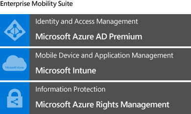
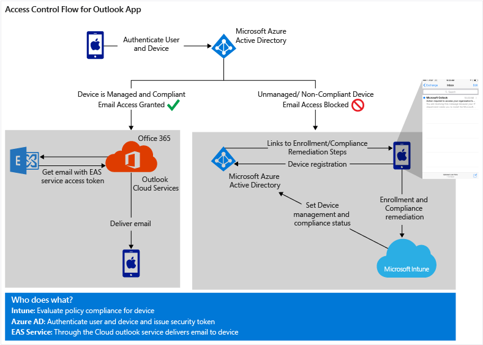

# Architekturrichtlinien f&#252;r den Schutz gesch&#228;ftlicher E-Mails und Dokumente
Dieses Thema beginnt mit einem Überblick der Möglichkeiten, um Datenschutz für Ihr Unternehmen bereitzustellen und gleichzeitig sicherzustellen, dass die Endbenutzererfahrung einfach ist und sich nicht negativ auf die Produktivität auswirkt. Anschließend konzentrieren wir uns speziell darauf, wie Sie bei der Bereitstellung eines sicheren Zugriffs auf Ihre Unternehmens-E-Mail sowie beim Schutz von Unternehmensdaten in E-Mails und Anlagen helfen können, indem Sie die Microsoft Enterprise Mobility Suite-Lösung verwenden.

> [!TIP]
> Eine herunterladbare Kopie des gesamten Themas finden Sie in der [TechNet Gallery](https://gallery.technet.microsoft.com/Managing-Access-and-Help-b7a05d0d/file/140056/1/Managing%20Access%20and%20Help%20Protect%20Corporate%20Email%20Data%20on%20Mobile%20Devices.pdf).

## Ausgeglichene Produktivität und Sicherheit
Mitarbeiter möchten ihre eigenen Geräte für den Zugriff auf Unternehmensressourcen und Produktivitätstools verwenden können. Die IT muss Mitarbeitern diese Möglichkeit einräumen und gleichzeitig sicherstellen, dass sensible Unternehmensdaten geschützt sind. BYOD oder [Bring Your Own Device](https://technet.microsoft.com/en-us/library/Dn656905(l=en-us,v=WS.11).aspx) stellt eine besondere Herausforderung dar, da persönliche und geschäftliche Daten auf persönlichen Geräten getrennt werden müssen und die absichtliche oder unabsichtliche Freigabe von Unternehmensdaten zu verhindern ist.

**Studien belegen Folgendes:**

-   37 % der weltweit Beschäftigten sind mobil&#42;

-   53 % der gesamten E-Mail wurde im dritten Quartal 2014 auf einem Mobiltelefon oder Tablet geöffnet&#42;&#42;

-   61 % der Arbeitnehmer führen sowohl persönliche als auch geschäftliche Aufgaben auf ihren Geräten durch&#42;&#42;&#42;

Beachten Sie Folgendes:

-   E-Mail ist oft die am häufigsten verwendete Anwendung auf jedem Gerät.

-   Inhalte in E-Mails und E-Mail-Anlagen können kopiert, freigegeben oder an andere Speicherorte außerhalb des Zugriffsbereichs Ihrer IT-Abteilung verschoben werden, was zur Gefährdung der Sicherheit Ihres Unternehmens führen kann.

Da Endbenutzer ihre Arbeit mithilfe ihrer eigenen persönlichen Geräte verrichten möchten und E-Mail die am häufigsten verwendete Anwendung ist, muss Ihre IT als erstes sicherstellen, dass Endbenutzer auf ihren Geräten auf ihre Unternehmens-E-Mail zugreifen können und dass vertrauliche Daten in den E-Mails nicht gefährdet sind.

## Übersicht
Microsoft bietet die Enterprise Mobility Suite (EMS) an, eine umfassende Lösung zur Verwaltung von Identitäten, mobilen Geräten und Apps sowie für Datensicherheit. EMS bietet ein mehrschichtiges Sicherheitsmodell, mit dem Ihre IT-Abteilung den Zugriff auf E-Mail, Daten und Unternehmensanwendungen von nahezu jedem Gerät aus verwalten kann.

EMS besteht aus den folgenden Clouddiensten:

Anhand von EMS werden die Daten sowohl innerhalb als auch außerhalb des Unternehmensnetzwerks geschützt:

-   Mitarbeiter können mit dem Gerät ihrer Wahl auf Unternehmens-E-Mail, geschäftliche Anwendungen und Unternehmensdaten zugreifen, ohne die Gefährdung vertraulicher Unternehmensdaten befürchten zu müssen.

-   Die Unternehmensdaten sind auf allen Ebenen geschützt: auf Benutzer-, Geräte- und Anwendungsebene und schließlich auch auf der Ebene der Daten selbst.

-   Ihr IT-Administrator kann sicherstellen, dass nur vertrauenswürdige Benutzer über verwaltete und kompatible Geräte und im Kontext von verwalteten Anwendungen auf Unternehmensdaten zugreifen.

Zu den mit Intune verwalteten Apps gehören mobile Office-Apps, die für diese Lösung von zentraler Bedeutung sind. Mit mobilen Office-Apps können Sie die Produktivität der Mitarbeiter maximieren und Datenlecks verhindern. Ihr IT-Administrator kann beispielsweise Richtlinien festlegen, die das Kopieren von Unternehmensdaten in persönlichen Cloudspeicher wie Dropbox verhindern.

Wenn Mitarbeiter umziehen oder die Stelle wechseln oder das Gerät verlieren, bietet EMS die Option, Unternehmensdaten remote und selektiv vom Gerät zu löschen. Dies kann durch den Endbenutzer oder durch Ihren IT-Administrator erfolgen.

## So kann EMS Ihre Daten schützen
Das vierstufige Sicherheitsmodell für Identität, Geräte, Apps und Daten stellt sicher, dass Ihre Unternehmensressourcen nur für den entsprechenden Benutzer auf einem Gerät zugänglich sind, das einer Reihe von von Ihnen konfigurierten Kompatibilitätsrichtlinien innerhalb der Grenzen von verwalteten Apps entspricht.

Der Schutz Ihrer Daten beginnt mit dem Einrichten und Überprüfen der Identität des Benutzers.*Azure AD /*, ein Tool der Unternehmensklasse zur Identitäts- und Zugriffsverwaltung, bietet einmaliges Anmelden, mehrstufige Authentifizierung, Self-Service-Kennwörter und vieles mehr. Es stellt die Funktionalität für die **Identitätsebene** des Sicherheitsmodells bereit.

Aufbauend auf der Identitätsbasis kann Ihr IT-Administrator *Microsoft Intune* einsetzen, um sicherzustellen, dass mobile Geräte registriert und verwaltet werden und mit Ihren Unternehmensrichtlinien kompatibel sind. Dies ist die **Geräteebene**.

Die dritte Ebene ist die **App-Verwaltungsebene** mit dem über Intune verwalteten App-Ökosystem. Dieses Ökosystem ermöglicht es Ihren Benutzern, produktiv zu sein und die benötigten und vertrauten Tools wie z. B. Office zu verwenden, und ermöglicht gleichzeitig der IT, vertrauliche Daten innerhalb des verwalteten App-Ökosystems zu halten.

*Azure Rights Management (Azure RMS)* rundet das Sicherheitsmodell durch den Schutz der Daten auf Dateiebene ab. Die auf die Daten angewandten Sicherheitsrichtlinien sind dauerhaft mit den Daten verknüpft und ermöglichen Datensicherheit während der Übertragung und im Ruhezustand, unabhängig von dem Gerät, das für den Zugriff verwendet wird. Dies ist die **Datenebene** des Sicherheitsmodells.

## Schützen von E-Mail und Dokumenten in Unternehmen
Der Schutz von Unternehmens-E-Mail umfasst zwei Hauptziele:

-   Zulassen von ausschließlich kompatiblen Geräten für den Zugriff auf Unternehmens-E-Mail

-   Schützen der Inhalte in E-Mails und Anlagen

### Zulassen von ausschließlich kompatiblen Geräten für den Zugriff auf Unternehmens-E-Mail
Ein wichtiger Schritt zum Schutz von Unternehmensdaten besteht im Beschränken des Zugriffs für Geräte, die kein sicheres Kennwort verwenden, für die ein Jailbreak durchgeführt wurde oder die nicht verschlüsselt sind. Mit Microsoft Intune können Sie Bedingungen festlegen, die Ihre Benutzer für den Zugriff auf die Unternehmensressourcen erfüllen müssen. Dies wird als bedingter Zugriff bezeichnet.

Bedingter Zugriff wird durch zwei Arten von Richtlinien bestimmt, die Sie in Intune festlegen können:

**Kompatibilitätsrichtlinien** legen die Kompatibilität eines Geräts fest. Damit werden zum Beispiel folgende Einstellungen und Bedingungen ausgewertet:

-   **PIN und Kennwörter**: Ihre IT kann Regeln erstellen, welche Kennwörter zum Entsperren eines Geräts erforderlich machen und die Komplexität des Kennworts, das Ablaufen von Kennwörtern und andere Kennworteinstellungen festlegen.

-   **Verschlüsselung:** Ihre IT kann den Zugriff auf Geräte einschränken, die verschlüsselt sind.

-   **Gerät wurde nicht per Jailbreak oder Rooting manipuliert**: Intune kann erkennen, wenn ein Gerät per Jailbreak manipuliert wurde, und Ihre IT kann die Richtlinie so festlegen, dass der Zugriff auf solchen Geräten blockiert wird.

**Bedingte Zugriffsrichtlinien** werden für einen bestimmten Dienst wie Exchange Online oder SharePoint Online konfiguriert. Für jeden Dienst können Sie definieren, auf welche Gruppen von Benutzern diese Richtlinien angewendet werden sollen. Beispielsweise können Sie sicherstellen, dass jeder Mitarbeiter der Finanzabteilung nur über registrierte und kompatible Geräte auf Unternehmens-E-Mail zugreifen kann.

Sehen Sie sich [dieses](https://www.youtube.com/watch?feature=player_embedded&v=lYx3YIezccg) vierminütige Video über die Auswirkungen des bedingten Zugriffs auf die Endbenutzer an.

## Bedeutung der Architektur
Die verschiedenen Komponenten von EMS und Office 365 wurden für eine Ausführung in der Cloud erstellt und konzipiert. Damit erhalten Sie alle Vorteile der Cloud: Skalierbarkeit, Flexibilität und einfache Verwaltung.

Da verschiedene Unternehmen über unterschiedliche Anforderungen verfügen, wurde EMS auf eine Integration in die vorhandene lokale Infrastruktur ausgelegt, z. B. Active Directory, Exchange Server und System Center Configuration Manager. Dadurch können Sie die Anmeldeinformationen, die bereits in Ihrem Netzwerk eingerichtet wurden, sowohl für lokale und als auch für Cloudressourcen verwenden.

In den folgenden Abschnitten wird die Architektur für die Cloudausführung beschrieben. Außerdem wird kurz auf die lokale Option eingegangen.

### Ablauf für den E-Mail-Zugriff
Je nach Art der E-Mail-Anwendung, mit der Sie auf Exchange Online zugreifen, kann der Pfad zum Einrichten des sicheren E-Mail-Zugriffs leicht abweichen. Allerdings bleiben die Hauptkomponenten identisch: Azure Active Directory (Azure AD), Office 365/Exchange Online und Microsoft Intune. Auch die IT-Umgebung und die Endbenutzeroberfläche sind ähnlich. EMS unterstützt derzeit systemeigene E-Mail-Apps und die Microsoft Outlook-App für iOS und Android.

### Ablauf der Zugriffssteuerung für systemeigene E-Mail-Anwendungen
EAS-Clients (Exchange ActiveSync), die versuchen, auf E-Mail in Exchange Online zuzugreifen, werden auf die folgenden Eigenschaften überprüft:

-   Wird das Gerät von Intune verwaltet?

-   Ist das Gerät bei Azure Active Directory registriert?

-   Ist das Gerät kompatibel?

-   Ist die Client-EAS-ID einem registrierten Gerät zugeordnet?

Um kompatibel zu sein, muss das Gerät, auf dem der EAS-Client ausgeführt wird, folgende Bedingungen erfüllen:

-   Es muss bei Intune registriert sein.

-   Es muss bei [Azure Active Directory](https://msdn.microsoft.com/en-us/6a14cb1f-a058-4453-8ede-d9f4a66a7073.aspx) registriert werden.

-   Es muss die Geräterichtlinien einhalten, die von Ihrem IT-Administrator festgelegt wurden.

Auf den meisten Plattformen erfolgt die Azure Active Directory-Geräteregistrierung automatisch während der Anmeldung. Der Gerätestatus wird von Intune in Azure Active Directory geschrieben und von Exchange Online gelesen, sobald der EAS-Client das nächste Mal versucht, E-Mail abzurufen. Wenn das Gerät nicht registriert ist, erhält der Benutzer in seinem Posteingang eine Nachricht mit Anweisungen zur Registrierung. Wenn das Gerät nicht kompatibel ist, erhält der Benutzer eine E-Mail, die ihn zum Intune-Webportal umleitet. Dort sind weitere Informationen über das Kompatibilitätsproblem und dessen Behebung zu finden.

**Azure AD** authentifiziert den Benutzer und das Gerät, Microsoft Intune verwaltet die Richtlinien zu Kompatibilität und bedingtem Zugriff, und **Exchange Online** verwaltet den Zugriff auf E-Mail- basierend auf dem Gerätestatus.

### Ablauf der Zugriffssteuerung für Outlook-Anwendungen
Ähnlich wie beim EAS-Client wird die Outlook-E-Mail-App, die versucht, auf E-Mail in Exchange Online zuzugreifen, auf die folgenden Eigenschaften überprüft:

-   Wird das Gerät von Intune verwaltet?

-   Ist das Gerät bei Azure Active Directory registriert?

-   Ist das Gerät kompatibel?

Die Gerätekompatibilität wird im Wesentlichen auf die gleiche Weise eingerichtet, wie im Ablauf der Zugriffssteuerung für den EAS-Client beschrieben. Für Outlook-Apps verläuft der Datenfluss zwischen den Komponenten jedoch etwas anders. Wenn die Outlook-App E-Mail abzurufen versucht, wird sie an Azure AD umgeleitet. Azure AD gibt ein Sicherheitstoken aus, wenn das Gerät erfolgreich als registriert und kompatibel bewertet wird. Das Sicherheitstoken wird dann zum Abrufen von Unternehmens-E-Mail von Exchange Online verwendet. Die E-Mail-Synchronisierung wird eigentlich über den Outlook-Clouddienst vermittelt, der im Namen des Benutzers ein Zugriffstoken für den EAS-Dienst abruft, um die Authentifizierung abzuschließen, und der dann die E-Mail zustellt.

### Vorteile für IT-Administratoren:
Hierzu ist keine komplexe Infrastruktureinrichtung für Azure AD oder Exchange erforderlich. Aufgaben für IT-Administratoren:

-   Konfigurieren und Bereitstellen der Kompatibilitätsrichtlinien, die zum Auswerten des Kompatibilitätsstatus des Geräts verwendet werden.

-   Konfigurieren der Richtlinie für den bedingten Exchange Online-Zugriff und Festlegen, welche Azure AD-Sicherheitsgruppen durch diese Richtlinien betroffen sind bzw. davon ausgenommen werden.

-   Zulassen oder Blockieren von Geräten, die nicht über Intune registriert werden können. Die Liste der unterstützten Betriebssysteme für mobile Geräte ist weiter unten aufgeführt.

Möglicherweise ist ein optionaler Setupschritt erforderlich. Für die Berichtfunktion, die zum Verwalten und Überwachen des Gerätezugriffs und -status verwendet wird, muss der Dienstconnector für Microsoft Intune eingerichtet werden.

### Ablauf für den Endbenutzer:
Wenn der Benutzer versucht, auf dem Gerät erstmals auf E-Mail zuzugreifen bzw. die E-Mail anschließend zu synchronisieren, wird der Gerätestatus auf Registrierung und Kompatibilität überprüft. Das Verfahren zur Registrierung oder zur Korrektur von Kompatibilitätsproblemen umfasst eine praktische Anleitung. Dem Endbenutzer werden die erforderlichen Schritte zum Registrieren des Geräts und zum Herbeiführen der Kompatibilität angezeigt, sodass ein Eingreifen des IT-Helpdesks nicht nötig ist:

-   **Wenn das Gerät nicht registriert ist**, wird auf der Anmeldeseite die Meldung "Zugriff verweigert" angezeigt, und Sie werden zur Registrierung aufgefordert. Bei der Registrierung wird das Gerät automatisch in Azure Active Directory registriert. Intune prüft das Gerät auf Kompatibilität und bietet die notwendigen Schritte zur Behebung von Kompatibilitätsproblemen. Sobald das Gerät kompatibel ist, legt Intune den Gerätekompatibilitätsstatus bei Azure Active Directory fest.

-   **Wenn das Gerät registriert, jedoch nicht kompatibel ist**, wird ein Link mit den Schritten zum Beheben der Probleme an das Gerät gesendet. Wenn der Endbenutzer das Problem korrigiert (z. B. durch Festlegen von Kennwort und Verschlüsselung), aktualisiert Intune, das zum Verwalten der Kompatibilitätsrichtlinien verwendet wird, den Kompatibilitätsstatus des Geräts in Azure AD.

Sobald das Gerät als registriert und kompatibel ausgewertet wird, sollte die E-Mail-Synchronisierung innerhalb weniger Minuten erfolgen.

## Schützen von E-Mails und Anlagen vor Datenlecks
Im vorherige Abschnitt wurde erläutert, wie Sie sicherstellen können, dass nur kompatible Geräte auf Unternehmens-E-Mail zugreifen können. Allerdings wird der Inhalt von E-Mails und E-Mail-Anlagen durch das Sichern des Zugriffs nicht geschützt. Der Inhalt kann kopiert, verschoben, an einem anderen Speicherort gespeichert oder mit einem anderen Benutzer gemeinsam verwendet werden. EMS löst dieses Problem mithilfe von Verwaltungsrichtlinien für mobile Anwendungen.

Verwaltete Apps sind Apps, die von Ihrem IT-Administrator bereitgestellt werden und die den Sicherheitsbestimmungen Ihres Unternehmens entsprechen. Mit diesen Apps verfügt die IT über direkte Kontrolle über die Bereitstellung, die laufende Verwaltung wie Inventur oder Updates und die selektive Löschung der Apps und der zugehörigen Daten. Außerdem ermöglicht Intune Ihnen über eine Reihe von MAM-Richtlinien (mobile Anwendungsverwaltung) das Ändern der Funktionalität von Apps und das Beschränken der gemeinsamen Nutzung von Daten:

-   Blockieren der Kopier- und Einfügefunktion oder Verhindern der Datenübertragung aus einer verwalteten App in eine App ohne MAM-Richtlinie.

-   Verhindern der Sicherung im persönlichen Cloudspeicher, Verhindern von "Speichern unter" usw.

-   Sichern des App-Zugriffs durch Anfordern von PIN/Passcode oder Firmenanmeldeinformationen für eine durch MAM geschützte App.

-   Konfigurieren der Anwendung für das Öffnen aller Weblinks im von Intune verwalteten Browser.

-   Selektives Löschen der Daten, die der verwalteten App zugeordnet sind. Wenn ein Gerät verloren geht, gestohlen wird oder nicht länger durch Ihre IT verwaltet wird, werden durch selektives Löschen alle Unternehmensdaten aus den Apps gelöscht, sodass nur persönliche App-Daten übrig bleiben. Dies wird als Multi-Identität bezeichnet.

Mit [Azure Rights Management Services](https://technet.microsoft.com/en-us/library/jj585026.aspx) können Sie den E-Mail-Schutz folgendermaßen erweitern:

-   E-Mail-Nachrichten können verschlüsselt werden, sodass nur die richtigen Benutzer den Inhalt lesen oder anzeigen können – sowohl innerhalb als auch außerhalb des Unternehmens.

-   Benutzer können E-Mail-Nachrichten schützen, und die Empfänger können die an sie gesendeten geschützten E-Mail-Nachrichten lesen und verwenden.

-   Ein Administrator kann für Regeln Folgendes festlegen:

    -   Automatisches Anwenden der Regeln auf eine angegebene Gruppe von Empfängern oder Erstellen von Vorlagen für bestimmte Abteilungen.

    -   Automatisches Erkennen und Anwenden von Regeln auf E-Mail-Nachrichten mit vertraulichem Inhalt. Die Regel kann auf dem Absender, dem Empfänger, dem Nachrichtenbetreff oder dem Inhalt beruhen.

    -   Erkennen wichtiger Inhalte und Auffordern des Absenders, vor dem Senden der E-Mail die Schutzregeln anzuwenden.

### Verwaltete App-Komponenten

-   In **Microsoft Intune** konfigurieren Sie die Richtlinien, ordnen die Richtlinien der App zu oder Verwenden das App Wrapping-Tool zum Aktivieren einer internen App für die Anwendung von Verwaltungsrichtlinien für mobile Anwendungen.

-   **Das Unternehmensportal** ist eine App, die entweder systemeigen auf jedem Gerät oder in einem Browser ausgeführt wird. Die IT stellt die verwalteten Apps Benutzern oder Geräten bereit, und Endbenutzer können die App vom Portal aus installieren. Die den Apps zugeordneten Richtlinien gelangen mit den Apps auf das Gerät.

### Vorteile für IT-Administratoren:
Ihr IT-Administrator erstellt die Verwaltungsrichtlinien für mobile Anwendungen, ordnet der App die Richtlinie zu und stellt die App den Benutzern oder Geräten bereit. Wenn die verwaltete Anwendung auf dem Gerät installiert ist, treten die App-Einschränkungen in Kraft. Das Erstellen und Bereitstellen von verwalteten Apps erfordert kaum oder gar keinen zusätzlichen Aufwand:

-   Es gibt vorhandene Apps, die bereits über das App-SDK verfügen, mit dem Sie Einschränkungen auf die App anwenden können. Diese erfordern keine weitere Verarbeitung, Sie müssen nur noch einen Link hinzufügen, der auf einen App Store wie iTunes oder Google Play verweist. Lesen Sie [diesen](https://technet.microsoft.com/en-us/library/dn708489.aspx) Artikel, um die Liste der verwalteten Apps anzuzeigen.

-   Wenn Sie intern erstellte Apps verwalten möchten, können Sie die Apps mit dem Microsoft Intune App Wrapping-Tool neu paketieren. Das Tool paketiert die App neu, sodass Sie Einschränkungen auf die App anwenden können.

### Ablauf für den Endbenutzer
Endbenutzer können verwaltete Apps installieren und für ihre Arbeit verwenden. Sie können Daten nur zwischen verwalteten Apps verschieben oder freigeben. Jeder Versuch, die Daten aus dem Ökosystem verwalteter Apps zu verschieben, wird blockiert.

## Vorgänge und Reaktion auf Incidents
Nachdem Sie die Lösung implementiert haben, müssen Sie die Umgebung verwalten und potenzielle Sicherheitsrisiken identifizieren. Sowohl Intune als auch Azure AD verfügen über Überwachungsfunktionen, die Ihnen die Überwachung und die schnelle Reaktion auf einen Sicherheitsincident erleichtern.

Hier sind einige der Berichtsfunktionen aufgeführt:

-   Mit Intune-Berichte und -Warnungen können Sie den Status und die Integrität der von Intune verwalteten Geräte überwachen.

-   Azure AD bietet Funktionen zur Überwachung und Aktivitätsprotokollierung. Sie können z. B. Kennwortänderungen und die Benutzerverwaltung überwachen. Azure Active Directory Premium umfasst erweiterte Sicherheitsberichte und Warnungen zu Anomalien. Diese Warnungen beruhen auf detaillierten, auf Machine Learning basierenden Berichten, in welchen Anmeldeaktivitäten, inkonsistente Zugriffsmuster und potenzielle Bedrohungsbereiche aufgezeigt werden.

## Lokale Implementierung
Wenn Sie eine vorhandene Implementierung von System Center Configuration Manager, Active Directory und/oder Exchange Server verwenden, können Sie die vorhandene Infrastruktur durch die Integration mit Intune, Azure AD und Office 365 erweitern. Mit dieser Hybridimplementierung können Sie eine konsistente Verwaltungsoberfläche über lokale und Cloudgeräte hinweg bereitstellen. Intune und Configuration Manager bieten eine ähnliche Reihe von Funktionen, um einen eingeschränkten E-Mail-Zugriff basierend auf dem Gerätestatus zu erlauben.

Bei einer dedizierten Exchange Online-Implementierungen hängt der Einsatz der zuvor beschriebenen cloudbasierten Lösung oder der Hybridimplementierung von der Beschaffenheit Ihrer aktuellen Implementierung ab. Wenden Sie sich an Ihr Kundenteam, um zu ermitteln, was die Implementierung umfassen soll.

## Beim Planen der Implementierung sollten Sie Folgendes berücksichtigen:

-   **Geräteplattformunterstützung**: Sie müssen auch überlegen, ob Sie den E-Mail-Zugriff auf Plattformen zulassen möchten, die nicht von Intune unterstützt werden. Die Verwaltung mobiler Geräte von Intune unterstützt die folgenden Betriebssysteme:

    -   Apple iOS 7.1 und höher (Bereits registrierte iOS 6.0- und 7.0-Geräte bleiben registriert, während neue Geräte dieser Version nicht registriert werden können.)

    -   Google Android 2.3.4 und höher (einschließlich Samsung KNOX)

    -   Windows Phone 8.0 und höher

    -   Windows RT und höher

    -   Computer mit Windows 8.1 und höher

-   **Typ der E-Mail-Apps**: Die EMS-Lösung unterstützt derzeit die Clients, die das EAS-Protokoll verwenden, und Outlook-Apps (zuvor Accompli in iOS und Android).

-   **Richtlinien**: Die EMS-Lösung und die zugehörigen Komponenten verfügen über mehrere Richtlinien, mit denen Sicherheit und Zugriff verwaltet werden. Ermitteln Sie, welche Richtlinien Ihr IT-Administrator konfigurieren muss. Im Folgenden werden die drei wichtigsten Richtlinien aufgeführt, die beim Sichern des Zugriffs auf E-Mail und E-Mail-Daten zur Forschung und Planung verwendet werden sollten:

    -   **Gerätecompliancerichtlinien**: Ermitteln Sie, was Compliance für Ihr Unternehmen bedeutet. Intune umfasst mehrere Regeln, die Sie festlegen können, aber möglicherweise sind nicht alle Regeln für Ihr Unternehmen relevant. Richtlinien können jederzeit geändert werden, es empfiehlt sich jedoch, einen grundlegenden Satz von Richtlinien für Ihr Unternehmen festzulegen. Kompatibilitätsrichtlinien sind auf Intune-Benutzer- und -Gerätegruppen ausgerichtet.

    -   **Bedingte Zugriffsrichtlinien**: Bedingte Zugriffsrichtlinien sind auf Azure AD-Sicherheitsgruppen ausgerichtet. Bestimmen Sie, welche Benutzer durch die Richtlinien betroffen sind und ob es Benutzer gibt, die davon ausgeschlossen werden müssen. Der bedingte Zugriff wird sowohl von der cloudbasierten Lösung als auch von der Hybridimplementierung unterstützt.

    -   **Verwaltung mobiler Anwendungen:** Bestimmen Sie, welche Apps verwaltet werden sollen und welche MAM-Richtlinien auf die jeweiligen Apps anzuwenden sind.

-   **Überlegungen zur Geräteverwaltung**: Wählen Sie die Option zur Geräteverwaltung aus, die den Anforderungen für Ihre Organisation am besten entspricht, bevor Sie die Lösung implementieren. Es stehen zwei Optionen zur Verfügung:

    -   Vereinheitlichen Sie System Center Configuration Manager mit Microsoft Intune, um alle Geräte über eine einzige Konsole zu verwalten. Hierbei spricht man von *Hybridimplementierung*. Vorteile dieses Ansatzes:

        -   Zentrale Verwaltungskonsole mit umfassenden Steuerelementen zur Rechteverwaltung sowohl auf lokalen PCs als auch auf mobilen Geräten

        -   Umfassende Funktionen für Zielgruppenadressierung und Bereitstellung

        -   Hohe Skalierbarkeit für sehr große Unternehmen

    -   Verwalten Sie die mobilen Geräte über Microsoft Intune getrennt von den lokalen Geräten mit System Center Configuration Manager. Dies wird als *eigenständige Intune-Implementierung* bezeichnet. Vorteile dieses Ansatzes:

        -   Einfache webbasierte Konsole, die speziell auf die Verwaltung mobiler Geräte zugeschnitten ist

        -   Schneller Zugriff auf die neuesten Features

    Auch wenn die Migration jederzeit möglich ist, wird dringend empfohlen, dass Sie diese Entscheidung vor der Implementierung treffen, da sie viele weitere Entscheidungen im Einführungsprozess beeinflusst.

-   **Ihre Exchange-Umgebung**:

    -   Bereitstellung von Exchange-Connectors und deren Verbindungsart bei der Implementierung von Netzwerk-Lastenausgleichsmodulen.

    -   Exchange Online – mehrinstanzenfähig oder dediziert? Wenn Sie die dedizierte Variante verwenden, finden Sie heraus, auf welcher Architektur Ihr Mandant ausgeführt wird. Dadurch wird bestimmt, ob der Azure AD-basierte bedingte Zugriff verwendet werden kann oder ob ein lokaler Connector erforderlich ist.

-   **Azure AD-Synchronisierung und Active Directory-Verbunddienste (AD FS) oder ein anderer Drittanbieter-Verbunddienst**:

    -   Bedingter Zugriff ist auf Kunden ausgelegt, die ihren Identitätsdienst in einem AD FS-Verbund konfiguriert haben. Clientzugriffsregeln gelten im Allgemeinen noch immer, es wird jedoch empfohlen, vollständige Tests durchzuführen. Anforderungen für die Verzeichnissynchronisierung und AD FS unterscheiden sich nicht von denen für Office 365.

    -   Drittanbieter-Verbunddienste wie Ping sollten ebenfalls funktionieren. Vor der Implementierung werden Tests empfohlen.

## Weitere Schritte
Sehen Sie sich dieses [Video](https://www.youtube.com/watch?v=ltcZvm4VOFU) an, um zu erfahren, wie Sie sich für ein Testkonto registrieren und erste Schritte durchführen.

&#42; IDC: „Worldwide Mobile Worker Population 2011–2015 Forecast“

&#42;&#42; Experian "Quarterly email benchmark report" (Q3 2014)

&#42;&#42;&#42; Forrester Research: "BT Futures Report: Info workers will erase boundary between enterprise &amp; consumer technologies," 21. Februar 2013

## Siehe auch
[EMS-Architektur](https://azure.microsoft.com/en-us/documentation/infographics/enterprise-mobility/)
[Starten der Verwendung von Intune](https://technet.microsoft.com/en-us/library/dn646953.aspx)
[Was ist Azure Active Directory](https://azure.microsoft.com/en-us/documentation/articles/active-directory-whatis/)
[Wie unterstützt Azure Active Directory Office 365, Microsoft Intune und andere Microsoft-Dienste?](https://azure.microsoft.com/en-us/documentation/articles/active-directory-administer/#what-is-an-azure-ad-tenant)
[So hilft Azure Active Directory Ihnen bei der Identitätsverwaltung](https://azure.microsoft.com/en-us/documentation/articles/active-directory-administer/)
[Was ist Azure Rights Management?](https://technet.microsoft.com/en-us/library/jj585026.aspx)
[So unterstützen Anwendungen Azure Rights Management](https://technet.microsoft.com/en-us/library/jj585004.aspx)
[Automatischer Schutz für E-Mail-Nachrichten mit Exchange Online und Richtlinien zum Schutz vor Datenverlust](https://technet.microsoft.com/en-us/library/jj585026.aspx#BKMK_Example_DLP)

