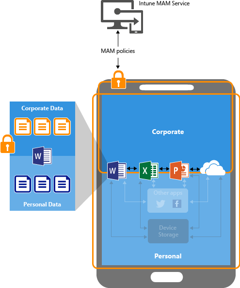
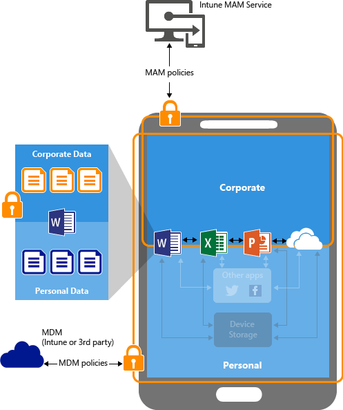

# Konfigurieren der App-Richtlinien f&#252;r die Verhinderung von Datenverlust mit Microsoft Intune
Verwenden Sie die Verwaltungsrichtlinien für mobile Apps in [!INCLUDE[wit_firstref](../Token/wit_firstref_md.md)], um Einschränkungen für Apps festzulegen, die dazu beitragen, die Daten Ihres Unternehmens zu schützen.

**Gegenstand dieses Themas**

[Wie Sie Ihre App-Daten schützen können](#bkmk_protectdata)

[Wie App-Daten mit MAM-Richtlinien geschützt werden](#bkmk_howMAMworks)

[Wie MAM-Richtlinien konfiguriert werden](#bkmk_WaystoConfigure)

[Nächste Schritte](#bkmk_nextsteps)

### Wie Sie Ihre App-Daten schützen können
Ihre Mitarbeiter verwenden mobile Geräte für private und berufliche Aufgaben.  Sie möchten einerseits die Produktivität Ihrer Mitarbeiter sicherstellen, möchten andererseits aber auch Datenverlust verhindern, sei er beabsichtigt oder unbeabsichtigt.  Darüber hinaus möchten Sie in der Lage sein, Daten auf Geräten zu schützen, ganz gleich, ob diese von Ihrem Unternehmen verwaltet werden.

Sie können Verwaltungsrichtlinien für mobile Apps (Mobile App Management, MAM) verwenden, um zum Schutz Ihrer Unternehmensdaten beizutragen. Da diese Funktion **unabhängig von allen Lösungen für die Verwaltung mobiler Geräte** arbeitet, können Sie sie mit oder ohne Registrierung der Geräte in einer Geräteverwaltungslösung zum Schutz Ihrer Unternehmensdaten verwenden. Durch die einfache Implementierung von **Richtlinien auf App-Ebene** können Sie den Zugriff auf Unternehmensressourcen einschränken und Daten im Zuständigkeitsbereich der IT-Abteilung halten.

Die MAM-Richtlinien unterstützen die folgenden Szenarien:

-   **Geräte werden in [!INCLUDE[wit_nextref](../Token/wit_nextref_md.md)] verwaltet und registriert**.  Hierbei handelt es sich normalerweise um unternehmenseigene Geräte, die Sie verwalten.

    > [!IMPORTANT]
    > Wenn Sie Intune mit Configuration Manager verwenden, um iOS- und Android-Geräte zu verwalten, können Sie Verwaltungsrichtlinien für mobile Apps für mobile Office-Apps erstellen, die die Verbindung zu Office 365-Diensten herstellen. Dies wird nicht für Apps unterstützt, die die Verbindung zu lokalen Exchange- oder SharePoint-Diensten herstellen.

-   **Geräte, die mit der Verwaltungslösung für mobile Geräte eines Drittanbieters verwaltet und hier registriert sind** (im Folgenden als **MDM** bezeichnet).   Hierbei handelt es sich normalerweise um unternehmenseigene Geräte, die Sie verwalten.

    > [!NOTE]
    > Verwaltungsrichtlinien für mobile Apps sollten nicht in Verbindung mit Verwaltungslösungen für mobile Geräte von Drittanbietern oder sicheren Containerlösungen verwendet werden.

-   **Geräte, die nicht verwaltet werden**.  Dies sind in der Regel eigene Geräte der Mitarbeiter, die nicht in einer MDM-Lösung registriert sind oder hiervon verwaltet werden.

> [!IMPORTANT]
> Es gibt weitere Vorteile bei der Verwendung einer MDM mit MAM-Richtlinien, und Unternehmen können von beidem gleichzeitig profitieren. So kann ein Mitarbeiter beispielsweise ein unternehmenseigenes Smartphone und ein privates Tablet verwenden.  In diesem Fall wird das unternehmenseigene Smartphone in einer MDM registriert und von MAM-Richtlinien geschützt, während das private Geräte nur mit MAM-Richtlinien geschützt wird.

**Eine MDM-Lösung stellt sicher, dass das Gerät geschützt ist**.  So können Sie beispielsweise die Eingabe einer PIN für den Zugriff auf das Gerät anfordern, oder Sie können verwaltete Apps auf dem Gerät bereitstellen. Sie können Apps auch über die MDM-Lösung auf Geräten bereitstellen, um mehr Kontrolle über die App-Verwaltung zu haben.

**MAM-Richtlinien stellen sicher, dass Schutzfunktionen auf App-Ebene vorhanden sind**. So können Sie beispielsweise eine PIN anfordern, wenn eine App im beruflichen Kontext geöffnet werden soll oder wenn Daten zwischen Apps ausgetauscht werden können oder um zu verhindern, dass App-Daten des Unternehmens an einem privaten Speicherort gespeichert werden.

**Die wichtigsten Vorteile von MAM-Richtlinien sind:**

-   Schutz Ihrer Unternehmensdaten auf App-Ebene.  Da die Verwaltung von mobilen Apps keine Geräteverwaltung voraussetzt, können Sie Unternehmensdaten auf verwalteten und auf unverwalteten Geräten schützen. Bei der Datenverwaltung wird die Benutzeridentität in dem Mittelpunkt gestellt, wodurch sich die Geräteverwaltung erübrigt.

-   Die Produktivität der Endbenutzer wird nicht beeinträchtigt, und die Richtlinien werden nicht angewendet, wenn die App im privaten Kontext verwendet wird.  Die Richtlinien werden nur auf den beruflichen Kontext angewendet, wodurch Sie die Möglichkeit haben, Unternehmensdaten zu schützen, ohne dass private Daten einbezogen werden.

### Wie App-Daten mit MAM-Richtlinien geschützt werden
Die folgenden Diagramme zeigen, wie Unternehmensdaten in Apps mit MAM geschützt werden.

Wie in **Abbildung 1** gezeigt, können Unternehmensdaten und private Daten vermischt werden, wenn Apps ohne Einschränkungen verwendet werden.  Unternehmensdaten könnten damit an Speicherorten wie dem persönlichen Speicher abgelegt oder an Apps außerhalb Ihres Zuständigkeitsbereichs übermittelt werden, was Datenverlust bedeuten würde. Das nachstehende Diagramm zeigt den Status ohne jede Einschränkung. Die Pfeile zeigen die Datenbewegung zwischen Apps (geschäftlich und privat) und an Speicherorte.

Abbildung 2 zeigt die gleiche Umgebung, jedoch mit Richtlinien, die die gemeinsame Nutzung von Daten einschränken.  Mit Datenschutzrichtlinien können Sie Richtlinien konfigurieren, die verhindern, dass Unternehmensdaten im lokalen Speicher des Geräts abgelegt oder in Apps verschoben werden, die nicht von den Datenschutzrichtlinien geschützt sind. Hiermit können unterschiedliche Richtlinien für die Verlagerung von und den Zugriff auf Daten eingerichtet werden, die zur Sicherheit der Unternehmensdaten beitragen. Die Richtlinien werden jedoch nicht angewendet, wenn der Endbenutzer die App für private Arbeiten verwendet, da die Einschränkungen nur im beruflichen Kontext gelten.  Damit kann der Endbenutzer das Gerät und die App sowohl für private als auch für berufliche Zwecke verwenden. Dies wird als Multi-Identity-Support bezeichnet.

**Multi-Identity:**

Mit dem Multi-Identity-Support (Unterstützung mehrerer Identitäten) haben Sie die Möglichkeit, unterschiedliche Konten wie Geschäfts- und Privatkonten für den Zugriff auf dieselben Apps zu verwenden.  Auf Geräten, auf denen Apps sowohl für private als auch für berufliche Zwecke verwendet werden, soll die Richtlinie angewendet werden, wenn der Endbenutzer die App mit seinem Geschäftskonto verwendet, jedoch nicht, wenn er sie mit seinem privaten Konto verwendet.[!INCLUDE[wit_nextref](../Token/wit_nextref_md.md)]-MAM-Richtlinien tun genau das.  Die Einschränkungen gelten nur, wenn sich der Benutzer mit seinem Geschäftskonto bei der App anmeldet. Wenn sich der Benutzer mit seinem privaten Konto bei derselben App anmeldet, werden die Richtlinieneinstellungen nicht in Kraft gesetzt, und der Benutzer kann seine Daten ohne jede Einschränkung verschieben.

Alle mobilen Office-Apps unterstützen mehrere Identitäten.

Lesen Sie den Artikel [Endbenutzer-Erfahrung mit Apps, die den Microsoft Intune-Verwaltungsrichtlinien für mobile Apps unterliegen](../Topic/End-user_experience_for_apps_associated_with_Microsoft_Intune_mobile_app_management_policies.md), wenn Sie wissen möchten, in welcher Weise sich die MAM-Richtlinien auf die Endbenutzererfahrung auswirken.

**Geräte, die mit einer MDM-Lösung verwaltet werden**

**Für Geräte, die in einer MDM-Lösung registriert sind, gilt Folgendes**.

Die MDM-Lösung:

-   Registrieren das Gerät

-   Stellt die Apps auf dem Gerät bereit

-   Sorgt für kontinuierliche Gerätekompatibilität und -verwaltung

**MAM-Richtlinien erhöhen den Wert:**

-   Sie tragen zum Schutz der Unternehmensdaten bei, indem der Zugriff durch Verbraucher-Apps und -Dienste verhindert wird.

-   Es werden Einschränkungen ("Speichern unter", Zwischenablage, PIN usw.) auf mobile Apps angewendet.

-   Unternehmensdaten können aus Apps entfernt werden, ohne die Apps vom Gerät zu löschen.

Abbildung 3 zeigt die Schutzebenen, die von MDM und MAM-Richtlinien geboten werden.

**Unverwaltete BYOD-Geräte**

Bei BYOD-Geräten, die nicht in einer MDM-Lösung registriert sind, können MAM-Richtlinien dazu beitragen, Unternehmensdaten auf App-Ebene zu schützen. Es gibt jedoch einige Einschränkungen, die Sie kennen sollten, wie die folgenden:

-   Sie können auf dem Gerät keine Apps bereitstellen.  Der Endbenutzer muss die Apps aus dem Store beziehen.

-   Sie können auf diesen Geräten keine Zertifikatprofile bereitstellen.

-   Sie können auf diesen Geräten keine unternehmensweiten WLAN- und VPN-Einstellungen bereitstellen.

Abbildung 4 zeigt, wie die Datenschutzrichtlinien auf App-Ebene ohne MDM funktionieren.

### Wie MAM-Richtlinien konfiguriert werden
Sie können MAM-Richtlinien mit den folgenden beiden Methoden konfigurieren:

1.  Sie können das **Azure-Vorschauportal** zum Konfigurieren von Richtlinien und zur Weitergabe an die Benutzer verwenden.  Auf diesem Portal können Richtlinien in drei Szenarien konfiguriert werden:

    -   Geräte, die nicht von einer Verwaltungslösung für mobile Geräte verwaltet werden

    -   Geräte, die in [!INCLUDE[wit_nextref](../Token/wit_nextref_md.md)] oder der MDM eines Drittanbieter registriert sind Sie können MAM-Richtlinien erstellen und die Apps über dieses Portal für die Benutzer bereitstellen. Die Endbenutzer müssen die Apps dann aus dem Apple Store oder aus Google Play herunterladen.  Wenn Sie Apps auf Geräten mit MAM-Richtlinien bereitstellen möchten, verwenden Sie die **Intune-Verwaltungskonsole**. Weitere Informationen finden Sie unter [Schützen von Daten mithilfe der Verwaltungsrichtlinien für mobile Anwendungen mit Microsoft Intune](../Topic/Configure_and_deploy_mobile_application_management_policies_in_the_Microsoft_Intune_console.md).

        > [!IMPORTANT]
        > Wenn Sie Intune mit Configuration Manager verwenden, um iOS- und Android-Geräte zu verwalten, können Sie Verwaltungsrichtlinien für mobile Apps für mobile Office-Apps erstellen, die die Verbindung zu Office 365-Diensten herstellen.  Dies wird nicht für Apps unterstützt, die die Verbindung zu lokalen Exchange- oder SharePoint-Diensten herstellen.

    Lesen Sie für weitere Informationen zur Verwendung des Azure-Vorschauportals den Artikel [Erste Schritte mit Richtlinien für die Verwaltung von mobilen Apps im Azure-Portal](../Topic/Get_started_with_mobile_app_management_policies_in_the_Azure_portal.md).

2.  Die [!INCLUDE[wit_nextref](../Token/wit_nextref_md.md)]-Verwaltungskonsole unterstützt das Konfigurieren von MAM-Richtlinien nur für Geräte, die in [!INCLUDE[wit_nextref](../Token/wit_nextref_md.md)] registriert sind.

    Weitere Informationen finden Sie in [Schützen von Daten mithilfe der Verwaltungsrichtlinien für mobile Anwendungen mit Microsoft Intune](../Topic/Configure_and_deploy_mobile_application_management_policies_in_the_Microsoft_Intune_console.md).

### Nächste Schritte
[Erste Schritte mit Richtlinien für die Verwaltung von mobilen Apps im Azure-Portal](../Topic/Get_started_with_mobile_app_management_policies_in_the_Azure_portal.md)

[Erstellen und Bereitstellen von Verwaltungsrichtlinien für mobile Apps mit Microsoft Intune](../Topic/Create_and_deploy_mobile_app_management_policies_with_Microsoft_Intune.md)

## Siehe auch
[Configure apps](../Topic/Configure_apps.md)
[Bereitstellen und Konfigurieren von Apps mit Microsoft Intune](../Topic/Deploy_and_configure_apps_with_Microsoft_Intune.md)

