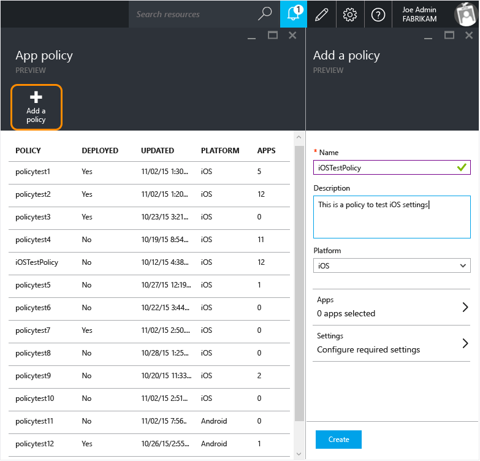
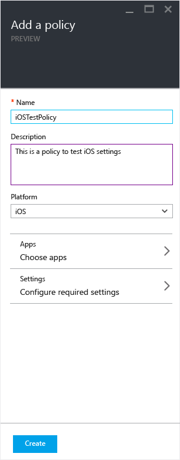
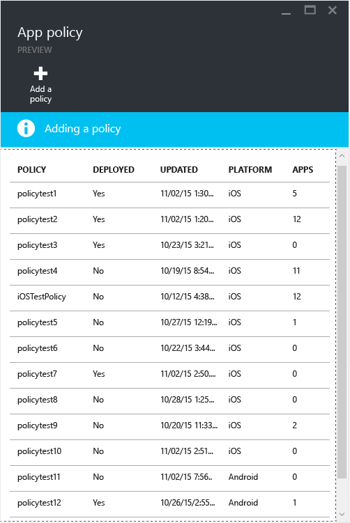
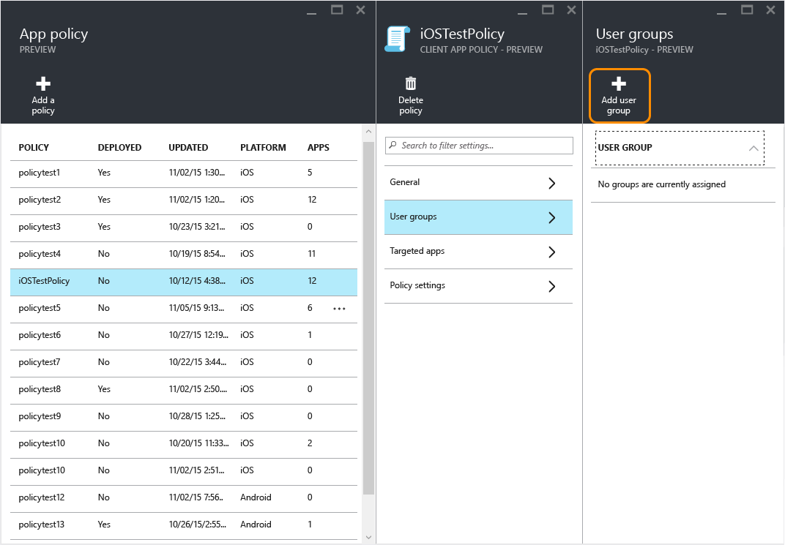
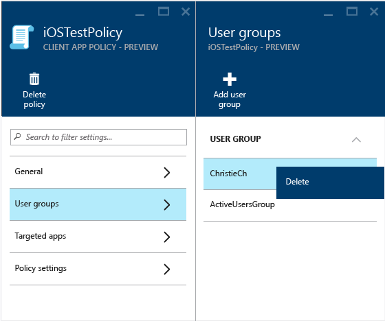
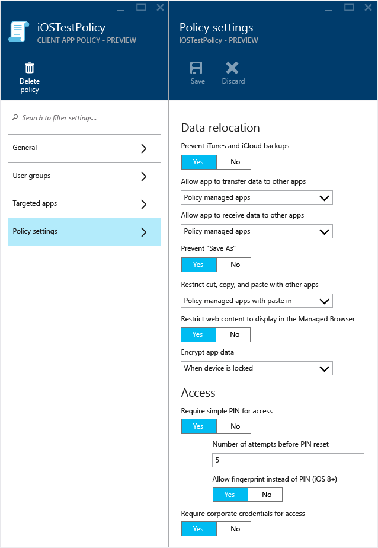

# Erstellen und Bereitstellen von Verwaltungsrichtlinien f&#252;r mobile Apps mit Microsoft Intune
Sie können Verwaltungsrichtlinien für mobile Apps (Mobile App Management, MAM) im Azure-Vorschauportal erstellen und für die Benutzer bereitstellen.  Die MAM-Richtlinien, die Sie hier erstellen, sind von der Geräteregistrierung unabhängig, was bedeutet, das sie auf nicht verwalteten Geräten ebenso verwendet werden können wie auf von [!INCLUDE[wit_firstref](../Token/wit_firstref_md.md)] oder einer Drittanbieterlösung verwalteten Geräten.

**Gegenstand dieses Themas**

[Erstellen und Bereitstellen einer MAM-Richtlinie](#bkmk_createanddeploy)

[Ändern vorhandener Richtlinien](#bkmk_changepolicy)

[Richtlinieneinstellungen](#bkmk_policysettings)

[Nächste Schritte](#bkmk_nextsteps)

### Erstellen und Bereitstellen einer MAM-Richtlinie

##### Erstellen einer MAM-Richtlinie

1.  Klicken Sie auf **Intune-Verwaltung von mobilen Anwendungen &gt; Einstellungen**, um das Blatt **Einstellungen** zu öffnen.

    

    > [!TIP]
    > Wenn Sie das Azure-Portal zum ersten Mal verwenden, lesen Sie [Erste Schritte mit Richtlinien für die Verwaltung von mobilen Apps im Azure-Portal](../Topic/Get_started_with_mobile_app_management_policies_in_the_Azure_portal.md), um sich mit dem Portal vertraut zu machen.

2.  Klicken Sie auf dem Blatt **Einstellungen** auf **App-Richtlinie**.  Hiermit wird das Blatt **App-Richtlinie** geöffnet, auf dem Sie neue Richtlinien erstellen und vorhandene bearbeiten können.

    

3.  Klicken Sie auf **Richtlinie hinzufügen**.

    

4.  Geben Sie einen Namen für die Richtlinie sowie eine kurze Beschreibung ein, und wählen Sie den Plattformtyp aus, um eine Richtlinie für iOS oder Android zu erstellen.  Sie können für jede Plattform mehr als eine Richtlinie erstellen.

    

5.  Klicken Sie auf **Apps**, um das Blatt **Apps** zu öffnen, auf dem einer Liste der verfügbaren Apps angezeigt wird. Sie können eine oder mehrere Apps in der Liste auswählen, mit denen Sie die von Ihnen zu erstellende Richtlinie verknüpfen möchten. Nachdem Sie die Apps ausgewählt haben, klicken Sie auf die Schaltfläche **Auswählen** unten im Blatt **Apps**, um Ihre Auswahl zu speichern.

    > [!IMPORTANT]
    > Sie müssen mindestens eine App auswählen, um eine Richtlinie erstellen zu können.

6.  Klicken Sie auf dem Blatt **Richtlinie hinzufügen** auf **Erforderliche Einstellungen konfigurieren**, um das Blatt mit den Richtlinieneinstellungen zu öffnen.

    Es gibt zwei Kategorien von Richtlinieneinstellungen: **Datenverlagerung** und **Zugriff**.  Richtlinien für die Datenverlagerung sind auf die Datenverschiebung in und als Apps anwendbar, während mit Zugriffsrichtlinien bestimmt wird, wie der Endbenutzer auf die Apps im beruflichen Kontext zugreift. Um Ihnen bei den ersten Schritten zu helfen, enthalten die Richtlinieneinstellung Standardwerte.  Sie müssen keine Änderungen vornehmen, wenn die Standardwerte Ihren Anforderungen entsprechen.

    > [!TIP]
    > Diese Richtlinieneinstellungen werden nur durchgesetzt, wenn Apps im beruflichen Kontext verwendet werden.  Wenn der Endbenutzer die App für eine private Aufgabe verwendet, ist dies von den Richtlinieneinstellungen nicht betroffen.

    

    Lesen Sie den Abschnitt [Richtlinieneinstellungen](#bkmk_policysettings) in diesem Artikel, wenn Sie eine vollständige Liste der Richtlinieneinstellungen und der Standardwerte anzeigen möchten.

7.  Klicken Sie auf **OK**, um diese Konfiguration zu speichern.  Damit befinden Sie sich wieder auf dem Blatt **Richtlinie hinzufügen**. Klicken Sie auf **Erstellen**, um die Richtlinie zu erstellen und Ihre Einstellungen zu speichern.

    

    

Wenn Sie mit dem Erstellen einer Richtlinie wie im vorherigen Verfahren beschrieben fertig sind, wird sie noch nicht für Benutzer bereitgestellt.  Folgen Sie den Schritten unten, um die Richtlinie bereitzustellen.

> [!NOTE]
> Wenn Sie Richtlinien für die Verwaltung von mobilen Apps in der Intune- oder Configuration Manager-Verwaltungskonsole und zudem auch eine Richtlinie für die App-Verwaltung in der Azure-Verwaltungskonsole erstellt haben, verknüpfen Sie beide Richtlinien mit derselben App, wobei die im Azure-Vorschauportal erstellte Richtlinie Vorrang hat. Mit der Berichterstattung in der Intune- oder Configuration Manager-Verwaltungskonsole werden jedoch die Richtlinieneinstellungen zurückgegeben, die im Azure-Vorschauportal erstellt wurden. Beispiel:
> 
> -   Sie haben eine Verwaltungsrichtlinie für mobile Anwendungen in der Intune-Verwaltungskonsole erstellt, mit der Kopien aus einer Anwendung verhindert werden.
> -   Sie haben eine Verwaltungsrichtlinie für mobile Apps in der Azure-Verwaltungskonsole erstellt, die Kopien aus einer Anwendung zulässt.
> -   Sie führen beide Richtlinien in derselben App zusammen.
> -   Das Ergebnis ist, dass die Richtlinie, die Sie in der Azure-Verwaltungskonsole erstellt haben, Vorrang hat und Kopien möglich sind.
> -   Status und Berichte der Intune-Verwaltungskonsole geben jedoch fälschlicherweise an, dass Kopien nicht möglich sind.

##### Bereitstellen einer Richtlinie für Benutzer

1.  Klicken Sie auf dem Blatt **Richtlinie** auf **Benutzergruppen**. Damit wird das Blatt **Benutzergruppen** geöffnet. Klicken Sie auf dem Blatt **Benutzergruppen** auf **Benutzergruppe hinzufügen**, um das Blatt **Benutzergruppe hinzufügen** zu öffnen.

    

2.  Auf dem Blatt **Benutzergruppe hinzufügen** wird eine Liste der Benutzergruppen angezeigt. Dies ist eine Liste aller Sicherheitsgruppen in Ihrem **Azure Active Directory**.  Sie können die Benutzergruppen auswählen, auf die diese Richtlinie angewendet werden soll, und dann auf **Auswählen** klicken.**Mit Klicken auf "'Auswählen" werden die Richtlinien für die Benutzer bereitgestellt**.

    

    > [!NOTE]
    > Von der Richtlinie sind nur Benutzer betroffen, denen [!INCLUDE[wit_nextref](../Token/wit_nextref_md.md)]-Lizenzen zugewiesen wurden.  Benutzer, die sich in einer von Ihnen ausgewählten Sicherheitsgruppe befinden und die nicht über eine [!INCLUDE[wit_nextref](../Token/wit_nextref_md.md)]-Lizenz verfügen, sind nicht betroffen.

    > [!NOTE]
    > Wenn Sie Intune mit Configuration Manager verwenden, um Ihre iOS- und Android-Geräte zu verwalten, wird die Richtlinie nur auf Benutzer in der Gruppe angewendet, die Sie ausgewählt haben.  Mitglieder von untergeordneten Gruppen, die in der ausgewählten Gruppe geschachtelt sind, sind nicht betroffen.

Damit haben Sie eine Richtlinie erstellt und für die Benutzer bereitgestellt.

### Ändern vorhandener Richtlinien
Wenn Sie vorhandene Richtlinien ändern, werden diese Änderungen für Benutzer, die bereits bei der App angemeldet sind, in den nächsten acht Stunden nicht wirksam.

Wenn Sie sich in der Testphase befinden und die geänderte Richtlinie sofort anzeigen möchten, melden Sie sich bei der App ab und wieder an, um die neuen Einstellungen zu überprüfen.

##### Ändern der Liste der Apps, die der Richtlinie zugeordnet sind

1.  Klicken Sie auf dem Blatt **App-Richtlinie** auf die Richtlinie, die Sie ändern möchten. Damit wird ein Blatt speziell für die Richtlinie geöffnet, die Sie soeben ausgewählt haben.

    

2.  Klicken Sie auf diesem Richtlinienblatt auf **Ziel-Apps**, um eine Liste der Apps zu öffnen.

3.  Fügen Sie der Liste Apps hinzu, oder entfernen Sie Apps hieraus, und klicken Sie dann auf das Symbol **Speichern**, um die Änderungen zu speichern.

##### Ändern der Liste der Benutzergruppen

1.  Klicken Sie auf dem Blatt **App-Richtlinie** auf die Richtlinie, die Sie ändern möchten. Damit wird ein Blatt speziell für die Richtlinie geöffnet, die Sie soeben ausgewählt haben.

2.  Klicken Sie auf dem Richtlinienblatt auf **Benutzergruppen**, um das Blatt **Benutzergruppe** zu öffnen, auf dem die Liste der Benutzergruppen angezeigt wird, auf die die Richtlinie gegenwärtig angewendet wird.

3.  Zum **Hinzufügen einer neuen Benutzergruppe** klicken Sie auf **Benutzergruppe hinzufügen**, und wählen dann die Benutzergruppe aus. Klicken Sie auf **Auswählen**, um die Richtlinie für die ausgewählte Gruppe bereitzustellen.

    

4.  Zum **Löschen einer Benutzergruppe** markieren Sie die Benutzergruppe, die Sie löschen möchten, klicken auf die Ellipse (...) und dann auf **Löschen**, um die Benutzergruppe zu entfernen.

    

##### Ändern von Richtlinieneinstellungen

1.  Klicken Sie auf dem Blatt **App-Richtlinie** auf die Richtlinie, die Sie ändern möchten. Damit wird ein Blatt speziell für die Richtlinie geöffnet, die Sie soeben ausgewählt haben.

    

2.  Klicken Sie auf **Richtlinieneinstellungen**, um das Blatt **Richtlinieneinstellungen** zu öffnen.

3.  Ändern Sie die Einstellungen, und klicken Sie auf das Symbol **Speichern**, um die Änderungen zu speichern.

    

### Richtlinieneinstellungen
**iOS-Richtlinien für die Datenverlagerung**

||||
|-|-|-|
|**Richtlinieneinstellung**|**Beschreibung**|**Standardwert**|
|**iTunes- und iCloud-Datensicherungen verhindern**|Wählen Sie **Ja** aus, um die Funktion zu deaktivieren, oder **Nein**, um die Datensicherung beliebiger Informationen aus den per Richtlinie verwalteten Apps zuzulassen.|**Ja**|
|**App Übertragung von Daten an andere Apps erlauben**|Wählen Sie eine der folgenden Optionen aus, um die Apps auszuwählen, an die per Richtlinie verwaltete Apps Daten senden können:  -   **Richtlinienverwaltete Apps**: Datenübertragung nur an andere eingeschränkte Apps zulassen -   **Alle Apps**: Datenübertragung an beliebige Apps zulassen -   **Keine**: Datenübertragung an andere Apps nicht zulassen|**Richtlinienverwaltete Apps**|
|**App Empfang von Daten aus anderen Apps erlauben**|Geben Sie an, von welchen Apps Daten an richtlinienverwaltete Apps übertragen werden können:  -   **Richtlinienverwaltete Apps**: Datenübertragung nur von anderen eingeschränkte Apps zulassen -   **Alle Apps**: Datenübertragung von beliebigen Apps zulassen -   **Keine**: Datenübertragung von anderen Apps nicht zulassen|**Alle Apps**|
|**"Speichern unter" verhindern**|Wählen Sie **Ja** aus, um die Verwendung der "Speichern unter"-Option in jeder App zu deaktiviert, die diese Richtlinie verwendet. Wählen Sie **Nein** aus, wenn die Verwendung von "Speichern unter" zulässig sein soll.|**Ja**|
|**Beschränken von Ausschneiden, Kopieren und Einfügen mit anderen Apps**|Geben Sie an, ob Ausschneiden, Kopieren und Einfügen eingeschränkt werden sollen. Wählen Sie aus:  -   **Blockiert**: Ausschneiden, Kopieren und Einfügen zwischen richtlinienverwalteten Apps nicht zulassen. -   **Richtlinienverwaltete Apps**: Ausschneiden, Kopieren und Einfügen nur zwischen richtlinienverwalteten Apps zulassen. -   **Richtlinienverwaltete Apps mit Einfügen**: Das Ausschneiden oder Kopieren zwischen richtlinienverwalteten Apps zulassen. Einfügen der aus beliebigen Apps ausgeschnittenen oder kopierten Daten in diese App zulassen. -   Jede App: Keine Einschränkungen für das Ausschneiden, Kopieren und Einfügen zwischen beliebigen Apps.|**Richtlinienverwaltete Apps mit Einfügen**|
|**App-Daten verschlüsseln**|Bei Apps, die einer [!INCLUDE[wit_nextref](../Token/wit_nextref_md.md)]-Verwaltungsrichtlinie für mobile Apps zugeordnet sind, werden Daten im Ruhezustand mit vom Betriebssystem bereitgestellter Verschlüsselung auf Geräteebene verschlüsselt. Wenn eine PIN erforderlich ist, werden die Daten gemäß den Einstellungen in der Verwaltungsrichtlinie für mobile Apps verschlüsselt. Wie in der Apple-Dokumentation angegeben, [sind die von iOS 7 verwendeten Module FIPS 140-2-zertifiziert](http://support.apple.com/en-us/HT202739).  In den Richtlinieneinstellungen können Sie PIN-Verschlüssungswerte festlegen.  Diese Werte bestimmen, wann die Daten verschlüsselt werden. Folgende Optionen sind verfügbar:  -   **Wenn Gerät gesperrt**: Alle App-Daten unter dieser Richtlinie werden verschlüsselt, während das Gerät gesperrt ist. -   **Wenn Gerät gesperrt (außer geöffnete Dateien)**: Alle App-Daten unter dieser Richtlinie werden verschlüsselt, wenn das Gerät gesperrt ist, außer den Daten in Dateien, die in der App geöffnet sind. -   **Nach Neustart des Geräts**: Alle App-Daten unter dieser Richtlinie werden verschlüsselt, wenn das Gerät neu gestartet wird, bis das Gerät zum ersten Mal entsperrt wird. -   **Geräteeinstellungen verwenden**: App-Daten werden basierend auf den Standardeinstellungen des Geräts verschlüsselt.  Wenn Sie diese Einstellung aktivieren, muss der Endbenutzer eine PIN einrichten und verwenden, um auf sein Gerät zuzugreifen.  Wenn für den Zugriff auf das Gerät keine PIN eingerichtet wurde, werden die Apps nicht gestartet, und der Endbenutzer wird mit der Meldung "Ihr Unternehmen verlangt, dass Sie zuerst eine Geräte-PIN aktivieren, bevor Sie auf diese Anwendung zugreifen können" aufgefordert, eine PIN einzurichten.|Die Option "Verschlüsselung" wurde nicht ausgewählt|
**Richtlinieneinstellungen für den iOS-Zugriff**

||||
|-|-|-|
|**Richtlinieneinstellung**|**Beschreibung**|**Standardwert**|
|**Einfache PIN für Zugriff erforderlich**|Wählen Sie **Ja** aus, um für die Nutzung von richtlinienverwalteten Apps eine PIN anzufordern. Benutzer werden beim ersten Ausführen der App im beruflichen Kontext aufgefordert, diese einzurichten.|**Ja**|
|**Anzahl der Versuche vor dem Zurücksetzen der PIN**|Geben Sie die Anzahl der möglichen PIN-Eingabeversuche, bevor der Benutzer die PIN zurücksetzen muss.|Für diese Einstellung gibt es keinen Standardwert.|
|**Fingerabdruck anstelle von PIN erforderlich (iOS 8.0+)**|Wählen Sie **Ja** aus, um für den Zugriff auf die App einen Identitätsnachweis in Form eines Fingerabdrucks anstellen einer aus Zahlen bestehenden PIN anzufordern.  Auf iOS-Geräten können Sie zulassen, dass sich die Benutzer per Fingerabdruck anstelle einer PIN identifizieren. Wenn der Benutzer versucht, mit seinem Geschäftskonto auf diese App zuzugreifen, wird er aufgefordert seine Identität per Fingerabdruck und nicht durch Eingabe eine PIN zu bestätigen.|**Ja**|
|**Unternehmensanmeldeinformationen für Zugriff erforderlich**|Wählen Sie **Ja** aus, um Unternehmensanmeldeinformationen anstelle einer PIN für den Zugriff auf die App anzufordern. **Note:** Wenn Sie diese Einstellung auf "Ja" festlegen, sind PIN oder Fingerabdruckidentifizierung damit hinfällig.  Der Benutzer wird aufgefordert, die Unternehmensanmeldeinformationen einzugeben.|**Nein**|
|**Blockieren der Ausführung von verwalteten Apps auf per Jailbreak oder Rooting manipulierten Geräten**|Wählen Sie **Ja** aus, wenn Sie die Ausführung von verwalteten Apps auf per Jailbreak oder Rooting manipulierten Geräten blockieren möchten. Der Benutzer kann die Apps weiterhin für private Zwecke verwenden, muss für berufliche Zwecke jedoch ein anderes Gerät verwenden.|**Ja**|
|**Überprüfen der Zugriffsanforderungen nach (Minuten)**|-   **Timeout**: Die Zeit (in Minuten), bevor die Zugriffsanforderungen der App erneut überprüft werden. -   **Offline-Toleranzperiode**: Wenn das Gerät offline ist, die Zeit (in Minuten), bevor die Zugriffsanforderungen für die App erneut geprüft werden.|**Timeout: 30 Minuten, Offline-Toleranzperiode: 720 Minuten**|
|**Offline-Intervall, bevor App-Daten zurückgesetzt werden (in Tagen)**|Sie können die Unternehmensdaten zurücksetzen, wenn ein Gerät für einen bestimmten Zeitraum offline war.  Auf der Seite "Richtlinieneinstellungen" können Sie die Anzahl Tage festlegen, für die ein Gerät offline sein kann, bevor die Unternehmensdaten von dem Gerät entfernt werden. **Tip:** Mit der Eingabe des Werts "0" wird diese Einstellung deaktiviert.|**90 Tage**|
**Android-Einstellungen für die Datenverlagerung**

||||
|-|-|-|
|**Richtlinieneinstellung**|**Beschreibung**|**Standardwert**|
|**Android-Datensicherungen verhindern**|Wählen Sie **Ja** aus, um die Funktion zu deaktivieren, oder **Nein**, um die Datensicherung beliebiger Informationen aus den per Richtlinie verwalteten Apps zuzulassen.|**Ja**|
|**App Übertragung von Daten an andere Apps erlauben**|Wählen Sie eine der folgenden Optionen aus, um die Apps auszuwählen, an die per Richtlinie verwaltete Apps Daten senden können:  -   **Richtlinienverwaltete Apps**: Datenübertragung nur an andere eingeschränkte Apps zulassen -   **Alle Apps**: Datenübertragung an beliebige Apps zulassen -   **Keine**: Datenübertragung an andere Apps nicht zulassen|**Richtlinienverwaltete Apps**|
|**App Empfang von Daten aus anderen Apps erlauben**|Geben Sie an, von welchen Apps Daten an richtlinienverwaltete Apps übertragen werden können:  -   **Richtlinienverwaltete Apps**: Datenübertragung nur von anderen eingeschränkte Apps zulassen -   **Alle Apps**: Datenübertragung von beliebigen Apps zulassen -   **Keine**: Datenübertragung von anderen Apps nicht zulassen|**Alle Apps**|
|**"Speichern unter" verhindern**|Wählen Sie **Ja** aus, um die Verwendung der "Speichern unter"-Option in jeder App zu deaktiviert, die diese Richtlinie verwendet. Wählen Sie **Nein** aus, wenn die Verwendung von "Speichern unter" zulässig sein soll.|**Ja**|
|**Beschränken von Ausschneiden, Kopieren und Einfügen mit anderen Apps**|Geben Sie an, ob Ausschneiden, Kopieren und Einfügen eingeschränkt werden sollen. Wählen Sie aus:  -   **Blockiert**: Ausschneiden, Kopieren und Einfügen zwischen richtlinienverwalteten Apps nicht zulassen. -   **Richtlinienverwaltete Apps**: Ausschneiden, Kopieren und Einfügen nur zwischen richtlinienverwalteten Apps zulassen. -   **Richtlinienverwaltete Apps mit Einfügen**: Das Ausschneiden oder Kopieren zwischen richtlinienverwalteten Apps zulassen. Einfügen der aus beliebigen Apps ausgeschnittenen oder kopierten Daten in diese App zulassen. -   Jede App: Keine Einschränkungen für das Ausschneiden, Kopieren und Einfügen zwischen beliebigen Apps.|**Richtlinienverwaltete Apps mit Einfügen**|
|**App-Daten verschlüsseln**|Bei Apps, die einer [!INCLUDE[wit_nextref](../Token/wit_nextref_md.md)]-Verwaltungsrichtlinie für mobile Apps zugeordnet sind, wird die Verschlüsselung von Microsoft bereitgestellt. Daten werden während der E/A-Dateivorgänge gemäß der Einstellung in der Verwaltungsrichtlinie für mobile Apps synchron verschlüsselt.  Verwaltete Apps auf Android verwenden AES-128-Verschlüsselung im CBC-Modus mit den Plattform-Kryptografie-Bibliotheken. Die Verschlüsselungsmethode ist nicht FIPS 140-2-zertifiziert. Die SHA-256-Verschlüsselung wird als explizite Anweisung mit dem Parameter "SigAlg" unterstützt und funktioniert nur auf Geräten 4.2 und höher. Inhalt im Speicher des Geräts wird immer verschlüsselt.  Wenn Sie diese Einstellung auf **Ja** festlegen, muss der Endbenutzer eine PIN einrichten und verwenden, um auf sein Gerät zuzugreifen.  Wenn für den Zugriff auf das Gerät keine PIN eingerichtet wurde, werden die Apps nicht gestartet, und der Endbenutzer wird mit der Meldung *"Ihr Unternehmen verlangt, dass Sie zuerst eine Geräte-PIN aktivieren, bevor Sie auf diese Anwendung zugreifen können"* aufgefordert, eine PIN einzurichten.|Die Option "Verschlüsselung" wurde nicht ausgewählt|
**Richtlinieneinstellungen für den Android-Zugriff**

||||
|-|-|-|
|**Richtlinieneinstellung**|**Beschreibung**|**Standardwert**|
|**Einfache PIN für Zugriff erforderlich**|Wählen Sie **Ja** aus, um für die Nutzung von richtlinienverwalteten Apps eine PIN anzufordern. Benutzer werden beim ersten Ausführen der App im beruflichen Kontext aufgefordert, diese einzurichten.|**Ja**|
|**Anzahl der Versuche vor dem Zurücksetzen der PIN**|Geben Sie die Anzahl der möglichen PIN-Eingabeversuche, bevor der Benutzer die PIN zurücksetzen muss.|Für diese Einstellung gibt es keinen Standardwert.|
|**Unternehmensanmeldeinformationen für Zugriff erforderlich**|Wählen Sie **Ja** aus, um Unternehmensanmeldeinformationen anstelle einer PIN für den Zugriff auf die App anzufordern. **Note:** Wenn Sie diese Einstellung auf **Ja** festlegen, sind PIN oder Fingerabdruckidentifizierung damit hinfällig.  Der Benutzer wird aufgefordert, die Unternehmensanmeldeinformationen einzugeben.|**Nein**|
|**Blockieren der Ausführung von verwalteten Apps auf per Jailbreak oder Rooting manipulierten Geräten**|Wählen Sie **Ja** aus, wenn Sie die Ausführung von verwalteten Apps auf per Jailbreak oder Rooting manipulierten Geräten blockieren möchten. Der Benutzer kann die Apps weiterhin für private Zwecke verwenden, muss für berufliche Zwecke jedoch ein anderes Gerät verwenden.|**Ja**|
|**Überprüfen der Zugriffsanforderungen nach (Minuten)**|-   **Timeout**: Die Zeit (in Minuten), bevor die Zugriffsanforderungen der App erneut überprüft werden. -   **Offline-Toleranzperiode**: Wenn das Gerät offline ist, die Zeit (in Minuten), bevor die Zugriffsanforderungen für die App erneut geprüft werden.|**Timeout: 30 Minuten, Offline-Toleranzperiode: 720 Minuten**|
|**Offline-Intervall, bevor App-Daten zurückgesetzt werden (in Tagen)**|Sie können die Unternehmensdaten zurücksetzen, wenn ein Gerät für einen bestimmten Zeitraum offline war.  Auf der Seite "Richtlinieneinstellungen" können Sie die Anzahl Tage festlegen, für die ein Gerät offline sein kann, bevor die Unternehmensdaten von dem Gerät entfernt werden. **Tip:** Mit der Eingabe des Werts "0" wird diese Einstellung deaktiviert.|**90 Tage**|
|**Bildschirmaufnahmen und Android Assistant blockieren (Android 6 Marshmallow oder höher)**|Wählen Sie **Ja** aus, um anzugeben, dass die Bildschirmaufnahmefunktionen und der **Android Assistant** des Geräts blockiert werden, wenn diese App verwendet wird.||

### Nächste Schritte
[Überwachen der Verwaltungsrichtlinien für mobile Apps mit Microsoft Intune](../Topic/Monitor_mobile_app_management_policies_with_Microsoft_Intune.md)

## Siehe auch
[Konfigurieren der App-Richtlinien für die Verhinderung von Datenverlust mit Microsoft Intune](../Topic/Configure_data_loss_prevention_app_policies_with_Microsoft_Intune.md)

