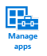

# Bereitstellen und Konfigurieren von Apps mit Microsoft Intune

Viele Unternehmen setzen [!INCLUDE[wit_firstref](../Token/wit_firstref_md.md)] hauptsächlich ein, um die Apps bereitzustellen, die Ihre Benutzer für ihre Arbeit benötigen. Bevor Sie Apps bereitstellen können, müssen Sie jedoch zunächst [die Geräte verwalten](https://technet.microsoft.com/library/dn646962.aspx).

Wenn Ihr Unternehmen z. B. Microsoft Word verwendet, stehen Versionen für Windows, iOS, Android und weitere Betriebssysteme zur Verfügung. Als IT-Administrator stehen Sie vor der Herausforderung, die Masse an verfügbaren Apps auf vielen verschiedenen Geräten und Computerplattformen so zu verwalten, dass die Benutzer ihre Arbeit erledigen können und gleichzeitig die Sicherheit der Unternehmensdaten gewährleistet wird.

[!INCLUDE[wit_nextref](../Token/wit_nextref_md.md)] bietet Ihnen eine Reihe von Möglichkeiten und Funktionen, um die Sicherheit Ihrer Apps zu verwalten. Dazu gehören auch Richtlinien für die Verwaltung von mobilen Anwendungen, mit denen Sie Apps auf Geräten verwalten können, die nicht bei [!INCLUDE[wit_nextref](../Token/wit_nextref_md.md)] registriert sind oder über eine andere Lösung verwaltet werden.

## Grundlegendes zum Lebenszyklus von Apps
Genau wie die Verwaltung Ihrer Geräte verfügen Apps über einen Lebenszyklus, der von der Vorbereitung, Bereitstellung, Überwachung und Aktualisierung bis zur Außerkraftsetzung führt.[!INCLUDE[wit_nextref](../Token/wit_nextref_md.md)] kann Sie in sämtlichen Phasen des Lebenszyklus unterstützen:

### Planen
Im Thema [Erste Schritte mit der Bereitstellung von Apps in Microsoft Intune](../Topic/Plan_for_app_deployment_in_Microsoft_Intune.md) machen Sie sich mit den Voraussetzungen und Konzepten vertraut, die Sie vor Beginn Ihrer Arbeit mit Apps kennen müssen. Sie erfahren, wie der Arbeitsbereich **Apps** aufgebaut ist und lernen die verschiedenen App-Typen kennen, die Sie bereitstellen können.

[!INCLUDE[wit_nextref](../Token/wit_nextref_md.md)] enthält auch Tools, mit denen Sie [prüfen können, welche Apps in Ihrer Organisation verwendet werden](https://technet.microsoft.com/en-us/library/jj733634.aspx) und wo sie installiert sind.

[!INCLUDE[wit_nextref](../Token/wit_nextref_md.md)] unterstützt das [Installieren von verschiedenartigen Apps](https://technet.microsoft.com/en-us/library/dn646955.aspx), z. B. von Apps aus dem App Store, Webanwendungen und intern entwickelten Apps.

### Bereitstellen
Nachdem Sie die Grundlagen verstanden haben, können Sie mit der Bereitstellung von Apps beginnen. In diesen Abschnitten erhalten Sie sämtliche Informationen zum Vorbereiten Ihrer Apps auf die Bereitstellung sowie zum anschließenden Bereitstellen auf [mobilen Geräten](https://technet.microsoft.com/library/dn646972.aspx) und [Computern](https://technet.microsoft.com/library/dn646961.aspx).

### Konfigurieren
[!INCLUDE[wit_nextref](../Token/wit_nextref_md.md)] bietet Tools, mit denen Sie die Unternehmensdaten in Ihren Apps verwalten, konfigurieren und schützen können.

-   Richtlinien für die Konfiguration von mobilen Apps stellen Konfigurationseinstellungen für eine App bereit, wenn diese ausgeführt wird. Beispielsweise können Sie Sprach-, Sicherheits- oder Netzwerkeinstellungen für die App festlegen.

-   Richtlinien für die Verwaltung von mobilen Apps tragen dazu bei, die Unternehmensdaten in Apps zu schützen, indem Funktionen für die Datenübertragung zwischen Apps eingeschränkt werden. Sie können z. B. Ausschneide-, Kopier- und Einfügevorgänge innerhalb einer verwalteten App einschränken.

-   Mit Richtlinien für verwaltete Browser wird eine Liste zulässiger oder blockierter Websites konfiguriert, um die Websites einzuschränken, die Benutzer des von [!INCLUDE[wit_nextref](../Token/wit_nextref_md.md)] verwalteten Browsers besuchen können.

Siehe [Konfigurieren von Apps mit Microsoft Intune](../Topic/Configure_apps_with_Microsoft_Intune.md).

### Aktualisieren
Moderne Apps werden häufig regelmäßig aktualisiert. Sicherzustellen, dass alle Benutzer die neueste Version einer App ausführen, kann sich als schwere Aufgabe erweisen. Glücklicherweise bietet [!INCLUDE[wit_nextref](../Token/wit_nextref_md.md)] eine einfache Funktion, mit der Sie eine zuvor bereitgestellte App durch eine neuere Version derselben App aktualisieren können.

Siehe [Aktualisieren von Apps mit Microsoft Intune](../Topic/Update_apps_using_Microsoft_Intune.md).

## Außerkraftsetzen
Nach einer gewissen Zeit ist es wahrscheinlich, dass die auf Geräten bereitgestellten Apps nicht mehr benötigt werden. Darum möchten Sie diese möglicherweise deinstallieren.[!INCLUDE[wit_nextref](../Token/wit_nextref_md.md)] vereinfacht diesen Prozess für Apps, die Sie verwalten.

Siehe [Außerkraftsetzen von Apps mit Microsoft Intune](../Topic/Retire_apps_using_Microsoft_Intune.md).

## Siehe auch
[Sicherer Zugriff auf Unternehmensressourcen von jedem Ort auf jedem Gerät](https://technet.microsoft.com/en-us/library/dn550982.aspx)
[Dokumentation zu Microsoft Intune](../Topic/Documentation_for_Microsoft_Intune.md)

