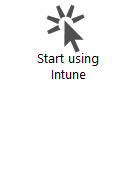
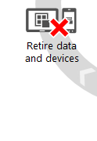
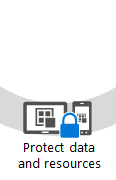
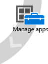

# Dokumentation zu Microsoft Intune &lt;Test 1&gt;
Mit Intune können Ihre Benutzer produktiver und flexibler arbeiten ohne  Schutz der Daten und Geräte zu vernachlässigen, mit denen sie arbeiten. In der Intune-Dokumentation wird erläutert, wie das geht.

Möglicherweise haben Sie aber auch Fragen dazu, wie Intune mit anderen Aspekten Ihres Jobs harmoniert. Hier sind einige Ressourcen, die diese Fragen beantworten können:

-   **Wie kann Intune helfen, die Mobilität im Unternehmen zu unterstützen?** Es gibt mehrere [Möglichkeiten zur Unterstützung von Mobilität im Unternehmen](https://technet.microsoft.com/library/dn957912.aspx) mit Intune, je nach Größe des Unternehmens, aktueller Verwaltungsinfrastruktur und Skalierungserfordernissen. Intune ist ein Teil der [Enterprise Mobility Suite (EMS)](http://www.microsoft.com/en-us/server-cloud/enterprise-mobility/overview.aspx). Sie können es eigenständig verwenden oder mit Azure Active Directory Premium, Azure Rights Management und der erweiterten Bedrohungsanalyse von Microsoft (Microsoft Advanced Threat Analytics) kombinieren, um umfassenden Schutz für Ihre Benutzer und Geräte bereitstellen.

-   **Welche Maßnahmen sollte ich einplanen, wenn Mitarbeitern ermögliche, ihre eigenen Geräte mit zur Arbeit zu bringen?**[Bring Your Own Device (BYOD) – Entwurfsüberlegungen](https://technet.microsoft.com/en-us/library/dn656905.aspx) wurde entwickelt, um Systemarchitekten und Designern Planung für eine mobile Belegschaft zu erleichtern.

-   **Was soll ich Mitarbeitern zur Verwendung ihrer persönlichen Geräte für den Zugriff auf E-Mail, Dateien und interne Websites mitteilen?** Mitarbeitern die Verwendung ihrer eigenen mobilen Geräte zu erlauben, kann ihre Produktivität steigern, allerdings sollten alle sehr genau verstehen, welche Verantwortung für den Schutz von Unternehmensdaten sie tragen. Die Mitarbeiter möchten wahrscheinlich auch wissen, wie sicher die eigenen persönlichen Informationen sind. Im [Registrierungshandbuch für Endbenutzer](http://aka.ms/b3ml2) finden Sie Material, das Ihnen hilft, dieses Gespräch zu führen.

-   **Warum sollte ich Intune mit Configuration Manager verwenden?** Wenn Sie bereits System Center Configuration Manager zum Verwalten der PCs, Macs und UNIX/Linux-Geräte im Unternehmen verwenden, können Sie durch Hinzufügen eines Intune-Connectors [all Ihre mobilen Geräte mühelos in einer einzigen Konsole verwalten](https://technet.microsoft.com/en-US/library/mt243476.aspx).

## Einführung in Intune
Im Abschnitt [Einführung in Intune](https://technet.microsoft.com/library/dn646960(TechNet.10).aspx) erhalten Sie einen Überblick über die Funktionen des Intune-Diensts. Hier finden Sie Informationen zur Anpassung von Intune an Ihr Unternehmen sowie zu Überlegungen, die vor dem Testen von Intune angestellt werden müssen.

## Erste Schritte
Der Abschnitt [Erste Schritte](https://technet.microsoft.com/library/dn646953(TechNet.10).aspx) enthält einen Leitfaden mit exemplarischen Vorgehensweisen, damit Sie sich mit der Intune-Umgebung vertraut machen können. Zudem haben Sie die Möglichkeit, ein erstes Pilotprojekt einzurichten. Außerdem finden Sie eine Vorlage, die Sie anpassen und den Benutzern bereitstellen können, um sie darüber zu informieren, was sie mit Intune erwartet.

## Registrieren von Geräten
Die heutigen Strategien zur Verwaltung mobiler Geräte (Mobile Device Management, MDM) behandeln verschiedene Mobiltelefone und Tabellen (iOS, Android, Windows). Der erste Schritt umfasst das [Einrichten der Geräteregistrierung ](https://technet.microsoft.com/library/dn646962(TechNet.10).aspx), unabhängig davon, ob Benutzer eigene Geräte (Bring Your Own Devices, BYOD) zum Abrufen von Unternehmensdaten verwalten lassen oder Sie firmeneigene Geräte (Company Owned Devices, COD) verteilen. Durch Registrieren mit Intune (MDM) oder durch Installieren der Intune-Clientsoftware können Sie auch Computer verwalten.

## Konfigurieren und Verwalten von Geräten
Sie müssen sowohl Geräte als auch Apps vorbereiten, um eine entsprechende Produktivität zu ermöglichen. In [Konfigurieren und Verwalten von Geräten](https://technet.microsoft.com/library/mt313202(TechNet.10).aspx) erstellen Sie Richtlinien, mit denen Sie steuern können, wie Benutzer zum VPN, WLAN und E-Mail-Dienst gelangen.

Sollen Benutzer auf Geräten, die Unternehmensdaten enthalten, Kennwörter verwenden? Sie können festlegen, dass ein Kennwort erforderlich ist. Gibt es Apps, die nicht verwendet werden sollen? Sie können diese Apps blockieren. Testen Sie diese Richtlinien, bevor Sie die Testclients registrieren und nehmen Sie dann auch während des Rollouts für alle Benutzer ständig weitere Optimierungen vor.

## Bereitstellen und Verwalten von Apps
In [Bereitstellen und Verwalten von Apps ](https://technet.microsoft.com/library/dn646965(TechNet.10).aspx) erfahren Sie, wie Sie Ihren Benutzern alle Arten von Apps – Store-Apps, Web-Apps, interne Apps – bereitstellen, aktualisieren und löschen, wenn sie nicht mehr benötigt werden.

## Schützen von Daten und Geräten
Es geht um immer um Daten. Sie müssen Benutzern Zugriff gewähren, aber Sie möchten sicherstellen, dass die Daten weder versehentlich falsch verwendet noch absichtlich missbraucht werden. In [Schutz von Daten und Geräten](https://technet.microsoft.com/library/mt313203(TechNet.10).aspx) erfahren Sie, welche Möglichkeiten Intune bereitstellt, um sicherzustellen, dass Benutzer nur dann auf gewünschte Features und Daten – z. B. E-Mail – zugreifen können, wenn ihre Geräte festgelegte Anforderungen erfüllen. Außerdem erfahren Sie, wie Sie mithilfe mehrstufiger Authentifizierung verhindern, dass Ihre Daten gestohlen werden, und wie Sie mithilfe von Apps Daten vor Verlust schützen.

## Außerkraftsetzen von Daten und Geräten
Wenn Geräte verloren gehen oder gestohlen werden, wenn Mitarbeiter das Unternehmen verlassen oder Hardware ersetzt werden muss, müssen Sie Apps und Daten von Geräten entfernen können, Geräte außer Kraft setzen oder den Zugriff widerrufen. Diese Szenarien sind unter [Außerkraftsetzen von Daten und Geräten in der Verwaltung](https://technet.microsoft.com/library/mt313204(TechNet.10).aspx) aufgeführt.

## Technische Referenz
Keine technische Dokumentation wäre ohne Themen zur [technischen Referenz](https://technet.microsoft.com/library/mt282239(TechNet.10).aspx) vollständig, die die Features behandelt.

## Zusätzliche Ressourcen

-   [Neuheiten in Microsoft Intune](../Topic/What_s_new_in_Microsoft_Intune.md)

-   [Anmerkungen zu Microsoft Intune](../Topic/Release_notes_for_Microsoft_Intune.md)

-   An der [!INCLUDE[wit_nextref](../Token/wit_nextref_md.md)]-Community teilnehmen:

    -   [Lesen Sie das Neueste ](http://blogs.technet.com/b/microsoftintune/) im Intune-Blog.[Folgen Sie Intune ](https://twitter.com/MSIntune) auf Twitter.[Stellen Sie eine Frage ](http://go.microsoft.com/fwlink/?LinkID=232998) in den Intune-Foren.

-   [Erfahren Sie, wie Sie Support für Intune erhalten](http://technet.microsoft.com/library/dn646963.aspx#OPEN)

