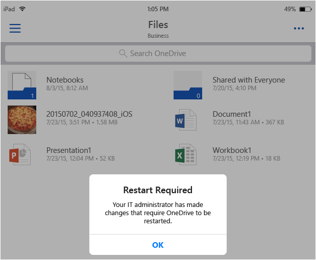
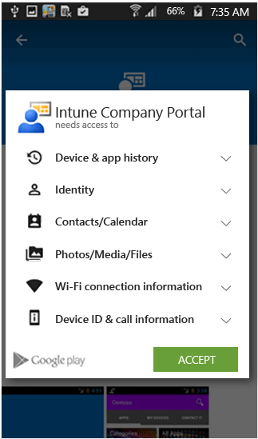
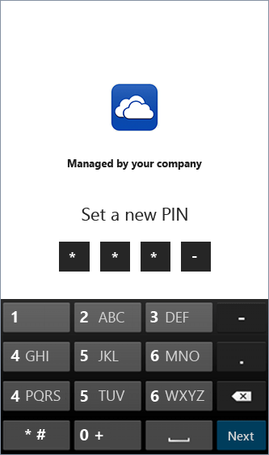
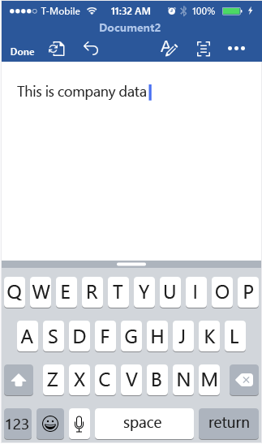

# Endbenutzer-Erfahrung mit Apps, die den Microsoft Intune-Verwaltungsrichtlinien f&#252;r mobile Apps unterliegen
MAM-Richtlinien (Mobile Application Management, Verwaltung mobiler Anwendungen) werden nur angewendet, wenn Apps im beruflichen Kontext verwendet werden.  Die folgenden Szenarien helfen Ihnen, Ihre Benutzer zu informieren, damit sie verstehen, wie verwaltete Apps funktionieren.

**Gegenstand dieses Themas**

[Szenario: Zugreifen auf OneDrive mit einem iOS-Gerät](#bkmk_OneDriveiOS)

[Szenario: Zugreifen auf OneDrive mit einem Android-Gerät](#bkmk_OneDriveAndroid)

[Szenario: Verwenden von Microsoft Word für berufliche und private Zwecke](#bkmk_wordworkandpersonal)

#### Szenario: Zugreifen auf OneDrive mit einem iOS-Gerät

1.  Starten Sie **OneDrive**, um die Anmeldeseite zu öffnen.

    

    > [!NOTE]
    > Auf einem privaten Gerät müsste der Endbenutzer normalerweise die App herunterladen.  Wenn das Gerät jedoch mit einer MDM-Lösung verwaltet wird, können Sie die App auf dem Gerät bereitstellen.

2.  Geben Sie den Benutzernamen Ihres Geschäftskontos ein. Sie werden auf die Seite **Office 365-Authentifizierung** weitergeleitet, auf der Sie Ihre Unternehmensanmeldeinformationen eingeben können.

    

3.  Nachdem Ihre Anmeldeinformationen von Azure Active Directory erfolgreich authentifiziert wurden, werden die MAM-Richtlinien angewendet, und Sie werden aufgefordert, **OneDrive** neu zu starten.

    

4.  Wenn Sie **OneDrive** neu starten, wird die App mit aktivierten MAM-Richtlinien gestartet. Sie werden nun aufgefordert, eine **PIN** für die App einzugeben (sofern hierfür eine Richtlinie konfiguriert wurde).

    

5.  Nachdem Sie die PIN festgelegt und bestätigt haben, können Sie auf Ihre Dateien in **OneDrive for Business** zugreifen.

    

    > [!NOTE]
    > Wenn Sie eine schon bereitgestellte Richtlinie ändern, werden die Änderungen beim nächsten Öffnen der App angewendet.

#### Szenario: Zugreifen auf OneDrive mit einem Android-Gerät

1.  Starten Sie OneDrive, um die Anmeldeseite zu öffnen.

    > [!NOTE]
    > Auf einem privaten Gerät müsste der Endbenutzer normalerweise die App herunterladen.  Wenn das Gerät jedoch mit einer MDM-Lösung verwaltet wird, können Sie die App auf dem Gerät bereitstellen.

2.  Geben Sie den Benutzernamen Ihres Geschäftskontos ein. Sie werden auf die Seite **Office 365-Authentifizierung** weitergeleitet, auf der Sie Ihre Unternehmensanmeldeinformationen eingeben können.

    

3.  Nachdem Ihre Anmeldeinformationen von **Azure AD** erfolgreich authentifiziert wurden, sollte eine Meldung mit Anweisungen zur Installation der Unternehmensportal-App angezeigt werden, sofern diese auf dem Gerät noch nicht installiert ist.  Tippen Sie auf **App abrufen**, um fortzufahren.

    

4.  Sie befinden sich nun im **Google Play Store**, von wo Sie die App **Unternehmensportal** herunterladen und installieren können.

    Die App "Unternehmensportal" hilft Ihnen, Ihre Daten zu schützen.

    

5.  Klicken Sie nach Abschluss der Installation auf **Annehmen**, um die Bedingungen zu akzeptieren.

    

6.  **OneDrive** wird automatisch gestartet.

7.  Beim nächsten Öffnen von OneDrive werden Sie aufgefordert, eine **PIN** einzurichten, sofern die Richtlinieneinstellungen vorgeben, dass für den Zugriff auf **OneDrive** eine PIN erforderlich ist.

    

8.  Nachdem Sie die PIN festgelegt und bestätigt haben, können Sie **OneDrive** weiterhin verwenden, wobei nun die Richtlinien für verwaltete Apps gelten.

    

#### Szenario: Verwenden von Microsoft Word für berufliche und private Zwecke

1.  Öffnen Sie **Word** auf Ihrem Gerät. Zur Darstellung der Schritte wird ein iOS-Gerät verwendet.

2.  Tippen Sie auf **Neu**, um ein neues Word-Dokument zu erstellen.

    

3.  Geben Sie einen oder zwei Sätze ein.  Wenn Sie dieses Dokument speichern, werden sowohl private als auch geschäftliche Speicherorte als Optionen zum Speichern des soeben erstellten Dokuments angezeigt.  An diesem Punkt werden die App-Richtlinien noch nicht angewendet, da der private/geschäftliche Kontext noch nicht eingerichtet wurde.

4.  Speichern Sie das Dokument an Ihrem OneDrive for Business-Speicherort. Das Dokument wird damit als Unternehmensdaten gekennzeichnet, und die Einschränkungen der Richtlinie werden wirksam.

    

5.  Öffnen Sie das Dokument, das Sie am Unternehmensspeicherort gespeichert haben.  Kopieren Sie den Text, öffnen Sie Ihr privates **Facebook**-Konto, und versuchen Sie, den kopierten Text einzufügen.  Wie Sie sehen, können Sie den Text nicht in den neuen Facebook-Beitrag einfügen. Die Option "Einfügen" ist nicht abgeblendet, aber wenn Sie auf **Einfügen** klicken, erfolgt keine Aktion.

    

    

6.  Wiederholen Sie nun die Schritte 2 und 3, um ein weiteres neues Dokument zu erstellen, geben Sie einen oder zwei Sätze ein, und speichern Sie das Dokument diesmal nicht mit dem Geschäftskonto, sondern mit Ihrem privaten Konto an einem privaten Speicherort wie **OneDrive – persönlich**.

    

7.  Öffnen Sie das Dokument, das Sie auf Ihrem persönlichen Speicherort abgelegt haben.  Kopieren Sie den Text, öffnen Sie die **Facebook**-App, und versuchen Sie, den kopierten Text einzufügen. Wie Sie sehen, können Sie den kopierten Inhalt in einen Facebook-Beitrag einfügen.

    

### Ändern des Benutzerkontos auf einem Gerät
Bei den OneDrive- und Outlook-Apps können Sie auf einem Gerät nur ein Geschäftskonto verwenden, für das eine MAM-Richtlinie gilt.  Das Hinzufügen weiterer Geschäftskonten wird von diesen Apps blockiert.  Sie können jedoch einen Benutzer entfernen und auf dem Gerät einen weiteren Benutzer hinzufügen.

Wenn Sie ein iOS-Gerät verwenden und versuchen, auf demselben Gerät ein zweites Geschäftskonto einzurichten, wird eine Sperrnachricht angezeigt.  Darüber hinaus wird eine Option zum Entfernen des vorhanden Kontos und zum Hinzufügen eines neuen Kontos angezeigt. Klicken Sie hierfür auf **Ja**.

Wenn Sie ein Android-Gerät verwenden, wird eine Sperrnachricht mit Anweisungen angezeigt, wie Sie das vorhandene Konto entfernen und ein neues Konto hinzufügen können.  Wechseln Sie auf Android-Geräten zum Entfernen eines vorhandenen Kontos zu **Einstellungen &gt; Allgemein &gt; Anwendungs-Manager &gt; Unternehmensportal**, und wählen Sie "Daten löschen" aus.

## Siehe auch
[Erstellen und Bereitstellen von Verwaltungsrichtlinien für mobile Apps mit Microsoft Intune](../Topic/Create_and_deploy_mobile_app_management_policies_with_Microsoft_Intune.md)

