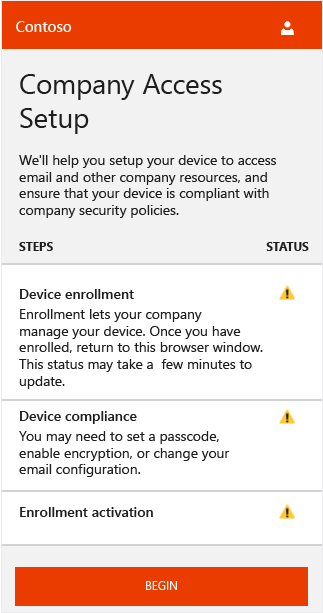
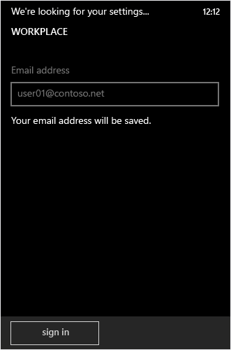
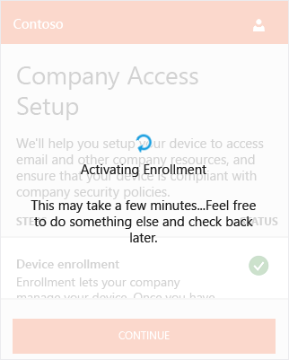
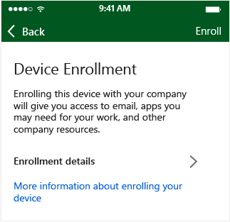
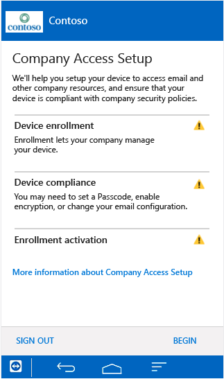
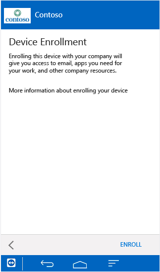
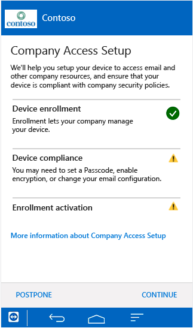

# Endbenutzererfahrung bei bedingtem Zugriff
In diesem Thema wird das Endbenutzerszenario nach dem Aktivieren des bedingten Zugriffs beschrieben, wenn ein Endbenutzer versucht, auf seinem mobilen Gerät auf E-Mails zuzugreifen.

> [!TIP]
> Eine herunterladbare Version des gesamten Themenbereichs finden Sie in der [TechNet Gallery](https://gallery.technet.microsoft.com/Deploying-Enterprise-16499404).

## Windows Phone
> [!NOTE]
> Der Registrierungsvorgang und die dem Benutzer angezeigten Bildschirme können abhängig von der auf dem Endbenutzergerät ausgeführten Betriebssystemversion geringfügig variieren.

1.  Wenn ein Benutzer bereits bei Intune registriert ist und Kompatibilität besteht, ist für den Benutzer auf Windows-Geräten kein Unterschied erkennbar. Der Benutzer kann weiterhin auf E-Mails zugreifen. Benutzer, die sich noch nicht bei Intune registriert haben, erhalten eine Quarantäne-E-Mail, die in etwa so wie das folgende Beispiel aussieht:

    

    Der Benutzer klickt auf **Jetzt starten**, um mit der Registrierung des Geräts zu beginnen.

2.  Der Benutzer klickt auf dem Bildschirm zum Einrichten des Unternehmenszugriffs auf **Starten**, um mit dem Einrichten des Geräts zu beginnen und zu überprüfen, ob es kompatibel ist.

    

3.  Der Benutzer klickt auf dem Bildschirm "Registrieren Sie Ihr Gerät" auf **Registrierung bestätigen**, um mit der Registrierung des Geräts zu beginnen.

    

    Während der Registrierung wird das Profil für die Verwaltung mobiler Geräte installiert, mit dem Sie, der IT-Administrator, das Gerät remote verwalten können. Der Benutzer wird möglicherweise aufgefordert, ein Zertifikat zur Autorisierung der Arbeitsbereichverknüpfung zu akzeptieren.

    

4.  Der Benutzer meldet sich mit der E-Mail-Adresse an, die er mit Office verwendet. Nach der Anmeldung müssen die Benutzer möglicherweise noch einmal auf **Registrierung bestätigen** klicken, um den Vorgang zur Registrierung des Geräts fortzusetzen.

    

    Das Gerät wird überprüft, um sicherzustellen, dass es registriert ist.

    

5.  Dann schließt der Benutzer den Registrierungsvorgang ab, indem er sein Gerät auswählt und auf **Auswählen** klickt. Wenn das Gerät nicht angezeigt wird, kann der Benutzer **Mein Gerät ist nicht aufgelistet** auswählen, um den Vorgang zu wiederholen.

    

    Das Gerät wird überprüft, um sicherzustellen, dass es den Unternehmensrichtlinien entspricht.

    

6.  Wenn ein Kompatibilitätsproblem besteht, wird der Benutzer aufgefordert, das Problem zu beheben (beispielsweise ein gültiges Kennwort zu erstellen) und dann auf **Kompatibilität überprüfen** zu klicken, um den Vorgang fortzusetzen.

    

    Nachdem die Kompatibilität überprüft wurde, kann der Benutzer sehen, dass die Registrierung aktiviert wird.

    

7.  Die Registrierung wird aktiviert, und der Benutzer klickt auf **Weiter**, um den Vorgang abzuschließen. Dann klickt der Benutzer auf **Fertig**, um die Einrichtung zu beenden.

    

    Nachdem der Benutzer registriert und die Kompatibilität überprüft wurde, sollte der E-Mail-Zugriff innerhalb weniger Minuten verfügbar sein.

Wenn der Benutzer diese Schritte ausgeführt hat, um sich zu registrieren und die Kompatibilität sicherzustellen, aber trotzdem nicht auf seinem mobilen Gerät auf seine E-Mails zugreifen kann, hat er die Möglichkeit, die folgenden zusätzlichen Schritte auszuführen, um zu versuchen, das Problem zu beheben:

-   Zuerst muss der Benutzer sicherstellen, dass das Gerät registriert ist. Wenn dies nicht der Fall ist, muss der Benutzer die obigen Schritte ausführen.

-   Der Benutzer muss sicherstellen, dass das Gerät kompatibel ist, indem er auf **Kompatibilität überprüfen** klickt. Wenn ein Kompatibilitätsfehler festgestellt wird, kann der Benutzer den Anweisungen für das jeweilige mobile Gerät zum Beheben des Fehlers befolgen, und beispielsweise das Kennwort zurücksetzen.

-   Beim Helpdesk anrufen.

### Wenn ein Gerät nicht mehr kompatibel ist
Die Geräte werden standardmäßig alle 8 Stunden überprüft, um sicherzustellen, dass sie immer noch kompatibel sind. Wenn ein zuvor kompatibles Gerät später als nicht kompatibel erachtet wird, weil beispielsweise eine Kompatibilitätsrichtlinie hinzugefügt oder geändert wurde, kann der Benutzer die folgenden Schritte ausführen, um die Kompatibilität des Geräts wiederherzustellen:

1.  Der Benutzer erhält eine Benachrichtigung per E-Mail oder auf dem Gerät, dass das Gerät nicht kompatibel ist. Zu diesem Zeitpunkt wird das Gerät in Exchange unter Quarantäne gestellt.

2.  Wenn der Benutzer versucht, auf E-Mails zuzugreifen, wird er vom Intune-Unternehmensportal wieder zum Bildschirm zum Einrichten des Unternehmenszugriffs umgeleitet, auf dem angezeigt wird, dass keine Kompatibilität besteht.

    

3.  Der Benutzer klickt auf **Weiter**, und daraufhin wird das Kompatibilitätsproblem angezeigt, durch das der Zugriff auf E-Mails verhindert wird.

4.  Nach der Problembehebung klickt der Benutzer auf **Kompatibilität überprüfen**, um zu überprüfen, ob das Problem behoben ist.

5.  Wenn das Problem behoben ist, klickt der Benutzer auf **Weiter**, um den Vorgang abzuschließen. Der E-Mail-Zugriff sollte innerhalb weniger Minuten wieder verfügbar sein.

## iOS
> [!NOTE]
> Der Registrierungsvorgang und die dem Benutzer angezeigten Bildschirme können abhängig von der auf dem Endbenutzergerät ausgeführten Betriebssystemversion geringfügig variieren.

1.  Wenn ein Benutzer bereits bei Intune registriert ist und Kompatibilität besteht, ist für den Benutzer auf iOS-Geräten kein Unterschied erkennbar. Der Benutzer kann weiterhin auf E-Mails zugreifen. Wenn der Benutzer noch nicht registriert ist, wird beim Starten der E-Mail-App eine Quarantänenachricht angezeigt, die in etwa wie folgt aussieht:

    

    Der Benutzer klickt auf **Jetzt starten**, um mit der Registrierung des Geräts zu beginnen.

2.  Der Benutzer wird aufgefordert, die Intune-Unternehmensportal-App aus dem entsprechenden App Store (herunterzuladen und) zu installieren.

    

    Nach der Installation öffnet der Benutzer die App und meldet sich mit seinen Unternehmensanmeldeinformationen an.

3.  Der Benutzer klickt auf dem Bildschirm zum Einrichten des Unternehmenszugriffs auf **Starten**, um mit dem Einrichten des Geräts zu beginnen und zu überprüfen, ob es kompatibel ist.

    

4.  Der Benutzer klickt auf dem Bildschirm "Geräteregistrierung" auf **Registrieren**, um mit der Registrierung des Geräts zu beginnen.

    

    Während der Registrierung wird das Profil für die Verwaltung mobiler Geräte installiert, mit dem Sie, der IT-Administrator, das Gerät remote verwalten können. Der Benutzer gibt sein Kennwort ein, wenn er dazu aufgefordert wird.

5.  Der Benutzer klickt auf dem Bildschirm zum Einrichten des Unternehmenszugriffs auf **Weiter**, um die Kompatibilitätsprüfung für das Gerät zu starten.

    

    Wenn ein Kompatibilitätsproblem besteht, wird der Benutzer aufgefordert, das Problem (beispielsweise durch Erstellen eines gültigen Kennworts) zu beheben und dann auf **Kompatibilität überprüfen** zu klicken, um den Vorgang fortzusetzen.

    

6.  Wenn das Gerät vollständig kompatibel ist, klickt der Benutzer auf **Weiter**, um den Vorgang fortzusetzen.

    

    Nachdem der Benutzer registriert und die Kompatibilität überprüft wurde, sollte der E-Mail-Zugriff innerhalb weniger Minuten verfügbar sein.

Wenn der Benutzer diese Schritte ausgeführt hat, um sich zu registrieren und die Kompatibilität sicherzustellen, aber trotzdem nicht auf seinem mobilen Gerät auf seine E-Mails zugreifen kann, hat er die Möglichkeit, die folgenden zusätzlichen Schritte auszuführen, um zu versuchen, das Problem zu beheben:

-   Zuerst muss der Benutzer sicherstellen, dass das Gerät registriert ist. Wenn dies nicht der Fall ist, muss der Benutzer die obigen Schritte ausführen.

-   Der Benutzer muss sicherstellen, dass das Gerät kompatibel ist, indem er auf **Kompatibilität überprüfen** klickt. Wenn ein Kompatibilitätsfehler festgestellt wird, kann der Benutzer den Anweisungen für das jeweilige mobile Gerät zum Beheben des Fehlers befolgen, und beispielsweise das Kennwort zurücksetzen.

-   Beim Helpdesk anrufen.

### Wenn ein Gerät nicht mehr kompatibel ist
Die Geräte werden standardmäßig alle 8 Stunden überprüft, um sicherzustellen, dass sie immer noch kompatibel sind. Wenn ein zuvor kompatibles Gerät später als nicht kompatibel erachtet wird, weil beispielsweise eine Kompatibilitätsrichtlinie hinzugefügt oder geändert wurde, kann der Benutzer die folgenden Schritte ausführen, um die Kompatibilität des Geräts wiederherzustellen:

1.  Der Benutzer erhält eine Benachrichtigung per E-Mail oder auf dem Gerät, dass das Gerät nicht kompatibel ist. Zu diesem Zeitpunkt wird das Gerät in Exchange unter Quarantäne gestellt.

2.  Wenn der Benutzer versucht, auf E-Mails zuzugreifen, wird er vom Intune-Unternehmensportal wieder zum Bildschirm zum Einrichten des Unternehmenszugriffs umgeleitet, auf dem angezeigt wird, dass keine Kompatibilität besteht.

    

3.  Der Benutzer klickt auf **Weiter**, und daraufhin wird das Kompatibilitätsproblem angezeigt, durch das der Zugriff auf E-Mails verhindert wird.

    

4.  Nach der Problembehebung klickt der Benutzer auf **Kompatibilität überprüfen**, um zu überprüfen, ob das Problem behoben ist.

5.  Wenn das Problem behoben ist, klickt der Benutzer auf **Weiter**, um den Vorgang abzuschließen.

    

    Der E-Mail-Zugriff sollte innerhalb weniger Minuten wieder verfügbar sein.

## Android
> [!NOTE]
> Der Registrierungsvorgang und die dem Benutzer angezeigten Bildschirme können abhängig von der auf dem Endbenutzergerät ausgeführten Betriebssystemversion geringfügig variieren.

1.  Wenn der Benutzer versucht, auf E-Mails zuzugreifen, erhält er zuerst eine Quarantäne-E-Mail, die in etwa so wie das folgende Beispiel aussieht:

    

    Der Benutzer klickt auf **Jetzt starten**, um mit der Registrierung des Geräts zu beginnen.

    > [!NOTE]
    > Wenn ein Benutzer keinen Standardbrowser für das Gerät festgelegt hat, wird er während der Geräteregistrierung und während der Registrierungsaktivierung aufgefordert, das Öffnen eines Browserfensters über einen Link zuzulassen. Wenn der Benutzer dazu aufgefordert wird, muss er jedes Mal den gleichen Browser auswählen. Andernfalls kann der Registrierungsvorgang nicht ausgeführt werden.

2.  Der Benutzer wird aufgefordert, die Intune-Unternehmensportal-App aus dem entsprechenden App Store (herunterzuladen und) zu installieren.

    

    Nach der Installation öffnet der Benutzer die App und meldet sich mit seinen Unternehmensanmeldeinformationen an.

3.  Der Benutzer klickt auf dem Bildschirm zum Einrichten des Unternehmenszugriffs auf **Starten**, um mit dem Einrichten des Geräts zu beginnen und zu überprüfen, ob es kompatibel ist.

    

4.  Der Benutzer klickt auf dem Bildschirm "Geräteregistrierung" auf **Registrieren**, um mit der Registrierung des Geräts zu beginnen.

    

5.  Benutzer müssen den Geräteadministrator aktivieren, indem sie bei entsprechender Aufforderung auf **Aktivieren** klicken. Andernfalls wird der Geräteregistrierungsvorgang abgebrochen.

    

    Die Geräteregistrierung wird gestartet. Je nach Gerät wird während der Registrierung möglicherweise eine Aufforderung zur Zertifikatinstallation oder eine Samsung KNOX-Datenschutzrichtlinien-Eingabeaufforderung angezeigt. Diese sind erforderlich, damit Sie als IT-Administrator das Gerät remote verwalten können. Das Gerät wird bei Intune registriert, und es wird eine Geräteidentität in Azure Active Directory eingerichtet.

    

6.  Nachdem der Registrierungsvorgang erfolgreich abgeschlossen wurde, klickt der Benutzer auf **Weiter**, um die Kompatibilitätsprüfung für das Gerät zu starten.

    

    Wenn ein Kompatibilitätsproblem besteht, wird der Benutzer aufgefordert, das Problem zu beheben (beispielsweise ein gültiges Kennwort zu erstellen) und dann auf **Kompatibilität überprüfen** zu klicken, um den Vorgang fortzusetzen.

    

7.  Wenn das Gerät vollständig kompatibel ist, klickt der Benutzer auf **Weiter**, um die Registrierungsaktivierung zu starten. Dadurch wird die AAD-Geräteidentität mit der von Exchange bereitgestellten EAS-ID verbunden.

    > [!NOTE]
    > Auf Android-Geräten wird der Standardbrowser ein paar Sekunden während der Registrierungsaktivierung angezeigt. Wenn der Benutzer noch keinen Standardbrowser ausgewählt hat, wird er zum Auswählen eines Browsers aufgefordert. Beim Einrichten des Unternehmenszugriffs muss der gleiche Browser vom Benutzer ausgewählt werden, wenn eine entsprechende Aufforderung erfolgt.

    

8.  Die Registrierungsaktivierung wird abgeschlossen, und der Benutzer klickt auf **Fertig**, um die Registrierung und die Kompatibilitätsprüfung zu beenden.

    

    Nachdem der Benutzer registriert und die Kompatibilität überprüft wurde, sollte der E-Mail-Zugriff innerhalb weniger Minuten verfügbar sein.

Wenn der Benutzer diese Schritte ausgeführt hat, um sich zu registrieren und die Kompatibilität sicherzustellen, aber trotzdem nicht auf seinem mobilen Gerät auf seine E-Mails zugreifen kann, hat er die Möglichkeit, die folgenden zusätzlichen Schritte auszuführen, um zu versuchen, das Problem zu beheben:

1.  Zuerst muss der Benutzer sicherstellen, dass das Gerät registriert ist. Wenn dies nicht der Fall ist, muss der Benutzer die obigen Schritte ausführen.

2.  Der Benutzer muss sicherstellen, dass das Gerät kompatibel ist, indem er auf **Kompatibilität überprüfen** klickt. Wenn ein Kompatibilitätsfehler festgestellt wird, kann der Benutzer den Anweisungen für das jeweilige mobile Gerät zum Beheben des Fehlers befolgen, und beispielsweise das Kennwort zurücksetzen.

3.  Beim Helpdesk anrufen.

### Wenn ein Gerät nicht mehr kompatibel ist
Die Geräte werden standardmäßig alle 8 Stunden überprüft, um sicherzustellen, dass sie immer noch kompatibel sind. Wenn ein zuvor kompatibles Gerät später als nicht kompatibel erachtet wird, weil beispielsweise eine Kompatibilitätsrichtlinie hinzugefügt oder geändert wurde, kann der Benutzer die folgenden Schritte ausführen, um die Kompatibilität des Geräts wiederherzustellen:

1.  Der Benutzer erhält eine Benachrichtigung per E-Mail oder auf dem Gerät, dass das Gerät nicht kompatibel ist. Zu diesem Zeitpunkt wird das Gerät in Exchange unter Quarantäne gestellt.

2.  Wenn der Benutzer versucht, auf E-Mails zuzugreifen, wird eine Quarantäne-E-Mail angezeigt, in der er darüber informiert wird, dass die Kompatibilitätsprobleme zuerst behoben werden müssen, um Zugriff zu erhalten. Wenn der Benutzer in der Quarantäne-E-Mail auf den Link klickt, wird er (über den Standardbrowser und Google Play) im Intune-Unternehmensportal zum Bildschirm zum Einrichten des Unternehmenszugriffs umgeleitet, auf dem angezeigt wird, dass das Gerät nicht kompatibel ist.

    

3.  Der Benutzer klickt auf **Weiter**, und daraufhin wird das Kompatibilitätsproblem angezeigt, durch das der Zugriff auf E-Mails verhindert wird.

    

4.  Nach der Problembehebung klickt der Benutzer auf **Kompatibilität überprüfen**, um zu überprüfen, ob das Problem behoben ist.

5.  Wenn das Problem behoben ist, klickt der Benutzer auf **Weiter**, um den Vorgang abzuschließen. Der E-Mail-Zugriff sollte innerhalb weniger Minuten wieder verfügbar sein.

## Siehe auch
[Erfahren Sie, wie Sie eine Lösung für den Schutz von geschäftlichen E-Mails und Dokumenten bereitstellen.](../Topic/Learn_how_to_deploy_a_solution_for_protecting_company_email_and_documents.md)
[Verwenden des bedingten Zugriffs zwischen Intune und Configuration Manager](../Topic/Use_conditional_access_with_Intune_and_Configuration_Manager.md)

