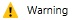

# Benachrichtigungen durch Microsoft Intune-Warnungen
Warnungen halten Sie über Ereignisse in [!INCLUDE[wit_firstref](../Token/wit_firstref_md.md)] auf dem Laufenden.

Warnungen können Sie z. B. bei den folgenden Ereignissen benachrichtigen:

-   Ein Problem mit dem Exchange-Connector beeinflusst die Verwaltung mobiler Geräte.

-   Auf einem Computer wurde Malware gefunden.

-   Ein Konflikt zwischen zwei [!INCLUDE[wit_nextref](../Token/wit_nextref_md.md)]-Richtlinien wurde erkannt.

-   Die neuesten Updates und Informationen zum [!INCLUDE[wit_nextref](../Token/wit_nextref_md.md)]-Service (Hinweise).

## Funktionsweise von Warnungen
Warnungen werden auf der Grundlage von **Warnungstypen** generiert, einem Satz von vorkonfigurierten, in [!INCLUDE[wit_nextref](../Token/wit_nextref_md.md)] integrierten Regeln. Der Warnungstyp **Im Cloudspeicher ist nur noch weniger als 10 % freier Speicherplatz vorhanden** warnt Sie beispielsweise, wenn Sie der Speicherplatz zum Speichern von Apps in der Cloud zur Neige geht. Sie können jeden Warnungstyp aktivieren oder deaktivieren und die Eigenschaften konfigurieren. Wenn Sie den oben genannten Warnungstyp verwenden, können Sie z. B. folgende Eigenschaften konfigurieren:

-   **Status:** Legt fest, ob der Warnungstyp aktiviert oder deaktiviert ist.

-   **Schweregrad:** Wie schwerwiegend ist diese Warnung?

    |||
    |-|-|
    |Schweregrad|Beschreibung|
    ||Weist auf ein schwerwiegendes Problem hin, das Sie so bald wie möglich untersuchen sollten, z. B., wenn Malware auf einem Computer erkannt wurde.|
    ||Weist auf ein Problem hin, das aktuell nicht kritisch ist, aber möglicherweise ernsthaft werden kann, wenn Sie sich nicht darum kümmern, z. B., wenn Sicherheitsupdates zum Installieren vorhanden sind.|
    ||Weist auf Informationen hin, die für den Betrieb unkritisch sind, z. B., wenn eine neue Version von Exchange Connector verfügbar ist.|

Andere Warnungstypen können verschiedene, konfigurierbare Elemente enthalten, z. B. den Prozentsatz der Geräte, die durch ein Problem betroffen sein müssen, bevor eine Warnung generiert wird.

**Wenn die Kriterien eines Warnungstyps erfüllt sind, wird eine Warnung generiert und in der [!INCLUDE[wit_nextref](../Token/wit_nextref_md.md)]-Verwaltungskonsole angezeigt.**

Darüber hinaus können Sie [!INCLUDE[wit_nextref](../Token/wit_nextref_md.md)] so konfigurieren, dass Sie per E-Mail benachrichtigt werden, wenn eine Warnung generiert wird.

## Konfigurieren von Warnungen
Klicken Sie in der [Microsoft Intune-Verwaltungskonsole](https://manage.microsoft.com) auf **Admin** &gt; **Warnungen und Benachrichtigungen**, und wählen Sie anschließend eine der folgenden Konfigurationsaufgaben aus:

|Aufgabe|Beschreibung|
|-----------|----------------|
|**Warnungstypen**|Wählen Sie den Warnungstyp aus, den Sie konfigurieren möchten, und führen Sie dann eine der folgenden Aktionen aus:  -   Klicken auf **Konfigurieren**. Konfigurieren Sie im Dialogfeld **Warnungstyp konfigurieren** die gewünschten Einstellungen, und klicken Sie dann auf **OK**. -   **Aktivieren** oder **Deaktivieren** Sie die Warnung. **Tip:** Erweitern Sie den Knoten **Warnungstypen**, und klicken Sie auf eine Kategorie, um nur die Warnungstypen dieser Kategorie anzuzeigen.|
|**Empfänger**|Klicken Sie auf **Hinzufügen**, um eine neue E-Mail-Adresse hinzuzufügen, an die die konfigurierten E-Mail-Benachrichtigungen gesendet werden sollen.  Sie können auch vorhandene Empfänger **bearbeiten** oder **löschen**. **Tip:** Um Benachrichtigungen zu erhalten, müssen Sie diese E-Mail-Adresse zudem als Empfänger unter **Benachrichtigungsregeln** hinzufügen.|
|**Benachrichtigungsregeln**|Konfiguriert Regeln, die definieren, an wen eine E-Mail-Warnung gesendet wird. Sie können entweder:  <ul><li>**Eine vorhandene Regel auswählen** – Wählen Sie eine Regel aus, und klicken Sie dann auf **Empfänger auswählen**. Dann können Sie alle Empfänger auswählen, an die eine E-Mail gesendet werden soll, wenn eine Warnung generiert wird, die diese Regel erfüllt.</li><li>**Eine neuen Regel erstellen** – Klicken Sie auf **Neue Regel erstellen**, und gehen Sie dann folgendermaßen vor:  <ol><li>Geben Sie einen Namen für die Regel ein, und wählen Sie dann die für die Regel geltenden Warnungskategorien und den Schweregrad aus.</li><li>Wählen Sie die Gerätegruppen aus, für die die Regel gilt.</li><li>Wählen Sie die Benutzer aus, die eine E-Mail erhalten, wenn eine Warnung generiert wird.</li></ol></li><li>Klicken Sie auf **Speichern**.</li></ul>Sie können auch eine vorhandene Regel **aktivieren**, **deaktivieren**, **bearbeiten** oder **löschen**.|

## Arbeiten mit Warnungen
Die folgenden Optionen erleichtern die Arbeit mit Warnungen in der die Intune-Verwaltungskonsole.

|Option|Beschreibung|
|----------|----------------|
|Anzeigen aktiver Warnungen|Wählen Sie eine der folgenden:  -   **Warnungszusammenfassung anzeigen** – Im Arbeitsbereich **Dashboard** werden die wichtigsten Fehler im Warnungsbereich angezeigt. Klicken Sie in den Bereich, um ausführlichere Informationen anzuzeigen:     Darüber hinaus können Sie eine Warnungszusammenfassung auf der Seite **Übersicht** im Arbeitsbereich **Warnungen** anzeigen. -   **Alle Warnungen anzeigen** – Klicken Sie im Arbeitsbereich **Warnungen** auf **Alle Warnungen**.|
|Anzeigen von Benachrichtigungen|Wählen Sie eine der folgenden:  -   Klicken Sie im Arbeitsbereich **Dashboard** auf **Benachrichtigungen**. -   Klicken Sie im Arbeitsbereich **Warnungen** auf **Alle Warnungen** &gt; **Benachrichtigungen**.|
|Schließen einer Warnung|Wählen Sie in der Liste der Warnungen die Warnung aus, die Sie schließen möchten, und klicken Sie dann auf **Warnung schließen**.  Geschlossene Warnungen werden nach 90 Tagen dauerhaft gelöscht.|
|Erneutes Aktivieren einer geschlossenen Warnung|Legen Sie in der Liste der Warnungen die Dropdownliste **Filter** auf **Geschlossen** fest.  Wählen Sie in der Liste geschlossener Warnungen die Warnung aus, die Sie erneut aktivieren möchten, und klicken Sie dann auf **Warnung erneut aktivieren**.|
[!INCLUDE[wit_nextref](../Token/wit_nextref_md.md)]-Warnungen bleiben aktiv, bis:

-   Das Problem, das die Warnung verursacht hat, beseitigt wurde.

-   Sie die Warnung manuell schließen.

-   45 Tage seit dem Generieren der Warnung vergangen sind.

> [!TIP]
> Wenn dieselbe Warnung von Geräten mit verschiedenen Betriebssystemen generiert wird, werden möglicherweise mehrere Versionen der gleichen Warnung in der Warnungsliste angezeigt.

## Siehe auch
[Überwachung und Berichte in Microsoft Intune](../Topic/Monitoring_and_reports_with_Microsoft_Intune.md)

