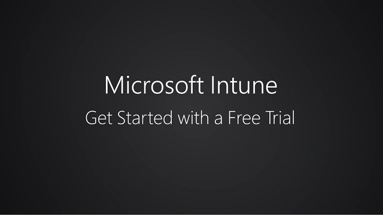

# Erste Schritte mit einer 30-Tage-Testversion von Microsoft Intune
Eine kostenlose 30-Tage-Testversion von Microsoft Intune, um Ihre mobilen Geräte und Computer zu verwalten, können Sie schnell und einfach einrichten. Mit wenigen einfachen Schritten in der Testversion können Sie bis zu 100 Benutzer und Geräte hinzufügen, Gruppen einrichten, Compliancerichtlinien konfigurieren und mobile Geräte und Computer registrieren und verwalten. In diesem Thema erfahren Sie die Grundlagen, wie Sie eine Intune Testversion einrichten und ausführen, und erhalten einen Überblick über den Dienst, sodass Sie die Features und Funktionen von Intune beurteilen können.

Sehen Sie sich dieses fünfminütige Demovideo an, um zu erfahren, wie einfach es ist, mit einer kostenlose Testversion von Microsoft Intune einzusteigen und Ihre Geräte zu verwalten:

## Vorbereitung
Bevor Sie mit Intune loslegen, benötigen Sie Folgendes:

-   Ein Gerät mit einem Silverlight-fähigen Webbrowser, mit dessen Hilfe Sie auf die Websites zugreifen können, auf denen Sie Intune-Benutzerkonten erstellen (**Intune-Kontoportal**) sowie Geräte, Gruppen und Richtlinien verwalten (**Intune-Verwaltungskonsole**) können.

-   Ein zweites Gerät mit einem Webbrowser, mit dem Sie testen, wie sich [!INCLUDE[wit_nextref](../Token/wit_nextref_md.md)]-Benutzer mithilfe des Unternehmensportals registrieren und ihre Geräte verwalten. Sie werden außerdem testen, wie Benutzer Apps suchen und installieren sowie Hilfe von Administratoren anfordern. Wenn Sie kein zweites Gerät haben, können Sie in dem Browser, den Sie zur Verwaltung von [!INCLUDE[wit_nextref](../Token/wit_nextref_md.md)] verwenden, auch den Datenschutzmodus aktivieren. (In Internet Explorer beispielsweise klicken Sie hierzu auf **Extras** &gt; **InPrivate-Browsen**).

-   Wenn Sie über ein vorhandenes Microsoft Online Services-Konto verfügen, dann benötigen Sie die Anmeldeinformationen des Administrators für dieses Konto. Wenn Sie nicht über ein solches Konto verfügen oder diesen Intune-Mandanten nur zu Evaluierungszwecken verwenden möchten, dann benötigen Sie diese Administratoranmeldeinformationen nicht.

-   Wenn Sie iOS- oder Windows Phone-Geräte mit der Intune-Testversion verwalten möchten, benötigen Sie Zertifikate (oder Schlüssel) und Konten, um diese Zertifikate abzurufen (siehe die folgende Tabelle) Für Android-Geräte sind keine zusätzlichen Zertifikate erforderlich.

    |Plattform|Zertifikatanforderungen|Weitere Informationen|
    |-------------|---------------------------|-------------------------|
    |Windows Phone 8.1 und [!INCLUDE[winphone8_client_1](../Token/winphone8_client_1_md.md)]|Für Benutzer von Windows Phone 8.1, die die Unternehmensportal-App über den Store installieren, ist kein Zertifikat erforderlich. Für Windows Phone 8.0 oder zur Verwendung von Intune zum Bereitstellen der Unternehmensportal-App auf Windows Phone 8.1-Geräten ist ein Symantec-Zertifikat erforderlich.|In dieser Anleitung wird davon ausgegangen, dass Ihre Benutzer die Unternehmensportal-App aus dem Store auf ein Gerät mit Windows Phone 8.1 oder höher abrufen. Weitere Informationen zur Unterstützung von Windows Phone 8.0 finden Sie unter [Einrichten der Windows Phone-Verwaltung mit Microsoft Intune](../Topic/Set_up_Windows_Phone_management_with_Microsoft_Intune.md).|
    |Geräte mit Windows 10, [!INCLUDE[winblue_winrt_2](../Token/winblue_winrt_2_md.md)], [!INCLUDE[win8RT_client_1](../Token/win8RT_client_1_md.md)] oder [!INCLUDE[winblue_client_2](../Token/winblue_client_2_md.md)]|Es bestehen keine Zertifikatanforderungen beim Registrieren von Geräten mit Windows RT und Windows.|[Installieren des Windows-PC-Clients mit Microsoft Intune](../Topic/Install_the_Windows_PC_client_with_Microsoft_Intune.md).|
    |iOS 7.1 oder höher|Beziehen Sie ein Apple Push Notification Service-Zertifikat.|Fordern Sie ein Apple Push Notification Service-Zertifikat bei Apple an, wie hier beschrieben: [Einrichten der iOS-Verwaltung mit Microsoft Intune](../Topic/Set_up_iOS_and_Mac_management_with_Microsoft_Intune.md).|

## Schritt 1: Registrieren oder Anmelden bei Intune
Berücksichtigen Sie Folgendes, bevor Sie sich bei Intune registrieren oder anmelden:

-   Ob Ihr Unternehmen bereits über ein Geschäfts- oder Schulkonto für Microsoft Online Services verfügt

-   Ob Sie über ein Enterprise Agreement oder einen vergleichbaren Volumenlizenzvertrag mit Microsoft verfügen

-   Ob Sie planen, den Intune-Mandanten Intune nach dem 30-Tage-Testzeitraum zu verwenden

|Registrieren Sie sich für ein neues Konto, wenn eine der folgenden Aussagen zutrifft:|Melden Sie sich mit Ihrem Geschäfts- oder Schulkonto an, wenn Folgendes zutrifft:|
|-----------------------------------------------------------------------------------------|-------------------------------------------------------------------------------------|
|-   **Sie besitzen kein Geschäfts- oder Schulkonto.** Ein Geschäfts- oder Schulkonto wird bereitgestellt, wenn Sie einen Volumenlizenzvertrag mit Microsoft abschließen oder Office 365 abonnieren. Wenn Ihre Organisation kein Enterprise Agreement oder keinen entsprechenden Volumenlizenzvertrag mit Microsoft abgeschlossen hat (oder nicht über ein Office 365-Konto verfügt), verfügen Sie nicht über ein Microsoft Online Services-Konto, mit dem Sie sich bei Microsoft Online Services anmelden können. -   **Sie verwerfen Ihren Intune-Mandanten nach Abschluss der 30-Tage-Testversion.** Wenn Sie Ihr kostenloses [!INCLUDE[wit_nextref](../Token/wit_nextref_md.md)]-Testabonnement nur zu Evaluierungszwecken nutzen und beabsichtigen, die Einrichtung des [!INCLUDE[wit_nextref](../Token/wit_nextref_md.md)]-Dienstes und die Gerätebereitstellung nach der Testversion erneut durchzuführen, sollten Sie ein neues Konto registrieren. Dies ist die empfohlene Option, wenn Sie planen, [!INCLUDE[wit_nextref](../Token/wit_nextref_md.md)] mit System Center 2012 Configuration Manager zu verwenden. **Important:** Wenn Sie ein neues Konto registrieren, können Sie zum Verwalten dieses Kontos kein vorhandenes Arbeits- oder Schulkonto mehr verwenden und es auch nicht mehr mit vorhandenen Volumenlizenzverträgen kombinieren.|**Sie verfügen über ein Geschäfts- oder Schulkonto, das über einen Volumenlizenzvertrag oder über ein Office 365-Abonnement bereitgestellt wurde, und verwenden diese Testversion zur Auswertung von [!INCLUDE[wit_nextref](../Token/wit_nextref_md.md)].** **Important:** Wenn Sie [!INCLUDE[wit_nextref](../Token/wit_nextref_md.md)] für ein vorhandenes Konto einrichten, wird empfohlen, dass Sie sich [Einführung in Microsoft Intune](../Topic/Introduction_to_Microsoft_Intune.md) ansehen, bevor Sie den Vorgang mit diesen Schritten fortsetzen.|

### Registrieren oder Anmelden bei Intune

1.  [Klicken Sie zunächst hier, um zur Intune-Anmeldeseite zu gelangen.](https://portal.office.com/Signup/Signup.aspx?OfferId=40BE278A-DFD1-470a-9EF7-9F2596EA7FF9&dl=INTUNE_A&ali=1#0%20).

2.  Auf der Seite **Registrieren** stehen Ihnen zwei Optionen zur Verfügung:

    -   **Über ein Microsoft Online Services-Geschäfts- oder -Schulkonto abonnieren**: Klicken Sie auf **Anmelden**, wenn Sie bereits über ein Geschäfts- oder Schulkonto verfügen, und das gleiche Konto verwenden möchten, um beide Dienste zu abonnieren. Wenn Sie ein Konto für mehrere Clouddienste verwenden, wird von diesen Diensten die gleiche Azure AD-Infrastruktur verwendet, und sie alle sind Mandanten von Azure AD. Von Azure AD werden die zentralen Funktionen für Verzeichnis- und Identitätsverwaltung der Microsoft-Clouddienste bereitgestellt.

    -   **Nur Intune abonnieren**: Wenn Sie noch keinen Clouddienst abonniert haben, füllen Sie das Formular auf der Registrierungsseite aus, um [!INCLUDE[wit_nextref](../Token/wit_nextref_md.md)] zu abonnieren.

        > [!NOTE]
        > Standardmäßig wird der Domänenname mit Ihrem Abonnement und mit Benutzerkonten verknüpft, die Sie [!INCLUDE[wit_nextref](../Token/wit_nextref_md.md)] hinzufügen. Nach dem Einrichten Ihres Abonnements können Sie einen benutzerdefinierten Domänennamen, den Sie bereits besitzen, hinzufügen und verwenden, oder Sie verwenden weiter die kostenlose **onmicrosoft.com**-Domäne.

Nachdem Sie das Registrierungsformular ausgefüllt und den Microsoft Online-Abonnementvertrag akzeptiert haben, werden Sie automatisch mit dem Mandantenadministratorkonto beim [!INCLUDE[wit_icp_1](../Token/wit_icp_1_md.md)] angemeldet. Zudem wird eine E-Mail mit Ihren Kontoinformationen an die von Ihnen bei der Registrierung angegebene E-Mail-Adresse gesendet. Diese E-Mail bestätigt, dass Ihr Abonnement aktiv ist.

## Schritt 2: Hinzufügen von Benutzern zu Intune
Nachdem Sie nun Ihr Konto eingerichtet haben, verwenden Sie entweder den Assistenten **Neue Benutzer**, um einzelne Benutzerkonten zu [!INCLUDE[wit_nextref](../Token/wit_nextref_md.md)] hinzuzufügen, oder den Assistenten **Benutzer per Massenvorgang hinzufügen**, um Benutzer in einem Massenvorgang hinzuzufügen (siehe die Schritte in diesem Abschnitt).  Bevor Sie beginnen, ist es wichtig, dass Sie verstehen, wie Intune Administratorkonten behandelt.

Ein Mandantenadministrator verwendet das Kontoportal zum Hinzufügen von Benutzern zur **Benutzergruppe** von Microsoft Intune. Durch das Hinzufügen von Benutzern zur **-Benutzergruppe** werden den Benutzern Intune-Abonnementlizenzen zugewiesen, und auf diese Weise werden die Benutzer auch in der Microsoft Intune-Verwaltungskonsole angezeigt.

Administratorkonten für Intune werden nicht wie reguläre Benutzerkonten im Kontoportal erstellt. Stattdessen weisen Sie Benutzern Administratorrechte  für schreibgeschützten Zugriff oder Vollzugriff zu, indem Sie die Verwaltungskonsole im Arbeitsbereich **Verwaltung** unter **Administratorverwaltung** verwenden. Dienstadministratoren, denen schreibgeschützter Zugriff zugewiesen wird, können keine Intune-Einstellungen ändern, aber sie können Daten anzeigen und Berichte ausführen. Dienstadministratoren mit Vollzugriff besitzen alle verfügbaren Administrationsrechte.

Sie können Mandantenadministratorinformationen mithilfe der Intune-Verwaltungskonsole anzeigen, Sie können darin aber keine Mandantenadministratoren erstellen. Standardmäßig wird der Besitzer des Abonnements Mandantenadministrator für Ihren Microsoft Intune-Dienst und verfügt über Vollzugriff auf sowohl das Intune-Kontoportal als auch auf die Intune-Verwaltungskonsole. Wir empfehlen Ihnen, mindestens ein zusätzliches Mandantenadministratorkonto über das Kontoportal zu erstellen, damit Sie Aufgaben delegieren können, und um sicherzustellen, dass Sie sich nicht aus Ihrem Intune-Dienstadministratorkonto aussperren, falls Sie Ihr Kennwort vergessen.

### Hinzufügen einzelner Benutzerkonten
Verwenden Sie die folgenden Schritte, um zusätzliche Benutzerkonten in Ihrem Testmandanten zu erstellen. Denken Sie daran, dass jedes von Ihnen hinzugefügte Benutzerkonto als eine der 100 Lizenzen gezählt wird, die Sie im Rahmen der kostenlosen [!INCLUDE[wit_nextref](../Token/wit_nextref_md.md)]-Testversion erhalten.

1.  Klicken Sie im [Intune-Kontoportal](https://account.manage.microsoft.com) auf **Benutzer hinzufügen** &gt; **Neu** &gt; **Benutzer**, um den Assistenten **Neue Benutzer** zu starten.

2.  Füllen Sie auf der Seite **Details** die erforderlichen Felder aus.

3.  Geben Sie auf der Seite **Einstellungen** den **Standort** des Benutzers an.

4.  Klicken Sie auf der Seite **Gruppe** auf **Weiter**, um die Vorgaben zu übernehmen, und weisen Sie dem Benutzerkonto eine [!INCLUDE[wit_nextref](../Token/wit_nextref_md.md)]-Lizenz zu.

5.  Geben Sie auf der Seite **E-Mail** bis zu fünf E-Mail-Adressen an, an die eine Benachrichtigung zum Benutzernamen und das temporäre Kennwort des Kontos gesendet werden sollen. Trennen Sie mehrere E-Mail-Adressen durch Semikola (;). Wenn Sie fertig sind, klicken Sie auf **Erstellen**, um den Benutzer Ihrem Abonnement hinzuzufügen.

6.  Auf der Seite **Ergebnisse** können Sie den neuen Kontonamen und das zugehörige temporäre Kennwort anzeigen. Das temporäre Kennwort wird von [!INCLUDE[wit_nextref](../Token/wit_nextref_md.md)] automatisch erstellt.

7.  Wenn der neue Benutzer im Knoten **Benutzer** des Kontoportals angezeigt wird, überprüfen Sie, ob der neue Benutzer erfolgreich erstellt wurde:

    1.  Klicken Sie in der [Intune-Verwaltungskonsole](https://manage.microsoft.com/) auf **Verwaltung** &gt; **Unternehmensportal**, und scrollen Sie zum unteren Rand des Bildschirms. Kopieren Sie die unter **Intune-Unternehmensportal** gezeigte URL.

    2.  Öffnen Sie ein neues Browserfenster im Datenschutzmodus (klicken Sie in Internet Explorer auf **Extras** &gt; **InPrivate-Browsen**) oder auf einem anderen Gerät, und navigieren Sie dann zu der URL, die Sie im vorigen Schritt kopiert haben. Wenn Benutzer sich nun erstmals anmelden, müssen sie ein neues Kennwort für ihr Konto angeben.

### Massenhaftes Hinzufügen von Benutzern
Um Benutzer massenhaft in Intune hinzuzufügen, verwenden Sie den Assistenten **Benutzer per Massenvorgang hinzufügen**, um eine CSV-Datei (durch Trennzeichen getrennt) hochzuladen, die Ihre Benutzerdaten enthält. Links im Assistenten ermöglichen es Ihnen, eine leere Vorlage und eine CSV-Beispieldatei herunterzuladen. Die erste Zeile Ihrer CSV-Datei muss jede der Beschriftungen für die Benutzerdatenspalten in der richtigen Reihenfolge enthalten. Ferner muss für jeden Benutzer in der CSV-Datei der **Benutzername** (z. B. **bob@contoso.com**) und ein **Anzeigename** (z. B. **Bob Kelly**) enthalten sein.

1.  Klicken Sie im [Microsoft Intune-Kontenportal](https://account.manage.microsoft.com) auf **Benutzer** &gt; **Neu**.

2.  Klicken Sie auf **Massenhinzufügen**, um den Assistenten „Massenhinzufügung von Benutzern“ zu starten.

3.  Auf der Seite **Datei auswählen** klicken Sie auf **Durchsuchen** und geben dann eine auf Ihrem Computer vorhandene CSV-Datei an, die geladen werden soll. Sie können auch eine CSV-Beispieldatei oder eine leere Vorlagendatei herunterladen, indem Sie die Links im Assistenten verwenden.

4.  Überprüfen Sie auf der Seite **Überprüfung** die Ergebnisse, und klicken Sie dann auf **Anzeigen**, um weitere Details anzuzeigen.

5.  Überprüfen Sie auf der Seite **Einstellungen**, ob der Anmeldestatus **Zugelassen** festgelegt ist, und legen Sie den **Standort** fest. Diese Einstellungen gelten für alle mithilfe der CSV-Datei hinzugefügten Benutzerkonten.

6.  Klicken Sie auf der Seite **Gruppe** auf **Weiter**, um die Vorgaben zu übernehmen, und weisen Sie allen Benutzerkonten, die mithilfe der CSV-Datei hinzugefügt werden, eine [!INCLUDE[wit_nextref](../Token/wit_nextref_md.md)]-Lizenz zu. Standardmäßig ist das Kontrollkästchen zum Zuweisen einer [!INCLUDE[wit_nextref](../Token/wit_nextref_md.md)]-Lizenz zu den Benutzerkonten aktiviert.

7.  Geben Sie auf der Seite **E-Mail** für jedes Konto bis zu fünf E-Mail-Adressen an, an die Benachrichtigungen mit den von [!INCLUDE[wit_nextref](../Token/wit_nextref_md.md)] jeweils erstellten Benutzernamen und temporären Kennwörtern gesendet werden sollen. Trennen Sie mehrere E-Mail-Adressen durch Semikolons (;). Wenn Sie fertig sind, klicken Sie auf **Erstellen**, um die Benutzer Ihrem Abonnement hinzuzufügen.

8.  Auf der Seite **Ergebnisse** können Sie die Kontonamen und temporären Kennwörter der einzelnen Benutzerkonten anzeigen.

Jedes Benutzerkonto, das Sie durch Importieren hinzugefügt haben, erscheint nun im Knoten **Benutzer** des Kontenportals. Wenn die neuen Benutzer sich erstmals anmelden, müssen sie für ihre Konten ein neues Kennwort angeben.

## Schritt 3: Erstellen von Gruppen zum Organisieren von Benutzern und Geräten
Mit Gruppen erhalten Sie in [!INCLUDE[wit_nextref](../Token/wit_nextref_md.md)] maximale Flexibilität beim Verwalten Ihrer Geräte und Benutzer. Sie können Gruppen einrichten, die Ihren organisatorischen Anforderungen (z. B. nach geografischem Standort, nach Abteilung oder nach Hardwareeigenschaften) entsprechen und diese verwenden, um verschiedene anstehende Verwaltungsaufgaben auszuführen, die von der Festlegung von Richtlinien für eine Gruppe von Benutzern bis zur Bereitstellung von Anwendungen auf einer Reihe von Geräten reichen.

### Erstellen einer Gerätegruppe
Verwenden Sie Gerätegruppen zum Bereitstellen von Software und Updates sowie zum Konfigurieren von Richtlinien für Microsoft Intune-Agent-Einstellungen und Windows-Firewalleinstellungen. Richten Sie z. B. eine Gruppe "Meine Testgeräte" mithilfe der folgenden Schritte ein:

1.  Klicken Sie in der [Intune-Verwaltungskonsole](https://manage.microsoft.com/) auf **Gruppen** &gt; **Übersicht** &gt; **Gruppe erstellen**.

2.  Geben Sie unter **Gruppenname** "Meine Testgeräte" ein, wählen Sie aus der übergeordneten Gruppenliste **Alle Geräte** aus, und klicken Sie dann auf **Weiter**.

3.  Wählen Sie **Alle Geräte** auf der Seite **Mitgliedschaftskriterien definieren** aus, um anzugeben, dass die Gruppe sowohl mobile Geräte als auch Computer enthält.

4.  Klicken Sie auf der Seite **Direkte Mitgliedschaft definieren** auf **Weiter**. Hätten Sie zuvor eine Gruppe erstellt, die nicht alle Geräte enthält, und wollten Sie dieser neuen Gruppe nun bestimmte Geräte hinzufügen, dann können Sie dies an dieser Stelle tun.

5.  Überprüfen Sie auf der Seite **Zusammenfassung** die Aktionen, die ausgeführt werden, und klicken Sie dann auf **Fertig stellen**.

Sie finden die neue Gruppe in der Liste **Gruppen** im Arbeitsbereich **Gruppen** unter **Alle Geräte**. Hier können Sie die Gruppe auch bearbeiten oder löschen.

### Erstellen einer Benutzergruppe
Verwenden Sie Benutzergruppen, um Software- und Geräterichtlinien bereitzustellen. Richten Sie z. B. eine Gruppe "Meine Testbenutzer" mithilfe der folgenden Schritte ein:

1.  Klicken Sie in der [Intune-Verwaltungskonsole](https://manage.microsoft.com/) auf **Gruppen** &gt; **Übersicht** &gt; **Gruppe erstellen**.

2.  Geben Sie unter **Gruppenname** "Meine Testbenutzer" ein, wählen Sie aus der übergeordneten Gruppenliste **Alle Benutzer** aus, und klicken Sie dann auf **Weiter**.

3.  Setzen Sie auf der Seite **Mitgliedschaftskriterien definieren** die Option **Gruppenmitgliedschaft starten mit** auf **Alle Benutzer in der übergeordneten Gruppe**.

4.  Klicken Sie neben **Mitglieder dieser Sicherheitsgruppen ausschließen** auf **Durchsuchen** und anschließend auf **Unternehmensadministrator**. Durch diesen Ausschluss können Sie die Gruppe "Meine Testbenutzer" verwalten, ohne dass das Konto "Unternehmensadministrator" (auch als Mandantenadministrator bezeichnet) davon betroffen ist.

5.  Klicken Sie auf der Seite **Direkte Mitgliedschaft definieren** auf **Weiter**. Hier brauchen Sie nichts zu tun, denn die Gruppe „Testbenutzer“ soll alle Benutzer außer dem Unternehmensadministrator einschließen.

6.  Überprüfen Sie auf der Seite **Zusammenfassung** die Aktionen, die ausgeführt werden, und klicken Sie dann auf **Fertig stellen**.

Sie finden die neue Gruppe in der Liste **Gruppen** im Arbeitsbereich **Gruppen** unter **Alle Benutzer**. Hier können Sie die Gruppe auch bearbeiten oder löschen.

Weitere Informationen zum Verwenden von Gruppen finden Sie unter [Verwenden von Gruppen zum Verwalten von Benutzern und Geräten in Microsoft Intune](../Topic/Use_groups_to_manage_users_and_devices_with_Microsoft_Intune.md).

## Schritt 4: Erstellen von Richtlinien und Veröffentlichen einer App
Mit [!INCLUDE[wit_nextref](../Token/wit_nextref_md.md)]-Richtlinien stehen Einstellungen bereit, mit deren Hilfe Sie die Sicherheitseinstellungen auf mobilen Geräten steuern, die Windows-Firewall- und Endpoint Protection-Einstellungen für Computer warten und Anwendungen bereitstellen können. Wenn Sie planen, Intune nach Ablauf der Testversion auf Geräten zu verwenden, die für die Produktion konfiguriert werden, müssen Sie unbedingt die Anweisungen unter [Verwalten von Einstellungen und Features auf Ihren Geräten mit Microsoft Intune-Richtlinien](../Topic/Manage_settings_and_features_on_your_devices_with_Microsoft_Intune_policies.md) und [Schützen von Windows-PCs mit Endpoint Protection für Microsoft Intune](../Topic/Help_secure_Windows_PCs_with_Endpoint_Protection_for_Microsoft_Intune.md) befolgen.

Sie können zwei Arten von App-Installationen mithilfe von Intune ausführen: Die erste ist eine **erforderliche Installation**, bei der die App automatisch auf verwalteten Computern bereitgestellt wird. Die andere ist eine **verfügbare Installation**, bei der die App oder ein Link auf die App über das Intune-Unternehmensportal bereitgestellt wird, damit Benutzer auswählen können, ob die App auf ihren Computern oder mobilen Geräten installiert werden soll.

Bevor Sie Intune zum Bereitstellen von Apps verwenden, stellen Sie sicher, dass Sie über die erforderlichen Lizenzen zum Veröffentlichen, Verteilen und Verwenden der App verfügen. Im Arbeitsbereich **Lizenzen** können Sie Lizenzvertragsinformationen für Apps oder Software, die im Rahmen von Microsoft-Volumenlizenzverträgen gekauft wurden, und für Microsoft- oder Nicht-Microsoft-Apps oder -Software, die auf anderem Wege gekauft wurde, hinzufügen und verwalten. Sie können dann Lizenzberichte erstellen, die dann Informationen zur Verwendung verwalteter Lizenzen im gesamten Unternehmen anzeigen, damit Sie über Aktivitäten zur Nutzung von Lizenzen auf dem Laufenden bleiben.

In den folgenden Schritten werden Sie eine Konfigurationsrichtlinie für mobile Geräte und eine Firewallrichtlinie für Windows-Computer einrichten und Skype als verfügbare Installation für mobile Geräte konfigurieren, nachdem diese registriert wurden. Nachdem Sie eine neue Richtlinie hinzugefügt und bereitgestellt haben, erben alle Benutzer oder Geräte in der Gruppe, für die Sie die Richtlinie bereitgestellt haben, die Einstellungen als Basisrichtlinie. Sie können die Details dieser Richtlinien später jederzeit über den Arbeitsbereich **Richtlinie** in der Verwaltungskonsole überprüfen und bearbeiten.

#### Erstellen und Bereitstellen einer Konfigurationsrichtlinie für mobile Geräte

1.  Öffnen Sie die [Intune-Verwaltungskonsole](https://manage.microsoft.com/).

2.  Klicken Sie im linken Bereich auf das Symbol **Richtlinie**.

3.  Klicken Sie auf der Seite **Richtlinienübersicht** in der Liste **Aufgaben** auf **Richtlinie hinzufügen**.

4.  Erweitern Sie in der Richtlinienliste die Plattform, für die Sie eine Richtlinie erstellen möchten, wählen Sie **Allgemeine Konfiguration** sowie **Richtlinie mit den empfohlenen Einstellungen erstellen und bereitstellen** aus, und klicken Sie dann auf **Richtlinie erstellen**.

5.  Wählen Sie nach Aufforderung in **Gruppen auswählen, die Sie diese Richtlinie bereitstellen möchten** in der Liste **Meine Testbenutzer** aus, und klicken Sie auf **Hinzufügen** &gt; **OK**.

Die Richtlinie wird in der Liste der Konfigurationsrichtlinien angezeigt und wurde für die Gruppe **Meine Testbenutzer** bereitgestellt. Doppelklicken Sie auf die Richtlinie, um die Einstellungen anzuzeigen.

#### Veröffentlichen der Skype-App für mobile Geräte

1.  Klicken Sie in der [Intune-Verwaltungskonsole](https://manage.microsoft.com/) auf das Symbol **Apps** und dann auf **Apps** &gt; **App hinzufügen**. Geben Sie Ihre [!INCLUDE[wit_nextref](../Token/wit_nextref_md.md)]-Anmeldeinformationen ein, wenn Sie dazu aufgefordert werden.

    > [!NOTE]
    > Wenn Sie den **Intune-Softwareherausgeber** erstmals ausführen, kommt es zu einer kurzen Verzögerung, während die Anwendung installiert wird.

2.  Überprüfen Sie die Sicherheitswarnung, und klicken Sie auf **Ausführen**.

3.  Klicken Sie auf der Seite **Vorbereitung** auf **Weiter**.

4.  Wählen Sie auf der Seite **Softwaresetup** unter **Wählen Sie aus, wie diese Software für Geräte bereitgestellt werden soll** die Option **Externer Link** aus.

5.  Geben Sie unter **Geben Sie die URL an** den externen Link für die Software ein, und klicken Sie dann auf **Weiter**. Achten Sie darauf, der URL **http://** voranzustellen. Verwenden Sie für die Skype-App den nachfolgenden Link, der der Plattform für mobile Geräte entspricht, die Sie verwenden:

    -   **iOS:** [https://itunes.apple.com/us/app/skype-for-iphone/id304878510?mt%3D8](https://itunes.apple.com/us/app/skype-for-iphone/id304878510?mt%3D8)

    -   **Android:** [https://play.google.com/store/apps/details?id=com.skype.raider](https://play.google.com/store/apps/details?id=com.skype.raider)

    -   **Windows Phone 8 oder Windows Phone 8.1:** [http://www.windowsphone.com/en-us/store/app/skype/c3f8e570-68b3-4d6a-bdbb-c0a3f4360a51](http://www.windowsphone.com/en-us/store/app/skype/c3f8e570-68b3-4d6a-bdbb-c0a3f4360a51)

6.  Geben Sie auf der Seite **Softwarebeschreibung** die Informationen ein, die den Benutzern im Unternehmensportal zu der Software angezeigt werden sollen. Klicken Sie dann auf **Weiter**. Die folgenden Einstellungen stehen zur Verfügung (dieses Beispiel bezieht sich auf Skype):

    -   **Herausgeber:** Geben Sie den Namen des Herausgebers ein: „Microsoft“.

    -   **Name:** Geben Sie **Skype** ein.

    -   **Beschreibung:** Geben Sie eine Beschreibung für die Software ein, z. B. **Skype-Kommunikations-App**.

    -   **Kategorie:** Wählen Sie die Kategorie aus, die dieser Software am ehesten entspricht, z. B. **Zusammenarbeit**.

    -   **Als ausgewählte App anzeigen und im Unternehmensportal hervorheben:** Wählen Sie diese Option, wenn Sie die App im Unternehmensportal auf mobilen Geräten hervorgehoben anzeigen möchten.

    -   **Symbol:** (Optional) Wählen Sie aus, ob der Software ein Symbol zugeordnet werden soll. Die maximale Symbolgröße beträgt 250 x 250 Pixel, empfohlen wird allerdings 32 x 32 Pixel.

7.  Überprüfen Sie auf der Seite **Zusammenfassung** die Softwareinformationen, und klicken Sie dann auf **Hochladen**. Klicken Sie auf **Schließen**, um den Assistenten zu beenden.

8.  Klicken Sie in der [Intune-Verwaltungskonsole](https://manage.microsoft.com/) auf **Apps** &gt; **Apps** &gt; **Skype** &gt; **Bereitstellung verwalten**.

9. Wählen Sie auf der Seite **Gruppen auswählen** die Option **Meine Testbenutzer** aus, um die Software für diese Benutzergruppe bereitzustellen, und klicken Sie auf **Hinzufügen** &gt; **Weiter**.

10. Wählen Sie auf der Seite **Bereitstellungsaktion** in der Spalte **Genehmigung** bei jeder Gruppe **Verfügbare Installation** aus.

11. Klicken Sie auf **Fertig stellen**.

Die Skype-App kann jetzt über das Unternehmensportal auf mobilen Geräten installiert werden, jedoch müssen Sie zunächst [!INCLUDE[wit_nextref](../Token/wit_nextref_md.md)]-Software auf Computern und mobilen Geräten installieren.

## Schritt 5: Registrieren von Computern in Intune
Sie können die [!INCLUDE[wit_nextref](../Token/wit_nextref_md.md)]-Clientsoftware auf folgende Weise auf Computern installieren:

-   Benutzer können ein vom Administrator bereitgestelltes Installationsprogramm für die manuelle Registrierung verwenden.

-   [!INCLUDE[wit_nextref](../Token/wit_nextref_md.md)]-Software kann in einem Betriebssystemimage enthalten sein oder mithilfe einer Gruppenrichtlinie bereitgestellt werden.

-   Endbenutzer können ihre Geräte über das [!INCLUDE[wit_firstref](../Token/wit_firstref_md.md)]-Unternehmensportal selbst registrieren.

Jeder registrierte Computer wird mit dem Benutzerkonto verknüpft, das zum Installieren der Clientsoftware verwendet wurde. Microsoft Intune Endpoint Protection wird ebenfalls standardmäßig während der Intune-Clientinstallation auf Computern installiert. Mit Endpoint Protection können Sie Computer in Ihrem Unternehmen schützen, indem Sie Echtzeitschutz gegen mögliche Bedrohungen bereitstellen, Malwaredefinitionen stets auf dem neuesten Stand halten und geplante Überprüfungen automatisch ausführen. Zur Erhöhung der Sicherheit können Sie auch Intune-Richtlinien zum Verwalten von Windows-Firewall-Einstellungen auf verwalteten Computern verwenden.

Was Sie wissen sollten, bevor Sie beginnen:

-   Der Benutzer muss ein Administrator auf dem Computer sein, um die Clientsoftware zu installieren.

-   Für die Selbstregistrierung muss Internet Explorer auf dem Clientcomputer installiert sein.

-   Bei jeder Selbstregistrierung eines Computers durch einen Benutzer wird eine [!INCLUDE[wit_firstref](../Token/wit_firstref_md.md)]-Lizenz verwendet.

-   Bei der Selbstregistrierung eines Computers muss ein Microsoft Online Services-Konto (für die Arbeit oder Schule) verwendet werden. Dies ist entweder das Konto, mit dem Sie sich angemeldet haben, oder das Administratorkonto, das erstellt wurde, als Sie sich für die kostenlose Testversion registriert haben.

Befolgen Sie für diese Testversion diese Schritte, in denen die Methode der Selbstregistrierung verwendet wird:

1.  Klicken Sie in der [Intune-Verwaltungskonsole](https://manage.microsoft.com/) auf **Verwaltung** &gt; **Unternehmensportal**, und scrollen Sie zum unteren Rand des Bildschirms. Kopieren Sie die unter **Intune-Unternehmensportal** gezeigte URL.

2.  Navigieren Sie mit Internet Explorer zu der Unternehmensportal-URL, die Sie im vorherigen Schritt notiert haben, und melden Sie sich mit Ihren Administratoranmeldeinformationen an.

3.  Klicken Sie auf **Gerät hinzufügen**.

4.  Klicken Sie auf **Software herunterladen** und dann auf **Ausführen**.

5.  Klicken Sie auf **Weiter**, um den [!INCLUDE[wit_firstref](../Token/wit_firstref_md.md)]-Setup-Assistenten zu starten.

6.  Klicken Sie nach Abschluss des Setup-Assistenten auf **Fertig stellen**.

Weitere Informationen zur Verwaltung von Computern mit [!INCLUDE[wit_nextref](../Token/wit_nextref_md.md)] finden Sie unter [Installieren des Windows-PC-Clients mit Microsoft Intune](../Topic/Install_the_Windows_PC_client_with_Microsoft_Intune.md).

Weitere Informationen zur Verwaltung von Software mit [!INCLUDE[wit_nextref](../Token/wit_nextref_md.md)] finden Sie unter [Bereitstellen und Konfigurieren von Apps mit Microsoft Intune](../Topic/Deploy_and_configure_apps_with_Microsoft_Intune.md).

## Schritt 6: Registrieren mobiler Geräte und Installieren einer App
Um die Verwaltung mobiler Geräte mit Intune einzurichten, müssen Sie zunächst die Verwaltungsstelle für mobile Geräte festlegen, die Verwaltung der Geräteplattformen aktivieren und Ihre Geräte anschließend in der Unternehmensportal-App registrieren. Sie können dann die von Ihnen veröffentlichte Microsoft Skype-Anwendung bereitstellen.

1.  **Festlegen von Intune als Verwaltungsstelle für mobile Geräte**
    Klicken Sie in der [Intune-Verwaltungskonsole](https://manage.microsoft.com/) auf **Verwaltung** &gt; **Verwaltung mobiler Geräte**. Wählen Sie unter **Aufgaben** die Option **MDM-Autorität festlegen**.  Klicken Sie im Dialogfeld **MDM-Autorität** auf **Ja**.

2.  **Aktivieren von MDM für Ihre Geräteplattform**
    Aktivieren Sie die Verwaltung mobiler Geräte für die Geräteplattform, die Sie verwalten möchten. Je nach Plattform sind andere Anforderungen relevant:

    -   **iOS**: Siehe [Einrichten der iOS-Verwaltung mit Microsoft Intune](../Topic/Set_up_iOS_and_Mac_management_with_Microsoft_Intune.md).

    -   **Windows Phone**: Siehe [Einrichten der Windows Phone-Verwaltung mit Microsoft Intune](../Topic/Set_up_Windows_Phone_management_with_Microsoft_Intune.md).

    -   **Android**: Mobile Android-Geräte ermöglichen Benutzern die Registrierung über die Unternehmensportal-App, die in Google Play zur Verfügung steht. Es ist keine weitere Konfiguration in Intune erforderlich.

3.  **Registrieren von Geräten:**

    -   **Android**: Installieren Sie die **Intune-Unternehmensportal-App** der Microsoft Corporation, die auf [Google Play](http://go.microsoft.com/fwlink/p/?LinkId=386612) verfügbar ist, und melden Sie sich mit den oben hinzugefügten Intune-Anmeldeinformationen an.

    -   **iOS**: Installieren Sie die **Microsoft Intune-Unternehmensportal-App** der Microsoft Corporation, die im App Store verfügbar ist, und melden Sie sich mit den oben hinzugefügten Intune-Anmeldeinformationen an. Rufen Sie **Angemeldete Geräte** auf, um Ihr Gerät hinzuzufügen.

    -   **Windows Phone 8.1**: Benutzer installieren die **Unternehmensportal**-App der Microsoft Corporation, die im Windows Phone Store verfügbar ist, und melden sich mit den oben hinzugefügten Intune-Anmeldeinformationen an.  Rufen Sie **Angemeldete Geräte** auf, um Ihr Gerät hinzuzufügen.

    -   **Windows Phone 8.0** : Benutzer klicken auf **Systemeinstellungen** &gt; **Unternehmens-Apps**, und registrieren sich mit den oben hinzugefügten Intune-Anmeldeinformationen. Die Unternehmensportal-App wird auf Ihrem Telefon bereitgestellt.

    Wenn Sie zur Eingabe einer **Serveradresse** aufgefordert werden, geben Sie "manage.microsoft.com" ein.

4.  Öffnen Sie auf dem Gerät das Unternehmensportal, wählen Sie **Apps** aus, und installieren Sie dann **Microsoft Skype**.

Weitere Informationen zum Verwalten von mobilen Geräten mit [!INCLUDE[wit_nextref](../Token/wit_nextref_md.md)] finden Sie unter [Vorbereiten der Registrierung von Geräten in Microsoft Intune](../Topic/Get_ready_to_enroll_devices_in_Microsoft_Intune.md).

## Intune-Optionen und -Extras

### Warnungen, Benachrichtigungen und Berichte
Über die **Warnungen** in der [!INCLUDE[wit_nextref](../Token/wit_nextref_md.md)]-Verwaltungskonsole können Sie sich schnell einen Überblick über die Gesamtintegrität der verwalteten Geräte innerhalb Ihres Unternehmens verschaffen. Sie können Warnungen konfigurieren und anpassen, sodass von ihnen nur die Informationen gemeldet und angezeigt werden, die für Ihre Organisation relevant sind. Sie können folgende Aktionen ausführen: festlegen, ob eine Warnung aktiviert oder deaktiviert wird; den Schweregrad konfigurieren; mithilfe des Anzeigeschwellenwerts bestimmen, wie oft ein Warnereignis ausgelöst werden muss, damit eine Warnung angezeigt wird; Einstellungen konfigurieren, die für bestimmte Warnungstypen spezifisch sind.

**Benachrichtigungen** sind E-Mails, mit denen Administratoren und andere Benutzer informiert werden, wenn bestimmte Warnungen ausgelöst werden.

Mit **Berichten** kann eine Vielzahl von Fragen beantwortet werden, so beispielsweise, auf wie vielen Computern eine bestimmte Anwendung oder ein bestimmtes Update installiert ist, welche Malware blockiert wurde oder welche Benutzer im Verlauf des letzten Monats Remoteunterstützung benötigten.

Weitere Informationen über Warnungen, Benachrichtigungen und Berichte finden Sie unter [Überwachung und Berichte in Microsoft Intune](../Topic/Monitoring_and_reports_with_Microsoft_Intune.md).

### Intune-Funktionen
[!INCLUDE[wit_nextref](../Token/wit_nextref_md.md)] verfügt über eine Vielzahl von weiteren Funktionen, die über die in diesen kurzen Einrichtungsschritten gezeigten hinausgehen. Einige Beispiele für diese Funktionen sind:

-   **Steuern des Zugriffs auf Exchange und Office 365.** Details finden Sie unter [Verwalten des Zugriffs auf E-Mail und SharePoint mit Microsoft Intune](../Topic/Manage_access_to_email_and_SharePoint_with_Microsoft_Intune.md).

-   **Verwaltung firmeneigener iOS-Geräte.** Details finden Sie unter [Registrieren firmeneigener iOS-Geräten in Microsoft Intune](../Topic/Enroll_corporate-owned_iOS_devices_in_Microsoft_Intune.md).

-   **Verwaltung von mobilen Anwendungen.** Verwaltete mobile Apps nutzen Richtlinien zur mobilen Anwendungsverwaltung, um bestimmte App-Vorgänge wie Kopieren und Einfügen oder Screenshotfunktionen einzuschränken. Weitere Informationen finden Sie unter [Schützen von Daten mithilfe der Verwaltungsrichtlinien für mobile Anwendungen mit Microsoft Intune](../Topic/Configure_and_deploy_mobile_application_management_policies_in_the_Microsoft_Intune_console.md) und [Verwalten des Internetzugriffs mittels Richtlinien für verwaltete Browser mit Microsoft Intune](../Topic/Manage_Internet_access_using_managed_browser_policies_with_Microsoft_Intune.md).

-   **Aktivieren des Zugriffs auf Unternehmensressourcen.** Sie können Zertifikate, E-Mail-Profile, VPN-Profile und WLAN-Profile für mobile Geräte bereitstellen, sodass mobile Geräte schneller eingerichtet werden können. Details finden Sie unter [Aktivieren des Zugriffs auf Unternehmensressourcen mit Microsoft Intune](../Topic/Enable_access_to_company_resources_with_Microsoft_Intune_-_deleted.md).

Informationen zum vollständigen Funktionsumfang von [!INCLUDE[wit_nextref](../Token/wit_nextref_md.md)] finden Sie unter [Verwaltungsfunktionen für mobile Geräte in Microsoft Intune](../Topic/Mobile_device_management_capabilities_in_Microsoft_Intune.md), [Funktionen für die Windows-PC-Verwaltung in Microsoft Intune](../Topic/Windows_PC_management_capabilities_in_Microsoft_Intune.md) und [Microsoft Intune-Dienstbeschreibung](../Topic/Microsoft_Intune_Service_Description.md).

Weitere Informationen zu Funktionen, die kürzlich in [!INCLUDE[wit_nextref](../Token/wit_nextref_md.md)] eingeführt wurden, finden Sie unter [Neuheiten in Microsoft Intune](../Topic/What_s_new_in_Microsoft_Intune.md).

Supportoptionen werden unter [Anfordern von Support für Microsoft Intune](../Topic/How_to_get_support_for_Microsoft_Intune.md) beschrieben. Sie können auch an Diskussionen zu [!INCLUDE[wit_nextref](../Token/wit_nextref_md.md)] in [Microsoft Intune-Foren](https://social.technet.microsoft.com/Forums/en-US/home?forum=microsoftintuneprod) teilnehmen.

## Bereit, um zu einem kostenpflichtigen Intune-Abonnement zu wechseln?
Wenn Sie in einem berechtigenden Plan mindestens 150 Lizenzen für Microsoft Intune erwerben, können Sie das „FastTrack Center-Leistungsangebot“ nutzen, einen Dienst, bei dem Microsoft-Spezialisten Sie bei der Vorbereitung Ihrer Umgebung für Intune unterstützen. Siehe auch [Microsoft Intune-Servicevorteil – Beschreibung](https://technet.microsoft.com/library/mt228265.aspx).

Sie können Ihre kostenlose Intune-Testversion auf folgende Weisen in ein kostenpflichtiges Abonnement umwandeln:

-   **Intune-Abonnement**: Die Lizenzierung erfolgt benutzerbezogen. Weitere Informationen finden Sie unter [Bezugsquellen für Microsoft Intune](http://www.microsoft.com/en-us/server-cloud/products/microsoft-intune/Purchasing.aspx). Nach Abschluss Ihres Kaufs führen Sie die Schritte unter [Erste Schritte mit einem kostenpflichtigen Abonnement in Microsoft Intune](../Topic/Get_started_with_a_paid_subscription_to_Microsoft_Intune.md) aus, und sehen Sie sich die zusätzlichen Konfigurationsschritte an, wenn Sie mit der Arbeit mit Intune beginnen.

-   **Enterprise Mobility Suite**: Bietet [!INCLUDE[wit_nextref](../Token/wit_nextref_md.md)]-, Azure Active Directory Premium- und Azure RMS-Dienste. Weitere Details erhalten Sie von Ihrem Microsoft-Kundenbetreuer, Händler oder in den [Informationen zur Enterprise Mobility Suite](https://www.microsoft.com/en-us/server-cloud/enterprise-mobility/overview.aspx) bzw. [Preisen für Enterprise Mobility Suite](http://www.microsoft.com/en-us/server-cloud/products/enterprise-mobility-suite/Purchasing.aspx).

-   **Enterprise Agreement** (&gt;250 Benutzer): Das optimale Lizenzierungsprogramm für Organisationen mit mehr als 250 Benutzern. Mit dem EA haben Sie die Flexibilität, entsprechend dem Bedarf Ihrer Benutzer aus lokaler Software und Onlinediensten auszuwählen und Ihre Technologiekosten zu optimieren. Weitere Details erhalten Sie bei Ihrem Microsoft-Kundenbetreuer oder örtlichen Händler oder auf der [Enterprise Volume Licensing-Website](http://www.microsoft.com/licensing/licensing-options/enterprise.aspx).

-   **Online Subscription-Programm** (&lt;250 Benutzer): Das [Programm für Online Services-Volumenlizenzierung](http://www.microsoft.com/licensing/online-services/default.aspx) wurde speziell für Organisationen mit weniger als 250 Benutzern entworfen. Verwenden Sie dieses Programm zum Abonnieren, Verwalten und Bereitstellen Ihrer [!INCLUDE[wit_nextref](../Token/wit_nextref_md.md)]-Dienste.

## Siehe auch
[Erste Schritte mit einem kostenpflichtigen Abonnement in Microsoft Intune](../Topic/Get_started_with_a_paid_subscription_to_Microsoft_Intune.md)

