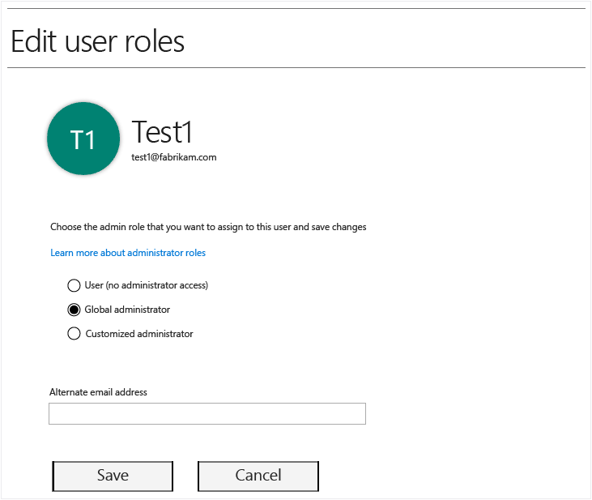
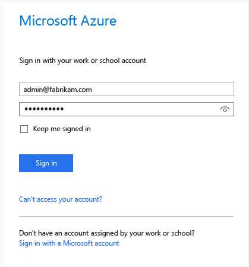
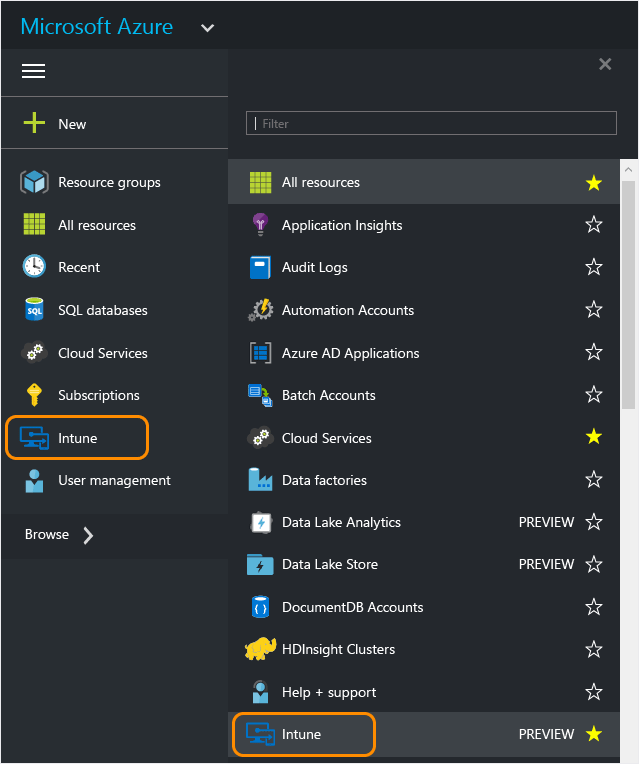
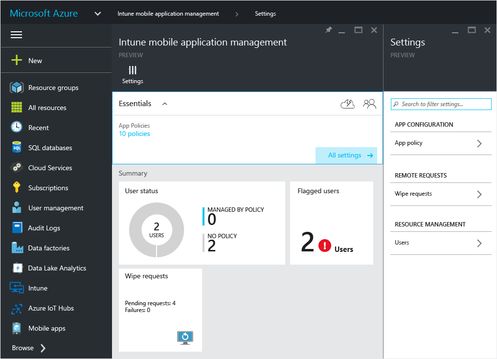
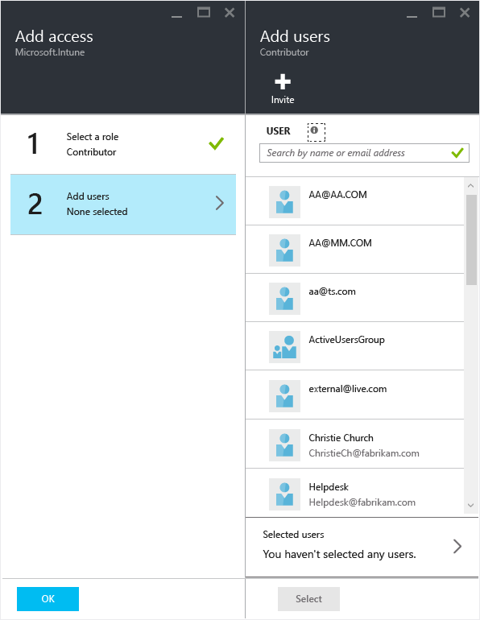

# Erste Schritte mit Richtlinien f&#252;r die Verwaltung von mobilen Apps im Azure-Portal
In diesem Thema erfahren Sie, was Sie für die ersten Schritte zum Erstellen von Richtlinien für die Verwaltung von mobilen Apps (Mobile App Management, MAM) im Azure-Portal benötigen.

**Gegenstand dieses Themas**

[Unterstützte Apps](#bkmk_supportedapps)

[Unterstützte Plattformen](#bkmk_supportedplatforms)

[Was Sie für die ersten Schritte benötigen](#bkmk_Prereqs)

[Einrichten der erforderlichen Komponenten](#bkmk_prereqshowto)

[Zugreifen auf das Azure-Vorschauportal](#bkmk_azureportal)

[Nächste Schritte](#bkmk_nextsteps)

## Unterstützte Plattformen

-   iOS 7.1 oder höher

-   Android 4 oder höher

## Unterstützte Apps
**iOS:** Microsoft Word, Excel, PowerPoint und OneDrive

**Android:** OneDrive

## Was Sie für die ersten Schritte benötigen
Bevor Sie beginnen, benötigen Sie Folgendes:

-   Ein [!INCLUDE[wit_firstref](../Token/wit_firstref_md.md)]-Abonnement.    Endbenutzer benötigen [!INCLUDE[wit_nextref](../Token/wit_nextref_md.md)]-Lizenzen, um Apps mit MAM-Richtlinien erhalten zu können.

-   Ein Office 365-Abonnement und Azure Active Directory (Azure AD) zum Erstellen von Benutzern und zum Zuweisen von [!INCLUDE[wit_nextref](../Token/wit_nextref_md.md)]-Lizenzen.  Azure AD authentifiziert den Benutzer, wenn der Endbenutzer die App startet und seine geschäftlichen Anmeldeinformationen eingibt.

    > [!NOTE]
    > Wenn Sie Benutzer mithilfe der [!INCLUDE[wit_nextref](../Token/wit_nextref_md.md)]-Konsole einrichten, müssen Sie darauf achten, dass die MAM-Richtlinienkonfiguration für die Zukunft in das Azure-Portal verschoben wird, und um dieses Portal verwenden zu können, müssen Sie Azure AD-Benutzergruppen mithilfe des Office 365-Portals einrichten.

## Einrichten der erforderlichen Komponenten
In der folgenden Tabelle werden die Rollen und Berechtigungen aufgelistet, die Sie Administratoren zuweisen können.

|||
|-|-|
|**Rolle**|**Berechtigungen**|
|Globaler Administrator (Office 365-Portal)|-   Zugriff auf das Office 365-Portal -   Zugriff auf das Azure AD-Portal -   Zugriff auf das Azure-Vorschauportal (damit können sowohl Rollenverwaltungs- als auch Verwaltungsaufgaben für mobile Apps ausgeführt werden).|
|Besitzer (Azure-Vorschauportal)|-   Zugriff auf das Azure-Vorschauportal (damit können sowohl Rollenverwaltungs- als auch Verwaltungsaufgaben für mobile Apps ausgeführt werden).|
|Mitwirkender (Azure-Vorschauportal)|-   Zugriff auf das Azure-Vorschauportal (damit können nur Verwaltungsaufgaben für mobile Apps ausgeführt werden.)|

#### Erstellen von Benutzern und Zuweisen von [!INCLUDE[wit_nextref](../Token/wit_nextref_md.md)]-Lizenzen

1.  Wenn Sie aktuell [!INCLUDE[wit_nextref](../Token/wit_nextref_md.md)] zum Verwalten Ihrer Geräte verwenden, verfügen Sie bereits über ein [!INCLUDE[wit_nextref](../Token/wit_nextref_md.md)]-Abonnement.  Wenn Sie eine EMS-Lizenz erworben haben, verfügen Sie ebenfalls über ein [!INCLUDE[wit_nextref](../Token/wit_nextref_md.md)]-Abonnement. Wenn Sie [!INCLUDE[wit_nextref](../Token/wit_nextref_md.md)] testen möchten, um die MAM-Funktionen kennenzulernen, können Sie [hier](http://www.microsoft.com/en-us/server-cloud/products/microsoft-intune/) ein Testkonto erhalten.

    Um zu überprüfen, ob Sie über ein [!INCLUDE[wit_nextref](../Token/wit_nextref_md.md)]-Abonnement verfügen, navigieren Sie im Office-Portal zur Seite "Abrechnung".  Unter den Abonnements sollte [!INCLUDE[wit_nextref](../Token/wit_nextref_md.md)] als **Aktiv** angezeigt werden.

2.  Melden Sie sich mit Ihren Administratoranmeldeinformationen beim [Office-Portal](http://portal.office.com) an.

3.  Navigieren Sie zur Seite **Aktive Benutzer**, um Benutzer hinzuzufügen und [!INCLUDE[wit_nextref](../Token/wit_nextref_md.md)]-Lizenzen zuzuweisen.

    

4.  Um einem Benutzer Zugriff auf das Office-Portal, das Azure AD-Portal und das Azure-Vorschauportal zu gewähren, weisen Sie dem Benutzer die Rolle **Globaler Administrator** zu.

    

5.  MAM-Richtlinien werden für Benutzergruppen in Azure Active Directory bereitgestellt. Um die Benutzergruppen zu erstellen, die Sie für Ihre MAM-Richtlinien verwenden möchten, navigieren Sie im **Office-Portal** zur Seite **Gruppen**, und klicken Sie auf das **+**-Symbol, um eine neue Sicherheitsgruppe zu erstellen.  Geben Sie einen Namen und eine Beschreibung ein, und klicken Sie auf **Erstellen**. Nachdem die Gruppe erstellt wurde, können Sie ihr Benutzer hinzufügen, indem Sie in der neu erstellten Sicherheitsgruppe auf **Mitglieder bearbeiten** klicken. Die Sicherheitsgruppe wird in Azure Active Directory erstellt.

    

## Zugreifen auf das Azure-Vorschauportal
Im **Azure-Vorschauportal** können Sie App-Richtlinien erstellen, die jeweilige Richtlinie für Benutzer bereitstellen und den Status Ihrer Bereitstellung überwachen.

#### Erste Schritte zur Verwendung des Portals

1.  Navigieren Sie zum [Azure-Vorschauportal](https://portal.azure.com), und melden Sie sich mit Ihren [!INCLUDE[wit_nextref](../Token/wit_nextref_md.md)]-Anmeldeinformationen an.

    

2.  Sobald Sie erfolgreich angemeldet sind, wird die **Startseite** oder **Homepage** angezeigt. Die **Startseite** oder Homepage enthält eine Reihe von Standardkacheln. Sie können diese entfernen und neue Kacheln hinzufügen, um die Seite anzupassen.

    

3.  Suchen Sie über das Menü **Durchsuchen** die Option **Intune**.

4.  Klicken Sie auf **Intune &gt; Intune-Verwaltung von mobilen Anwendungen &gt; Einstellungen**.

    

    > [!TIP]
    > Zum Anheften eines Blatts an die **Startseite** können Sie auf dem Blatt die Option zum **Anheften** verwenden.  Klicken Sie auf dem Blatt **Intune-Verwaltung von mobilen Anwendungen** auf das Pinsymbol, um das Blatt an die **Startseite** anzuheften.

    

    

**Globale Administratoren** haben Zugriff auf das Azure-Portal.  Wenn Sie möchten, dass andere Administratoren in der Lage sind, Richtlinien zu konfigurieren und andere Verwaltungsaufgaben für mobile Apps auszuführen, können Sie den jeweiligen Benutzern wie nachstehen beschrieben die Rolle **Mitwirkender** zuweisen:

#### Zuweisen der Rolle "Mitwirkender" für einen Benutzer

1.  Klicken Sie auf dem Blatt **Einstellungen** im Abschnitt **Ressourcenverwaltung** auf **Benutzer**.

    

2.  Klicken Sie auf **Hinzufügen**, um das Blatt **Zugriff hinzufügen** zu öffnen.

3.  Klicken Sie auf **Rolle auswählen**, und klicken Sie dann auf die Rolle **Mitwirkender**.

    

4.  Klicken Sie nach dem Auswählen der Rolle auf **Benutzer hinzufügen**, und suchen Sie anhand des Namens oder der E-Mail-Adresse nach dem Benutzer. Bei den in dieser Liste angezeigten Benutzern handelt es sich um die ersten 1.000 Benutzer, die Sie zuvor über das Office-Portal in Azure AD erstellt haben. Klicken Sie auf dem Blatt **Zugriff hinzufügen** auf **OK**, um den Vorgang zu speichern und dem Benutzer die Rolle zuzuweisen.

    

    > [!IMPORTANT]
    > Wenn Sie einen Benutzer auswählen, dem keine [!INCLUDE[wit_nextref](../Token/wit_nextref_md.md)]-Lizenz zugewiesen ist, kann dieser Benutzer nicht auf das Portal zugreifen.

## Nächste Schritte
[Erstellen und Bereitstellen von Verwaltungsrichtlinien für mobile Apps mit Microsoft Intune](../Topic/Create_and_deploy_mobile_app_management_policies_with_Microsoft_Intune.md)

## Siehe auch
[Konfigurieren der App-Richtlinien für die Verhinderung von Datenverlust mit Microsoft Intune](../Topic/Configure_data_loss_prevention_app_policies_with_Microsoft_Intune.md)

