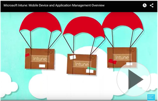

# Einf&#252;hrung in Microsoft Intune

[!INCLUDE[wit_nextref](../Token/wit_nextref_md.md)] ist ein cloudbasierter Dienst, mit dem Sie mobile Geräte, PCs und Apps verwalten können, damit Ihre Benutzer produktiver sein können, während gleichzeitig die Informationen Ihres Unternehmens geschützt werden.

Die Verwaltung mobiler Geräte (Mobile Device Management, MDM) und die Verwaltung von Windows-PCs sind grundlegende Anforderungen in modernen IT-Abteilungen. Heutzutage sind Mitarbeiter, Personal, Schüler und Studenten mobiler und engagierter als je zuvor. Ihr Erfolg hängt davon ab, dass Sie Informationen dorthin liefern, wo sie gebraucht werden, und gleichzeitig sicherstellen, dass Informationen geschützt sind. Sie müssen Apps bereitstellen, Geräte schützen, sicherstellen, dass Updates ausgeführt werden, und E-Mails schneller als je zuvor bereitstellen, während Sie gleichzeitig die Informationen Ihres Unternehmens verteidigen müssen.

## Verschiedene Arten der Verwaltung von Geräten mit Microsoft Intune
Sie können Intune auf verschiedene Arten verwenden. Dieses kurze Video zeigt Ihnen, wie Intune in Ihr vorhandenes Netzwerk passt, um Ihnen bei der Verwaltung von Geräten und Apps zu helfen.

Weitere Informationen, was Intune bietet, z. B.:

-   **Eine eigenständige Lösung für die Geräteverwaltung**. Dank der Cloudbasierung des Diensts verwalten Sie Geräte und schützen Sie Unternehmensdaten, ohne den Mehraufwand von Netzwerk-Infrastrukturkosten tragen zu müssen.

    Mit Intune können iOS-, Android-, Mac OS X- und Windows Phone-Geräte sowie Windows RT-, Windows 8.1- und Windows 10-Geräte als mobile Geräte verwaltet werden. Wenn Sie sich [!INCLUDE[wit_nextref](../Token/wit_nextref_md.md)] als Lösung zur Verwaltung mobiler Geräte (MDM) ansehen, lesen Sie [MDM-Funktionen und -Features in Intune](https://technet.microsoft.com/library/dn600287.aspx).

    Sie können die [!INCLUDE[wit_nextref](../Token/wit_nextref_md.md)]-Clientsoftware auf Windows-PCs installieren, um die Verwaltung zu ermöglichen. Sobald ein PC verwaltet wird, können Sie Apps und Softwareupdates bereitstellen, Endpoint Protection und Windows-Firewalls verwalten, Remoteunterstützung bereitstellen und vieles mehr. Hier finden Sie [eine vollständige Liste der PC-Verwaltungsfunktionen](http://technet.microsoft.com/library/dn646975.aspx).

    Sie können Intune auch zum [Bereitstellen und Verwalten von Apps](https://technet.microsoft.com/library/dn646965.aspx) verwenden. Die App-Verwaltung hilft Ihnen dabei, Daten vor der Freigabe außerhalb Ihres Unternehmens zu schützen, indem Aktionen wie Kopieren, Ausschneiden, Einfügen und Speichern unter zwischen mit Intune verwalteten und persönlichen Apps eingeschränkt werden. Diese Datenschutz ist direkt in viele mobile Microsoft-Apps integriert, aber Sie können [den Datenschutz mithilfe des Intune App Wrapping Tools auf Ihre vorhandenen Branchen-Apps erweitern](https://technet.microsoft.com/library/dn878026.aspx). Sie können außerdem die Anzeige sicherer Inhalte mit dem [Intune Managed Browser](https://technet.microsoft.com/library/dn878029.aspx) einrichten. Um Unternehmensinformationen noch stärker zu schützen, können Sie [verwaltete Apps und zugehörige Daten selektiv zurücksetzen](https://technet.microsoft.com/library/mt313204.aspx) auf Geräten, deren Registrierung aufgehoben wurde, die nicht mehr konform sind oder verloren, gestohlen oder außer Betrieb gesetzt wurden.

-   **Eine Clouderweiterung von Microsoft System Center 2012 Configuration Manager**. Wenn Sie bereits Configuration Manager zum Verwalten von lokalen Geräten verwenden und nach einer Möglichkeit suchen, viele der heutigen mobilen Geräte zu verwalten, können Sie [Intune als Erweiterung von System Center 2012 Configuration Manager verwenden](https://technet.microsoft.com/library/dn957912.aspx#BKMK_HybridOfferings). Zwei Hauptvorteile dieser Option sind eine einheitliche Verwaltungsoberfläche für die lokale Verwaltung und die Verwaltung mobiler Geräte sowie die Skalierbarkeit. Diese Hybridimplementierung von Intune bietet Ihnen die Möglichkeit, mehr als 50.000 Geräte zu verwalten.

-   **Teil Ihres Microsoft Office 365-Abonnements**. Wenn Sie ein kommerzielles Office 365-Abonnement besitzen, können Sie die [in Office 365 integrierten Funktionen für die Verwaltung mobiler Geräte von Intune verwenden](https://technet.microsoft.com/library/dn957912.aspx#MDMOfferings). Diese Option ist zwar nicht so umfassend wie eigenständiges Intune oder Intune in Kombination mit Configuration Manager, doch Sie können immer noch iOS-, Android- und Windows Phone-Geräte verwalten, Sicherheitsrichtlinien erstellen, den Zugriff auf Office 365-E-Mails und Dokumente auf verwalteten Geräten beschränken sowie das selektive Zurücksetzen verwenden, um Office 365 von verwalteten Geräten zu entfernen.

-   **Teil der Microsoft Enterprise Mobility Suite**. Mobilität ist nicht mehr wegzudenken, und das gilt auch für die Cloud. Intune ist eine Hauptkomponente der [Microsoft Enterprise Mobility Suite (EMS)](https://www.microsoft.com/en-us/server-cloud/enterprise-mobility/overview.aspx%20), einer Gruppe cloudbasierter Dienste, die Erkennung von Bedrohungen und Identitätsverwaltung zusätzlich zum Datenschutz und der Geräteverwaltung bietet, die bereits von eigenständigem Intune bereitgestellt werden.

## Anforderungen für die Einrichtung von Intune
Obwohl Intune ein Dienst ist und Ihnen somit viele Infrastrukturkosten erspart, müssen Sie dennoch eventuell ein paar [Anforderungen an die Netzwerkeinrichtung](https://technet.microsoft.com/library/dn646950.aspx) erfüllen. Beispielsweise blockiert Ihre Firewall eventuell standardmäßig einige der Netzwerkports, die für [!INCLUDE[wit_nextref](../Token/wit_nextref_md.md)] erforderlich sind.  Darüber hinaus gibt es, wenn Sie Daten von Exchange Server synchronisieren möchten, auch noch bestimmte Firewallausnahmen, die Sie möglicherweise einrichten müssen.

Weitere Vorbereitungen, die Sie treffen müssen, während Sie [sich auf die Bereitstellung von Intune vorbereiten](https://technet.microsoft.com/library/dn646966.aspx), umfassen:

-   Einrichten eines Unternehmensportals, damit Benutzer ihre mobilen Geräte für die Verwaltung durch Intune registrieren können.

-   Verstehen der erwarteten Bandbreitenauslastung.

-   Entscheiden, ob der Standarddomänenname **onmicrosoft.com** verwendet werden soll, oder einer, den Sie besitzen.

## Siehe auch
[Handbuch mit Überlegungen zum Entwurf der Verwaltung mobiler Geräte](https://technet.microsoft.com/en-us/library/mt143180.aspx)
[Dokumentation zu Microsoft Intune](../Topic/Documentation_for_Microsoft_Intune.md)

