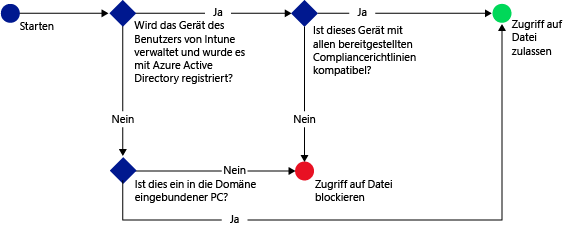

# Verwalten des Zugriffs auf SharePoint Online mit Microsoft Intune
Nutzen Sie die [!INCLUDE[wit_firstref](../Token/wit_firstref_md.md)]-Richtlinie für bedingten Zugriff auf **SharePoint Online** zum Verwalten des Zugriffs auf OneDrive for Business-Dateien in SharePoint Online basierend auf von Ihnen angegebenen Bedingungen.

Wenn ein bestimmten Benutzer versucht, mit einer unterstützten App wie z. B. OneDrive auf seinem Gerät eine Verbindung mit einer Datei herzustellen, erfolgt die folgende Auswertung:

Zum Herstellen einer Verbindung mit den gewünschten Dateien muss das Gerät, auf dem OneDrive ausgeführt wird, die folgenden Voraussetzungen erfüllen:

-   Es muss bei [!INCLUDE[wit_nextref](../Token/wit_nextref_md.md)] oder einem in die Domäne eingebundenen PC registriert sein.

-   Es muss in Azure Active Directory registriert sein (dies erfolgt automatisch bei der Registrierung des Geräts in [!INCLUDE[wit_nextref](../Token/wit_nextref_md.md)]).

    Bei einem in die Domäne eingebundenen PC müssen Sie es für eine [automatische Registrierung](https://msdn.microsoft.com/en-us/library/azure/dn935033.aspx) bei Azure Active Directory einrichten.

-   Es muss mit allen festgelegten Kompatibilitätsrichtlinien von [!INCLUDE[wit_nextref](../Token/wit_nextref_md.md)] kompatibel sein.

Der Gerätestatus wird in Azure Active Directory gespeichert. Die Anwendung gewährt oder blockiert den Zugriff auf Dateien entsprechend den von Ihnen angegebenen Bedingungen.

Wenn eine Bedingung nicht erfüllt wird, erhält der Benutzer bei der Anmeldung die folgenden Meldungen:

-   Wenn das Gerät nicht bei [!INCLUDE[wit_nextref](../Token/wit_nextref_md.md)] oder in Azure Active Directory registriert ist, wird eine Meldung mit Anweisungen zum Installieren der Unternehmensportal-App und zum Registrieren des Geräts angezeigt.

-   Wenn das Gerät nicht kompatibel ist, wird eine Meldung angezeigt, die den Benutzer zum [!INCLUDE[wit_nextref](../Token/wit_nextref_md.md)]-Webportal weiterleitet. Hier werden Informationen zum Problem und dessen Lösung geboten.

-   Für PCs:

    -   Wenn die Richtlinie das Beitreten zu einer Domäne erfordert und der PC nicht in die Domäne eingebunden ist, wird die Meldung angezeigt, dass der IT-Administrator kontaktiert werden sollte.

    -   Wenn die Richtlinie das Beitreten zu einer Domäne oder Kompatibilität erfordert und der PC keine der Anforderungen erfüllt, wird eine Meldung mit einer Anleitung zum Installieren der Unternehmensportal-App und zur Registrierung angezeigt.

Sie können den Zugriff auf SharePoint Online in den folgenden Apps steuern :

-   Microsoft Office Mobile (Android)

-   Microsoft OneDrive (Android und iOS)

-   Microsoft Word (Android und iOS)

-   Microsoft Excel (Android und iOS)

-   Microsoft PowerPoint (Android und iOS)

-   Microsoft OneNote (Android und iOS)

## Schritte zum Konfigurieren des bedingten Zugriffs für SharePoint Online

### Schritt 1: Konfigurieren von Active Directory-Sicherheitsgruppen
Bevor Sie beginnen, konfigurieren Sie Azure Active Directory-Sicherheitsgruppen für die bedingte Zugriffsrichtlinien. Sie können diese Gruppen im **Office 365 Admin Center** oder **Intune-Kontenportal** konfigurieren. Die Gruppen enthalten die Benutzer, für die die Richtlinie gelten soll oder die davon ausgeschlossen sind. Bei Benutzern, für die eine Richtlinie gelten soll, muss jedes von ihnen verwendete Gerät die Richtlinie erfüllen, damit sie auf Ressourcen zugreifen können.

Sie können zwei Arten von Gruppentypen in einer SharePoint Online-Richtlinie angeben:

-   **Zielgruppen**: Gruppen von Benutzern, für die die Richtlinie gelten soll.

-   **Ausgenommene Gruppen**: Gruppen von Benutzern, die von der Richtlinie ausgenommen sind (optional).

Benutzer, die in beiden Gruppen enthalten sind, werden von der Richtlinie ausgenommen.

### Schritt 2: Konfigurieren und Bereitstellen einer Kompatibilitätsrichtlinie
Wichtig ist, dass Sie für alle Geräte, für die die SharePoint Online-Richtlinie gelten soll, eine Kompatibilitätsrichtlinie erstellen und bereitstellen.

> [!NOTE]
> Wenn Kompatibilitätsrichtlinien für [!INCLUDE[wit_nextref](../Token/wit_nextref_md.md)]-Gruppen bereitgestellt werden, gelten bedingte Zugriffsrichtlinien für Azure Active Directory-Sicherheitsgruppen.

Ausführliche Informationen über das Konfigurieren der Kompatibilitätsrichtlinien finden Sie unter [Verwalten von Gerätekonformitätsrichtlinien für Microsoft Intune](../Topic/Manage_device_compliance_policies_for_Microsoft_Intune.md).

> [!IMPORTANT]
> Wenn Sie keine Kompatibilitätsrichtlinie bereitgestellt haben und dann die SharePoint Online-Richtlinie aktivieren, wird allen Zielgeräten der Zugriff erlaubt.

Wenn Sie soweit sind, fahren Sie mit **Schritt 3** fort.

### Schritt 3: Konfigurieren der SharePoint Online-Richtlinie
Anschließend konfigurieren Sie die Richtlinie so, dass nur verwaltete und kompatible Geräte auf SharePoint Online zugreifen dürfen. Diese Richtlinie wird in Azure Active Directory gespeichert.

#### 

1.  Klicken Sie in der [Microsoft Intune-Verwaltungskonsole](https://manage.microsoft.com) auf **Richtlinie** &gt; **Bedingter Zugriff** &gt; **SharePoint Online-Richtlinie**.

2.  Wählen Sie **Bedingte Zugriffsrichtlinie für SharePoint Online aktivieren** aus.

3.  Unter **Geräteplattformen** können Sie optional eine bedingte Zugriffsrichtlinie auf Folgendes anwenden:

    -   **Alle Plattformen**

        Dies setzt voraus, dass jedes Gerät, das für den Zugriff auf **SharePoint Online** verwendet wird, in Intune registriert und kompatibel zu den Richtlinien ist.  Jede Clientanwendung, die die **moderne Authentifizierung** verwendet, unterliegt der Richtlinie für den bedingten Zugriff, und wenn die Plattform gegenwärtig nicht von Intune unterstützt wird, wird der Zugriff auf **SharePoint Online** blockiert.

    -   **Bestimmte Plattformen**

        Wenn Sie die Option **Bestimmte Plattformen** auswählen, wird eine Liste der Plattformen angezeigt, in der Sie einzelne Plattformen auswählen können.   Die Richtlinie für den bedingten Zugriff wird auf jede Client-App angewendet, die mit der modernen Authentifizierung arbeitet, jedoch nur auf den von Ihnen ausgewählten Plattformen.

    > [!TIP]
    > Die **moderne Authentifizierung** ermöglicht das ADAL-basierte (Active Directory Authentication Library) Anmelden für Office-Clients.
    > 
    > -   Die ADAL-basierte Authentifizierung ermöglicht Office-Clients die Einbindung in die browserbasierte Authentifizierung (auch als passive Authentifizierung bekannt).  Der Benutzer wird zur Authentifizierung zu einer Anmeldewebseite umgeleitet.
    > -   Diese neue Anmeldemethode ermöglicht neue Szenarien, z. B. den bedingten Zugriff, auf Grundlage der **Gerätekompatibilität** und in Abhängigkeit davon, ob eine **mehrstufige Authentifizierung** erfolgt ist.
    > 
    > Dieser [Artikel](https://blogs.office.com/2014/11/12/office-2013-updated-authentication-enabling-multi-factor-authentication-saml-identity-providers/) enthält weitere ausführliche Informationen zur Funktionsweise der modernen Authentifizierung.

    Bei Windows-PCs muss der PC entweder in die Domäne eingebunden oder bei [!INCLUDE[wit_nextref](../Token/wit_nextref_md.md)] registriert und kompatibel sein. Sie können die folgenden Anforderungen festlegen:

    -   **Geräte müssen in eine Domäne eingebunden oder kompatibel sein.** Dies bedeutet, dass PCs entweder in die Domäne eingebunden oder mit den in [!INCLUDE[wit_nextref](../Token/wit_nextref_md.md)] festgelegten Richtlinien kompatibel sein müssen. Wenn der PC keine der Anforderungen erfüllt, wird der Benutzer aufgefordert, das Gerät bei [!INCLUDE[wit_nextref](../Token/wit_nextref_md.md)] zu registrieren.

    -   **Geräte müssen in eine Domäne eingebunden sein.** Dies bedeutet, dass die PCs für den Zugriff auf Exchange Online in die Domäne eingebunden sein müssen. Wenn der Computer in keine Domäne eingebunden ist, wird der E-Mail-Zugriff blockiert und der Benutzer aufgefordert, den IT-Administrator zu kontaktieren.

    -   **Geräte müssen kompatibel sein.** Dies bedeutet, dass die PCs bei [!INCLUDE[wit_nextref](../Token/wit_nextref_md.md)] registriert und kompatibel sein müssen. Wenn der PC nicht registriert ist, wird eine Meldung mit Anweisungen zur Registrierung angezeigt.

4.  Klicken Sie unter **Zielgruppen** auf **Ändern**, um die Active Directory-Sicherheitsgruppen auszuwählen, für die die Richtlinie gelten soll. Sie können dies für alle Benutzer oder nur für ausgewählte Benutzergruppen festlegen.

5.  Klicken Sie unter **Ausgenommene Gruppen** optional auf **Ändern**, um die Active Directory-Sicherheitsgruppen auszuwählen, die von dieser Richtlinie ausgenommen werden.

6.  Klicken Sie abschließend auf **Speichern**.

Die Richtlinie für bedingten Zugriff wird sofort wirksam und muss nicht explizit bereitgestellt werden.

### Schritt 4: Überwachen der Richtlinien für Kompatibilität und bedingten Zugriff
Im Arbeitsbereich **Gruppen** können Sie den Status beim bedingten Zugriff Ihrer Geräte anzeigen.

Wählen Sie eine beliebige Gruppe von Mobilgeräten und dann auf der Registerkarte **Geräte** einen der folgenden **Filter** aus:

-   **Geräte, die nicht bei AAD registriert sind**: Diese Geräte werden für SharePoint Online blockiert.

-   **Geräte, die nicht kompatibel sind**: Diese Geräte werden für SharePoint Online blockiert.

-   **Geräte, die bei AAD registriert und kompatibel sind**: Diese Geräte können auf SharePoint Online zugreifen.

## Siehe auch
[Verwalten des Zugriffs auf E-Mail und SharePoint mit Microsoft Intune](../Topic/Manage_access_to_email_and_SharePoint_with_Microsoft_Intune.md)

