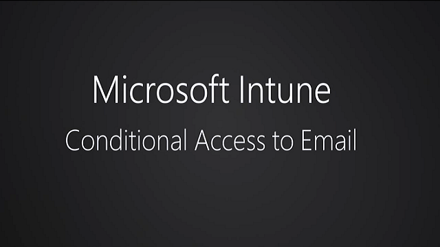
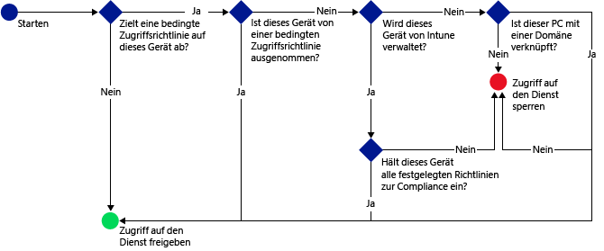

# Verwalten des Zugriffs auf E-Mail und SharePoint mit Microsoft Intune
Verwenden Sie den **bedingten Zugriff** in [!INCLUDE[wit_firstref](../Token/wit_firstref_md.md)], um E-Mail- und andere Dienste basierend auf Bedingungen zu schützen, die Sie festlegen.

Sehen Sie sich dieses vierminütige Video an, um einen Überblick darüber zu erhalten, wie Sie dieses Feature in Ihrer Organisation verwenden können.

Ein typischer Ablauf für bedingten Zugriff könnte wie folgt aussehen:

Verwenden Sie den bedingten Zugriff zur Verwaltung des Zugriffs auf Microsoft **Exchange lokal**, **Exchange Online**, **Exchange Online Dedicated** und **SharePoint Online**.

Sie können den Zugriff auf Exchange Online und Exchange On-Premises über die folgenden E-Mail-Apps steuern:

-   Die integrierte App für Android 4.0 und höher, Samsung KNOX 4.0 Standard und höher

-   Die integrierte App für iOS 7.1 und höher

-   Die integrierte App für Windows Phone 8.1 und höher

-   Die E-Mail-Anwendung unter Windows 8.1 und höher

-   Die Microsoft Outlook-App für Android und iOS (nur für Exchange Online)

Sie können den Zugriff auf SharePoint Online über die folgenden Apps für die aufgeführten Plattformen steuern:

-   Microsoft Office Mobile (Android)

-   Microsoft OneDrive (Android und iOS)

-   Microsoft Word (iOS)

-   Microsoft Excel (iOS)

-   Microsoft PowerPoint (iOS)

-   Microsoft OneNote (iOS)

Office-Desktopanwendungen können auf PCs, auf denen Folgendes ausgeführt wird, auf Exchange Online und SharePoint Online zugreifen:

-   Office Desktop 2013 und höher mit aktivierter [moderner Authentifizierung](https://blogs.office.com/2015/03/23/office-2013-modern-authentication-public-preview-announced/)

-   Windows 7.0 und höher

> [!NOTE]
> PCs sollten in eine Domäne eingebunden oder mit den in [!INCLUDE[wit_nextref](../Token/wit_nextref_md.md)] festgelegten Richtlinien kompatibel sein.

Um bedingten Zugriff zu implementieren, konfigurieren Sie zwei Richtlinientypen in [!INCLUDE[wit_nextref](../Token/wit_nextref_md.md)]:

-   **Konformitätsrichtlinien** sind optionale Richtlinien, die Sie für Benutzer und Geräte bereitstellen können. Mit diesen Richtlinien werden Einstellungen wie die folgenden ausgewertet:

    -   Passwort

    -   Verschlüsselung

    -   Ob das Gerät per Jailbreak oder Rooting manipuliert wurde

    -   Ob der E-Mail-Dienst auf dem Gerät über eine [!INCLUDE[wit_nextref](../Token/wit_nextref_md.md)]-Richtlinie verwaltet wird

    Wenn keine Konformitätsrichtlinie für ein Gerät bereitgestellt wird, behandeln alle anwendbaren Richtlinien für bedingten Zugriff das Gerät als konform.

-   **Richtlinien für bedingten Zugriff** werden für einen bestimmten Dienst konfiguriert und definieren Regeln wie z. B., welche Azure Active Directory-Sicherheitsbenutzergruppen oder [!INCLUDE[wit_nextref](../Token/wit_nextref_md.md)]-Benutzergruppen als Ziel dienen und wie Geräte, die sich nicht bei [!INCLUDE[wit_nextref](../Token/wit_nextref_md.md)] registrieren können, verwaltet werden.

    Im Gegensatz zu anderen [!INCLUDE[wit_nextref](../Token/wit_nextref_md.md)]-Richtlinien stellen Sie Richtlinien für bedingten Zugriff nicht bereit. Stattdessen konfigurieren Sie diese einmalig; anschließend gelten sie für alle Zielbenutzer.

Wenn Geräte die von Ihnen konfigurierten Bedingungen nicht erfüllen, erhält der Benutzer Anweisungen zum Registrieren des Geräts und zum Beheben des Problems, das die Konformität des Geräts verhindert.

## Erste Schritte mit dem bedingten Zugriff
Bevor Sie den bedingten Zugriff verwenden können, müssen Sie sicherstellen, dass die jeweiligen Anforderungen erfüllt sind:

> [!IMPORTANT]
> Der bedingte Zugriff funktioniert nicht bei Geräten, die beim [Geräteregistrierungs-Manager](https://technet.microsoft.com/en-us/library/dn764961.aspx) registriert sind, da diese Geräte in Azure Active Directory nicht mit einem Benutzer verknüpft sind.

-   [Exchange Online (bei Verwendung der freigegebenen Umgebung mit mehreren Mandanten)](#Exo)

-   [Exchange Online Dedicated](#ExoDedicated)

-   [Exchange lokal](#ExOnPrem)

-   [SharePoint Online](#Spo)

-   [Bedingter Zugriff für PCs](#PC)

### Exchange Online (bei Verwendung der freigegebenen Umgebung mit mehreren Mandanten)
Bedingter Zugriff auf Exchange Online unterstützt Geräte, die Folgendes ausführen:

-   Windows 8.1 und höher (bei Registrierung mit [!INCLUDE[wit_nextref](../Token/wit_nextref_md.md)])

-   Windows 7.0 oder höher (bei Einbindung in eine Domäne)

-   Windows Phone 8.1 und höher

-   iOS 7.1 und höher

-   Android 4.0 und höher, Samsung KNOX Standard 4.0 und höher

Darüber hinaus gilt:

-   Geräte müssen beim Azure Active Directory Device Registration Service (AAD DRS) registriert werden.

    In eine Domäne eingebundene PCs müssen automatisch über eine Gruppenrichtlinie oder MSI bei Azure Active Directory registriert werden. Im Abschnitt [Bedingter Zugriff für PCs](#PC) in diesem Thema sind alle Anforderungen für die Aktivierung des bedingten Zugriffs für einen PC beschrieben.

    AAD DRS wird automatisch für Intune und Office 365-Kunden aktiviert. Kunden, die bereits den AD FS Device Registration Service bereitgestellt haben, sehen keine registrierten Geräte in ihrem lokalen Active Directory.

-   Sie müssen ein Office 365-Abonnement verwenden, das Exchange Online (z. B. E3) umfasst, und die Benutzer müssen für Exchange Online lizenziert sein.

-   Der **Microsoft Intune Service to Service Connector** verbindet [!INCLUDE[wit_nextref](../Token/wit_nextref_md.md)] mit Microsoft Exchange Online und ermöglicht Ihnen die Verwaltung von Geräteinformationen über die [!INCLUDE[wit_nextref](../Token/wit_nextref_md.md)]-Konsole (siehe [Verwaltung mobiler Geräte mit Exchange ActiveSync und Microsoft Intune](../Topic/Mobile_device_management_with_Exchange_ActiveSync_and_Microsoft_Intune.md)). Der Connector ist nicht zur Verwendung von Konformitätsrichtlinien oder Richtlinien für den bedingten Zugriff erforderlich, aber zum Ausführen von Berichten, mit deren Hilfe die Auswirkungen des bedingten Zugriffs bewertet werden.

    Wenn Sie den Connector konfigurieren, können einige Exchange ActiveSync-Richtlinien aus [!INCLUDE[wit_nextref](../Token/wit_nextref_md.md)] in der Office-Konsole angezeigt werden, sind aber nicht als Standardrichtlinien festgelegt und haben keine Auswirkung auf Geräte.

    > [!NOTE]
    > Konfigurieren Sie den Service to Service Connector nicht, wenn Sie beabsichtigen, die Zugangsberechtigung für Exchange Online und lokales Exchange zu verwenden.

### Exchange Online Dedicated
Bedingter Zugriff auf Exchange Online Dedicated unterstützt Geräte, die Folgendes ausführen:

-   Windows 8 und höher (bei Registrierung mit [!INCLUDE[wit_nextref](../Token/wit_nextref_md.md)])

-   Windows 7.0 oder höher (bei Einbindung in eine Domäne)

    Bedingter Zugriff auf PCs, die in eine Domäne eingebunden sind, nur für Mandanten in der neuen Exchange Online Dedicated-Umgebung.

-   Windows Phone 8 und höher

-   Beliebige iOS-Geräte, die einen Exchange ActiveSync-E-Mail-Client (EAS) verwenden

-   Android 4 und höher

-   Für Mandanten in der Exchange Online Dedicated-Legacyumgebung gilt Folgendes:

    Sie müssen den **lokalen Exchange-Connector** verwenden, der [!INCLUDE[wit_nextref](../Token/wit_nextref_md.md)] mit Microsoft Exchange On-Premises verbindet. Auf diese Weise können Sie Geräte über die [!INCLUDE[wit_nextref](../Token/wit_nextref_md.md)]-Konsole verwalten (siehe [Verwaltung mobiler Geräte mit Exchange ActiveSync und Microsoft Intune](../Topic/Mobile_device_management_with_Exchange_ActiveSync_and_Microsoft_Intune.md)).

-   Für Mandanten in der neuen Exchange Online Dedicated-Umgebung gilt Folgendes:

    Der **Microsoft Intune Service to Service Connector** verbindet [!INCLUDE[wit_nextref](../Token/wit_nextref_md.md)] mit Microsoft Exchange Online und ermöglicht Ihnen die Verwaltung von Geräteinformationen über die [!INCLUDE[wit_nextref](../Token/wit_nextref_md.md)]-Konsole (siehe [Verwaltung mobiler Geräte mit Exchange ActiveSync und Microsoft Intune](../Topic/Mobile_device_management_with_Exchange_ActiveSync_and_Microsoft_Intune.md)). Der Connector ist nicht zur Verwendung von Konformitätsrichtlinien oder Richtlinien für den bedingten Zugriff erforderlich, aber zum Ausführen von Berichten, mit deren Hilfe die Auswirkungen des bedingten Zugriffs bewertet werden.

> [!IMPORTANT]
> Stellen Sie sicher, dass Sie die neueste Version des **lokalen Exchange-Connectors** verwenden.

### Exchange lokal
Beim bedingten Zugriff auf Exchange lokal wird Folgendes unterstützt:

-   Windows 8 und höher (bei Registrierung mit [!INCLUDE[wit_nextref](../Token/wit_nextref_md.md)])

-   Windows Phone 8 und höher

-   Beliebige iOS-Geräte, die einen Exchange ActiveSync-E-Mail-Client (EAS) verwenden

-   Android 4 und höher

Darüber hinaus gilt:

-   Bei Ihrer Exchange-Version muss es sich um Exchange 2010 oder höher handeln. Exchange Server-Clientzugriffsserver-Arrays werden unterstützt.

    > [!TIP]
    > Wenn sich Ihre Exchange-Umgebung in einer Clientzugriffsserver-Konfiguration befindet, müssen Sie den lokalen Exchange-Connector auf einem der Clientzugriffsserver installieren.

-   Exchange ActiveSync kann mit zertifikatbasierter Authentifizierung oder Eingabe von Anmeldeinformationen konfiguriert werden

-   Sie müssen den **lokalen Exchange-Connector** verwenden, der [!INCLUDE[wit_nextref](../Token/wit_nextref_md.md)] mit Microsoft Exchange On-Premises verbindet. Auf diese Weise können Sie Geräte über die [!INCLUDE[wit_nextref](../Token/wit_nextref_md.md)]-Konsole verwalten (siehe [Verwaltung mobiler Geräte mit Exchange ActiveSync und Microsoft Intune](../Topic/Mobile_device_management_with_Exchange_ActiveSync_and_Microsoft_Intune.md)).

    > [!IMPORTANT]
    > Stellen Sie sicher, dass Sie die neueste Version des **lokalen Exchange-Connectors** verwenden. Der lokale Exchange-Connector, der Ihnen in der Intune-Konsole zur Verfügung steht, ist spezifisch für Ihren Intune-Mandanten und kann mit keinem anderen Mandanten verwendet werden. Sie sollten auch sicherstellen, dass der Exchange-Connector für Ihren Mandanten auf genau einem Computer und nicht auf mehreren installiert ist.

### SharePoint Online
Bedingter Zugriff auf SharePoint Online unterstützt Geräte, die Folgendes ausführen:

-   Windows 8.1 und höher (bei Registrierung mit [!INCLUDE[wit_nextref](../Token/wit_nextref_md.md)])

-   Windows 7.0 oder höher (bei Einbindung in eine Domäne)

-   Windows Phone 8.1 und höher

-   iOS 7.1 und höher

-   Android 4.0 und höher, Samsung KNOX Standard 4.0 und höher

Darüber hinaus gilt:

-   Geräte müssen beim Azure Active Directory Device Registration Service (AAD DRS) registriert werden.

    AAD DRS wird automatisch für Intune und Office 365-Kunden aktiviert. Kunden, die bereits den AD FS Device Registration Service bereitgestellt haben, sehen keine registrierten Geräte in ihrem lokalen Active Directory.

    In eine Domäne eingebundene PCs müssen automatisch über eine Gruppenrichtlinie oder MSI bei Azure Active Directory registriert werden. Im Abschnitt [Bedingter Zugriff für PCs](#PC) in diesem Thema sind alle Anforderungen für die Aktivierung des bedingten Zugriffs für einen PC beschrieben.

-   Es ist ein SharePoint Online-Abonnement erforderlich, und Benutzer müssen für SharePoint Online lizenziert sein.

## Bedingter Zugriff für PCs
Sie können den bedingten Zugriff für PCs einrichten, auf denen Office-Desktopanwendungen ausgeführt werden, um auf **Exchange Online** und **SharePoint Online** zuzugreifen. Dies gilt für PCs, die folgende Anforderungen erfüllen:

-   Auf dem PC muss Windows 7.0 oder höher ausgeführt werden.

-   Der PC muss entweder in eine Domäne eingebunden oder kompatibel sein.

    Damit der PC kompatibel ist, muss er in [!INCLUDE[wit_nextref](../Token/wit_nextref_md.md)] registriert sein und den Richtlinien entsprechen.

    Für in die Domäne eingebundene PCs müssen Sie [das Gerät für eine automatische Registrierung](https://azure.microsoft.com/en-us/documentation/articles/active-directory-conditional-access-automatic-device-registration-windows7/) bei Azure Active Directory einrichten.

-   [Die moderne Authentifizierung von Office 365 muss aktiviert sein](https://blogs.office.com/2015/03/23/office-2013-modern-authentication-public-preview-announced/) und alle neuesten Office-Updates enthalten.

    Die moderne Authentifizierung ermöglicht Windows-Clients mit Office 2013 eine Active Directory Authentication Library (ADAL)-basierte Anmeldung und bietet größere Sicherheit wie **mehrstufige Authentifizierung** und **zertifikatbasierte Authentifizierung**.

-   Setup-ADFS beansprucht Regeln zum Blockieren nicht moderner Authentifizierungsprotokolle. Schrittanleitungen werden in Szenario 3 beschrieben: [Blockieren des gesamten Zugriffs auf Office 365 außer durch browserbasierte Anwendungen](https://technet.microsoft.com/en-us/library/dn592182.aspx).

## Nächste Schritte
Lesen Sie die folgenden Themen, um mehr über das Konfigurieren von Konformitätsrichtlinien und Richtlinien für den bedingten Zugriff für Ihr Szenario zu erfahren:

-   [Verwalten von Gerätekonformitätsrichtlinien für Microsoft Intune](../Topic/Manage_device_compliance_policies_for_Microsoft_Intune.md)

-   [Verwalten des E-Mail-Zugriffs mit Microsoft Intune](../Topic/Manage_email_access_with_Microsoft_Intune.md)

-   [Verwalten des Zugriffs auf SharePoint Online mit Microsoft Intune](../Topic/Manage_SharePoint_Online_access_with_Microsoft_Intune.md)

## Siehe auch
[Schützen von Daten und Geräten mit Microsoft Intune](../Topic/Protect_data_and_devices_with_Microsoft_Intune.md)

