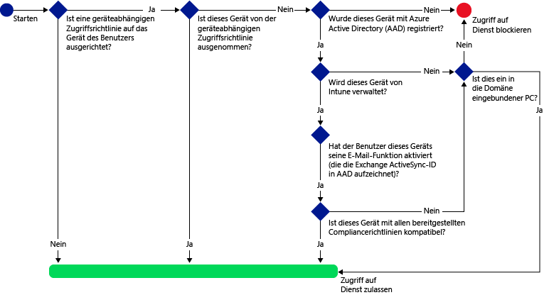

# Verwalten des E-Mail-Zugriffs mit Microsoft Intune
Verwalten Sie den Zugriff auf Exchange-E-Mails mithilfe der [!INCLUDE[wit_firstref](../Token/wit_firstref_md.md)] **Richtlinie für bedingten Zugriff** für Exchange, die es Ihnen ermöglichen, eigene Bedingungen festzulegen.

Sie können den Zugriff auf folgende Module verwalten:

-   Microsoft Exchange lokal

-   Microsoft Exchange Online

-   Exchange Online Dedicated

Wenn Sie den bedingten Zugriff konfigurieren, bevor Benutzer ihre E-Mails abrufen können, muss das Gerät folgende Voraussetzungen erfüllen:

-   Es muss bei [!INCLUDE[wit_nextref](../Token/wit_nextref_md.md)] oder einem in die Domäne eingebundenen PC registriert sein.

-   Das Gerät muss in Azure Active Directory registriert sein (dies erfolgt automatisch bei der Registrierung des Geräts in [!INCLUDE[wit_nextref](../Token/wit_nextref_md.md)] – nur für Exchange Online). Darüber hinaus muss die Client-ID für Exchange ActiveSync bei Azure Active Directory registriert sein (gilt nicht für Windows- und Windows Phone-Geräten, die mit Exchange lokal verknüpft sind).

    Für einen in die Domäne eingebundenen PC müssen Sie es für eine automatische Registrierung bei Azure Active Directory festlegen.  Im Abschnitt **Bedingter Zugriff für PCs** im Thema [Verwalten des Zugriffs auf E-Mail und SharePoint mit Microsoft Intune](../Topic/Manage_access_to_email_and_SharePoint_with_Microsoft_Intune.md) ist der vollständigen Satz von Anforderungen zum Aktivieren des bedingten Zugriff für PCs aufgelistet.

-   Sie müssen mit allen für das Gerät festgelegten Konformitätsrichtlinien von [!INCLUDE[wit_nextref](../Token/wit_nextref_md.md)] kompatibel sein.

Wenn eine Richtlinie für bedingten Zugriff nicht erfüllt wird, erhält der Benutzer bei der Anmeldung eine der folgenden Meldungen:

**Für mobile Geräte:**

-   Wenn das Gerät nicht bei [!INCLUDE[wit_nextref](../Token/wit_nextref_md.md)] oder in Azure Active Directory registriert ist, wird eine Meldung mit Anweisungen zum Installieren der Unternehmensportal-App, zum Registrieren des Geräts und zum Aktivieren des E-Mail-Zugriffs angezeigt. Bei Letzterem wird die Exchange ActiveSync-ID des Geräts mit dem Gerätedatensatz in Azure Active Directory verknüpft.

-   Wenn das Gerät nicht kompatibel ist, wird eine Meldung angezeigt, die den Benutzer zum [!INCLUDE[wit_nextref](../Token/wit_nextref_md.md)]-Webportal oder der Unternehmensportal-App weiterleitet. Hier finden Sie Informationen zum Problem und dessen Lösung.

**Für PCs:**

-   Wenn die Richtlinienanforderung für bedingten Zugriff das Zulassen von **In die Domäne eingebunden** oder **Kompatibel** vorsieht, wird eine Meldung mit Anweisungen zum Registrieren des Geräts angezeigt. Wenn der PC keine der Anforderungen erfüllt, wird der Benutzer aufgefordert, das Gerät bei [!INCLUDE[wit_nextref](../Token/wit_nextref_md.md)] zu registrieren.

-   Wenn die Richtlinienanforderung für bedingten Zugriff nur das Zulassen von in die Domäne eingebundenen Windows-Geräten vorsieht, wird das Gerät blockiert und die Meldung angezeigt, dass der IT-Administrator kontaktiert werden sollte.

Sie können den Zugriff auf Exchange-E-Mails auf den folgenden Plattformen über den geräteinternen Exchange ActiveSync-E-Mail-Client blockieren:

-   Android 4.0 und höher, Samsung KNOX Standard 4.0 und höher

-   iOS 7.1 und höher

-   Windows Phone 8.1 und höher

-   **E-Mail-Anwendung** unter Windows 8.1 und höher

-   Outlook-App für iOS und Android

-   Outlook Desktop 2013

## Schritt 1: Bewerten der Auswirkungen der Richtlinie für bedingten Zugriff
Wenn Sie zwischen [!INCLUDE[wit_nextref](../Token/wit_nextref_md.md)] und Exchange mit dem **Microsoft Intune Service to Service Connector** oder dem **lokalen Exchange Connector** eine Verbindung konfiguriert haben, können Sie über die **Inventurberichte für Mobilgeräte** EAS-E-Mail-Clients identifizieren, deren Zugriff auf Exchange nach dem Konfigurieren der Richtlinie für bedingten Zugriff blockiert wurde.

Wählen Sie in den Berichtsparametern die auszuwertende [!INCLUDE[wit_nextref](../Token/wit_nextref_md.md)]-Gruppe sowie gegebenenfalls die Geräteplattformen aus, auf die Sie die Richtlinie beschränken möchten.

Weitere Informationen zum Ausführen von Berichten finden Sie unter [Einblicke in Microsoft Intune-Vorgänge durch Berichte](../Topic/Understand_Microsoft_Intune_operations_by_using_reports.md).

Überprüfen Sie nach der Ausführung des Berichts die folgenden vier Spalten auf blockierte Benutzer:

-   **##Verwaltungskanal** – Gibt an, ob das Gerät durch Intune und/oder Exchange ActiveSync verwaltet wird.

-   **Bei AAD registriert** – Gibt an, ob das Gerät bei Azure Active Directory registriert ist (dies wird als Arbeitsbereichsverknüpfung bezeichnet).

-   **Kompatibel** – Gibt an, ob das Gerät mit den von Ihnen bereitgestellten Konformitätsrichtlinien kompatibel ist.

-   **##Exchange ActiveSync-ID** – Bei IOS- und Android-Geräten muss die Exchange ActiveSync-ID mit der Geräteregistrierung in Azure Active Directory verknüpft sein. Dies erfolgt, wenn der Benutzer in der Quarantäne-E-Mail auf den Link zum Aktivieren von E-Mails klickt.

    > [!NOTE]
    > Für Windows Phone-Geräte wird in dieser Spalte immer ein Wert angezeigt.

Bei Geräten, die Teil einer Zielgruppe sind, ist der Zugriff auf Exchange blockiert, sofern die Spaltenwerte nicht mit den in der folgenden Tabelle aufgeführten Werten übereinstimmen:

|Verwaltungskanal|Bei AAD registriert|Kompatibel|Exchange ActiveSync-ID|Resultierende Aktion|
|--------------------|-----------------------|--------------|--------------------------|------------------------|
|**Von Microsoft Intune und Exchange ActiveSync verwaltet**|Ja|Ja|Es wird ein Wert angezeigt.|E-Mail-Zugriff erlaubt|
|Beliebiger anderer Wert|Nein|Nein|Es wird kein Wert angezeigt.|E-Mail-Zugriff blockiert|
Sie können den Inhalt des Berichts exportieren und die Benutzer über die in der Spalte **E-Mail-Adresse** enthaltene Adresse informieren, dass sie blockiert werden.

## Schritt 2: Konfigurieren von Benutzergruppen für die Richtlinie für bedingten Zugriff
Je nach Art der Richtlinie weisen Sie unterschiedlichen Benutzergruppen spezielle Richtlinien für bedingten Zugriff zu. Die Gruppen beinhalten die Benutzer, für die die Richtlinie gelten soll oder die davon ausgeschlossen sind. Bei Benutzern, für die eine Richtlinie gelten soll, muss jedes von ihnen verwendete Gerät die Richtlinie erfüllen, damit sie auf ihre E-Mails zugreifen können.

-   **Richtlinie für Exchange Online** – Richtet sich an Azure Active Directory-Sicherheitsbenutzergruppen. Sie können diese Gruppen in der **Office 365 Admin Center** oder im **Intune-Kontenportal** konfigurieren.

-   **Richtlinie für Exchange lokal** – Richtet sich an [!INCLUDE[wit_nextref](../Token/wit_nextref_md.md)]-Benutzergruppen. Sie können diese im Arbeitsbereich **Gruppen** der [!INCLUDE[wit_nextref](../Token/wit_nextref_md.md)]-Konsole konfigurieren.

Sie können für jede Richtlinie zwei Arten von Gruppen angeben:

-   **Zielgruppen** – Benutzergruppen, auf die die Richtlinie angewendet wird

-   **Ausgenommene Gruppen** – Benutzergruppen, die von der Richtlinie ausgenommen sind (optional)

Benutzer, die in beiden Gruppen enthalten sind, werden von der Richtlinie ausgenommen.

Es werden nur die Gruppen, für die die Richtlinie für bedingten Zugriff gilt, für den Exchange-Zugriff ausgewertet.

## Schritt 3: Konfigurieren und Bereitstellen einer Kompatibilitätsrichtlinie
Wichtig ist, dass Sie für alle Geräte, auf die die Exchange-Richtlinie für bedingten Zugriff angewendet wird, eine Konformitätsrichtlinie erstellen und bereitstellen.

Ausführliche Informationen über das Konfigurieren der Konformitätsrichtlinien finden Sie unter [Verwalten von Gerätekonformitätsrichtlinien für Microsoft Intune](../Topic/Manage_device_compliance_policies_for_Microsoft_Intune.md).

> [!IMPORTANT]
> Wenn Sie keine Konformitätsrichtlinie bereitgestellt haben und dann die Exchange-Richtlinie für bedingten Zugriff aktivieren, erhalten alle betreffenden Geräte Zugriff.

Fahren Sie mit **Schritt 4** fort.

## Schritt 4: Konfigurieren der Richtlinie für bedingten Zugriff

### Für Exchange Online (und Mandanten in der neuen Exchange Online Dedicated-Umgebung)
Bei Richtlinien für bedingten Zugriff wird für Exchange Online mithilfe des folgenden Ablaufs bewertet, ob Geräte Zugriff erhalten.

Für den E-Mail-Zugriff müssen Geräte die folgenden Voraussetzungen erfüllen:

-   Sie müssen bei [!INCLUDE[wit_nextref](../Token/wit_nextref_md.md)] registriert sein.

-   PCs müssen entweder in die Domäne eingebunden oder registriert und mit den in [!INCLUDE[wit_nextref](../Token/wit_nextref_md.md)] festgelegten Richtlinien kompatibel sein.

-   Das Gerät muss in Azure Active Directory registriert sein (dies erfolgt automatisch bei der Registrierung des Geräts in [!INCLUDE[wit_nextref](../Token/wit_nextref_md.md)]).

    Für in die Domäne eingebundene PCs müssen Sie [das Gerät für eine automatische Registrierung](https://msdn.microsoft.com/en-us/library/azure/dn935033.aspx) bei Azure Active Directory einrichten.

-   Ihr E-Mail-Dienst muss aktiviert sein, damit die Exchange ActiveSync-ID des Geräts mit dem Gerätedatensatz in Azure Active Directory verknüpft wird (gilt nur für iOS- und Android-Geräte).

-   Sie müssen mit allen festgelegten Konformitätsrichtlinien von [!INCLUDE[wit_nextref](../Token/wit_nextref_md.md)] kompatibel sein.

Der Gerätestatus wird in Azure Active Directory gespeichert. Die Anwendung gewährt oder blockiert den Zugriff auf E-Mails entsprechend den ausgewerteten Bedingungen.

Wenn eine Bedingung nicht erfüllt wird, erhält der Benutzer bei der Anmeldung eine der folgenden Meldungen:

-   Wenn das Gerät nicht und auch nicht in Azure Active Directory registriert ist, wird eine Meldung mit Anweisungen zum Installieren der Unternehmensportal-App und zum Registrieren des Geräts angezeigt.

-   Wenn das Gerät nicht kompatibel ist, wird eine Meldung angezeigt, die den Benutzer zum [!INCLUDE[wit_nextref](../Token/wit_nextref_md.md)]-Webportal weiterleitet. Hier finden Sie Informationen über das Problem und dessen Lösung.

-   Für PCs:

    -   Wenn die Richtlinie das Beitreten zu einer Domäne erfordert und der PC nicht in die Domäne eingebunden ist, wird die Meldung angezeigt, dass der IT-Administrator kontaktiert werden sollte.

    -   Wenn die Richtlinie das Beitreten zu einer Domäne oder Kompatibilität erfordert und der PC keine der Anforderungen erfüllt, wird eine Meldung mit einer Anleitung zum Installieren der Unternehmensportal-App und zur Registrierung angezeigt.

Die Meldung wird für Exchange Online-Benutzer und Mandanten in der neuen Umgebung von Exchange Online Dedicated auf dem Gerät angezeigt. Auf Geräten, die Exchange lokal und ältere Exchange Online Dedicated-Umgebungen verwenden, wird sie zudem an den E-Mail-Posteingang gesendet.

> [!NOTE]
> Mit den Regeln für bedingten Zugriff von [!INCLUDE[wit_nextref](../Token/wit_nextref_md.md)] werden in der Exchange Online-Verwaltungskonsole definierte Regeln überschrieben, zugelassen, blockiert und unter Quarantäne gestellt.

#### So aktivieren Sie die Exchange Online-Richtlinie

1.  Klicken Sie in der [Microsoft Intune-Verwaltungskonsole](https://manage.microsoft.com) auf **Richtlinie** &gt; **Bedingter Zugriff** &gt; **Exchange Online-Richtlinie**.

2.  Aktivieren Sie auf der Seite **Exchange Online-Richtlinie** die Option **Bedingte Zugriffsrichtlinie für Exchange Online aktivieren**. Wenn Sie diese Option aktivieren, muss das Gerät kompatibel sein. Wenn diese Option nicht aktiviert ist, wird der bedingte Zugriff nicht angewendet.

    > [!NOTE]
    > Wenn Sie keine Konformitätsrichtlinie bereitgestellt haben und dann die Exchange Online-Richtlinie aktivieren, werden alle Zielgeräte als konform gemeldet.
    > 
    > Unabhängig vom Konformitätsstatus müssen alle Benutzer, denen die Richtlinie zugewiesen ist, ihre Geräte bei [!INCLUDE[wit_nextref](../Token/wit_nextref_md.md)] registrieren.

3.  Unter **Apps mit modernen Authentifizierung** können Sie den Zugriff auf ausschließlich Geräte beschränken, die für jede Plattform kompatibel sind.

    > [!TIP]
    > Die **moderne Authentifizierung** ermöglicht das ADAL-basierte (Active Directory Authentication Library) Anmelden für Office-Clients.
    > 
    > -   Die ADAL-basierte Authentifizierung ermöglicht Office-Clients die Einbindung in die browserbasierte Authentifizierung (auch als passive Authentifizierung bekannt).  Der Benutzer wird zur Authentifizierung zu einer Anmeldewebseite umgeleitet.
    > -   Diese neue Anmeldemethode ermöglicht neue Szenarien, z. B. den bedingten Zugriff, auf Grundlage der **Gerätekompatibilität** und in Abhängigkeit davon, ob eine **mehrstufige Authentifizierung** erfolgt ist.
    > 
    > Dieser [Artikel](https://blogs.office.com/2014/11/12/office-2013-updated-authentication-enabling-multi-factor-authentication-saml-identity-providers/) enthält weitere ausführliche Informationen zur Funktionsweise der modernen Authentifizierung.

    PCs müssen entweder in die Domäne eingebunden oder in Intune registriert und kompatibel sein. Sie können die folgenden Anforderungen festlegen:

    -   **Geräte müssen in eine Domäne eingebunden oder kompatibel sein.** Dies bedeutet, dass PCs entweder in die Domäne eingebunden oder mit den in [!INCLUDE[wit_nextref](../Token/wit_nextref_md.md)] festgelegten Richtlinien kompatibel sein müssen. Wenn der PC keine der Anforderungen erfüllt, wird der Benutzer aufgefordert, das Gerät bei [!INCLUDE[wit_nextref](../Token/wit_nextref_md.md)] zu registrieren.

    -   **Geräte müssen in eine Domäne eingebunden sein.** Dies bedeutet, dass die PCs für den Zugriff auf Exchange Online in die Domäne eingebunden sein müssen. Wenn der Computer in keine Domäne eingebunden ist, wird der E-Mail-Zugriff blockiert und der Benutzer aufgefordert, den IT-Administrator zu kontaktieren.

    -   **Geräte müssen kompatibel sein.** Dies bedeutet, dass die PCs bei [!INCLUDE[wit_nextref](../Token/wit_nextref_md.md)] registriert und kompatibel sein müssen. Wenn der PC nicht registriert ist, wird eine Meldung mit Anweisungen zur Registrierung angezeigt.

4.  Unter **Exchange ActiveSync-E-Mail-Apps** können Sie E-Mails am Zugriff auf Exchange Online hindern, wenn das Gerät nicht kompatibel ist. Außerdem können Sie auswählen, ob der Zugriff auf E-Mail zugelassen oder blockiert wird, wenn Microsoft Intune das Gerät nicht verwalten kann.

5.  Wählen Sie unter **Zielgruppen** die Active Directory-Sicherheitsgruppen der Benutzer aus, auf die die Richtlinie angewendet wird.

    > [!NOTE]
    > Für Benutzer in den Zielgruppen werden die Exchange-Regeln und -Richtlinien durch Intune-Richtlinien ersetzt.
    > 
    > Exchange erzwingt nur in den folgenden Situationen die Exchange-Regeln zum Zulassen, Blockieren und für die Quarantäne sowie Exchange-Richtlinien:
    > 
    > -   Der Benutzer ist nicht für Intune lizenziert.
    > -   Der Benutzer ist für Intune lizenziert, gehört aber keiner Sicherheitsgruppe an, die in der Richtlinie für den bedingten Zugriff angegeben ist.

6.  Wählen Sie unter **Ausgenommene Gruppen** die Active Directory-Sicherheitsgruppen der Benutzer aus, die von dieser Richtlinie ausgenommen werden. Wenn ein Benutzer sowohl in den Zielgruppen als auch in den ausgenommenen Gruppen enthalten ist, wird er von der Richtlinie ausgenommen.

7.  Wählen Sie unter **Nicht unterstützte Plattformen** aus, ob der E-Mail-Zugriff zugelassen oder blockiert werden soll, wenn ein Gerät nicht von [!INCLUDE[wit_firstref](../Token/wit_firstref_md.md)] verwaltet werden kann und von Exchange ActiveSync verwaltet wird.

8.  Klicken Sie abschließend auf **Speichern**.

-   Die Richtlinie für bedingten Zugriff wird sofort wirksam und muss nicht explizit bereitgestellt werden.

-   Nachdem ein Benutzer ein E-Mail-Konto erstellt hat, wird das Gerät sofort blockiert.

-   Sobald ein blockierter Benutzer das Gerät bei [!INCLUDE[wit_nextref](../Token/wit_nextref_md.md)] registriert (oder die Nichtkompatibilität behebt), wird der E-Mail-Zugriff innerhalb von 2 Minuten entsperrt.

-   Wenn der Benutzer die Registrierung seines Geräts aufhebt, wird der E-Mail-Zugriff nach ca. 24 Stunden blockiert.

### Für Exchange lokal (und Mandanten in der älteren Exchange Online Dedicated-Umgebung)
Bei Richtlinien für bedingten Zugriff wird für Exchange lokal und Mandanten in der älteren Exchange Online Dedicated-Umgebung über den folgenden Ablauf bewertet, ob Geräten Zugriff erhalten.

##### So aktivieren Sie die Richtlinie für lokales Exchange

1.  Klicken Sie in der [Microsoft Intune-Verwaltungskonsole](https://manage.microsoft.com) auf **Richtlinie** &gt; **Bedingter Zugriff** &gt; **Konfigurieren einer lokalen Exchange-Richtlinie**.

2.  Konfigurieren Sie die Richtlinie mit den benötigten Einstellungen.

    |Einstellung|Weitere Informationen|
    |---------------|-------------------------|
    |**Verhindern, dass E-Mail-Apps auf lokales Exchange zugreifen, wenn das Gerät nicht konform oder nicht bei Windows Intune registriert ist**|Wenn Sie diese Option aktivieren, werden Geräte, die nicht von [!INCLUDE[wit_nextref](../Token/wit_nextref_md.md)] verwaltet werden oder einer für sie bereitgestellten Konformitätsrichtlinie nicht entsprechen, am Zugriff auf Exchange-Dienste gehindert, es sei denn, sie wurden als ausgenommen definiert.|
    |**Außerkraftsetzung der Standardregel: Registrierten und kompatiblen Geräten immer den Zugriff auf Exchange gestatten**|Wenn Sie diese Option aktivieren, dürfen Geräte, die bei Intune angemeldet und mit der Geräterichtlinie konform sind, auf Exchange zugreifen.  Diese Regel setzt die **Standardregel** außer Kraft, was bedeutet, dass, selbst wenn Sie die **Standardregel** so festlegen, dass der Zugriff isoliert bzw. blockiert wird, registrierte und kompatible Geräte weiterhin auf Exchange zugreifen können.|
    |**Zielgruppen**|Wählen Sie die [!INCLUDE[wit_nextref](../Token/wit_nextref_md.md)]-Benutzergruppen, die ihr Gerät bei [!INCLUDE[wit_nextref](../Token/wit_nextref_md.md)] registrieren müssen, um auf Exchange zugreifen zu können.|
    |**Ausgenommene Gruppen**|Wählen Sie die [!INCLUDE[wit_nextref](../Token/wit_nextref_md.md)]-Benutzergruppen aus, die von der Richtlinie für bedingten Zugriff ausgenommen werden soll.  Die Einstellungen in dieser Liste haben Vorrang vor der Liste **Zielgruppen**.|
    |**Plattformausnahmen**|Klicken Sie auf **Regel hinzufügen**, um eine Regel zu konfigurieren, die Zugriffsebenen für mobile Gerätefamilien und -modelle definiert.  Da dies Geräte eines beliebigen Typs sein können, haben Sie die Möglichkeit, auch Gerätetypen zu konfigurieren, die nicht von [!INCLUDE[wit_nextref](../Token/wit_nextref_md.md)] unterstützt werden.|
    |**Standardregel**|Bei Geräten, die durch keine der anderen Regeln abgedeckt werden, können Sie wählen, ob der Zugriff auf Exchange zugelassen oder blockiert oder ob das Gerät unter Quarantäne gestellt werden soll.  Wenn Sie die Regel so festlegen, dass der Zugriff gewährt wird, wird iOS-, Windows- und Samsung Knox-Geräten, die registriert und kompatibel sind, der E-Mail-Zugriff automatisch gewährt. Der Endbenutzer muss keinen Prozess durchlaufen, um an seine E-Mails zu gelangen.  Auf Android-Geräte, die nicht Knox-basiert sind, erhalten Endbenutzer eine Quarantäne-E-Mail, die eine exemplarische Vorgehensweise zur Überprüfung der Registrierung und Kompatibilität enthält, die ausgeführt werden muss, bevor der Zugriff auf die E-Mail erfolgen kann.  Wenn Sie die Regel so festlegen, dass der Zugriff blockiert oder isoliert wird, wird der Zugriff aller Geräte auf Exchange blockiert, unabhängig davon, ob sie bereits bei Intune registriert sind oder nicht. Um zu verhindern, dass registrierte und kompatible Geräte von dieser Regel betroffen sind, aktivieren Sie **Außerkraftsetzung der Standardregel**. **Tip:** Wenn Sie beabsichtigen, zuerst alle Geräte zu blockieren, bevor Sie den Zugriff auf E-Mail gewähren, kann es nützlich sein, die Regel „Zugriff blockieren“ oder „Isolieren“ zu aktivieren. Die Standardregel gilt für alle Gerätetypen, sodass Gerätetypen, die Sie als Plattformausnahmen konfiguriert haben und die nicht von [!INCLUDE[wit_nextref](../Token/wit_nextref_md.md)] unterstützt werden, ebenfalls betroffen sind.|
    |**Benutzerbenachrichtigung**|Zusätzlich zu der von Exchange gesendeten Benachrichtigungs-E-Mail sendet Intune eine von Ihnen konfigurierbare E-Mail mit Schritten zum Entsperren des Geräts.  Sie können die Standardnachricht bearbeiten und den Text mithilfe von HTML-Tags formatieren. **Note:** Da die Benachrichtigungs-E-Mail von Intune mit den Lösungsanweisungen an das Exchange-Postfach des Benutzers gesendet wird, kann es vorkommen, dass das Gerät blockiert wird, bevor der Benutzer die E-Mail-Nachricht erhält. In diesem Fall besteht die Möglichkeit, die Nachricht über ein freigeschaltetes Gerät oder eine andere Exchange-Zugriffsmethode anzuzeigen.Dies gilt insbesondere, wenn die **Standardregel** auf das Blockieren oder Isolieren festgelegt ist.  In diesem Fall muss der Endbenutzer seinen App Store besuchen, die Microsoft-Unternehmensportal-App herunterladen und sein Gerät registrieren. Dies gilt für iOS-, Windows- und Samsung Knox-Geräte.  Für Android-Geräte, die nicht Knox-basiert sind, muss der IT-Administrator die Quarantäne-E-Mail an ein alternatives E-Mail-Konto senden, das der Endbenutzer dann auf sein blockiertes Gerät kopieren muss, um den Registrierungs- und Complianceprozess abzuschließen.|
    > [!NOTE]
    > Damit die Benachrichtigungs-E-Mail in Exchange gesendet werden kann, müssen Sie das dafür verwendete Konto entsprechend konfigurieren.
    > 
    > Details finden Sie unter [Konfigurieren von Microsoft Intune On-Premises Connector für lokales oder gehostetes Exchange](../Topic/Mobile_device_management_with_Exchange_ActiveSync_and_Microsoft_Intune.md#bkmk_EX_OP).

3.  Klicken Sie abschließend auf **Speichern**.

-   Die Richtlinie für bedingten Zugriff wird sofort wirksam und muss nicht explizit bereitgestellt werden.

-   Nachdem ein Benutzer ein Exchange ActiveSync-Profil eingerichtet hat, kann es 1 bis 3 Stunden dauern, bis das Gerät blockiert wird (wenn es nicht von [!INCLUDE[wit_nextref](../Token/wit_nextref_md.md)] verwaltet wird).

-   Wenn ein blockierter Benutzer das Gerät anschließend bei [!INCLUDE[wit_nextref](../Token/wit_nextref_md.md)] registriert (oder die Nichtkompatibilität behebt), wird der E-Mail-Zugriff innerhalb von zwei Minuten entsperrt.

-   Wenn der Benutzer das Gerät bei [!INCLUDE[wit_nextref](../Token/wit_nextref_md.md)] deregistriert, kann es 1 bis 3 Stunden dauern, bis das Gerät blockiert wird.

## Schritt 5: Überwachen der Richtlinien für Compliance und bedingten Zugriff

#### So zeigen Sie Geräte an, die in Exchange blockiert wurden

1.  Klicken Sie im [!INCLUDE[wit_nextref](../Token/wit_nextref_md.md)]-Dashboard auf die Kachel **Blockierte Geräte von Exchange**, um die Anzahl der blockierten Geräte und Links zu weiteren Informationen anzuzeigen.

## Beispielszenarien

### Alle iOS-Geräte, die auf lokales Exchange zugreifen, müssen von Intune verwaltet werden
In diesem Beispiel verwendet die Organisation nur Geräte mit iOS. Alle diese Geräte müssen durch [!INCLUDE[wit_nextref](../Token/wit_nextref_md.md)] verwaltet werden, bevor sie auf Exchange zugreifen können.

Dazu muss in der Richtlinie für bedingten Zugriff Folgendes konfiguriert werden:

-   Wählen Sie die Option **Bedingte Zugriffsrichtlinie für Exchange Online aktivieren** aus.

-   Wählen Sie für Apps mit modernen Authentifizierung **iOS** für die Plattform aus.

-   Wählen Sie für Exchange ActiveSync-Apps **Anfordern, dass Mobilgeräte kompatibel sind** aus, und blockieren Sie den Zugriff auf E-Mail auf Geräten, die nicht von [!INCLUDE[wit_nextref](../Token/wit_nextref_md.md)] unterstützt werden.

-   Eine Plattformausnahme, die Geräten mit iOS erlaubt, auf Exchange zuzugreifen.

-   Eine Standardregel, die angibt, dass ein Gerät blockiert werden sollte, wenn es nicht durch andere Regeln abgedeckt wird.

Der folgende Ablauf wird verwendet, um zu entscheiden, welche Geräte auf Exchange zugreifen können:

### Android-Geräte können nicht auf Exchange lokal zugreifen. Alle anderen Geräte, die auf Exchange zugreifen, müssen von Intune verwaltet werden.
In diesem Beispiel möchte die Organisation Geräten mit Android nicht den Zugriff auf Exchange ermöglichen. Alle anderen unterstützten Geräte können auf Exchange zugreifen, solange sie von [!INCLUDE[wit_nextref](../Token/wit_nextref_md.md)] verwaltet werden.

Dazu muss in der Richtlinie für bedingten Zugriff Folgendes konfiguriert werden:

-   Wählen Sie die Option **Bedingte Zugriffsrichtlinie für Exchange Online aktivieren** aus.

-   Eine Plattformausnahme, die verhindert, dass Geräte mit Android auf Exchange zugreifen.

-   Eine Standardregel, die angibt, dass ein Gerät zugelassen werden sollte, wenn es nicht durch andere Regeln abgedeckt wird.

Der folgende Ablauf wird verwendet, um zu entscheiden, welche Geräte auf Exchange zugreifen können:

### Exchange Online-Zugriff für Benutzer nicht konformer Geräte in einer angegebenen Active Directory-Sicherheitsgruppe blockieren. Geräte in einer anderen Sicherheitsgruppe ausnehmen
In diesem Szenario müssen alle Benutzer in der Active Directory-Sicherheitsgruppe **Accounting** am Zugriff auf Exchange Online gehindert werden, wenn das Gerät einer von Ihnen bereitgestellten Konformitätsrichtlinie nicht entspricht. Darüber hinaus müssen alle Benutzer in der Active Directory-Sicherheitsgruppe **Finance** von der Richtlinie ausgenommen werden, auch wenn sie ebenfalls in der Sicherheitsgruppe **Accounting** enthalten sind. Schließlich müssen alle Benutzer in dieser Gruppe, deren Geräte nicht von [!INCLUDE[wit_nextref](../Token/wit_nextref_md.md)] unterstützt werden, am Zugriff auf Exchange Online über dieses Gerät gehindert werden.

Dazu muss in der Richtlinie für bedingten Zugriff Folgendes konfiguriert werden:

-   Wählen Sie die Option **Bedingten Zugriff für Exchange Online aktivieren** aus.

-   Wählen Sie **Accounting** unter **Zielgruppen** aus.

-   Wählen Sie **Finance** unter **Ausgenommene Gruppen** aus.

-   Wählen Sie unter **Exchange ActiveSync-E-Mail-Apps** die Option **Anfordern, dass Mobilgeräte kompatibel sind** aus.

Der folgende Ablauf wird verwendet, um zu entscheiden, welche Geräte auf Exchange zugreifen können:

## Siehe auch
[Verwalten des Zugriffs auf E-Mail und SharePoint mit Microsoft Intune](../Topic/Manage_access_to_email_and_SharePoint_with_Microsoft_Intune.md)

