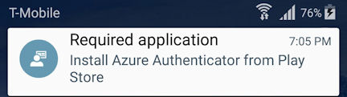

# App-Bereitstellung mit Microsoft Azure Authenticator
Microsoft Azure Authentificator zählt zu den Anwendungen der Microsoft Enterprise Mobility Suite (EMS). Mithilfe dieser App können Ihre Benutzer und deren Geräte eine sichere Verbindung zu Microsoft-Diensten wie Office 365 herstellen. Diese App ist für die Features der Zugriffskontrolle, des Datenschutzes und der Compliance von Microsoft Intune erforderlich.

Diese App optimiert auch die Registrierung für Ihre Benutzer und stellt die einmalige Anmeldung (Single Sign-On, SSO) sowie die mehrstufige Authentifizierung (MFA) für Apps auf Ihren Geräten bereit.

Sie sollten die App im Rahmen der Intune-Geräteregistrierung bereitstellen, um optimale Ergebnisse zu erzielen. Ab September stellen Intune und Configuration Manager hybrid die Azure Authentificator-App als erforderliche Installation für Android-Geräte automatisch über Google Play bereit.

[Klicken Sie hier](https://msdn.microsoft.com/en-us/library/azure/dn858223.aspx), um weitere Informationen zur Azure Authenticator-App zu erhalten.

## Gründe für die Bereitstellung dieser App durch Intune
Im Laufe dieses Jahres wird Microsoft ein Update für die Microsoft Intune-Unternehmensportal-App veröffentlichen, um die Registrierung zu vereinfachen. Dies umfasst auch das Entfernen der Aufforderungen für „Microsoft-Geschäftskonto“ und zur Benennung des Zertifikats, die während der Intune-Registrierung auf Android-Geräten erforderlich sind.

Wenn das Unternehmensportal aktualisiert wird, gilt Folgendes für Android-Geräte ohne die Azure Authentificator-App:

-   Sie verlieren die Möglichkeit zum einmaligen Anmelden für Intune

-   Sie verlieren die Möglichkeit zum einmaligen Anmelden für Office-Apps

-   Sie werden unter Quarantäne gestellt, wenn der bedingte Zugriff aktiviert ist

### Empfehlungen für IT-Administratoren
Um diese Probleme zu vermeiden, sollten Sie vor dem Update für das Unternehmensportal die Azure Authentificator-App als erforderliche Installation auf Android-Geräten bereitstellen. Dies ist auf zwei Arten möglich:

-   Weisen Sie die Endbenutzer an, die Microsoft Azure Authentificator-App jetzt über [Google Play](https://play.google.com/store/apps/details?id=com.azure.authenticator) zu installieren.

-   Stellen Sie die Azure Authentificator-App manuell über Google Play als erforderliche Installation für alle Benutzer bereit.

Weisen Sie die Endbenutzer alternativ an, die erforderliche Anwendungsbenachrichtigung zum Installieren der Azure Authentificator-App über Google Play zu befolgen, nachdem die für September angekündigten Updates von Microsoft Intune und Microsoft System Center Configuration Manager freigegeben wurden.

Obwohl es empfohlen wird, dass dieses Feature aktiviert bleibt, können Sie die automatische Bereitstellung der Azure Authentificator-App über die Intune-Konsole wie folgt deaktivieren, wenn in Ihrem Unternehmen die Features für die einmalige Anmeldung oder den bedingten Zugriff nicht verwendet werden:

**Intune:** Wechseln Sie in der Intune-Verwaltungskonsole zum Knoten **Verwaltung mobiler Geräte** &gt; **Android**.

**Configuration Manager hybrid:** Klicken Sie in er Configuration Manager-Konsole auf die Seite mit den **Microsoft Intune-Abonnementeigenschaften**.

## Vorgehensweise bei unter Quarantäne gestellten Benutzern
Wenn Benutzer mit Android-Geräten, die Zielgruppe einer Richtlinie für den bedingten Zugriff sind, die Azure Authentificator-App nicht installieren, werden sie von den Exchange-E-Mails isoliert, wenn das Unternehmensportal auf ihren Geräten aktualisiert wird.

Damit Ihnen der Zugriff wieder gewährt wird, müssen die Benutzer in der erhaltenen Quarantäne-E-Mail auf den Link klicken, um auf das Unternehmensportal zuzugreifen. Dann müssen sie die Anweisungen befolgen, um die Aktualisierung und Aktivierung der Registrierung abzuschließen.

## Siehe auch
[Dokumentation zu Microsoft Intune](../Topic/Documentation_for_Microsoft_Intune.md)

