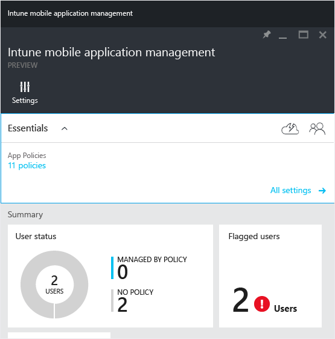

# &#220;berwachen der Verwaltungsrichtlinien f&#252;r mobile Apps mit Microsoft Intune
Die Informationen in diesem Artikel helfen Ihnen bei der Überwachung der Verwaltungsrichtlinien für mobile Anwendungen im Azure-Vorschauportal.

### Überwachen der Kompatibilität der Verwaltungsrichtlinie für mobilen Anwendungen
Die Kachel **Benutzerstatus** im Blatt **Intune-Verwaltung für mobile Anwendungen** zeigt den Kompatibilitätsstatus Ihrer App-Richtlinien wie nachstehend beschrieben an:

-   **Benutzer** – Die Gesamtzahl Benutzer in Ihrem Unternehmen, die geschäftliche Apps auf ihren Geräten verwenden.

-   **RICHTLINIE** – Diese ist die Anzahl der Benutzer, die mindestens eine der der Richtlinie zugeordneten Apps verwendet haben.

-   **KEINE RICHTLINIE** – Die Anzahl der Benutzer, die die geschäftlichen Apps aktiv nutzen, jedoch nicht durch die Verwaltungsrichtlinie für mobile Anwendungen geschützt sind.

    Auf der Kachel **Gekennzeichnete Benutzer** finden Sie zusammengefasste Informationen dazu, bei wie vielen Benutzern Probleme auftreten. Aktuell sind nur Benutzer mit per Jailbreak manipulierten Geräten gekennzeichnet.

    

-   Auf der Kachel **Löschanforderungen** wird der Zusammenfassungsbericht des Status der von Ihnen übermittelten Löschanforderungen angezeigt. Wenn Sie auf diese Kachel klicken, wird ein neues Blatt mit detaillierteren Informationen geöffnet. Eine detaillierte Beschreibung der Informationen zu den Löschanforderungen, die auf diesem Blatt angezeigt werden, finden Sie im Artikel [Löschen verwalteter Unternehmensdaten aus Apps mit Microsoft Intune](../Topic/Wipe_managed_company_app_data_with_Microsoft_Intune.md).

    

## Siehe auch
[Erstellen und Bereitstellen von Verwaltungsrichtlinien für mobile Apps mit Microsoft Intune](../Topic/Create_and_deploy_mobile_app_management_policies_with_Microsoft_Intune.md)
[Konfigurieren der App-Richtlinien für die Verhinderung von Datenverlust mit Microsoft Intune](../Topic/Configure_data_loss_prevention_app_policies_with_Microsoft_Intune.md)

