# Plan your user and device groups
Considered planning of your groups and policies will help you keep them organized and achieve the client behavior that you want. Here are some the recommended practices for organizing and managing your Intune policies and groups.

## Group basics
Groups in Intune provide great flexibility in managing your devices and users. You can set up groups by geographic location, department, hardware characteristics, operating system or based on whether the device is user-owned or company-owned, to suit your organizational needs.  More information on how to create and manage groups can be found in [Use groups to manage users and devices with Microsoft Intune](../Topic/Use_groups_to_manage_users_and_devices_with_Microsoft_Intune.md)

### Working with groups
The default view of the Groups node in the Intune Management console is:

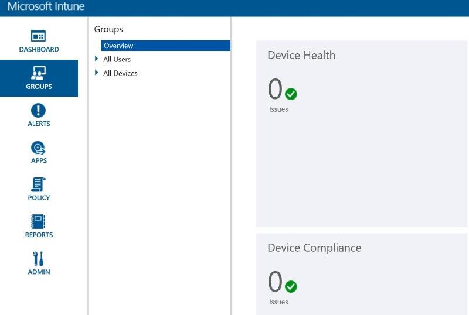

Policies are deployed onto groups, so group hierarchy is one of your key design considerations. It is also important to know that a group’s parent group cannot be changed once the group is created, so the design of your groups is critically important from the moment you start using the Intune service. Some of the recommended practices for designing a group hierarchy based on your organizational needs are  described here.

> [!NOTE]
> *Keep it simple* should be your motto. If your organization does not have specific needs such as those described here, keeping it simple and going with the default group structure and policies will make the service more manageable in the long term. Maintenance will be easier if it is possible for you to treat your users equally with little differentiation by group,  thereby having to maintain  fewer policies.

## All users and devices in your organization
You should have a parent group defined for all users and devices in your organization, as you are likely to have policies that will apply to all. This can be the default **All Users** and **All devices** groups in Intune. These groups can then be used to apply policies that are applicable to all users and devices within your organization. If you are creating BYOD (bring your own device), Corporate Owned (CO) groups, then those groups can be the children of the **All Users** and **All devices**  parent groups.

## BYOD and corporate owned devices
If your organizational policy permits the usage of BYOD (bring your own device), Corporate Owned (CO) devices or a combination of both, then we recommend that you apply policies based on those two categories of devices. In the case of BYOD or a mix, policies should be carefully planned and designed in order not to infringe on local privacy regulations. This will also help employees understand the corporate management of their personal devices and may drive more towards application-level management rather than device-level management. Create a parent group for all users who will be bringing their own devices. This group can then be used to apply policies that are applicable to all users in this category.

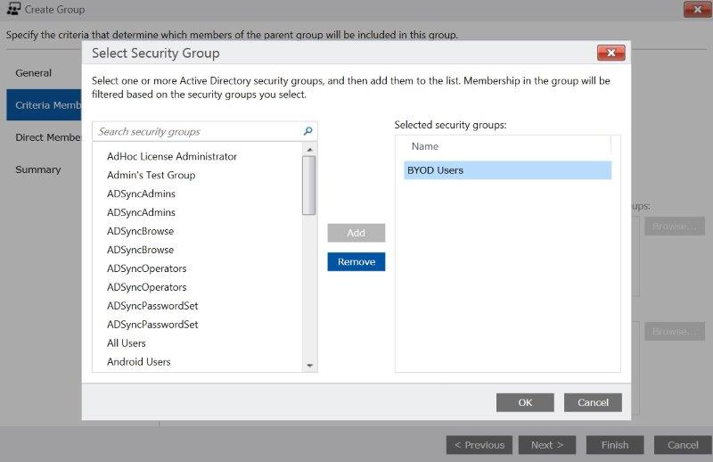

Similarly, you can create a group for the CO users in your organization, resulting in this:

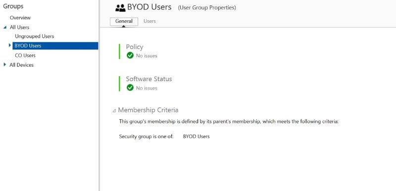

## Groups for geographic regions
If your organization needs policies for specific regions you can create groups based on this criterion.  These Intune groups could be centered on regional groups that you have already created in your on-premises Active Directory (AD) and synchronized to Azure AD (AAD) or created directly in AAD.

These screen shots show how to create Intune groups based on groups synchronized from your on-premises AD. This examples assumes that you have an AD security group called **US Users Group**. First, provide the general information.

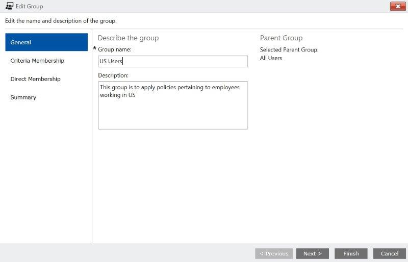

Under Membership criteria, select **US Users Group**, synchronized from AD,  as the security group to use under Membership rules.

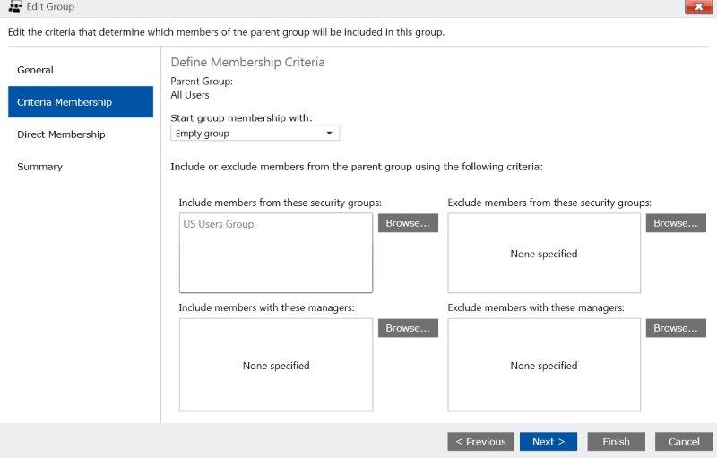

Review and then click **Finish** to finish creating the group

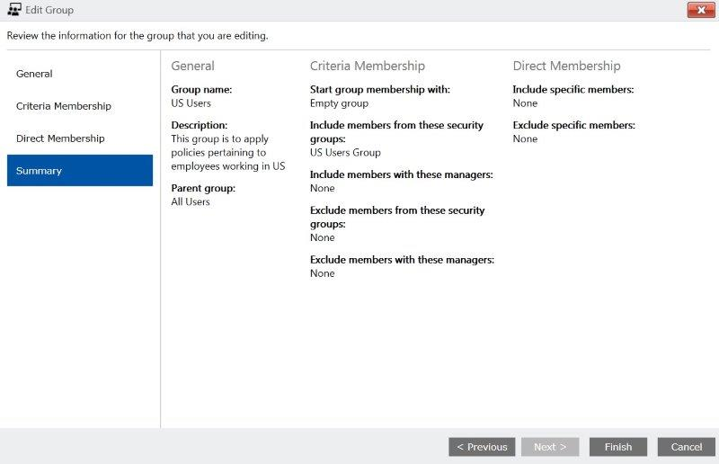

In our example, we’ve also created a Middle East and Asia group, MEA.

> [!NOTE]
> If the group membership is not populated based on the security group membership, check that you have assigned Intune licenses to those members.

## Groups for specific hardware
If your organization has a requirement to have policies applicable to specific hardware types, you can create groups based on this criterion.  These Intune groups could be based on specific groups that you have already created in your on-premises Active Directory (AD) and synchronized to Azure AD (AAD) or created directly in AAD. In this example, we use the **US Users Group** as the parent for the **Laptop Users** group.

At this point, the groups hierarchy should appear as shown below. As you see, there are now members within the Intune group **Laptop Users**. Any policies applied to this group will now be applied to  BYOD laptop users from the US region.

## Groups for specific operating systems
If your organization has a requirement to have policies applicable to specific operating systems  such as Android, iOS or Windows, you can create groups based on this criterion. As in the previous examples, these Intune groups could be based on OS-specific groups that you have already created in your on-premises Active Directory (AD) and synchronized to Azure AD (AAD) or directly created in AAD.
Using the same method that we followed for the other examples, we can create groups based on users using specific OS platforms.

> [!NOTE]
> If you have users using multiple mobile platforms/operating systems and do not have an automated way to categorize users  as Android users, iOS users or Windows users, consider applying policies at the device level, which will give you better flexibility in applying OS-specific policies.
> 
> You cannot provision groups dynamically based on the OS of the device . Do this using AD or AAD Security groups.

Once all your User groups are populated based on these organizational requirements, your group hierarchy should look like this:

This hierarchy can be used to apply the organization's policies appropriately.

## Device groups
You can also create similar groups for devices in your organization as shown below, starting with a broad group that includes all employee owned devices, for the BYOD scenario:

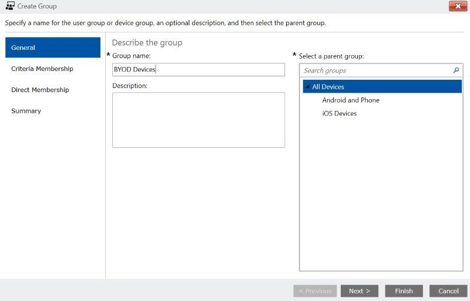

Make sure you select **All devices (computers and mobile)** so that the group will include all BYO devices:

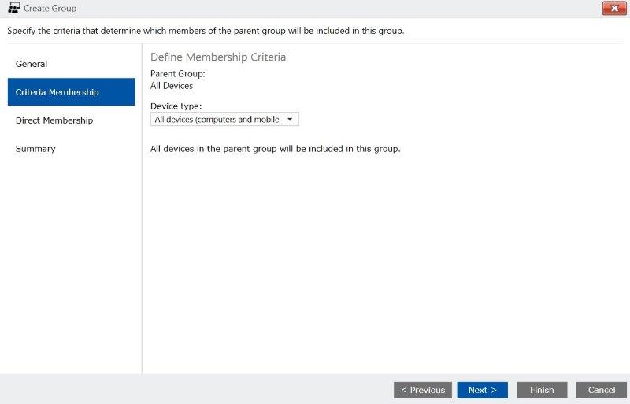

Review and click **Finish** to create the BYOD group.

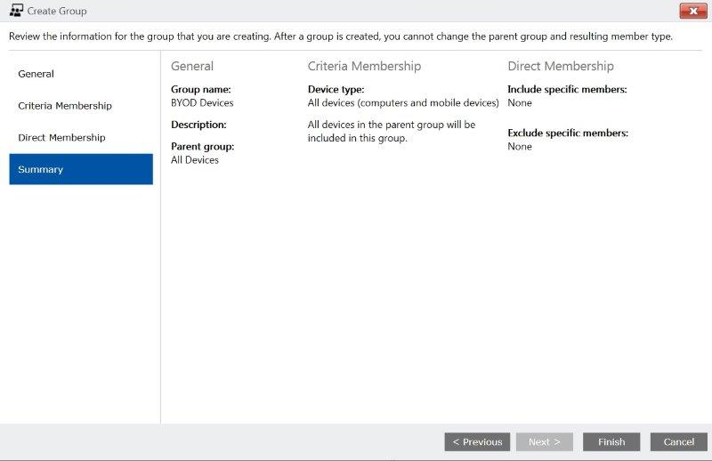

Continue to create device groups, until you have a device group hierarchy similar to the user group hierarchy. Then your group node in the Intune console should look similar to this:

## Group hierarchies and naming conventions
To make the management of policies easier we recommend that you name each policy according to  purpose, platform and  scope to which it is applied. This naming standard should follow the group structure that you created  in preparation for applying your policies.
For instance, for an Android policy that is applied to all corporate, android, mobile devices at the regional level US, the policy can be named 
**CO_US_Mob_Android_General**.

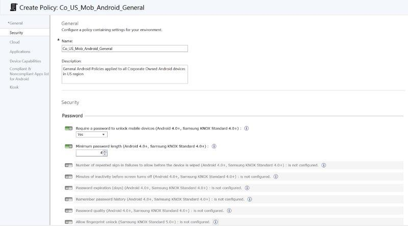

By naming the policies this way you will be able to quickly identify policies and their intended use and scope from the console’s policies node, as shown:

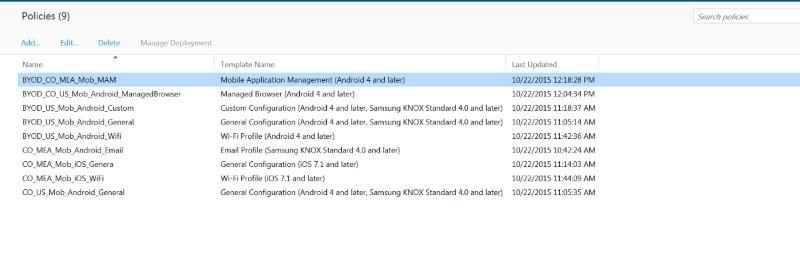

