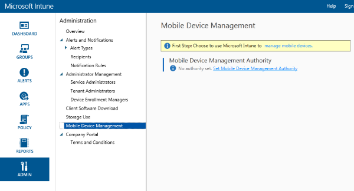

# Festlegen von Microsoft Intune als Autorit&#228;t f&#252;r die Verwaltung mobiler Ger&#228;te
Bevor Benutzer mobile Geräte mit [!INCLUDE[wit_nextref](../Token/wit_nextref_md.md)] registrieren können, muss der IT-Administrator [!INCLUDE[wit_nextref](../Token/wit_nextref_md.md)] als Ihre *Autorität für die Verwaltung mobiler Geräte* angeben. Eine *Autorität für die Verwaltung mobiler Geräte* definiert den einzelnen Verwaltungsdienst mit Berechtigung zur Verwaltung einer Gruppe von Geräten.  Zu den Lösungen für die Verwaltungsautorität für mobile Geräte gehören [!INCLUDE[wit_nextref](../Token/wit_nextref_md.md)], Configuration Manager mit [!INCLUDE[wit_nextref](../Token/wit_nextref_md.md)] oder Office 365 MDM-Lösungen.

In dieser Anleitung wird davon ausgegangen, dass Intune ohne Integration von System Center Configuration Manager verwendet wird, daher sollte die Einstellung auf „Microsoft Intune“ festgelegt werden.

## MDM-Autorität
**Festlegen der Autorität zur Verwaltung mobiler Geräte**

> [!IMPORTANT]
> Es ist sorgfältig zu überlegen, ob die mobilen Geräte ausschließlich über Intune, über System Center Configuration Manager mit Intune-Integration oder mit Office 365 verwaltet werden sollen. Ist die Autorität für die Verwaltung mobiler Geräte einmal festgelegt, kann sie nicht mehr geändert werden. Wenn Sie sich bezüglich der Optionen nicht sicher sind, finden Sie weitere Informationen unter [Optionen für die Mobilität im Unternehmen](../Topic/Ways_to_do_enterprise_mobility.md).

### Festlegen der Autorität zur Verwaltung mobiler Geräte

1.  Klicken Sie in der [Microsoft Intune-Verwaltungskonsole](http://manage.microsoft.com) auf **Verwaltung** &gt; **Verwaltung mobiler Geräte**.

2.  Klicken Sie in der Liste **Aufgaben** auf **Autorität für die Verwaltung mobiler Geräte festlegen**. Das Dialogfeld **MDM-Autorität festlegen** wird geöffnet.

    

3.  Intune erfordert eine Bestätigung, dass es als MDM-Autorität verwendet werden soll. Aktivieren Sie das Kontrollkästchen, und klicken Sie dann auf **Ja**, um Microsoft Intune zum Verwalten mobiler Geräte zu verwenden.

4.  Nachdem nun Intune die MDM-Autorität ist, können Sie die Geräteregistrierung für Geräte aktivieren:

    -   [Aktivieren der iOS-Verwaltung](https://technet.microsoft.com/library/dn408185.aspx)

    -   [Aktivieren der Android-Verwaltung](https://technet.microsoft.com/library/dn764960.aspx)

    -   [Aktivieren der Windows Phone-Verwaltung](https://technet.microsoft.com/library/dn764959.aspx)

    -   [Aktivieren der Windows-Verwaltung](https://technet.microsoft.com/library/mt346003.aspx)

## Siehe auch
[Vorbereiten der Registrierung von Geräten in Microsoft Intune](../Topic/Get_ready_to_enroll_devices_in_Microsoft_Intune.md)

