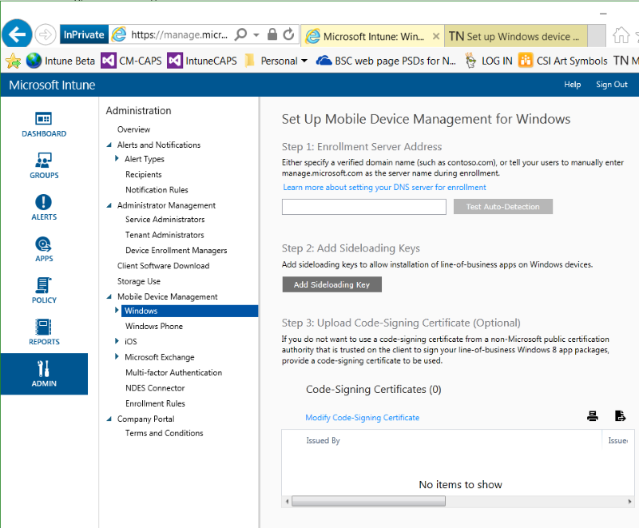

# Einrichten der Windows-Ger&#228;teverwaltung mit Microsoft Intune
Sie können [!INCLUDE[wit_nextref](../Token/wit_nextref_md.md)] verwenden, um Desktopcomputer, Laptops und andere Geräte mit Windows als mobile Geräte zu verwalten. Außerdem kann das [Einrichten der Windows Phone-Verwaltung mit Microsoft Intune](../Topic/Set_up_Windows_Phone_management_with_Microsoft_Intune.md) oder das [Verwalten von Computern mit Intune-Clientsoftware](http://technet.microsoft.com/library/dn646959.aspx) unter Verwendung des [!INCLUDE[wit_nextref](../Token/wit_nextref_md.md)]-Clients sinnvoll sein.

## Vorbereiten der Verwaltung von Windows-Geräten mit Intune
Für den Zugriff auf Ressourcen, die über [!INCLUDE[wit_nextref](../Token/wit_nextref_md.md)] verwaltet werden, können Benutzer ihre Windows-Computer als mobile Geräte registrieren.  Durch das Erstellen eines DNS-CNAME-Eintrags können Benutzer sich mit dem [!INCLUDE[wit_nextref](../Token/wit_nextref_md.md)]-Unternehmensportal verbinden, ohne einen Servernamen eingeben zu müssen. Wenn Sie das Unternehmensportal mit [!INCLUDE[wit_nextref](../Token/wit_nextref_md.md)] bereitstellen möchten, müssen Sie das Sideloading mit einem Sideload-Schlüssel aktivieren.   Benutzer können das Unternehmensportal zudem aus dem Store herunterladen und installieren oder Software verwenden, die mit Windows bereitgestellt wird. Führen Sie die folgenden Schritte aus, um die Windows-Geräteverwaltung mit [!INCLUDE[wit_nextref](../Token/wit_nextref_md.md)] einzurichten.

#### Einrichten der Windows-Geräteverwaltung

1.  **Einrichten von [!INCLUDE[wit_nextref](../Token/wit_nextref_md.md)]** 
    Wenn nicht bereits geschehen, [bereiten Sie die Verwaltung mobiler Geräte vor,](https://technet.microsoft.com/library/mt346013.aspx) indem Sie die Autorität für die Verwaltung mobiler Geräte auf **[!INCLUDE[wit_nextref](../Token/wit_nextref_md.md)]** festlegen.

2.  **Festlegen eines DNS-Alias für die Adresse des Registrierungsservers** (optional)

    Wenn ein DNS-Alias (CNAME-Eintrag) vorhanden ist, können Benutzer ihre Geräte einfacher registrieren, da der Servername bei der Registrierung automatisch eingetragen wird.

    ###### Überprüfen und Erstellen eines DNS CNAME

    1.  Klicken Sie in der [Intune-Verwaltungskonsole](http://manage.microsoft.com) auf **Verwaltung** &gt; **Verwaltung mobiler Geräte** &gt; **Windows Phone**.

    2.  Geben Sie die URL der überprüften Domäne der Unternehmenswebsite in das Feld **Verifizierten Domänennamen eingeben**, und klicken Sie dann auf **Test Auto-Detection**.

    3.  Erstellen Sie CNAME-Ressourceneinträge für die Domäne des Unternehmens. Die CNAME-Ressourceneinträge müssen die folgenden Informationen enthalten:

        |TYP|Hostname|Verweist auf|TTL|
        |-------|------------|----------------|-------|
        |CNAME|enterpriseenrollment.company_domain.com|manage.microsoft.com|1 Stunde|
        |CNAME|enterpriseregistration.company_domain.com|enterpriseregistration.windows.net|1 Stunde|
        Wenn der Name Ihrer Unternehmens-Website beispielsweise contoso.com lautet, erstellen Sie einen CNAME in DNS, von dem EnterpriseEnrollment.contoso.com an manage.microsoft.com umgeleitet wird. Existieren mehrere überprüfte Domänen, erstellen Sie einen CNAME-Eintrag für jede Domäne.

        -   `manage.microsoft.com` – Unterstützt eine Umleitung zum Intune-Dienst mit Domänenerkennung anhand des E-Mail-Domänennamens

        -   `enterpriseregistration.windows.net` – Unterstützt eine Arbeitsbereichverknüpfung für mobile Geräte. Der bedingte Zugriff auf Windows 8.1 wird ebenfalls unterstützt.

    

3.  **Aktivieren von Sideload-Apps** (optional)
    Bei Windows RT 8.1-, Windows 8.1- und Windows 10-Geräten kann die Unternehmensportal-App aus dem Windows Store installiert werden. Wenn nicht direkt aus dem Windows Store installiert, sind für die Installation der Unternehmensportal-App Sideload-Schlüssel auf den Zielcomputern erforderlich. Weitere Informationen zum Bereitstellen von Sideload-Schlüsseln finden Sie unter [http://go.microsoft.com/fwlink/?LinkID=290705](http://go.microsoft.com/fwlink/?LinkID=290705). Quergeladene Apps müssen nicht über den Windows Store zertifiziert oder installiert werden. Sie können nur auf Geräten installiert werden, die für Querladen aktiviert sind. Weitere Informationen zum Erwerb von Sideload-Schlüsseln finden Sie unter [Volume Licensing für Unternehmen](http://go.microsoft.com/fwlink/?LinkId=264711).

    ###### Codesignatur von Apps für Windows-Geräte

    1.  Klicken Sie in der [Intune-Verwaltungskonsole](http://manage.microsoft.com) auf **Verwaltung** &gt; **Mobilgeräteverwaltung** &gt; **Windows**, und klicken Sie dann auf **Sideload-Schlüssel hinzufügen**.

    2.  Geben Sie im Dialogfeld **Sideload-Schlüssel hinzufügen** einen Namen, den Schlüssel zur Produktaktivierung, die Gesamtzahl der Aktivierungen und optional eine Beschreibung ein. Klicken Sie dann auf **OK**.

    3.  Laden Sie aus dem Download Center [http://go.microsoft.com/fwlink/?LinkId=615800](http://go.microsoft.com/fwlink/?LinkId=615800) die Microsoft Intune-Unternehmensportal-App für Windows Phone 8.1 herunter. Führen Sie die heruntergeladene Datei aus, um die Datei CompanyPortal.appx zu extrahieren. Platzieren Sie sie in einem über das Netzwerk zugänglichen, freigegebenen Ordner.

    4.  Führen Sie **Windows PowerShell** als Administrator aus, und geben Sie dann das folgende Cmdlet ein:

        ```
        Powershell add-appxpackage –path '‹path›'
        ```

    5.  Überprüfen Sie, ob auf dem Zielcomputer in der Liste der Apps die Kachel **Unternehmensportal** verfügbar ist. (Bei Windows 8.1- oder Windows RT 8.1-Geräten wird automatisch eine Kachel auf der Startseite erstellt.)

4.  **Hinzufügen von Intune-Benutzern** 
    Der Eigentümer des mobilen Geräts muss dem Kontoportal hinzugefügt werden, bevor Geräte registriert werden können. Melden Sie sich beim [Microsoft Intune-Kontoportal](http://go.microsoft.com/fwlink/?LinkId=698854) an, klicken Sie auf **Benutzer hinzufügen**, und wählen Sie eine Option aus:

    -   **Benutzer**: Zum Hinzufügen eines einzelnen Benutzers wählen Sie **Neu** &gt; **Benutzer** aus und geben in den Feldern **Details**, **Rollen zuweisen** und **Benutzerstandort einstellen** Informationen an. Weisen Sie den Benutzer anschließend einer **Gruppe** zu.

    -   **Per Massenvorgang hinzufügen**: Erstellen Sie eine CSV-Datei (siehe bereitgestellte Beispieldateien), und importieren Sie diese ins Kontoportal. Geben Sie Rollen, den Speicherort und die Gruppe an, und erstellen Sie anschließend die Konten. Beispieldateien und leere CSV-Dateien können vom Kontoportal heruntergeladen werden.

    Sie können auch die Active Directory- oder Azure Active Directory-Synchronisierung aktivieren. Weitere Informationen zur Integration anderer Azure Active Directory-Benutzer in Intune finden Sie unter [Fahrplan zur Verzeichnissynchronisierung](http://go.microsoft.com/fwlink/?LinkId=511540).

5.  **Erstellen von Gruppen**  (optional)
    Gruppen bieten Flexibilität für die Verwaltung von Geräten und Benutzern. Sie können die Gruppen so einrichten, wie es Ihren organisatorischen Anforderungen am besten entspricht, beispielsweise nach geografischem Standort, Abteilung oder Hardwareeigenschaften.   Weitere Informationen finden Sie unter [Verwenden von Gruppen zum Verwalten von Benutzern und Geräten in Microsoft Intune](../Topic/Use_groups_to_manage_users_and_devices_with_Microsoft_Intune.md).

6.  **Hinzufügen von Richtlinien für Geräte** (optional)
    Richtlinien sind Gruppen von Einstellungen zum Steuern der Features auf Geräten. Die meisten MDM-Richtlinien sind plattformspezifisch. Sie erstellen Richtlinien mithilfe von Vorlagen, in denen empfohlene oder angepasste Einstellungen enthalten sind, und stellen diese dann für Gruppen bereit. Weitere Informationen finden Sie unter [Verwenden von Richtlinien zum Verwalten von Computern und mobilen Geräten mit Microsoft Intune](../Topic/Use_policies_to_manage_computers_and_mobile_devices_with_Microsoft_Intune.md).

7.  **Festlegen der Beschränkung für Registrierungen für das Gerät** (optional) 
    Um die Anzahl von mobilen Geräten zu beschränken, die ein Benutzer registrieren kann, melden Sie sich bei der [Microsoft Intune-Verwaltungskonsole](http://manage.microsoft.com) an, klicken Sie auf **Verwaltung** &gt; **Verwaltung mobiler Geräte** &gt; **Registrierungsregeln**. Wählen Sie die maximale Anzahl der Geräte aus, die ein Benutzer registrieren kann, und klicken Sie dann auf **Speichern**.

8.  **Festlegen von Unternehmensportaleinstellungen** 
     Sie können das Intune-Unternehmensportal für Ihr Unternehmen anpassen. Klicken Sie in der [Microsoft Intune-Verwaltungskonsole](http://manage.microsoft.com) auf **Verwaltung** &gt; **Unternehmensportal**. Konfigurieren Sie Folgendes

    -   **Firmenname**

    -   **Kontaktname für IT-Abteilung**

    -   **Telefonnummer der IT-Abteilung**

    -   **Weitere Informationen**

    -   **URL der Datenschutzrichtlinie des Unternehmens**

    -   **URL der Supportwebsite (nicht angezeigt)**

    -   **Websitename**

9. [!INCLUDE[CPEnrollmentTermsAndConditions](../Token/CPEnrollmentTermsAndConditions_md.md)]

10. **Erläutern des Zugriffs auf Unternehmensressourcen über das Unternehmensportal**
    Ihre Benutzer müssen wissen, wie sie ihre Geräte registrieren können und was sie erwartet, wenn die Geräte in die Verwaltung eingebunden sind.[Informieren der Endbenutzer über den Einsatz von Microsoft Intune](../Topic/What_to_tell_your_end_users_about_using_Microsoft_Intune.md)

## Siehe auch
[Vorbereiten der Registrierung von Geräten in Microsoft Intune](../Topic/Get_ready_to_enroll_devices_in_Microsoft_Intune.md)

