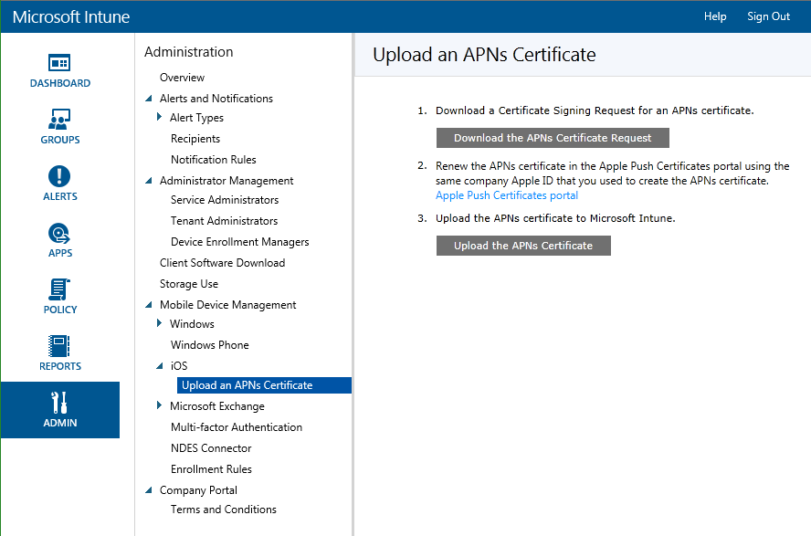

# Einrichten der iOS-Verwaltung mit Microsoft Intune
Mit [!INCLUDE[wit_nextref](../Token/wit_nextref_md.md)] können Sie die BYOD-Registrierung („Bring Your Own Device“) für iOS-Geräte aktivieren, um iPhone- und iPad-Benutzern Zugriff auf Unternehmens-E-Mail und -Apps zu gewähren. Nachdem Benutzer die [!INCLUDE[wit_nextref](../Token/wit_nextref_md.md)]-Unternehmensportal-App installiert haben, können ihre Geräte mithilfe von Richtlinien über die [!INCLUDE[wit_nextref](../Token/wit_nextref_md.md)]-Verwaltungskonsole angesprochen werden.  Bevor Sie iOS-Geräte verwalten können, müssen Sie ein APNS-Zertifikat (Apple Push Notification Service) von Apple importieren. Dieses Zertifikat ermöglicht Intune das Verwalten von iOS-Geräten und die Einrichtung einer akkreditierten und verschlüsselten IP-Verbindung mit den Diensten für die Verwaltungsautorität für mobile Geräte.

Als Alternative zur Registrierung mit der Unternehmensportal-App können Sie auch [firmeneigene iOS-Geräte registrieren](https://technet.microsoft.com/en-US/library/dn408185.aspx#BKMK_CODiOS).

## Vorbereiten der Verwaltung von iOS-Mobilgeräten mit Microsoft Intune
Die folgenden Schritte ermöglichen [!INCLUDE[wit_nextref](../Token/wit_nextref_md.md)] die Verwaltung von iOS-Geräten mithilfe des Unternehmensportals.

#### Einrichten der iOS-Registrierung bei Intune

1.  **Einrichten von Intune**
    Wenn nicht bereits geschehen, bereiten Sie die Verwaltung mobiler Geräte durch [Festlegen der Autorität für die Verwaltung mobiler Geräte](https://technet.microsoft.com/library/mt346013.aspx) auf **Microsoft Intune** vor.

2.  **Abrufen einer Zertifikatsignierungsanforderung**
    Öffnen Sie als Administrator die [Microsoft Intune-Verwaltungskonsole](http://manage.microsoft.com), wechseln Sie zu **Verwaltung** &gt; **Verwaltung mobiler Geräte** &gt; **iOS** &gt; **APNs-Zertifikat hochladen**, und klicken Sie auf **APNs-Zertifikatanforderung herunterladen**. Speichern Sie die Zertifikatsignierungsanforderung (CSR-Datei) lokal. Die CSR-Datei wird verwendet, um ein Vertrauensstellungszertifikat vom Apple Push Certificates-Portal anzufordern.

    

3.  **Abrufen eines Apple Push Notification Service-Zertifikats**
    Wechseln Sie zum [Apple Push Certificates-Portal](http://go.microsoft.com/fwlink/?LinkId=269844), und melden Sie sich mit Ihrer Unternehmens-Apple-ID an, um das APNs-Zertifikat mithilfe der CSR-Datei zu erstellen. Diese Apple-ID muss später verwendet werden, um das APNs-Zertifikat zu erneuern. Laden Sie das APNs-Zertifikat (.pem) herunter, und speichern Sie die Datei lokal. Diese APNs-Zertifikatdatei wird verwendet, um eine Vertrauensstellung zwischen dem Apple Push Notification-Server und der Verwaltungsautorität für mobile Geräte von Intune herzustellen.

4.  **Hinzufügen des APNs-Zertifikats zu Intune**
    Wechseln Sie in der [Microsoft Intune-Verwaltungskonsole](http://manage.microsoft.com) zu **Verwaltung** &gt; **Verwaltung mobiler Geräte** &gt; **iOS** &gt; **APNs-Zertifikat hochladen**, und klicken Sie auf **APNs-Zertifikat hochladen**.**Wechseln Sie** zur Zertifikatdatei (.pem), klicken Sie auf **Öffnen**, und geben Sie Ihre **Apple-ID** ein. Mit dem APNs-Zertifikat kann Intune iOS-Geräte registrieren und verwalten, indem die Richtlinie auf registrierte mobile Geräte übertragen wird.

5.  **Hinzufügen von Intune-Benutzern** 
    Der Eigentümer des mobilen Geräts muss dem Kontoportal hinzugefügt werden, bevor Geräte registriert werden können. Melden Sie sich beim [Microsoft Intune-Kontoportal](http://account.manage.microsoft.com) an, klicken Sie auf **Benutzer hinzufügen**, und wählen Sie eine Option aus:

    -   **Benutzer**: Zum Hinzufügen eines einzelnen Benutzers wählen Sie **Neu** &gt; **Benutzer** aus und geben in den Feldern **Details**, **Rollen zuweisen** und **Benutzerstandort einstellen** Informationen an. Weisen Sie den Benutzer anschließend einer **Gruppe** zu.

    -   **Per Massenvorgang hinzufügen**: Erstellen Sie eine CSV-Datei (siehe bereitgestellte Beispieldateien), und importieren Sie diese ins Kontoportal. Geben Sie Rollen, den Speicherort und die Gruppe an, und erstellen Sie anschließend die Konten. Beispieldateien und leere CSV-Dateien können vom Kontoportal heruntergeladen werden.

    Sie können auch die Active Directory- oder Azure Active Directory-Synchronisierung aktivieren. Weitere Informationen zur Integration anderer Azure Active Directory-Benutzer in Intune finden Sie unter [Fahrplan zur Verzeichnissynchronisierung](http://go.microsoft.com/fwlink/?LinkId=511540), oder klicken Sie auf **Andere Möglichkeiten zum Hinzufügen von Benutzern** im Kontoportal.

6.  **Erstellen von Gruppen**  (optional)
    Gruppen bieten Flexibilität für die Verwaltung von Geräten und Benutzern. Sie können die Gruppen so einrichten, wie es Ihren organisatorischen Anforderungen am besten entspricht, beispielsweise nach geografischem Standort, Abteilung oder Hardwareeigenschaften.   Weitere Informationen finden Sie unter [Verwenden von Gruppen zum Verwalten von Benutzern und Geräten in Microsoft Intune](../Topic/Use_groups_to_manage_users_and_devices_with_Microsoft_Intune.md).

7.  **Hinzufügen von Richtlinien für Geräte** (optional)
    Richtlinien sind Gruppen von Einstellungen zum Steuern der Features auf Geräten. Die meisten MDM-Richtlinien sind plattformspezifisch. Sie erstellen Richtlinien mithilfe von Vorlagen, in denen empfohlene oder angepasste Einstellungen enthalten sind, und stellen diese dann für Gruppen bereit. Weitere Informationen finden Sie unter [Verwenden von Richtlinien zum Verwalten von Computern und mobilen Geräten mit Microsoft Intune](../Topic/Use_policies_to_manage_computers_and_mobile_devices_with_Microsoft_Intune.md).

8.  **Festlegen der Beschränkung für Registrierungen für das Gerät** (optional) 
    Um die Anzahl von mobilen Geräten zu beschränken, die ein Benutzer registrieren kann, melden Sie sich bei der [Microsoft Intune-Verwaltungskonsole](http://manage.microsoft.com) an, klicken Sie auf **Verwaltung** &gt; **Verwaltung mobiler Geräte** &gt; **Registrierungsregeln**. Wählen Sie die maximale Anzahl der Geräte aus, die ein Benutzer registrieren kann, und klicken Sie dann auf **Speichern**.

9. **Festlegen von Unternehmensportaleinstellungen** 
     Sie können das Intune-Unternehmensportal für Ihr Unternehmen anpassen. Klicken Sie in der [Microsoft Intune-Verwaltungskonsole](http://manage.microsoft.com) auf **Verwaltung** &gt; **Unternehmensportal**. Konfigurieren Sie Folgendes

    -   **Firmenname**

    -   **Kontaktname für IT-Abteilung**

    -   **Telefonnummer der IT-Abteilung**

    -   **Weitere Informationen**

    -   **URL der Datenschutzrichtlinie des Unternehmens**

    -   **URL der Supportwebsite (nicht angezeigt)**

    -   **Websitename**

10. **Festlegen von Nutzungsbedingungen**
    Sie können die Nutzungsbedingungen veröffentlichen, die den Benutzern angezeigt werden, wenn sie das Unternehmensportal das erste Mal auf einem beliebigen Gerät verwenden, unabhängig davon, ob das Gerät bereits registriert ist. Benutzer müssen diese Bedingungen für den Zugriff auf das Portal akzeptieren. Wenn Sie die Nutzungsbedingungen maßgeblich aktualisieren und diese von den Benutzern angezeigt und akzeptiert werden sollen, können Sie die neuen Nutzungsbedingungen als neue Version kennzeichnen. Die Benutzer durchlaufen dann denselben Prozess, wenn sie das Portal das nächste Mal besuchen.

    Wechseln Sie in der [Microsoft Intune-Administrationskonsole](http://manage.microsoft.com) zu **Unternehmensportal** &gt; **Nutzungsbedingungen**.

    Legen Sie Folgendes fest:

    -   **Benutzer müssen vor Verwendung des Unternehmensportals die Nutzungsbedingungen des Unternehmens akzeptieren**

    -   **Titel**

    -   **Text der Nutzungsbedingungen**

    -   **Text zur Erläuterung, was das Akzeptieren der Nutzungsbedingungen für die Benutzer bedeutet**

    Sie können [Details zu den Nutzungsbedingungen](https://technet.microsoft.com/library/mt405893.aspx) anzeigen.  Mithilfe der [Berichte zu Nutzungsbedingungen](https://technet.microsoft.com/library/dn646977.aspx) können Sie außerdem anzeigen, welche Benutzer die Nutzungsbedingungen akzeptiert haben.

11. **Bereitstellen von Informationen an Benutzer zum Zugriff auf Unternehmensressourcen über das Unternehmensportal**
    [Informieren der Endbenutzer über den Einsatz von Microsoft Intune](../Topic/What_to_tell_your_end_users_about_using_Microsoft_Intune.md)

## <a name="BKMK_CODiOS"></a>Verwaltung von unternehmenseigenen Geräten mit Microsoft Intune
Als Alternative zur Registrierung mit der Unternehmensportal-App können Sie firmeneigene Geräte, die von Apple gekauft wurden, registrieren. Intune unterstützt die Registrierung von firmeneigenen iOS-Geräten mithilfe des Apple Device Enrollment Program (DEP) oder des Tools [Apple Configurator](http://go.microsoft.com/fwlink/?LinkId=518017), das auf einem Mac-Computer ausgeführt wird.

Sie können firmeneigene iOS-Geräte auf drei Arten registrieren:

-   **Device Enrollment Programm (DEP)**: Stellt ein Registrierungsprofil bereit, mit dem das Gerät "drahtlos" registriert wird, und kann die Setup-Assistent-Optionen für das Gerät enthalten. Die Registrierung von Geräten über DEP kann von Benutzern nicht rückgängig gemacht werden.

-   **Setup-Assistent für die Registrierung**: Setzt das Gerät auf die Werkseinstellungen zurück und bereitet es für die Einrichtung durch den neuen Benutzer des Geräts vor. Diese Methode unterstützt die Registrierung mit DEP oder dem Apple Configurator.

-   **Direkte Anmeldung** – Erstellt eine Apple Configurator-kompatible Datei zur Verwendung während der Vorbereitung des Geräts. Das registrierte Gerät wird nicht auf die Werkseinstellungen zurückgesetzt. Diese Methode kann nicht für die Registrierung mit DEP verwendet werden. Diese Methode funktioniert nur, wenn die Benutzerzugehörigkeit auf "Keine Benutzeraffinität" festgelegt ist.

> [!CAUTION]
> Die Intune-Unternehmensportal-App wird auf mit diesen Methoden registrierten Geräte nicht unterstützt. Folglich stehen bestimmte Intune-Funktionen wie [Bedingter Zugriff](https://technet.microsoft.com/library/dn818907.aspx) und [Mobile Anwendungsverwaltung](https://technet.microsoft.com/library/dn878026.aspx) nicht zur Verfügung. Sie können weiterhin auf diesen Geräten Intune-[Richtlinien](https://technet.microsoft.com/library/mt346005.aspx), [Profile für den Ressourcenzugriff](https://technet.microsoft.com/library/dn997277.aspx) und [erforderliche Apps](https://technet.microsoft.com/library/dn646955.aspx) bereitstellen (ausgenommen [solche, die eine MAM-Richtlinie erfordern](https://technet.microsoft.com/library/dn708489.aspx)). Um die zukünftige Kompatibilität mit dem Unternehmensportal sicherzustellen, sollten Sie **Eingabeaufforderung für Benutzeraffinität** für ihr DEP-Anmeldungsprofil konfigurieren und auf den Geräten eine Apple-ID festlegen.

### <a name="BKMK_DEP"></a>Apple-DEP-Verwaltung für iOS-Geräte mit Microsoft Intune
Zum Verwalten unternehmenseigener iOS-Geräte mit dem Apple-Programm zur Geräteregistrierung (Device Enrollment Program, DEP) müssen Unternehmen am Apple-DEP teilnehmen und Geräte über das Programm beziehen. Details zu diesem Prozess finden Sie unter: [https://deploy.apple.com](https://deploy.apple.com). Das Programm bietet den Vorteil, dass Geräte eingerichtet werden können, ohne dass jedes Gerät physisch über USB mit einem Computer verbunden werden muss.

Bevor Sie firmeneigene iOS-Geräte mit DEP registrieren können, benötigen Sie einen DEP-Token von Apple. Mit diesem Token kann Intune Informationen zu DEP-Geräten synchronisieren, die Ihrem Unternehmen gehören. Damit kann Intune außerdem Registrierungsprofile an Apple übermitteln und diesen Profile Geräte zuweisen.

#### <a name="BKMK_DEPtok"></a>Aktivieren der DEP-Verwaltung mit Intune

1.  **Beginnen der Verwaltung von iOS-Geräten mit Microsoft Intune** 
    Bevor Sie iOS DEP-Geräte registrieren können, müssen Sie die Aktivierung der iOS-Verwaltung für Intune abschließen.

2.  **Abrufen eines Verschlüsselungsschlüssels** 
    Öffnen Sie als Administrator die [Microsoft Intune-Verwaltungskonsole](http://manage.microsoft.com), wechseln Sie zu **Verwaltung** &gt; **Verwaltung mobiler Geräte** &gt; **iOS** &gt; **Device Enrollment Program**, und klicken Sie auf **Verschlüsselungsschlüssel herunterladen**. Speichern Sie die Verschlüsselungsschlüsseldatei (PEM) lokal. Die PEM-Datei wird verwendet, um ein Vertrauensstellungszertifikat vom Apple Device Enrollment Program-Portal anzufordern.

3.  **Abrufen eines Device Enrollment Program-Tokens** 
    Rufen Sie das [Device Enrollment Program-Portal](https://deploy.apple.com) (https://deploy.apple.com) auf, und melden Sie sich mit der Apple-ID Ihres Unternehmen an. Diese Apple-ID muss später verwendet werden, um das DEP-Token zu erneuern.

    1.  Wechseln Sie im [Device Enrollment Program-Portal](https://deploy.apple.com) zu **Device Enrollment Program** &gt; **Server verwalten**, und klicken Sie dann auf **MDM-Server hinzufügen**.

    2.  Geben Sie den **MDM-Servernamen** ein , und klicken Sie dann auf **Weiter**. Der Servername dient als Referenz zum Identifizieren des MDM-Servers. Es ist nicht der Name oder die URL des Microsoft Intune-Servers.

    3.  Das Dialogfeld **&lt;Servername&gt; hinzufügen** wird geöffnet. Klicken Sie auf **Datei auswählen...**, um die PEM-Datei hochzuladen, und klicken Sie auf **Weiter**.

    4.  Im Dialogfeld **&lt;Servername&gt; hinzufügen** wird der Link **Ihr Servertoken** angezeigt. Laden Sie die Servertokendatei (.p7m) auf Ihren Computer herunter, und klicken Sie dann auf **Fertig**.

    Diese Zertifikatdatei (.p7m) wird verwendet, um eine Vertrauensstellung zwischen dem Intune- und Apple Device Enrollment Program-Server herzustellen.

4.  **Hinzufügen des DEP-Tokens zu Intune** 
    Wechseln Sie in der [Microsoft Intune-Verwaltungskonsole](http://manage.microsoft.com) zu **Verwaltung** &gt; **Verwaltung mobiler Geräte** &gt; **iOS** &gt; **Device Enrollment Program**, und klicken Sie auf **DEP-Token hochladen**.**Wechseln Sie** zur Zertifikatdatei (.p7m), geben Sie Ihre **Apple-ID** ein, und klicken Sie auf **Hochladen**.

5.  **Hinzufügen der Corporate Device Enrollment-Richtlinie** 
    Wechseln Sie in der [Microsoft Intune-Verwaltungskonsole](http://manage.microsoft.com) zu **Richtlinie** &gt; **Corporate Device Enrollment**, und klicken Sie dann auf **Hinzufügen**. Geben Sie **allgemeine** Details ein, wie z. B. **Name** und **Beschreibung**. Geben Sie an, ob die dem Profil zugeordneten Geräte zu einem Benutzer oder einer Gruppe gehören, und aktivieren Sie dann **Device Enrollment Program-Einstellungen für diese Richtlinie konfigurieren**, um DEP zu unterstützen. Die **Setup-Assistent-Bereiche** definieren die iOS-Geräteeinstellungen, die während des Setups konfiguriert werden.

6.  **Zuweisen von DEP-Geräten zur Verwaltung** 
    Wechseln Sie zum [Device Enrollment Program-Portal](https://deploy.apple.com) (https://deploy.apple.com), und melden Sie sich mit der Apple-ID Ihres Unternehmens an. Wechseln Sie **Bereitstellungsprogramm** &gt; **Device Enrollment Program** &gt; **Geräte verwalten**. Geben Sie an, wie Sie **Geräte wählen**, fügen Sie Geräteinformationen hinzu, und geben Sie die Details zum Gerät wie **Seriennummer** und **Bestellnummer** an, oder **laden Sie eine CSV-Datei hoch**. Wählen Sie als Nächstes **Zu Server zuweisen**. Wählen Sie den für Microsoft Intune angegebenen &lt;Servernamen&gt; aus, und klicken Sie dann auf **OK**.

7.  **Verteilen von Geräten an Benutzer** 
    Ihre firmeneigenen Geräte können jetzt an Benutzer verteilt werden. Wenn ein iOS-Gerät eingeschaltet wird, wird es für die Verwaltung durch Intune registriert.

8.  **Synchronisieren von mit DEP verwalteten Geräten** 
    Öffnen Sie als Administrator die [Microsoft Intune-Verwaltungskonsole](http://manage.microsoft.com), wechseln Sie zu **Verwaltung** &gt; **Verwaltung mobiler Geräte** &gt; **iOS** &gt; **Device Enrollment Program**, und klicken Sie auf **Jetzt synchronisieren**. Eine Synchronisierungsanforderung wird an Apple gesendet. Zum Anzeigen von DEP verwalteter Geräte nach der Synchronisierung wechseln Sie in der [Microsoft Intune-Verwaltungskonsole](http://manage.microsoft.com) zu **Gruppen** &gt; **Alle firmeneigenen Geräte**. Im Arbeitsbereich **Firmeneigene Geräte** wird der **Status** verwalteter Geräte als "Nicht kontaktiert" angezeigt, bis das Gerät eingeschaltet und der Setup-Assistent auf ihm ausgeführt wird.

### <a name="BKMK_SAE"></a>Registrierung von iOS-Geräten bei Microsoft Intune über den Setup-Assistenten
Mit dem Apple Configurator können Sie iOS-Geräte auf die Werkseinstellungen zurücksetzen und für die Einrichtung durch den neuen Benutzer des Geräts vorbereiten.  Bei dieser Methode muss das iOS über USB mit einem Mac-Computer verbunden werden, um die Registrierung beim Unternehmen einzurichten.

##### Aktivieren der Registrierung bei Intune über den Setup-Assistenten

1.  **Erstellen einer mobilen Gerätegruppe** (Optional) 
    Wenn Ihr Unternehmen mobile Gerätegruppen zur Verwaltung von Geräten erfordert, erstellen Sie diese Gruppen.[Verwenden von Gruppen zum Verwalten von Benutzern und Geräten in Microsoft Intune](../Topic/Use_groups_to_manage_users_and_devices_with_Microsoft_Intune.md).

2.  **Erstellen eines Profils für Geräte**
    Ein Registrierungsprofil für Geräte definiert die Einstellungen für eine Gruppe von Geräten. Wenn Sie dies noch nicht getan haben, erstellen Sie ein Registrierungsprofil für iOS-Geräte, die mit Apple Configurator registriert werden.**Eingabeaufforderung für Benutzerzuweisung** sollte für die Registrierung mit dem **Setup-Assistenten** aktiviert werden.

    ###### So erstellen Sie ein Profil

    1.  Wechseln Sie in der [Microsoft Intune-Verwaltungskonsole](http://manage.microsoft.com) zu **Richtlinie** &gt; **Firmeneigene Geräte**, und klicken Sie dann auf **Hinzufügen…**.

    2.  Geben Sie die Details für die Geräteprofile ein:

        -   **Name**: Name des Geräteanmeldungsprofils. (Für Benutzer nicht sichtbar)

        -   **Beschreibung**: Beschreibung des Geräteanmeldungsprofils. (Für Benutzer nicht sichtbar)

        -   **Benutzerzuweisung**: Gibt an, wie Geräte registriert werden.

            -   **Eingabeaufforderung für Benutzeraffinität** – Das Gerät kann während der ersten Installation einem Benutzer zugewiesen werden und dann berechtigt sein, auf Unternehmensdaten und E-Mail im Namen dieses Benutzers zuzugreifen. Dieser Modus unterstützt eine Reihe von Szenarien:

                -   **Persönliches firmeneigenes Gerät**: „Choose Your Own Device“ (CYOD) Ähnlich privaten oder persönlichen Geräten, aber der Administrator hat bestimmte Rechte, z. B. die Berechtigung zum Löschen, Zurücksetzen, Verwalten und Abmelden des Geräts. Der Benutzer des Geräts kann Apps installieren und hat die meisten anderen Berechtigungen für die Verwendung des Geräts, soweit diese nicht durch Verwaltungsrichtlinien gesperrt sind.

                -   **Konto des Geräteregistrierungsmanagers**: Das Gerät wird mit einem speziellen Intune-Administratorkonto registriert. Es kann als privates Konto verwaltet werden, aber nur ein Benutzer, der die Anmeldeinformationen des Registrierungsmanagers kennt, kann Apps installieren, löschen, zurücksetzen, verwalten und das Gerät abmelden. Informationen zum Registrieren von Geräten, die von vielen Benutzern über ein allgemeines Konto gemeinsam verwendet werden, finden Sie unter [Registrieren von firmeneigenen Geräten mit dem Geräteregistrierungs-Manager in Microsoft Intune](../Topic/Enroll_corporate-owned_devices_with_the_Device_Enrollment_Manager_in_Microsoft_Intune.md).

            -   **Keine Benutzeraffinität** – Für das Gerät sind keine Eingriffe durch Benutzer erforderlich. Verwenden Sie diese Zuweisung für Geräte, die Aufgaben ohne den Zugriff auf lokale Benutzerdaten ausführen. Apps, die eine Benutzerzuweisung erfordern, werden deaktiviert oder funktionieren nicht.

        -   **Gerätegruppen-Vorabzuweisung**: Alle Geräte, die mit diesem Profil bereitgestellt werden, gehören anfänglich zu dieser Gruppe. Sie können die Geräte nach der Registrierung erneut zuweisen.

    3.  Klicken Sie auf **Profil speichern**, um das Profil hinzuzufügen.

3.  **Mit dem Setup-Assistenten zu registrierende iOS-Geräte hinzufügen**
    Wechseln Sie in der [Microsoft Intune-Verwaltungskonsole](http://manage.microsoft.com) zu **Gruppen** &gt; **Alle Geräte** &gt; **Alle firmeneigenen Geräte** &gt; **Alle Geräte**, und klicken Sie dann auf **Geräte hinzufügen**. Sie können Geräte auf zwei Arten hinzufügen:

    -   **Eine CSV-Datei mit Seriennummern hochladen** – Erstellen Sie eine durch Trennzeichen getrennte Liste von zwei Spalten ohne Header, beschränkt auf 5000 Geräte oder 5 MB pro CSV-Datei.

        |||
        |-|-|
        |&lt;Serie 1&gt;|&lt;Gerätedetails 1&gt;|
        |&lt;Serie 2&gt;|&lt;Gerätedetails 2&gt;|
        Diese CSV-Datei wird bei der Anzeige in einem Text-Editor folgendermaßen angezeigt:

        ```
        0000000,PO 1234 111111111,PO 1234
        ```

    -   **Gerätedetails manuell hinzufügen**: Geben Sie die Seriennummer und Gerätedetails von bis zu fünf Geräten ein.

    > [!NOTE]
    > Wenn Sie später firmeneigene Geräte aus der Intune-Verwaltung entfernen müssen, entfernen Sie die Seriennummer des Geräts in Intune aus der Gruppe **Firmeneigene Geräte**, um die Geräteregistrierung zu deaktivieren.  Wenn Intune eine Notfallwiederherstellung durchführt, während oder nachdem Seriennummern entfernt wurden, müssen Sie sicherstellen, dass in dieser Gruppe nur die Seriennummern aktiver Geräte vorhanden sind.

    Klicken Sie dann auf **Weiter**.

4.  **Auswählen der zu registrierenden Geräte**
    Bestätigen Sie die zu registrierenden Geräte. Bereits registrierte oder anderweitig registrierte Seriennummern werden nicht importiert. Klicken Sie zum Fortfahren auf **Weiter**.

5.  **Zuweisen eines Profils**
    Geben Sie das Profil an, das hinzugefügten Geräten aus der Liste der verfügbaren Profile zugewiesen werden soll, überprüfen Sie die **Registrierungsprofildetails**, und klicken Sie dann auf **Fertig stellen**. Manuell hinzugefügte Geräte können einem Registrierungsprofil zugewiesen werden. Mit DEP synchronisierte Geräte müssen allerdings einem DEP-fähigen Profil zugeordnet sein.

6.  **Auswählen eines Profils zum Bereitstellen auf iOS-Geräten**
    Wechseln Sie in der [Microsoft Intune-Verwaltungskonsole](http://manage.microsoft.com) zu **Richtlinie** &gt; **Unternehmensgeräteregistrierung**, und wählen Sie das Geräteprofil aus, das auf mobilen Geräten bereitgestellt werden soll. Klicken Sie in der Taskleiste auf **Exportieren...**. Kopieren und speichern Sie die **Profil-URL**. Sie werden sie später in Apple Configurator hochladen, um das von iOS-Geräten verwendete Intune-Profil zu definieren. Bei DEP-Geräte können Sie einfach die Erstkonfiguration mit einem Werksimage durchführen oder das Gerät auf die Werkseinstellungen zurücksetzen.

7.  **Vorbereiten des Geräts mit Apple Configurator** 
    iOS-Geräte werden mit dem Mac-Computer verbunden und für die Verwaltung mobiler Geräte registriert.

    > [!WARNING]
    > Während des Registrierungsprozesses werden die Geräte auf Werkseinstellungen zurückgesetzt.

    1.  Öffnen Sie auf einem Mac-Computer **Apple Configurator**.

    2.  Wählen Sie **Setup** und dann **Geräteregistrierung** aus. Geben Sie die Registrierungs-URL von Intune in **MDM Server-URL**, ein und klicken Sie dann auf **Speichern**.

    3.  Verbinden Sie die mobilen iOS-Geräte über einen USB-Adapter mit dem Apple-Computer.

    4.  Klicken Sie auf **Vorbereiten**. Der Fortschritt wird in Apple Configurator angezeigt.

8.  **Verteilen von Geräten** 
    Die Geräte sind nun für die Unternehmensregistrierung bereit. Schalten Sie die Geräte aus, und verteilen Sie sie an Benutzer. Wenn das Gerät eingeschaltet wird, wird der Setup-Assistent gestartet und fragt die Benutzer nach ihrem Geschäfts- oder Schulkonto.

### <a name="BKMK_DE"></a>Direkte Registrierung von iOS-Geräten bei Microsoft Intune

##### Aktivieren der direkten Registrierung bei Intune

1.  **Erstellen einer mobilen Gerätegruppe** (Optional) 
    Wenn Ihr Unternehmen oder Ihre Organisation mobile Gerätegruppen zur Verwaltung von Geräten erfordert, erstellen Sie diese Gruppen.[Verwenden von Gruppen zum Verwalten von Benutzern und Geräten in Microsoft Intune](../Topic/Use_groups_to_manage_users_and_devices_with_Microsoft_Intune.md).

2.  **Erstellen eines Profils für Geräte**
    Ein Registrierungsprofil für Geräte definiert die Einstellungen für Geräte. Wenn Sie dies noch nicht getan haben, erstellen Sie ein Registrierungsprofil für iOS-Geräte, die mit Apple Configurator registriert werden.

    ###### So erstellen Sie ein Profil

    1.  Wechseln Sie in der [Microsoft Intune-Verwaltungskonsole](http://manage.microsoft.com) zu **Richtlinie** &gt; **Unternehmensgeräteregistrierung**, und klicken Sie dann auf **Hinzufügen**.

    2.  Geben Sie die Details für die Geräteprofile ein:

        -   **Name**: Name des Geräteanmeldungsprofils. Für Benutzer nicht sichtbar.

        -   **Beschreibung**: Beschreibung des Geräteanmeldungsprofils. Für Benutzer nicht sichtbar.

        -   **Benutzerzuweisung**: Gibt an, wie Geräte registriert werden. Wählen Sie für die direkte Anmeldung **Keine Benutzeraffinität** aus.

        -   **Gerätegruppen-Vorabzuweisung**: Alle Geräte, die mit diesem Profil bereitgestellt werden, gehören anfänglich zu dieser Gruppe. Sie können die Geräte nach der Registrierung erneut zuweisen.

    3.  Klicken Sie auf **Profil speichern**, um das Profil hinzuzufügen.

3.  **Auswählen und Exportieren einer Registrierungsprofildatei** 
    Wechseln Sie in der [Microsoft Intune-Verwaltungskonsole](http://manage.microsoft.com) zu **Richtlinie** &gt; **Unternehmensgeräteregistrierung**, und wählen Sie das Geräteprofil aus, das auf iOS-Geräten bereitgestellt werden soll. Klicken Sie in der Taskleiste auf **Exportieren...**. Das Fenster **Apple-Konfigurationsmethode** wird geöffnet.

    Wählen Sie unter **Apple-Konfigurationsmethode** die Option **Direkte Registrierung** aus. Laden Sie die Profildatei für die direkte Registrierung (.mobileconfig) herunter, und speichern Sie sie. Sie müssen diese Datei in Apple Configurator importieren, um das Intune-Profil für iOS-Geräte zu definieren. Eine Registrierungsprofildatei ist zwei Wochen gültig.

4.  **Importieren der Profildatei und Vorbereiten des Geräts** 
    Kopieren Sie die Intune-Registrierungsprofildatei (.mobileconfig) auf einen Mac-Computer, und importieren Sie die Datei in Apple Configurator. Anschließend können Sie iOS-Geräte über USB verbinden, um sie bei Apple Configurator zu registrieren. Geräte, die mit dieser Datei konfiguriert werden, müssen den Setup-Assistenten bereits abgeschlossen haben und benötigen eine Internetverbindung, wenn die Datei angewendet wird.

## Siehe auch
[Vorbereiten der Registrierung von Geräten in Microsoft Intune](../Topic/Get_ready_to_enroll_devices_in_Microsoft_Intune.md)

