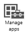
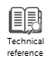

# Dokumentation zu Microsoft Intune &lt;2&gt;

## Starten mit der kostenlosen Testversion
Verwenden Sie die Anleitung [Starten mit einer 30-Tage-Testversion](https://technet.microsoft.com/library/dn646967.aspx%20), um Ihre Testversion von Intune schnell einzurichten. Mit der kostenlosen Testversion können Sie bis zu 100 Benutzerlizenzen testen und von kostenlosem Support profitieren.

> [!NOTE]
> Wenn Sie ein neues Konto registrieren, können Sie später zum Verwalten dieses Kontos kein vorhandenes Geschäfts- oder Schulkonto verwenden und es auch nicht mehr mit vorhandenen Volumenlizenzverträgen kombinieren.

[Registrieren Sie daher nur in den folgenden Fällen ein neues Konto](https://account.manage.microsoft.com/Signup/MainSignUp.aspx?OfferId=40BE278A-DFD1-470a-9EF7-9F2596EA7FF9&ali=1):

-   Ihre Organisation verfügt noch nicht über ein Enterprise Agreement, einen Microsoft-Volumenlizenzvertrag oder ein Office 365-Abonnement.

    ODER

-   Sie löschen das kostenlose Testkonto nach dem Evaluieren von Intune. Dies ist die empfohlene Option, wenn Sie planen, Intune mit System Center 2012 Configuration Manager zu verwenden.

## Starten mit dem kostenpflichtigen Abonnement
Wenn Sie über ein Geschäfts- oder Schulkonto mit einem Enterprise Agreement oder einem entsprechenden Volumenlizenzvertrag bzw. Office 365-Abonnement verfügen, [melden Sie sich mit Ihrem Geschäfts- oder Schulkonto an](https://manage.microsoft.com/). Verwenden Sie dann das Einrichtungshandbuch zum [Starten mit einem kostenpflichtigen Abonnement](https://technet.microsoft.com/library/dn646983.aspx), um schnell eine kleine Bereitstellung einzurichten, mit der Sie Szenarien der Geräteverwaltung testen können.

> [!NOTE]
> Wenn Sie Intune mit einem vorhandenen Konto einrichten, empfiehlt sich die Lektüre des Artikels [Einführung in Intune](https://technet.microsoft.com/library/dn646960.aspx).

## Informationen über Intune für Mitarbeiter
Wir haben [eine Liste verschiedener Themen](https://technet.microsoft.com/library/dn948527(TechNet.10).aspx) zusammengestellt, die Sie dabei unterstützen, Fragen Ihrer Endbenutzer zu beantworten und Probleme mit Endbenutzergeräten zu beheben, die über Intune verwaltet werden. Sie können auch das anpassbare [Registrierungshandbuch für Endbenutzer](http://aka.ms/bm3ml2) herunterladen und an Ihre Mitarbeiter weitergeben.

## Neuerungen
Der Intune-Dienst wird regelmäßig aktualisiert, und wichtige Änderungen werden im Thema [Neuheiten](https://technet.microsoft.com/library/dn292747.aspx) dokumentiert, auf das Sie ebenfalls über das Intune-Dashboard zugreifen können.

## Abrufen von Hilfe zu Intune
Zu jedem Microsoft Intune-Abonnement bietet der Microsoft-Support Unterstützung bei allgemeinen technischen Fragen, bei der Vertriebsvorbereitung sowie bei Fragen zu Rechnungen und Abonnements.[Der Support ist sowohl für kostenpflichtige Abonnements als auch für Testabonnements online und telefonisch verfügbar](https://technet.microsoft.com/library/dn646963.aspx).

Wenn Ihr Unternehmen über mehr als 150 Intune-Lizenzen verfügt und Sie Hilfe bei der Intune-Bereitstellung wünschen, sollten Sie sich für das [Intune-Onboardingangebot](https://technet.microsoft.com/library/mt228265.aspx) registrieren.

## Siehe auch
[Dokumentation zu Microsoft Intune](../Topic/Documentation_for_Microsoft_Intune.md)

