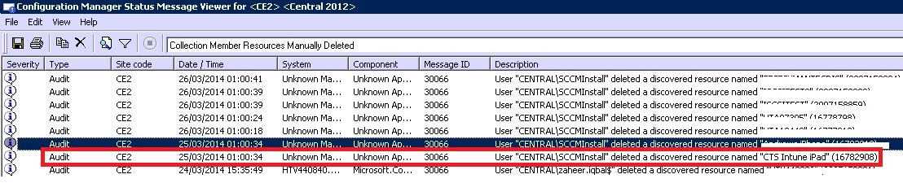

# Behandlung von Problemen bei der Ger&#228;teregistrierung bei Intune

## Probleme bei der Geräteregistrierung
Hier werden einige Geräteregistrierungsprobleme sowie Informationen zu ihrer Problembehandlung und Lösung angeführt.

> [!NOTE]
> Ihr Benutzer verwalteter Geräte können Registrierungsprotokolle erfassen, die Sie überprüfen können. Anleitungen zur Erfassung der Protokolle finden Sie unter [Fix issues with mobile device enrollment](../Topic/Fix_issues_with_mobile_device_enrollment.md)

### Gerätekapazität erreicht
**Problem:** Sie erhalten während der Registrierung eine Fehlermeldung auf Ihrem Gerät, z. B. einen Fehler **Company Portal vorübergehend nicht verfügbar** auf einem iOS-Gerät, und das „DMPdownloader.log“ auf Configuration Manager enthält den Fehler **DeviceCapReached**.

**Lösung:** Beabsichtigt. Benutzer können nicht mehr als 5 Geräte registrieren.

##### Überprüfen Sie die Anzahl der registrierten und zulässigen Geräte.

1.  Überprüfen Sie im Intune-Verwaltungsportal, dass dem Benutzer nicht mehr als 5 Geräte zugewiesen sind.

2.  Überprüfen Sie im Intune-Verwaltungsportal unter „Admin\Mobile Device Management\Enrollment Rules“, dass der Grenzwert für die Geräteregistrierung auf 5 festgelegt ist.

Benutzer von mobilen Geräten können Geräte unter folgender URL löschen: [https://byodtestservice.azurewebsites.net/](https://byodtestservice.azurewebsites.net/).

Administratoren können Geräte im Azure Active Directory-Portal löschen:

##### So löschen Sie Geräte im Azure Active Directory-Portal

1.  Navigieren Sie zu [http://aka.ms/accessaad](http://aka.ms/accessaad), oder klicken Sie unter [https://portal.office.com](https://portal.office.com) auf **Admin** &gt; **Azure AD**.

2.  Melden Sie sich mit Ihrer Organisations-ID über den Link im linken Bereich der Seite an.

3.  Erstellen Sie ein Azure-Abonnement, wenn Sie noch keins besitzen. Hierzu sollte keine Kreditkarte oder Zahlung erforderlich sein, wenn Sie ein gebührenpflichtiges Konto besitzen (klicken Sie auf den Abonnementlink **Ihr kostenloses Azure Active Directory registrieren**).

4.  Wählen Sie zuerst **Active Directory** und dann Ihre Organisation aus.

5.  Wählen Sie die Registerkarte **Benutzer** aus.

6.  Wählen Sie den Benutzer aus, dessen Geräte Sie löschen möchten.

7.  Klicken Sie auf **Geräte**.

8.  Entfernen Sie Geräte nach Bedarf, z. B. solche, die nicht mehr verwendet werden oder fehlerhafte Definitionen haben.

> [!NOTE]
> Sie können das Erreichen der Kapazitätsgrenze für Geräteregistrierungen vermeiden, indem Sie Geräteregistrierungs-Manager verwenden, wie unter [Registrieren von firmeneigenen Geräten mit dem Geräteregistrierungs-Manager in Microsoft Intune](../Topic/Enroll_corporate-owned_devices_with_the_Device_Enrollment_Manager_in_Microsoft_Intune.md) beschrieben.
> 
> Ein Benutzerkonto das der Gruppe „Geräteregistrierungs-Manager“ hinzugefügt wird, kann die Registrierung nicht abschließen, wenn die bedingte Zugriffsrichtlinie für diese spezielle Benutzeranmeldung erzwungen wird.

### Fehler bei der Profilinstallation
**Problem:** Sie erhalten eine **Fehler bei der Profilinstallation**-Fehlermeldung auf einem iOS- oder Android-Gerät.

##### Schritte zur Problembehandlung bei fehlgeschlagener Profilinstallation

1.  Vergewissern Sie sich, dass dem Benutzer eine geeignete Lizenz für die Version des von Ihnen verwendeten Intune-Diensts zugewiesen wurde.

2.  Stellen Sie sicher, dass das Gerät nicht bereits bei einem anderen MDM-Anbieter registriert ist oder dass nicht bereits ein Verwaltungsprofil darauf installiert ist.

3.  Wechseln Sie für ein iOS-Gerät zu [https://portal.manage.microsoft.com](https://portal.manage.microsoft.com), und versuchen Sie, das Profil zu installieren, wenn Sie dazu aufgefordert werden.

4.  Vergewissern Sie sich, dass Safari für iOS und Chrome für Android der Standardbrowser ist und dass Cookies aktiviert sind.

### Unternehmensportal vorübergehend nicht verfügbar
**Problem:** Sie erhalten eine **Unternehmensportal vorübergehend nicht verfügbar**-Fehlermeldung auf dem Gerät.

##### Behandlung des Fehlers „Unternehmensportal vorübergehend nicht verfügbar“

1.  Entfernen Sie die Intune-Unternehmensportal-App von dem Gerät.

2.  Öffnen Sie auf dem Gerät den Browser, navigieren Sie zu [https://portal.manage.microsoft.com](https://portal.manage.microsoft.com), und versuchen Sie eine Benutzeranmeldung.

3.  Wenn sich der Benutzer nicht anmelden kann, lassen Sie ihn ein anderes Netzwerk ausprobieren.

4.  Wenn auch dies fehlschlägt, überprüfen Sie, ob die Anmeldeinformationen des Benutzers korrekt mit Azure Active Directory synchronisiert wurden.

5.  Wenn sich der Benutzer erfolgreich angemeldet hat, werden Sie auf einem iOS-Gerät aufgefordert, die Intune-Unternehmensportal-App zu installieren und sich zu registrieren. Auf einem Android-Geräten müssen Sie die Intune-Unternehmensportal-App manuell installieren, wonach Sie die Registrierung erneut versuchen können.

### MDM-Autorität nicht definiert
**Problem:** Sie erhalten eine **MDM-Autorität nicht definiert**-Fehlermeldung.

##### Behandlung des Fehlers  „MDM-Autorität nicht definiert“

1.  Stellen Sie sicher, dass die MDM-Autorität entsprechend der Version des von Ihnen verwendeten Intune-Diensts festgelegt wurde, d. h. für Intune Office 365 MDM oder System Center Configuration Manager mit Intune. Für [!INCLUDE[wit_nextref](../Token/wit_nextref_md.md)] wird die MDM-Autorität in **Administrator** &gt; **Verwaltung mobiler Geräte** festgelegt. Für [!INCLUDE[cmshort](../Token/cmshort_md.md)] mit [!INCLUDE[wit_nextref](../Token/wit_nextref_md.md)] legen Sie sie fest, wenn Sie den [!INCLUDE[wit_nextref](../Token/wit_nextref_md.md)]-Connector konfigurieren, und in Office 365 ist es eine Einstellung **Mobilgeräte**.

    > [!NOTE]
    > Nachdem Sie die MDM-Autorität festgelegt haben, können Sie sie nur ändern, indem Sie sich an den Support wenden, wie unter [Anfordern von Support für Microsoft Intune](../Topic/How_to_get_support_for_Microsoft_Intune.md) beschrieben.

2.  Stellen Sie sicher, dass die Anmeldeinformationen des Benutzers korrekt mit Azure Active Directory synchronisiert wurden, indem Sie überprüfen, ob der UPN mit den Active Directory-Informationen im Kontoportal übereinstimmt. Wenn der UPN nicht mit den Active Directory-Informationen übereinstimmt:

    1.  Deaktivieren Sie DirSync auf dem lokalen Server.

    2.  Löschen Sie den nicht übereinstimmenden Benutzer aus der Benutzerliste **Intune-Kontoportal**.

    3.  Warten Sie etwa eine Stunde, damit der Azure-Dienst die fehlerhaften Daten entfernen kann.

    4.  Aktivieren Sie DirSync erneut, und überprüfen Sie, ob der Benutzer jetzt ordnungsgemäß synchronisiert ist.

3.  In einem Szenario, in dem Sie System Center Configuration Manager mit Intune verwenden, stellen Sie sicher, dass der Benutzer eine gültige Cloudbenutzer-ID besitzt:

    1.  Öffnen Sie SQL Management Studio.

    2.  Stellen Sie eine Verbindung mit der geeigneten Datenbank her.

    3.  Öffnen Sie den Datenbankenordner, und suchen und öffnen Sie den Ordner **CM_DBName** Ordner, wobei „DBName“ der Name der Kundendatenbank ist.

    4.  Klicken Sie im oberen Bereich auf „Neue Abfrage“, und führen Sie die folgenden Abfragen aus:

        -   Zum Anzeigen aller Benutzer: `select * from [CM_ DBName].[dbo].[User_DISC]`

        -   Zum Anzeigen bestimmter Benutzer verwenden Sie die folgende Abfrage, wobei „%testuser1%“ für „Benutzername@domain.com“ des Benutzers steht, den Sie nachschlagen möchten: `select * from [CM_ DBName].[dbo].[User_DISC] where User_Principal_Name0 like '%testuser1%'`

        Klicken Sie nach dem Schreiben der Abfrage auf **!Ausführen**. Nachdem die Ergebnisse zurückgegeben wurden, suchen Sie nach der Cloudbenutzer-ID.  Wenn Sie keine ID finden, ist der Benutzer nicht für die Verwendung von Intune lizenziert.

### Mobile Geräte verschwinden bei der Verwendung von System Center Configuration Manager mit Intune
**Problem:** Nach der erfolgreichen Registrierung eines mobilen Geräts bei Configuration Manager verschwindet es aus der Auflistung der Mobilgeräte, aber das Gerät besitzt weiterhin das Verwaltungsprofil und wird im CSS-Gateway aufgeführt.

**Lösung:** Dies kann auftreten, weil Sie einen benutzerdefinierten Prozess haben, der Geräte, die keiner Domäne angehören, entfernt oder weil der Benutzer das Gerät aus dem Abonnement entfernt hat. Um zu verifizieren und überprüfen, welcher Prozess oder welches Benutzerkonto das Gerät aus der Configuration Manager-Konsole entfernt hat, führen Sie die folgenden Schritte aus:

##### Überprüfen, wie das Gerät entfernt wurde

1.  Wählen Sie in der Configuration Manager-Verwaltungskonsole **Überwachung** &gt; **Systemstatus** &gt; **Statusmeldungsabfragen** aus.

2.  Klicken Sie mit der rechten Maustaste auf **Manuell gelöschte Auflistungselementressourcen** und wählen Sie **Meldungen anzeigen**.

3.  Wählen Sie eine geeignete Datum/Uhrzeit-Kombination innerhalb der letzten 12 Stunden aus.

4.  Suchen Sie das fragliche Gerät, und überprüfen Sie, wie das Gerät entfernt wurde. Das folgende Beispiel zeigt, dass das Konto „SCCMInstall“ das Gerät über eine unbekannte Anwendung gelöscht hat.

    

5.  Überprüfen Sie, ob der Configuration Manager keine geplante Aufgabe, ein geplantes Skript oder einen anderen geplanten Prozess hat, der eventuell keiner Domäne beigetretene, mobile oder verwandte Geräte automatisch löscht.

