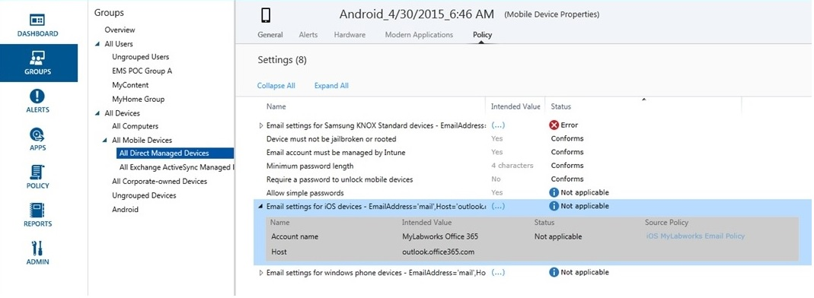

# Behandlung von Problemen mit Richtlinien in Microsoft Intune

## Probleme mit Richtlinien
Sie finden hier einige Probleme aufgelistet, die aus Ihrer [!INCLUDE[wit_firstref](../Token/wit_firstref_md.md)]-Richtlinienkonfiguration entstehen können, sowie Empfehlungen zur Behandlung dieser Probleme.

### Ist die Richtlinie auf das Gerät angewendet?
**Problem:** Es ist nicht klar, ob eine bestimmte Richtlinie auf ein Gerät angewendet ist, oder ein Gerät verhält sich entgegen einer Richtlinie.

Überprüfen Sie die Richtlinieninformationen, die für jedes Gerät verfügbar sind, um zu verstehen, wie sich eine Richtlinie auf ein bestimmtes Gerät auswirkt.

In der Intune-Verwaltungskonsole verfügt jedes Gerät unter **Geräteeigenschaften** über eine Registerkarte „Richtlinie“. Wenn nicht, befindet sich das Gerät eventuell noch im Registrierungsprozess, oder es sind keine Richtlinien darauf angewendet. Jede Richtlinie verfügt über einen **beabsichtigten Wert** und einen **Status**. Den beabsichtigten Wert möchten Sie durch Zuweisen der Richtlinie erzielen. Der Status gibt an, was tatsächlich erreicht wird, wenn alle für das Gerät geltenden Richtlinien sowie die Einschränkungen und Anforderungen der Hardware und des Betriebssystems zusammen betrachtet werden. Mögliche Status sind:

-   **Konform**: Das Gerät hat die Richtlinie empfangen und meldet dem Dienst, dass es der Einstellung entspricht.

-   **Nicht zutreffend**: Die Richtlinieneinstellung ist nicht zutreffend. Beispielsweise wären E-Mail-Einstellungen für iOS-Geräte nicht auf ein Android-Gerät anwendbar.

-   **Ausstehend**: Die Richtlinie wurde an das Gerät gesendet, hat aber noch keinen Status an den Dienst gemeldet. Beispielsweise Verschlüsselung unter Android, die erfordert, dass der Endbenutzer die Verschlüsselung aktiviert, weshalb diese ausstehend sein kann.

Der folgende Screenshot zeigt zwei eindeutige Beispiele:

-   **Einfache Kennwörter zulassen** ist auf **Ja** gesetzt, wie in der Spalte **Beabsichtigter Wert** gezeigt, der **Status** ist jedoch **Nicht zutreffend**. Dies liegt daran, dass einfache Kennwörter für Android-Geräte nicht unterstützt werden.

-   Ebenso gilt das erweiterte Richtlinienelement **E-Mail-Einstellungen für iOS-Geräte** nicht für dieses Gerät, da es ein Android-Gerät ist.

> [!NOTE]
> Denken Sie daran: Wenn zwei Richtlinien mit unterschiedlichen Einschränkungsstufen für das gleiche Gerät gelten, wird in der Praxis die restriktivere Richtlinie angewendet.

### Fehler „0x87D1FDE8“ für KNOX-Gerät
**Problem**: Nach dem Erstellen und Bereitstellen eines Exchange ActiveSync-E-Mail-Profils für Samsung KNOX für verschiedene Android-Geräte melden diese den Fehler **0x87D1FDE8** oder **Fehler bei Wiederherstellung**auf der Registerkarte „Eigenschaften“ &gt; „Richtlinie“ des Geräts.

Überprüfen Sie die Konfiguration Ihres EAS-Profils für Samsung KNOX und die Quellrichtlinie. Die Samsung-Option zum Synchronisieren von Notizen wird nicht mehr unterstützt, und diese Option sollte in Ihrem Profil nicht ausgewählt werden. Achten Sie darauf, dass Geräte genug Zeit hatten, um die Richtlinie zu verarbeiten (bis zu 24 Stunden).

### Warnung: Fehler beim Speichern von Zugriffsregeln in Exchange
**Problem**: Sie erhalten die Warnung **Fehler beim Speichern von Zugriffsregeln in Exchange** in der Verwaltungskonsole.

Wenn Sie Richtlinien im Exchange-Arbeitsbereich „Lokale Richtlinie“ in der Verwaltungskonsole erstellt haben, aber Office 365 verwenden, werden die konfigurierten Richtlinieneinstellungen von Intune nicht erzwungen. Beachten Sie die Richtlinienquelle in der Warnung.  Löschen Sie im Exchange-Arbeitsbereich „Lokale Richtlinie“ die Legacyregeln, weil diese in Intune globale Exchange-Regeln für lokales Exchange und für Office 365 nicht relevant sind. Erstellen Sie dann eine neue Richtlinie für Office 365.

## Sicherheitsrichtlinie für verschiedene MDM-Geräte kann nicht geändert werden
Windows Phone- und Windows RT-Geräte gestatten keine Verringerung der Sicherheitsstufe in Sicherheitsrichtlinien, die mittels MDM oder EAS festgelegt wurden, nachdem diese festgelegt wurden. Angenommen, Sie legen ein **Kennwort mit Mindestanzahl von Zeichen** auf 8 fest und versuchen dann, diesen Wert auf 4 zu verringern. Die restriktivere Richtlinie wurde bereits auf das Gerät angewendet.

Abhängig von der Geräteplattform müssen Sie, wenn Sie die Richtlinie auf einen niedrigeren Sicherheitswert ändern möchten, Sicherheitsrichtlinien möglicherweise zurücksetzen. In Windows RT wischen Sie beispielsweise auf dem Desktop von rechts nach innen, um die Leiste **Charms** zu öffnen, und klicken Sie auf **Einstellungen** &gt; **Systemsteuerung**.  Wählen Sie das Applet **Benutzerkonten** aus. Im linken Navigationsmenü befindet sich unten ein Link **Sicherheitsrichtlinien zurücksetzen**. Klicken Sie darauf, und klicken Sie dann auf die Schaltfläche **Richtlinien zurücksetzen**. Andere MDM-Geräte, wie Android, Windows Phone 8.1 und höher sowie iOS, müssen möglicherweise außer Kraft gesetzt und bei dem Dienst neu registriert werden, damit Sie eine weniger restriktive Richtlinie anwenden können.

## Android-Geräte erzwingen keine Änderungen von Sicherheitsrichtlinien ohne die Genehmigung durch den Endbenutzer
Android-MDM gestattet dem Dienst nicht das Erzwingen von Änderungen an der anfänglichen Richtlinie auf Geräten, wie es andere Plattformen zulassen. Dies liegt an der Funktionalität von Android und steht in keinem Zusammenhang mit dem Intune-Dienst. Android-Geräte fordern den Endbenutzer über das Benachrichtigungsfenster der zugehörigen Richtlinienänderung auf (z. B. Kennwort, Verschlüsselung usw.).  Der Endbenutzer muss auf die Aufforderung reagieren, und nachdem er bestätigt hat, sollte die Richtlinie angewendet werden.

## Siehe auch
[Behandlung von Problemen bei Softwareupdates in Microsoft Intune](../Topic/Troubleshoot_software_updates_in_Microsoft_Intune.md)

