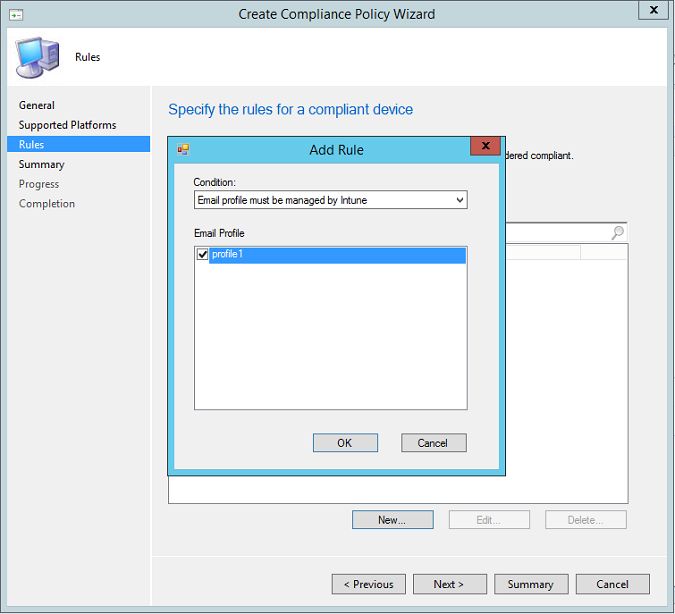
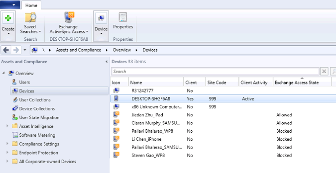
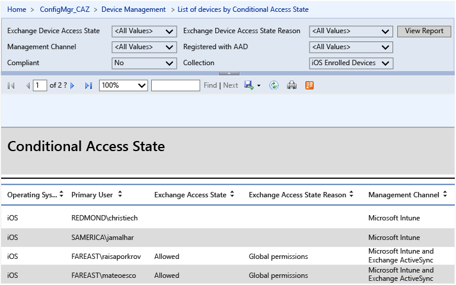

# Verwenden des bedingten Zugriffs zwischen Intune und Configuration Manager
Bei dieser Lösung verwenden Sie bereits System Center Configuration Manager und Microsoft Exchange Server in Ihrem Unternehmen, um den Zugriff auf E-Mail zu verwalten – mit einer lokalen Implementierung, mit Exchange Online, mit einer Hybridimplementierung oder beidem. Diese Lösung kombiniert die vorhandene Configuration Manager-Umgebung mit Intune, um den E-Mail-Zugriff auf allen Geräten, ungeachtet des Standorts, auf sichere Weise zu verwalten.

> [!TIP]
> Eine herunterladbare Kopie dieses Artikels finden Sie in der [TechNet Gallery](https://gallery.technet.microsoft.com/Deploying-Enterprise-16499404).

## Exchange Server lokal
Wenn Sie bereits System Center Configuration Manager und Exchange in Ihrer lokalen Infrastruktur verwenden, können Sie Intune integrieren, um auf mobilen Geräten den Zugriff auf E-Mails zu verwalten und E-Mail-Daten zu schützen. Diese Lösung wird mit den folgenden allgemeinen Schritten implementiert:

-   Sie konfigurieren On-Premises Intune Exchange Connector über die Configuration Manager-Konsole, wodurch Configuration Manager mit dem Exchange-Server kommunizieren kann, der als Host für die Postfächer der mobilen Geräte dient.

-   Sie führen eine vollständige Synchronisierung des Exchange Server-Connectors durch, um die Benutzer zu finden und um alle Exchange ActiveSync-IDs (EASIDs) von mobilen Geräten zu inventarisieren, die die Verbindung zum lokalen Exchange-Server herstellen.

-   Sie erstellen Benutzersammlungen für Benutzergruppen, die entweder Ziel der bedingten Zugriffsrichtlinie sind oder hiervon ausgenommen werden. Anschließend erstellen Sie die Kompatibilitätsrichtlinien, die die Regeln und Einstellungen definieren , die ein Gerät erfüllen muss, damit es als mit bedingten Zugriffsrichtlinien kompatibel eingestuft wird.

-   Sie beginnen mit der Durchsetzung von des bedingten Zugriffs.

### Ablaufsteuerung beim bedingten Zugriff für Exchange Server lokal
Dieses Diagramm zeigt die Ablaufsteuerung für Clients, die versuchen, auf E-Mails in Exchange lokal zuzugreifen.

-   Microsoft Intune: Verwaltet die Kompatibilität und die Richtlinien für den bedingten Zugriff für das Gerät

-   Microsoft Azure Active Directory: Authentifiziert Benutzer und übermittelt den Kompatibilitätsstatus des Geräts

-   Configuration Manager: Verwaltet die Geräteregistrierung und sorgt für die Berichterstellung

-   Exchange lokal: Erzwingt den Zugriff auf E-Mails basierend auf dem Gerätestatus

### Voraussetzungen
Bevor Sie fortfahren, sollten Sie sich vergewissern, dass Ihre Umgebung die Voraussetzungen für die Implementierung der Lösung erfüllt.

> [!NOTE]
> Wenn Sie Configuration Manager bereits über Intune für die Verwaltung mobiler Geräte konfiguriert haben, fahren Sie mit den [Bereitstellungsschritte](#DeploySteps) fort.

-   Stellen Sie sicher, dass die [Hardwareanforderungen für On-Premises Connector](https://technet.microsoft.com/en-us/library/dn646950.aspx#BKMK_ExchanceConnectorReqs) erfüllt sind

-   Vergewissern Sie sich, dass System Center 2012 R2 Configuration Manager SP1 mit dem kumulativen Update 1 oder höher ausgeführt wird.

-   Stellen Sie sicher, dass der [Exchange Web Services-Endpunkt (EWS)](https://technet.microsoft.com/library/hh529912(v=exchg.150).aspx) ordnungsgemäß für Discovery konfiguriert ist. Wenden Sie sich im Bedarfsfall an Ihr Configuration Manager-Supportteam, und fragen Sie nach einem Tool, das Ihnen bei der Erkennung von EWS-Verbindungsproblemen helfen kann. Mit EWS können Entwickler über das standardmäßige HTTP mit Exchange-Postfächern und -Inhalten interagieren.

-   Installieren Sie die Exchange-Dienste, und weisen Sie ein [gültiges digitales Zertifikat](https://technet.microsoft.com/library/dd351044(v=exchg.150).aspx) von einer vertrauenswürdigen öffentlichen Zertifizierungsstelle zu.

-   Konfigurieren Sie ein Konto (als lokaler oder Domänenadministrator) mit den Berechtigungen zum Ausführen der folgenden Exchange Server-Cmdlets:

    **Clear-ActiveSyncDevice**

    **Get-ActiveSyncDevice**

    **Get-ActiveSyncDeviceAccessRule**

    **Get-ActiveSyncDeviceStatistics**

    **Get-ActiveSyncMailboxPolicy**

    **Get-ActiveSyncOrganizationSettings**

    **Get-ExchangeServer**

    **Get-Recipient**

    **Set-ADServerSettings**

    **Set-ActiveSyncDeviceAccessRule**

    **Set-ActiveSyncMailboxPolicy**

    **Set-CASMailbox**

    **New-ActiveSyncDeviceAccessRule**

    **New-ActiveSyncMailboxPolicy**

    **Remove-ActiveSyncDevice**

> [!IMPORTANT]
> Wenn Sie versuchen, installieren oder Exchange Server-Connector ohne erforderliche Cmdlets zu verwenden, sehen Sie einen Fehler mit der Meldung protokolliert Invoke-Cmdlet &lt; Cmdlet &gt; Fehler in die Protokolldatei "EasDisc.log" auf dem Standortservercomputer.

### Bereitstellungsschritte
Folgen Sie diesen Schritten, um die lokale Exchange-Lösung bereitzustellen:

#### Schritt 1: Sicherstellen, dass die Intune Connector-Rolle installiert ist
Stellen Sie sicher, dass die Intune Connector-Rolle installiert ist, damit Configuration Manager mit Intune interagieren kann. Weitere Informationen finden Sie unter [Verwalten von mobilen Geräten mit Configuration Manager und Microsoft Intune](https://technet.microsoft.com/en-us/library/JJ884158.aspx).

#### Schritt 2: Installieren und Konfigurieren eines Exchange Server-Connectors
Von Configuration Manager wird nur jeweils ein Connector in einer Exchange-Organisation unterstützt.

> [!IMPORTANT]
> Vergewissern Sie sich vor der Installation des Exchange Server-Connectors, dass die von Ihnen verwendete Microsoft Exchange-Version von Configuration Manager unterstützt wird. Weitere Informationen finden Sie unter [Vom Configuration Manager unterstützte Konfigurationen](https://technet.microsoft.com/en-us/library/gg682077.aspx).

Folgen Sie den Schritten unter [Verwalten von mobilen Geräten mit Configuration Manager und Exchange](https://technet.microsoft.com/en-us/library/gg682001.aspx) zum Installieren und Konfigurieren des Exchange Server-Connectors.

#### Schritt 3: Ausführen einer vollständigen Synchronisierung zum Ermitteln von Benutzern

1.  Klicken Sie in der Configuration Manager-Konsole auf **Verwaltung**, erweitern Sie **Hierarchiekonfiguration**, und wählen Sie dann **Exchange Server-Connector** aus.

2.  Wählen Sie den Exchange Server-Connector aus, den Sie in Schritt 2 installiert haben.

3.  Klicken Sie auf **Jetzt synchronisieren**.

    

Die vollständige Synchronisierung kann je nach Anzahl der Geräte mehrere Stunden in Anspruch nehmen. Eine vollständige Synchronisierung wird standardmäßig alle 24 Stunden ausgeführt. Bei einer Delta-Synchronisierung werden alle Geräteverbindungen seit der vorherigen vollständigen Synchronisierung ermittelt. Sie erfolgt in dem Intervall, das Sie bei der Installation des Exchange Server-Connectors festgelegt haben. Damit wird sichergestellt, dass neue Benutzer und neue Exchange-Benutzer schnell ermittelt werden, sodass die Richtlinie für den bedingten Zugriff angewendet werden kann.

Verwenden Sie das Configuration Manager Trace Log-Tool, und öffnen Sie die Datei "EasDisc.log" (die sich im Ordner **Microsoft Configuration Manager/Logs** befindet, dem Pfad, in dem auch Configuration Manager installiert ist), um sich zu vergewissern, dass der Connector ausgeführt wird und Geräteverbindungen abfragt. Nach Abschluss der vollständigen Synchronisierung werden die Exchange ActiveSync-IDs (EASIDs) aller mobilen Geräte inventarisiert, die die Verbindung zum lokalen Exchange herstellen.

#### Schritt 4: Erstellen von Benutzersammlungen
Legen Sie die Intune-Benutzergruppen fest, für die die Richtlinie für den bedingten Zugriff vorgesehen ist. Anschließend erstellen Sie Benutzersammlungen für Benutzergruppen, die entweder Ziel der bedingten Zugriffsrichtlinie sind oder hiervon ausgenommen werden. Diese Gruppen geben Sie später an, wenn Sie den bedingten Zugriff erzwingen.

Folgen Sie den Schritten unter [Erstellen von Sammlungen in Configuration Manager](https://technet.microsoft.com/en-us/library/gg712295.aspx) zum Erstellen von Benutzersammlungen.

#### Schritt 5: Erstellen von Kompatibilitätsrichtlinien und Bereitstellung für die Benutzer
Konformitätsrichtlinien definieren die Regeln und Einstellungen, die ein Gerät erfüllen muss, damit es als mit bedingten Zugriffsrichtlinien konform eingestuft wird. Folgen Sie den Schritten unter [Kompatibilitätsrichtlinien in Configuration Manager](https://technet.microsoft.com/en-us/library/mt131417.aspx), um Kompatibilitätsrichtlinien zu erstellen.

> [!NOTE]
> Wenn Sie über die Möglichkeit verfügen möchten, alle Unternehmens-E-Mails von einem iOS-Gerät zu entfernen, wenn der Besitzer aus dem Unternehmen ausgeschieden ist, müssen Sie ein E-Mail-Profil erstellen und bereitstellen und dann die Kompatibilitätsrichtlinie festlegen, die angibt, dass E-Mail-Profile von Intune verwaltet werden. Sie müssen das E-Mail-Profil für die gleiche Benutzergruppe bereitstellen, die auch das Ziel dieser Kompatibilitätsrichtlinie ist.
> 
> 
> 
> Wenn Sie diese Kompatibilitätsrichtlinie festlegen, muss ein Benutzer, der sein E-Mail-Konto bereits eingerichtet hat, dieses manuell entfernen. Es wird dann von Intune über den unter [Endbenutzererfahrung bei bedingtem Zugriff](../Topic/End-user_experience_of_conditional_access.md) beschriebenen Registrierungsprozess wieder hinzugefügt.

Nachdem Sie die Kompatibilitätsrichtlinie erstellt haben, wählen Sie in der Liste einen Namen für die Kompatibilitätsrichtlinie aus, und klicken dann auf **Bereitstellen**.

#### Schritt 6: Konfigurieren der Richtlinie für bedingten Zugriff
Entscheiden Sie zuerst, wie und wann Sie die Richtlinie für den bedingten Zugriff erzwingen möchten und welche Mitarbeiter davon betroffen sein sollen. Folgen Sie anschließend den Schritten unter [Bedingter Zugriff für Exchange-E-Mail in Configuration Manager](https://technet.microsoft.com/en-us/library/mt131421.aspx), um die Richtlinie für den bedingten Zugriff für Exchange lokal zu konfigurieren.

#### Schritt 7: Überwachen der Bereitstellungen und Erzwingen des bedingten Zugriffs
Wenn in Intune bereits eine große Anzahl von Benutzern mit kompatiblen Geräten registriert ist, können Sie mit der Erzwingung der Richtlinie für den bedingten Zugriff beginnen, indem Sie sie für etwa 500 Benutzer pro Tag bereitstellen. Bei 70.000 Benutzer dauert dies vier bis fünf Monate, in deren Verlauf Sie alle ggf. auftretenden Probleme lösen können, ohne dass Sie den E-Mail-Zugriff für zu viele Benutzer gleichzeitig einschränken.

Wenn nicht so viele Benutzer bereits in Intune registriert sind, sorgt die Richtlinie für den bedingten Zugriff für eine benutzerfreundliche und von Anweisungen begleitete Bereitstellung wie in [Endbenutzererfahrung bei bedingtem Zugriff](../Topic/End-user_experience_of_conditional_access.md) beschrieben.

### Überprüfungsschritte
Verwenden Sie das Configuration Manager Trace Log-Tool, und öffnen Sie die Datei "EasDisc.log" (die sich im Ordner "Microsoft Configuration Manager/Logs" befindet, dem Pfad, in dem auch Configuration Manager installiert ist). Suchen Sie nach der Protokolldatei für "Exchange Connector", um Informationen darüber zu erhalten, ob der Exchange-Connector ausgeführt wird und wie viele Geräte verbunden sind.

Das Configuration Manager Trace Log-Tool befindet sich im [System Center 2012 R2 Configuration Manager-Toolkit](http://www.microsoft.com/en-us/download/details.aspx?id=36213).

### Berichterstellung
Sie können in der Configuration Manager-Konsole spezifische Informationen zu Geräten anzeigen, die vom Exchange-Connector ermittelt wurden. Bei Geräten, auf denen der bedingte Zugriff erzwungen wurde, können Sie den aktuellen Status eines jeden Geräts, den letzten Zeitpunkt, zu dem das Gerät mit dem Exchange-Server verbunden war usw. anzeigen.

Klicken Sie in der Configuration Manager-Konsole auf **Bestand und Kompatibilität** und dann auf **Geräte**. Sie können den aktuellen Status eines jeden Geräts ("Blockiert" oder "Zugelassen") der Spalte **Exchange-Zugriffsstatus** entnehmen. Wenn diese Spalte noch nicht angezeigt wird, fügen Sie sie hinzu, indem Sie mit der rechten Maustaste in den Bereich mit den Spaltenüberschriften klicken. Sie können auch den Zeitpunkt der letzten erfolgreichen Synchronisierung eines jeden Geräts wie von Exchange zurückgemeldet anzeigen, indem Sie die Spalte **Zeit der letzten erfolgreichen Synchronisierung mit Exchange Server** hinzufügen.

Wenn Sie SSRS (SQL Server Reporting Services) ausführen, können Sie einen Bericht zum bedingten Zugriff anzeigen, in dem der Konformitätsstatus der Geräte und der EAS-Zugriffsstatus angegeben ist und der zeigt, ob ein Exchange-Connector installiert ist und ausgeführt wird. Hierin finden Sie darüber hinaus auch Informationen zur Active Directory-Registrierung, zur EAS-Aktivierung und zum Besitzer des Geräts.

Zum Anzeigen von SSRS-Berichten muss auf dem primären Server eine Berichterstellungsrolle installiert sein:

1.  Klicken Sie in Configuration Manager auf **Verwaltung**, klicken Sie auf **Hierarchiekonfiguration**, klicken Sie auf **Websitekonfiguration**, und klicken Sie dann auf **Server- und Standortsystemrollen**.

2.  Wählen Sie einen Server aus, und klicken Sie auf **Standortsystemrolle hinzufügen**, um den Assistenten für Standortsystemrollen zu öffnen.

3.  Aktivieren Sie auf der Seite "Systemrollenauswahl" das Kontrollkästchen **Reporting Services-Punkt**. Der Reporting Services-Punkt zeigt Berichte im Zusammenhang mit der Clientverwaltung an.

4.  Klicken Sie auf **Weiter**.

Im Folgenden wird der Bereitstellungsstatus der Konfigurationsrichtlinie angezeigt:

#### Wartezeit
Ein Gerät wird blockiert, sobald es vom Exchange-Connector ermittelt wurde. Die Wartezeit der Blockierung ist von den für "Vollständige Synchronisierung" und "Delta-Synchronisierung" festgelegten Zeitintervallen sowie der Zeit zwischen diesen Intervallen abhängig, in der das Gerät die Verbindung zum Exchange-Server herstellt. Standardmäßig erfolgen eine vollständige Synchronisierung alle 24 Stunden und eine Delta-Synchronisierung alle 240 Minuten. Während dieser Wartezeit kann ein Gerät als kompatibel angesehen werden.

## Exchange Online
Wenn Sie bereits System Center Configuration Manager und Exchange Online verwenden, können Sie Intune integrieren, um auf mobilen Geräten den Zugriff auf E-Mails zu verwalten und E-Mail-Daten zu schützen. Diese Lösung wird mit den folgenden allgemeinen Schritten implementiert:

-   Erstellen Sie die Kompatibilitätsrichtlinien, die die Regeln und Einstellungen definieren , die ein Gerät erfüllen muss, damit es als mit bedingten Zugriffsrichtlinien kompatibel eingestuft wird.

-   Sie beginnen mit der Durchsetzung von des bedingten Zugriffs.

-   Konfigurieren Sie optional den Exchange-Connector für Exchange Online. Dieser Connector wird nur für Berichtserstellungszwecke benötigt. Es ist nicht erforderlich, den bedingten Zugriff zu aktivieren.

### Ablauf beim bedingten Zugriff für Exchange Online
Dieses Diagramm zeigt die Ablaufsteuerung für Clients, die versuchen, auf E-Mails in Exchange Online zuzugreifen. A und B können durchgeführt werden, bevor der bedingte Zugriff erzwungen wird.

-   Microsoft Intune: Verwaltet die Kompatibilität und die Richtlinien für den bedingten Zugriff für das Gerät

-   Microsoft Azure Active Directory: Authentifiziert Benutzer und übermittelt den Kompatibilitätsstatus des Geräts

-   Configuration Manager: Verwaltet die Geräteregistrierung und sorgt für die Berichterstellung, sofern aktiviert

-   Exchange Online: Erzwingt den Zugriff auf E-Mails basierend auf dem Gerätestatus

### Voraussetzungen
Bevor Sie fortfahren, sollten Sie sich vergewissern, dass Ihre Umgebung die Voraussetzungen für die Implementierung der Lösung erfüllt.

-   Installieren Sie die Exchange-Dienste, und weisen Sie ein [gültiges digitales Zertifikat](https://technet.microsoft.com/library/dd351044(v=exchg.150).aspx) von einer vertrauenswürdigen öffentlichen Zertifizierungsstelle zu.

-   Vergewissern Sie sich, dass System Center 2012 R2 Configuration Manager SP1 mit dem kumulativen Update 1 oder höher ausgeführt wird.

-   Konfigurieren Sie ein Konto (als lokaler oder Domänenadministrator) mit den Berechtigungen zum Ausführen der folgenden Exchange Server-Cmdlets:

    **Clear-ActiveSyncDevice**

    **Get-ActiveSyncDevice**

    **Get-ActiveSyncDeviceAccessRule**

    **Get-ActiveSyncDeviceStatistics**

    **Get-ActiveSyncMailboxPolicy**

    **Get-ActiveSyncOrganizationSettings**

    **Get-ExchangeServer**

    **Get-Recipient**

    **Set-ADServerSettings**

    **Set-ActiveSyncDeviceAccessRule**

    **Set-ActiveSyncMailboxPolicy**

    **Set-CASMailbox**

    **New-ActiveSyncDeviceAccessRule**

    **New-ActiveSyncMailboxPolicy**

    **Remove-ActiveSyncDevice**

### Bereitstellungsschritte
Folgen Sie diesen Schritten, um die Exchange Online-Lösung bereitzustellen:

#### Schritt 1: Erstellen von Kompatibilitätsrichtlinien und Bereitstellung für die Benutzer
Konformitätsrichtlinien definieren die Regeln und Einstellungen, die ein Gerät erfüllen muss, damit es als mit bedingten Zugriffsrichtlinien konform eingestuft wird. Folgen Sie den Schritten unter [Kompatibilitätsrichtlinien in Configuration Manager](https://technet.microsoft.com/en-us/library/mt131417.aspx), um Kompatibilitätsrichtlinien zu erstellen.

> [!NOTE]
> Wenn Sie über die Möglichkeit verfügen möchten, alle Unternehmens-E-Mails von einem iOS-Gerät zu entfernen, wenn der Besitzer aus dem Unternehmen ausgeschieden ist, müssen Sie ein E-Mail-Profil erstellen und bereitstellen und dann die Kompatibilitätsrichtlinie festlegen, die angibt, dass E-Mail-Profile von Intune verwaltet werden. Sie müssen das E-Mail-Profil für die gleiche Benutzergruppe bereitstellen, die auch das Ziel dieser Kompatibilitätsrichtlinie ist.
> 
> 
> 
> Wenn Sie diese Kompatibilitätsrichtlinie festlegen, muss ein Benutzer, der sein E-Mail-Konto bereits eingerichtet hat, dieses manuell entfernen. Es wird dann von Intune über den unter [Endbenutzererfahrung bei bedingtem Zugriff](../Topic/End-user_experience_of_conditional_access.md) beschriebenen Registrierungsprozess wieder hinzugefügt.

Nachdem Sie die Kompatibilitätsrichtlinie erstellt haben, wählen Sie in der Liste einen Namen für die Kompatibilitätsrichtlinie aus, und klicken dann auf **Bereitstellen**.

#### Schritt 2: Konfigurieren der Richtlinie für bedingten Zugriff
Entscheiden Sie zuerst, wie und wann Sie die Richtlinie für den bedingten Zugriff erzwingen möchten und welche Mitarbeiter davon betroffen sein sollen. Folgen Sie anschließend den Schritten unter [Bedingter Zugriff für Exchange-E-Mail in Configuration Manager](https://technet.microsoft.com/en-us/library/mt131421.aspx), um die Richtlinie für den bedingten Zugriff für Exchange Online zu aktivieren.

> [!NOTE]
> Die Richtlinie für bedingten Zugriff muss in der Intune-Konsole konfiguriert werden. Die folgenden Schritte beginnen mit dem Zugriff auf die Intune-Konsole über den Configuration Manager. Wenn Sie dazu aufgefordert werden, melden Sie sich mit denselben Anmeldeinformationen an, die zum Einrichten des Connectors zwischen Configuration Manager und Intune verwendet wurden.

#### Schritt 3: (*Optional*) Installieren und Konfigurieren eines Exchange Server-Connectors
Von Configuration Manager wird nur jeweils ein Connector in einer Exchange-Organisation unterstützt.

> [!IMPORTANT]
> Vergewissern Sie sich vor der Installation des Exchange Server-Connectors, dass die von Ihnen verwendete Microsoft Exchange-Version von Configuration Manager unterstützt wird. Weitere Informationen finden Sie unter [Vom Configuration Manager unterstützte Konfigurationen](https://technet.microsoft.com/en-us/library/gg682077.aspx).

Folgen Sie den Schritten unter [Verwalten von mobilen Geräten mit Configuration Manager und Exchange](https://technet.microsoft.com/en-us/library/gg682001.aspx) zum Installieren und Konfigurieren des Exchange Server-Connectors.

### Überprüfungsschritte
Wenn Sie für diese Lösung optional den Exchange Server-Connector konfiguriert haben, können Sie das Configuration Manager Trace Log-Tool verwenden, um die Datei "EasDisc.log" zu öffnen (die sich im Ordner "Microsoft Configuration Manager/Logs" befindet, dem Pfad, in dem auch Configuration Manager installiert ist). Suchen Sie nach der Protokolldatei für "Exchange Connector", um Informationen darüber zu erhalten, ob der Exchange-Connector ausgeführt wird und wie viele Geräte verbunden sind.

Das Configuration Manager Trace Log-Tool befindet sich im [System Center 2012 R2 Configuration Manager-Toolkit](http://www.microsoft.com/en-us/download/details.aspx?id=36213).

### Berichterstellung
Wenn Sie optional den Exchange Server-Connector konfiguriert haben, können Sie in der Configuration Manager-Konsole spezifische Informationen zu Geräten anzeigen, die vom Exchange-Connector ermittelt wurden. Bei Geräten, auf denen der bedingte Zugriff erzwungen wurde, können Sie den aktuellen Status eines jeden Geräts, den letzten Zeitpunkt, zu dem das Gerät mit dem Exchange-Server verbunden war usw. anzeigen.

Klicken Sie in der Configuration Manager-Konsole auf **Bestand und Kompatibilität** und dann auf **Geräte**. Sie können den aktuellen Status eines jeden Geräts ("In Quarantäne" oder "Zugelassen") der Spalte **Exchange-Zugriffsstatus** entnehmen. Wenn diese Spalte noch nicht angezeigt wird, fügen Sie sie hinzu, indem Sie mit der rechten Maustaste in den Bereich mit den Spaltenüberschriften klicken. Sie können auch den Zeitpunkt der letzten erfolgreichen Synchronisierung eines jeden Geräts wie von Exchange zurückgemeldet anzeigen, indem Sie die Spalte **Zeit der letzten erfolgreichen Synchronisierung mit Exchange Server** hinzufügen.

Wenn Sie SSRS (SQL Server Reporting Services) ausführen, können Sie einen Bericht zum bedingten Zugriff anzeigen, in dem der Konformitätsstatus der Geräte und der EAS-Zugriffsstatus angegeben ist und der zeigt, ob ein Exchange-Connector installiert ist und ausgeführt wird. Hierin finden Sie darüber hinaus auch Informationen zur Active Directory-Registrierung, zur EAS-Aktivierung und zum Besitzer des Geräts.

Zum Anzeigen von SSRS-Berichten muss auf dem primären Server eine Berichterstellungsrolle installiert sein:

1.  Klicken Sie in Configuration Manager auf **Verwaltung &gt; Hierarchiekonfiguration &gt; Websitekonfiguration &gt; Server- und Standortsystemrollen**.

2.  Wählen Sie einen Server aus, und klicken Sie auf **Standortsystemrolle hinzufügen**, um den Assistenten für Standortsystemrollen zu öffnen.

3.  Aktivieren Sie auf der Seite "Systemrollenauswahl" das Kontrollkästchen **Reporting Services-Punkt**. Der Reporting Services-Punkt zeigt Berichte im Zusammenhang mit der Clientverwaltung an.

4.  Klicken Sie auf **Weiter**.

Im Folgenden wird der Bereitstellungsstatus der Konfigurationsrichtlinie angezeigt:

#### Wartezeit
Bei Geräten, die mit moderner Authentifizierung arbeiten, wird die Richtlinie für den bedingten Zugriff sofort angewendet. Bei Geräten, die die Verbindung über das EAS-Protokoll herstellen, dann es basierend auf den Standardeinstellungen zu Verzögerungen von bis zu sechs Stunden kommen, bevor die Richtlinie für den bedingten Zugriff angewendet wird. Während dieser Zeit kann ein Gerät als kompatibel angesehen werden.

## Koexistenz auf dem lokalen Exchange-Server und auf Exchange Online
In einer Umgebung, in der Exchange sowohl lokal und auch in Form von Exchange Online für die Verwaltung von E-Mail-Profilen verwendet wird, haben Unternehmen die Möglichkeit, die funktionsreiche Oberfläche und die administrative Kontrolle der vorhandenen lokalen Microsoft Exchange-Organisation auf die Cloud auszuweiten. Diese Form der Hybridbereitstellung ermöglicht die nahtlose Darstellung einer einzelnen Exchange-Organisation, die einerseits lokal auf Exchange Server 2013 und zugleich auf Exchange Online in Microsoft Office 365 gehostet wird. Darüber hinaus kann diese Art der Bereitstellung als ein Zwischenschritt für den vollständigen Umstieg auf eine Exchange Online-Organisation dienen.

Wenn Sie bereits Configuration Manager und eine Hybridbereitstellung von Exchange lokal und Exchange Online verwenden, können Sie Intune integrieren, um auf mobilen Geräten den Zugriff auf E-Mails zu verwalten und E-Mail-Daten zu schützen. Sie können diese Gesamtlösung implementieren, indem Sie den vorstehenden Schritten zur separaten Implementierung der einzelnen Lösungen folgen.

### Voraussetzungen
Zum Konfigurieren einer Hybridumgebung, in der sowohl Exchange lokal als auch Exchange Online verwendet werden, muss Ihre Exchange-Organisation bestimmte Voraussetzungen erfüllen. Werden diese Voraussetzungen nicht erfüllt, können Sie die Schritte nicht abschließen, die notwendig sind, um ein Hybridbereitstellung der lokalen Exchange-Organisation und der Exchange Online-Organisation in Microsoft Office 365 zu konfigurieren.

Informationen zu den Voraussetzungen zum Erstellen und Konfigurieren dieser Art von Umgebung finden Sie unter [Voraussetzungen für eine Hybridbereitstellung](https://technet.microsoft.com/en-us/library/hh534377.aspx).

### Bereitstellungsschritte
Folgen Sie den vorstehenden Schritten, um eine Hybridbereitstellung bestehend aus [Exchange Server lokal](#ExchangeOnPrem) und [Exchange Online](#ExchangeOnline) zu implementieren.

## Siehe auch
[Erfahren Sie, wie Sie eine Lösung für den Schutz von geschäftlichen E-Mails und Dokumenten bereitstellen.](../Topic/Learn_how_to_deploy_a_solution_for_protecting_company_email_and_documents.md)
[Endbenutzererfahrung bei bedingtem Zugriff](../Topic/End-user_experience_of_conditional_access.md)

