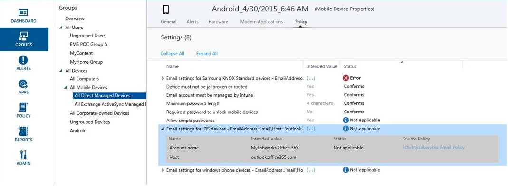

# Verwenden von Gruppen zum Verwalten von Benutzern und Ger&#228;ten in Microsoft Intune
Mit **Gruppen** erhalten Sie in [!INCLUDE[wit_firstref](../Token/wit_firstref_md.md)] maximale Flexibilität beim Verwalten Ihrer Geräte und Benutzer. Sie können die Gruppen so einrichten, wie es Ihren organisatorischen Anforderungen am besten entspricht (zum Beispiel nach geografischem Standort, nach Abteilung oder nach Hardwareeigenschaften).

Darüber hinaus können Sie Gruppen filtern, damit Ihre IT-Administratoren Operationen nur für Gruppen durchführen können, die Sie angeben. Weitere Informationen finden Sie unter [Verwenden von Ansichten für gefilterte Gruppen, um Benutzer und Geräte zu sichern und zu verwalten](../Topic/Use_groups_to_manage_users_and_devices_with_Microsoft_Intune.md#BKMK_Filter) in diesem Thema.

Zum Erstellen und Verwalten von Gruppen verwenden Sie den Arbeitsbereich **Gruppen** in der [!INCLUDE[wit_adminconsole](../Token/wit_adminconsole_md.md)]. Die Seite **Gruppenübersicht** enthält folgende Statusübersichten, mit denen Sie Probleme, die Ihre Aufmerksamkeit erfordern, schnell erkennen und priorisieren können:

-   Warnungen

-   Softwareupdates

-   [!INCLUDE[epshort](../Token/epshort_md.md)]

-   Richtlinie

-   Softwareverwaltung

Zusätzlich wird eine hierarchische Ansicht Ihrer Gruppen angezeigt, mit der Sie Statusübersichten ansehen sowie Probleme bei Mitgliedern ausgewählter Gruppen erkennen und beheben können.

In [!INCLUDE[wit_nextref](../Token/wit_nextref_md.md)] sind neun integrierte Gruppen verfügbar, die Sie weder bearbeiten noch löschen können:

-   **Allen Benutzern**

    -   **Nicht gruppierte Benutzer**

-   **Alle Geräte**

    -   **Alle Computer**

    -   **Alle mobilen Geräte**

        -   **Alle direkt verwalteten Geräte**

        -   **Alle mit Exchange ActiveSync verwalteten Geräte**

    -   **Alle firmeneigenen Geräte**

    -   **Nicht gruppierte Geräte**

## Gruppenmitgliedschaften

-   Eine Gruppe kann entweder Benutzer oder Geräte enthalten, aber nicht beides.

    -   **Gerätegruppen:** Hierbei sind sowohl Computer als auch mobile Geräte enthalten. Bevor Sie einer Gruppe einen Computer hinzufügen können, muss dieser registriert werden. Bevor Sie einer Gruppe ein mobiles Gerät hinzufügen können, muss Ihre Umgebung für die Unterstützung mobiler Geräte konfiguriert werden, und die Geräte müssen entweder registriert oder über Exchange ActiveSync ermittelt werden.

    -   **Benutzergruppen:** Eine Gruppe kann Benutzer aus Sicherheitsgruppen enthalten, die mithilfe von Active Directory synchronisiert werden. Wenn Sie keine Active Directory-Synchronisierung verwenden, können sie diese Gruppen manuell erstellen.

-   Ein Gerät oder ein Benutzer kann zu mehr als einer Gruppe gehören.

-   Mitglieder können in einer Gruppe auf Basis folgender Mitgliedschaftsregeln ein- und ausgeschlossen werden:

    -   **Mitgliedschaft nach Kriterien:** Hierbei handelt es sich um dynamische Regeln, die von [!INCLUDE[wit_nextref](../Token/wit_nextref_md.md)] zum Ein- bzw. Ausschließen von Mitgliedern ausgeführt werden.  Von diesen Kriterien werden Sicherheitsgruppen und andere Informationen verwendet, die von Ihrem lokalen Active Directory synchronisiert werden. Wenn die synchronisierten Gruppen oder Daten geändert werden, kann sich auch die Gruppenmitgliedschaft ändern.

    -   **Direkte Mitgliedschaft:** Hierbei handelt es sich um statische Regeln, durch die Mitglieder explizit hinzugefügt oder ausgeschlossen werden. Die Mitgliederliste ist statisch.

-   Zur Erstellung von Benutzer- oder Gerätegruppen, die Benutzer oder Computer enthalten, sind keine Active Directory-Domänendienste (AD DS) erforderlich. Bei Gerätegruppen, die auch mobile Geräte enthalten sollen, muss Ihre Umgebung jedoch für die Unterstützung mobiler Geräte konfiguriert werden.

    Zusätzlich müssen die Geräte ermittelt und [!INCLUDE[wit_nextref](../Token/wit_nextref_md.md)] hinzugefügt werden.

## Gruppenbeziehungen

-   Für jede Gruppe, die Sie erstellen, muss eine übergeordnete Gruppe vorhanden sein. Nach Erstellen der Gruppe kann deren übergeordnete Gruppe nicht geändert werden.

-   Beim Hinzufügen von Benutzern oder Geräten zu einer untergeordneten Gruppe:

    -   Untergeordnete Gruppen sind immer eine Teilmenge der übergeordneten Gruppe.

    -   Wenn Sie einer untergeordneten Gruppe Mitglieder hinzufügen, werden diese automatisch auch der entsprechenden übergeordneten Gruppe hinzugefügt.

    -   Mitglieder, die von der übergeordneten Gruppe ausgeschlossen wurden, können der untergeordneten Gruppe nicht hinzugefügt werden.

-   Die verfügbare Mitgliedschaft einer untergeordneten Gruppe wird durch die Mitgliedschaft der übergeordneten Gruppe definiert.

-   Beim Löschen einer übergeordneten Gruppe werden alle untergeordneten Gruppen gelöscht.

-   Es ist möglich, Inhalt und Richtlinien für eine übergeordnete Gruppe bereitzustellen und die Bereitstellung für untergeordnete Gruppen auszuschließen.

-   Sie können bestimmte Benutzer oder Geräte einer untergeordneten Gruppe hinzufügen, auch wenn sie kein Mitglied der übergeordneten Gruppe sind. In diesem Fall werden die neuen Gruppenmitglieder der übergeordneten Gruppe hinzugefügt.

    Mitglieder, die von der übergeordneten Gruppe ausgeschlossen wurden, können der untergeordneten Gruppe jedoch nicht hinzugefügt werden.

-   Gruppenmitgliedschaften sind rekursiv. Beispiel:

    -   **Pat** ist nur bei einer Gruppe Mitglied: bei der Sicherheitsgruppe **Laptopbenutzer**.

    -   Die Gruppe **Laptopbenutzer** ist Mitglied der Sicherheitsgruppe **Genehmigte Benutzer**.

    -   Sie erstellen in [!INCLUDE[wit_nextref](../Token/wit_nextref_md.md)] eine Gruppe, von der eine dynamische Mitgliedschaftsabfrage ausgeführt wird, die die Mitglieder der Gruppe **Genehmigte Benutzer** einschließt. Im Ergebnis enthält die Benutzergruppe [!INCLUDE[wit_nextref](../Token/wit_nextref_md.md)] das Mitglied **Pat**.

> [!TIP]
> Überlegen Sie beim Erstellen von Gruppen, wie Sie Richtlinie angewendet werden. Sie können beispielsweise spezielle Richtlinien für Gerätebetriebssysteme, für verschiedene Rollen in Ihrer Organisation oder für bereits in Active Directory definierte Organisationseinheiten verwenden. Einige halten es für sinnvoll, spezielle Gerätegruppen für iOS, Android und Windows sowie Benutzergruppen für jede Rolle im Unternehmen zu verwenden.
> 
> Vermutlich ist es ratsam, eine Standardrichtlinie zu erstellen, die für alle Gruppen und Geräte gilt, um die grundlegenden Compliance-Anforderungen Ihres Unternehmens zu erfüllen. Erstellen Sie anschließend spezifischere Richtlinien für die allgemeinsten Kategorien von Benutzern und Geräten, z. B. E-Mail-Richtlinien für jedes der Gerätebetriebssysteme.
> 
> Benennen Sie die Richtlinien so, dass Sie diese später problemlos erkennen können. Ein guter, beschreibender Richtlinienname ist beispielsweise **WP-E-Mail-Richtlinie für das gesamte Unternehmen**.
> 
> Wenn Sie restriktive Richtlinien erstellen, sollten Sie diese Ihren Benutzern mitteilen. Achten Sie daher nach dem Erstellen der allgemeineren Gruppen und Richtlinien darauf, wie Sie kleinere Gruppen erstellen, um eine unnötige Kommunikation zu vermeiden.

## Erstellen von Microsoft Intune-Gruppen

### So erstellen Sie eine Gerätegruppe

1.  Klicken Sie in der [Microsoft Intune-Verwaltungskonsole](https://manage.microsoft.com/) auf **Gruppen** &gt; **Übersicht** &gt; **Gruppe erstellen**.

2.  Geben Sie einen Namen und wahlweise eine Beschreibung für die Gruppe an, wählen Sie eine Gerätegruppe als übergeordnete Gruppe aus, und klicken Sie dann auf **Weiter**.

3.  Wählen Sie auf der Seite **Mitgliedschaftskriterien definieren** den Gerätetyp aus, den die Gruppe enthalten wird. Zusätzliche Optionen zum Konfigurieren der Gruppe hängen vom ausgewählten Gerätetyp ab:

    -   **Computer:** Geben Sie an, ob alle Mitglieder der übergeordneten Gruppe eingeschlossen werden sollen und welche Organisationseinheiten (OUs) sowie Domänen ein- bzw. ausgeschlossen werden sollen. Die Informationen zu OUs und Domänen für einen Computer werden aus dem Inventar abgerufen.

    -   **Mobil:** Geben Sie an, ob nur mobile Geräte enthalten sein sollen, die von [!INCLUDE[wit_nextref](../Token/wit_nextref_md.md)] verwaltet werden, nur mobile Geräte, die von Exchange ActiveSync verwaltet werden, oder beides.

    -   **Alle Geräte:**Bei dieser Option sind alle Geräte ohne Ausschlüsse auf Basis von Kriterien enthalten.

4.  Schließen Sie auf der Seite **Direkte Mitgliedschaft definieren** einzelne Geräte ein oder aus, die Sie angeben, indem Sie auf **Durchsuchen** klicken. Wenn Sie die Option zum Auswählen von Geräten verwenden, die nicht in der angegebenen übergeordneten Gruppe enthalten sind, werden diese Geräte der übergeordneten Gruppe automatisch hinzugefügt.

5.  Überprüfen Sie auf der Seite **Zusammenfassung** die Aktionen, die ausgeführt werden, und klicken Sie dann auf **Fertig stellen**.

Sie finden die neue Gruppe im Arbeitsbereich **Gruppen** unter der übergeordneten Gruppe in der Liste **Gruppen**. Hier können Sie die Gruppe auch bearbeiten oder löschen.

#### So erstellen Sie eine Benutzergruppe

1.  Klicken Sie in der [Microsoft Intune-Verwaltungskonsole](https://manage.microsoft.com/) auf **Gruppen** &gt; **Übersicht** &gt; **Gruppe erstellen**.

2.  Geben Sie einen Namen und wahlweise eine Beschreibung für die Gruppe an, wählen Sie eine Benutzergruppe als übergeordnete Gruppe aus, und klicken Sie dann auf **Weiter**.

3.  Geben Sie auf der Seite **Mitgliedschaftskriterien definieren** an, ob alle Mitglieder der übergeordneten Gruppe eingeschlossen werden sollen oder ob mit einer leeren Gruppe begonnen werden soll.  Sie können dann Mitglieder auf Basis der **Sicherheitsgruppen** ein- oder ausschließen, welche manuell im Kontenportal konfiguriert oder vom lokalen Active Directory synchronisiert werden. Wenn sich die Mitgliedschaft bei einer Sicherheitsgruppe ändert, können sich auch Mitgliedschaften bei Benutzergruppen auf Basis dieser Sicherheitsgruppe ändern.

    > [!IMPORTANT]
    > Derzeit werden, wenn Ihre Gruppe Mitglieder aus bestimmten Sicherheits- oder Vorgesetztengruppen einschließt und Sie außerdem Mitglieder aus bestimmten Gruppen ausschließen, die Mitglieder, die Sie ursprünglich aufgenommen hatten, entfernt. Um eine Gruppe zu erstellen, die sowohl eingeschlossene als auch ausgeschlossene Mitglieder enthält, empfehlen wir, zuerst eine übergeordnete Gruppe mit den eingeschlossenen Mitgliedern zu erstellen und dann eine dieser Gruppe untergeordnete Gruppe zu erstellen, in der Sie die ausgeschlossenen Mitglieder auflisten. Sie können dann diese untergeordnete Gruppe nach Bedarf für Intune-Richtlinien, -Profile und -App-Verteilung verwenden.

    > [!NOTE]
    > Im Azure-Verwaltungsportal können Sie eine Gruppe auf Grundlage des Vorgesetzten erstellen, dem die Benutzer unterstellt sind. Die Gruppe ist dynamisch und ändert sich mit dem Hinzufügen oder Entfernen von Mitarbeitern im Team dieses Vorgesetzten in Azure Active Directory. Das Verfahren zum Erstellen einer Azure-Gruppe auf Grundlage eines Vorgesetzten wird unter [Verwenden von Attributen zum Erstellen erweiterter Regeln](https://azure.microsoft.com/en-us/documentation/articles/active-directory-accessmanagement-groups-with-advanced-rules/) im Abschnitt **So konfigurieren Sie eine Gruppe als „Vorgesetzten“-Gruppe** beschrieben.

4.  Schließen Sie auf der Seite **Direkte Mitgliedschaft definieren** einzelne Benutzer ein oder aus, die Sie angeben, indem Sie auf **Durchsuchen** klicken. Wenn Sie die Option zum Auswählen von Benutzern verwenden, die nicht in der angegebenen übergeordneten Gruppe enthalten sind, werden diese Benutzer der übergeordneten Gruppe automatisch hinzugefügt.

5.  Überprüfen Sie auf der Seite **Zusammenfassung** die Aktionen, die ausgeführt werden, und klicken Sie dann auf **Fertig stellen**.

Sie finden die neue Gruppe im Arbeitsbereich **Gruppen** unter der übergeordneten Gruppe in der Liste **Gruppen**. Hier können Sie die Gruppe auch bearbeiten oder löschen.

> [!TIP]
> Sicherheitsgruppen sind eine hervorragende Ressource zum Auffüllen von Benutzergruppen. Da Sicherheitsgruppen definieren, wer auf welche Ressourcen zugreifen kann, eignen sie sich gut als [!INCLUDE[wit_nextref](../Token/wit_nextref_md.md)]-Benutzergruppen. Alle Sicherheitsgruppen, die von Active Directory in Azure Active Directory synchronisiert oder über das [!INCLUDE[wit_nextref](../Token/wit_nextref_md.md)]-Kontoportal, das O365-Verwaltungsportal oder das Azure-Verwaltungsportal direkt in Azure Active Directory erstellt werden, stehen Ihnen zum Erstellen von Benutzergruppen in [!INCLUDE[wit_nextref](../Token/wit_nextref_md.md)] zur Verfügung.

## Verwalten von Gruppen
Wenn Sie Gruppen erstellt haben, verwalten Sie diese entsprechend den Anforderungen Ihrer Organisation.

### Verwenden von Ansichten für gefilterte Gruppen, um Benutzer und Geräte zu sichern und zu verwalten
Mit gefilterten Gruppenansichten können Sie einschränken, welche Gruppen jeder IT-Administrator verwalten kann. Dies kann in folgenden Fällen hilfreich sein:

-   IT-Administratoren sollten nur Elemente für bestimmte Benutzer und Geräte bereitstellen können.

-   Jedem IT-Administrator sollen nur relevante Gruppen angezeigt werden.

Sie können gefilterte Gruppenansichten für Dienstadministratoren in der [!INCLUDE[wit_nextref](../Token/wit_nextref_md.md)]-Verwaltungskonsole konfigurieren. Details finden Sie unter [Wissenswertes vor dem Einrichten von Microsoft Intune](../Topic/What_to_know_before_setting_up_Microsoft_Intune.md).

Nach dem Konfigurieren der gefilterten Gruppenansichten für einen Dienstadministrator hat der Administrator folgende Möglichkeiten:

-   Kann nur die Gruppen anzeigen und auswählen, die Sie bei der Bereitstellung von Software oder Richtlinien oder bei der Verwendung von Berichten angegeben haben.

-   Erhält keine Statusinformationen auf den folgenden Seiten der Verwaltungskonsole:

    -   **Systemübersicht**

    -   **Gruppenübersicht**

    -   **Übersicht über Endpoint Protection**

    -   **Warnungsübersicht**

    -   **Softwareübersicht**

    -   **Richtlinienübersicht**

##### So konfigurieren Sie die gefilterten Gruppenansichten

1.  Klicken Sie in der [Microsoft Intune-Verwaltungskonsole](https://manage.microsoft.com) auf **Verwaltung** &gt; **Administratorverwaltung** &gt; **Dienstadministratoren**.

2.  Wählen Sie den Dienstadministrator aus, für den die Gruppen gefiltert werden sollen, und klicken Sie auf **Gruppen verwalten**.

3.  Fügen Sie im Dialogfeld **Wählen Sie die Gruppen, die diesem Dienstadministrator angezeigt werden** die Gruppen hinzu, auf die der ausgewählte Dienstadministrator zugreifen darf, und klicken Sie dann auf **OK**.

Nach der Konfiguration der gefilterten Gruppenansichten können IT-Administrator nur die Gruppen anzeigen und auswählen, die Sie ausgewählt haben.

## Weitere Verwaltungsaufgaben für Gruppen
Sie können den Namen, die Beschreibung und die Mitglieder der Gruppe ändern.

Sie können eine Gruppe löschen, die keinen Nutzen mehr für Ihre Organisation hat. Beim Löschen einer Gruppe werden die Benutzer, die zu dieser Gruppe gehören, nicht gelöscht.

## Gruppen und Richtlinien
Nachdem Sie die Gruppen und Richtlinien eingerichtet haben, sollten Sie die praktischen Auswirkungen Ihres Entwurfs überprüfen. Hier sind einige hilfreiche Tipps und Informationen zu Gruppen und Richtlinien.

Sie können eine Vielzahl von Informationen zu jedem Gerät abrufen, das von [!INCLUDE[wit_nextref](../Token/wit_nextref_md.md)] verwaltet wird. Wählen Sie ein Gerät aus einer Gerätegruppe aus, und navigieren Sie durch die Informationskategorien am oberen Bildschirmrand. Wählen Sie **Richtlinie**. Sie sehen in etwa diesen Screenshot mit den Richtlinieneinstellungen eines Android-Geräts.

Jede Richtlinie verfügt über einen **beabsichtigten Wert** und einen **Status**. Den beabsichtigten Wert möchten Sie durch Zuweisen der Richtlinie erzielen. Der Status gibt an, was tatsächlich erreicht wird, wenn alle für das Gerät geltenden Richtlinien sowie die Einschränkungen und Anforderungen der Hardware und des Betriebssystems zusammen betrachtet werden.  Der Screenshot zeigt zwei klare Beispiele:

-   **Einfache Kennwörter zulassen** ist auf **Ja** gesetzt, wie in der Spalte **Beabsichtigter Wert** gezeigt, der **Status** ist jedoch **Nicht zutreffend**. Dies liegt daran, dass einfache Kennwörter für Android-Geräte nicht unterstützt werden.

-   Ebenso gilt das erweiterte Richtlinienelement **E-Mail-Einstellungen für iOS-Geräte** nicht für dieses Gerät, da es ein Android-Gerät ist.

> [!NOTE]
> Denken Sie daran: Wenn zwei Richtlinien mit unterschiedlichen Einschränkungsstufen für das gleiche Gerät gelten, wird in der Praxis die restriktivere Richtlinie angewendet.

## Siehe auch
[Erste Schritte mit einem kostenpflichtigen Abonnement in Microsoft Intune](../Topic/Get_started_with_a_paid_subscription_to_Microsoft_Intune.md)
[Intune-Bezugsquellen](http://technet.microsoft.com/en-us/library/dn646949.aspx)

