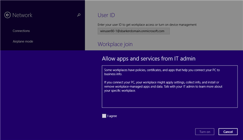
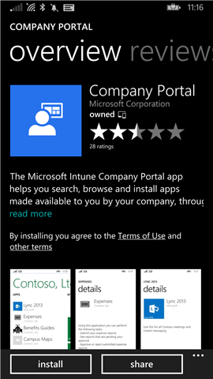

# Verwenden Ihres Windows-Ger&#228;ts mit Intune
Befolgen Sie diese Schritte für Aufgaben, die Sie auf Ihrem Windows-Gerät oder -Computer ausführen müssen, wenn Ihr Unternehmen Microsoft Intune verwendet:

|Aufgabenkategorie|Aufgaben, die Sie erledigen können|
|---------------------|--------------------------------------|
|Installation der Unternehmensportal-App und Intune-Registrierung|-   [Registrieren Ihres Geräts in Intune](#BKMK_windows_enroll_instrucs) -   [Was geschieht, wenn ich die Unternehmensportal-App installiere und mein Gerät bei Intune registriere?](#BKMK_what_happns_enroll_all) -   [Was kann mein IT-Administrator sehen, wenn ich mein Gerät bei Intune registriere?](#BKMK_win_what_IT_can_see)|
|Aufgaben, die Sie erledigen können, wenn Ihr Gerät bei Intune registriert ist|-   [Was ist die Unternehmensportal-Website?](#BKMK_win_whatis_cp_website) -   [Installieren von Unternehmens-Apps](#BKMK_win_install_comp_apps) -   [Registrieren Ihres Geräts](#BKMK_win_encrypt_device) -   [Zurücksetzen (Löschen) Ihres verlorenen oder gestohlenen Geräts](#BKMK_win_erase_lost_device) -   [Aufheben der Registrierung Ihres Geräts in Intune](#BKMK_win_unenroll_device)|

## Registrieren Ihres Geräts in Intune
Verwenden Sie zum Registrieren den Link, der dem Gerät entspricht, das Sie verwenden:

-   [Windows 10](#BKMK_enrollment_w10)

-   [Windows 8.1 oder Windows RT 8.1](#BKMK_enrollment_w81orwrt81)

-   [Windows RT](#BKMK_enrollment_rt)

-   [Windows Phone 8.1](#BKMK_enrollment_81)

-   [Windows Phone 8](#BKMK_enrollment_wp8)

### Windows 10
So registrieren Sie Ihr Gerät:

1.  Wechseln Sie zu **Windows-Einstellungen**, und tippen Sie auf **Konten**.

    

2.  Tippen Sie auf **Mein Konto**.

    

3.  Tippen Sie auf **Geschäfts- oder Schulkonto hinzufügen**.

    

4.  Melden Sie sich mit den Anmeldeinformationen Ihres Geschäfts- oder Schulkontos an.

    

Wenn Sie die obigen Schritte ausgeführt haben und trotzdem nicht auf E-Mails, Dateien und andere Daten Ihres Geschäfts- oder Schulkontos zugreifen können, wechseln Sie zurück zu **Konten**, und tippen Sie auf **Geschäftszugriff**.

-   Wenn Ihr Geschäfts- oder Schulkonto angezeigt wird, sind keine weiteren Schritte erforderlich. Sie sind verbunden.

-   Wenn Ihr Geschäfts- oder Schulkonto nicht angezeigt wird, tippen Sie auf **Verbinden**, und melden Sie sich mit den Anmeldeinformationen Ihres Geschäfts- oder Schulkontos an.

Außerdem wird empfohlen, dass Sie die Unternehmensportal-App installieren, mit der Sie die Unternehmens-Apps einfach bestimmen und abrufen können, die für Sie und Ihre Rolle relevant sind. Abhängig von der Intune-Konfiguration Ihres Unternehmens wurde die Unternehmensportal-App möglicherweise bereits als Teil Ihres Registrierungsprozesses installiert. Um zu prüfen, ob Sie die App haben, suchen Sie in der Liste Ihrer Apps nach **Unternehmensportal**. Wenn das Unternehmensportal nicht in der Liste der Apps angezeigt wird, gehen Sie folgendermaßen vor, um es zu installieren.

1.  Tippen Sie auf **Starten** &gt; **Store**.

2.  Tippen Sie auf **Suchen**, und geben Sie **Unternehmensportal** ein.

3.  Tippen Sie in der Liste der Ergebnisse auf **Unternehmensportal** &gt; **Installieren**.

4.  Tippen Sie auf **Installieren** oder **Free**. Die angezeigte Option hängt davon ab, wie Ihr Unternehmen die App konfiguriert hat.

### Windows 8.1 oder Windows RT 8.1
So registrieren Sie Ihr Gerät:

1.  Tippen Sie auf dem Gerät auf **Einstellungen** &gt; **PC-Einstellungen** &gt; **Netzwerk** &gt; **Arbeitsplatz**.

    

2.  Geben Sie Ihre E-Mail-Adresse (Geschäft, Schule oder Uni) als Benutzer-ID ein, und tippen Sie dann auf **Beitreten**.

    Wenn Ihre Benutzer-ID nicht erforderlich ist, wird die E-Mail-Adresse verwendet, die Sie beim Anmelden bei diesem Gerät eingegeben haben.

3.  Geben Sie das Kennwort für Ihr Geschäfts-, Schul- oder Uni-E-Mail ein.

    

4.  Tippen Sie unter **Geräteverwaltung aktivieren** auf **Aktivieren**.

    

5.  Aktivieren Sie im Dialogfeld **Apps und Dienste des IT-Administrators zulassen** das Kontrollkästchen **Ich stimme zu**, und tippen Sie dann auf **Aktivieren**.

    

    Wenn Sie sich erfolgreich registriert haben, wird folgender Bildschirm angezeigt.

    

Außerdem wird empfohlen, dass Sie die Unternehmensportal-App installieren, mit der Sie die Unternehmens-Apps einfach bestimmen und abrufen können, die für Sie und Ihre Rolle relevant sind. Abhängig von der Intune-Konfiguration Ihres Unternehmens wurde die Unternehmensportal-App möglicherweise bereits als Teil Ihres Registrierungsprozesses installiert. Um zu prüfen, ob Sie die App haben, suchen Sie in der Liste Ihrer Apps nach **Unternehmensportal**. Wenn das Unternehmensportal nicht in der Liste der Apps angezeigt wird, gehen Sie folgendermaßen vor, um es zu installieren.

1.  Tippen Sie auf **Starten** &gt; **Store**.

2.  Tippen Sie auf **Suchen**, und geben Sie **Unternehmensportal** ein.

3.  Tippen Sie in der Liste der Ergebnisse auf **Unternehmensportal**.

4.  Tippen Sie auf **Installieren** oder **Free**. Die angezeigte Option hängt davon ab, wie Ihr Unternehmen die App konfiguriert hat.

### Windows RT
So registrieren Sie Ihr Gerät:

1.  Tippen Sie auf **Starten**, und geben Sie dann **Systemkonfiguration** ein.

2.  Tippen Sie auf das Dialogfeld, um die **Unternehmens-Apps** zu öffnen. Möglicherweise werden Sie aufgefordert, die allgemeinen Geschäftsbedingungen Ihres Unternehmens zu akzeptieren.

3.  Melden Sie sich mit Ihren Anmeldeinformationen an.

Außerdem wird empfohlen, dass Sie die Unternehmensportal-App installieren, mit der Sie die Unternehmens-Apps einfach bestimmen und abrufen können, die für Sie und Ihre Rolle relevant sind. Abhängig von der Intune-Konfiguration Ihres Unternehmens wurde die Unternehmensportal-App möglicherweise bereits als Teil Ihres Registrierungsprozesses installiert. Um zu prüfen, ob Sie die App haben, suchen Sie in der Liste Ihrer Apps nach **Unternehmensportal**. Wenn das Unternehmensportal nicht in der Liste der Apps angezeigt wird, gehen Sie folgendermaßen vor, um es zu installieren.

1.  Tippen Sie auf **Starten** &gt; **Store**.

2.  Tippen Sie auf **Suchen**, und geben Sie **Unternehmensportal** ein.

3.  Tippen Sie in der Liste der Ergebnisse auf **Unternehmensportal**.

4.  Tippen Sie auf **Unternehmensportal**  &gt; **Installieren**.

### Windows Phone 8.1
Befolgen Sie die für Ihr Unternehmen geltenden Anweisungen, um Ihr Gerät in Intune zu registrieren:

-   [Wenn Ihr Unternehmen Ihnen das Verwenden des Unternehmensportals aus dem Windows Store erlaubt, gehen Sie folgendermaßen vor:](#BKMK_comp_allows_cp)

-   [Wenn es Ihnen nicht gestattet ist, von Ihrem Windows Phone aus auf den Windows Store zuzugreifen oder Sie kein Microsoft-Konto besitzen:](#BKMK_comp_doesnt_allow_cp)

#### Wenn Ihr Unternehmen Ihnen das Verwenden des Unternehmensportals aus dem Windows Store erlaubt, gehen Sie folgendermaßen vor:
Installieren Sie die Unternehmensportal-App auf Ihrem Gerät:

1.  Tippen Sie auf **Starten** &gt; **Store**.

2.  Tippen Sie auf **Suchen**, und geben Sie **Unternehmensportal** ein.

3.  Tippen Sie in der Liste der Ergebnisse auf **Unternehmensportal**.

    

4.  Tippen Sie auf **Unternehmensportal**  &gt; **Installieren**.

    

Registrieren Sie Ihr Gerät:

1.  Öffnen Sie auf dem Gerät die App **Microsoft Intune-Unternehmensportal**.

2.  Geben Sie Ihre Anmeldeinformationen ein. Möglicherweise werden Sie aufgefordert, die allgemeinen Geschäftsbedingungen Ihres Unternehmens zu akzeptieren.

3.  Navigieren Sie zu **Meine Geräte**.

4.  Tippen Sie auf **Tippen, um dieses Gerät zu registrieren oder zu identifizieren**.

    

5.  Tippen Sie auf **Dieses Gerät registrieren**.

    

6.  Tippen Sie auf **Konto hinzufügen**.

    

7.  Geben Sie den Anforderungen entsprechend zusätzliche Informationen ein, und tippen Sie dann auf **Anmelden**, um die Registrierung abzuschließen. Ihr Arbeitsplatzkonto sollte nun auf der Seite **Einstellungen** &gt; **Arbeitsplatz** angezeigt werden.

    

#### Wenn es Ihnen nicht gestattet ist, von Ihrem Windows Phone aus auf den Windows Store zuzugreifen oder Sie kein Microsoft-Konto besitzen:

1.  Tippen Sie auf **Einstellungen** &gt; **Arbeitsplatz**.

2.  Tippen Sie auf **Konto hinzufügen**, und melden Sie sich mit Ihrem Geschäftskonto an.

3.  Geben Sie den Anforderungen entsprechend zusätzliche Informationen ein, und tippen Sie dann auf **Anmelden**, um die Registrierung abzuschließen.

4.  Wenn Sie aufgefordert werden, die Unternehmens-App oder den Hub zu installieren, stellen Sie sicher, dass das entsprechende Kontrollkästchen aktiviert ist, und tippen Sie dann auf **Fertig**.

Wenn Ihr IT-Administrator das Unternehmensportal so konfiguriert hat, dass es während der Anmeldung installiert wird, wird das Unternehmensportal in Ihrer App-Liste angezeigt.

### Windows Phone 8
Registrieren Sie Ihr Gerät:

1.  Tippen Sie auf dem Gerät auf  **Einstellungen** &gt; **Unternehmens-Apps**.

2.  Tippen Sie auf **Konto hinzufügen**, und melden Sie sich mit Ihrem Geschäftskonto an.

3.  Nachdem das Konto erfolgreich hinzugefügt wurde, sollten Sie aufgefordert werden, die Unternehmens-App oder den Hub zu installieren. Stellen Sie sicher, dass das entsprechende Kontrollkästchen aktiviert ist, und tippen Sie dann auf **Fertig**.

Das Unternehmensportal wird nach der Installation in der Liste Ihrer Apps angezeigt.

## Installieren von Unternehmens-Apps

1.  Wählen Sie in **Apps** eine App aus.

2.  Tippen Sie auf **Store** &gt; **Installieren**.

## Was ist die Unternehmensportal-Website?
Die Unternehmensportal-Website ist die Weboberfläche Ihres Unternehmens, über die Sie Ihre Arbeitscomputer und -geräte sowie Ihre persönlichen Computer und Geräte verwalten, die Sie für die Arbeit verwenden.

Nachdem Sie Ihren Computer oder Ihr Gerät im Unternehmensportal hinzugefügt haben, stehen Ihnen folgende Möglichkeiten zur Verfügung:

-   Durchsuchen nach und Herunterladen von Unternehmens-Apps

-   Verwalten von Geräten, die Sie dem Unternehmensportal hinzugefügt haben

-   Suchen von Kontaktinformationen für Ihren IT-Administrator

Wenn Sie dem Unternehmensportal einen Computer oder ein Gerät hinzufügen, wird je nach Gerät möglicherweise Software installiert oder eine App heruntergeladen. Sie gestatten damit Ihrem IT-Administrator, Ihr Gerät zu verwalten, damit die Unternehmensinformationen auf dem Gerät geschützt werden.

## Registrieren Ihres Geräts
Sie können Ihr Gerät verschlüsseln, indem Sie entweder ein Microsoft-Konto hinzufügen oder BitLocker aktivieren.

**Option 1: Hinzufügen eines Microsoft-Kontos**

1.  Suchen und starten Sie die App **PC-Einstellungen**.

2.  Klicken Sie auf **Konten** &gt; **Ihr Konto**, und klicken Sie dann auf **Mit einem Microsoft-Konto verbinden**.

3.  Folgen Sie den angezeigten Anweisungen.

4.  Stellen Sie sicher, dass Ihr Gerät mit [!INCLUDE[wit_firstref](../Token/wit_firstref_md.md)] registriert wird, indem Sie die Anweisungen unter [Registrieren Ihres Geräts für den Einsatz bei der Arbeit](http://go.microsoft.com/fwlink/?LinkId=519071) befolgen.

**Option 2: Aktivieren von BitLocker**

1.  Suchen und starten Sie die App **BitLocker verwalten**.

2.  Klicken Sie auf **BitLocker aktivieren**, folgen Sie den Anweisungen, um die Laufwerke zu verschlüsseln.

3.  Stellen Sie sicher, dass Ihr Gerät mit [!INCLUDE[wit_firstref](../Token/wit_firstref_md.md)] registriert wird, indem Sie die Anweisungen unter [Registrieren Ihres Geräts für den Einsatz bei der Arbeit](http://go.microsoft.com/fwlink/?LinkId=519071) befolgen.

## Aufheben der Registrierung Ihres Geräts in Intune
Wenn Sie in Intune registriert sind, Ihr Gerät aber nicht mehr für die Arbeit oder in der Schule bzw. Uni verwenden möchten und auch nicht mehr auf geschäftliche oder Schul-/Uni-E-Mails, -Apps oder andere diesbezügliche Ressourcen zugreifen müssen, müssen Sie die Registrierung Ihres Geräts aufheben.   Nachdem Sie die Registrierung Ihres Geräts bei Intune aufgehoben haben, können Sie nicht mehr auf diese Ressourcen zugreifen.

-   Tippen Sie in Ihrer Apps-Liste auf die App **Unternehmensportal**.

-   Melden Sie sich mit Ihren Geschäfts-, Schul- oder Unianmeldeinformationen an.

-   Wählen Sie in **Meine Geräte** das Gerät aus, dessen Registrierung Sie aufheben möchten.

-   Tippen Sie auf **Entfernen** &gt; **Entfernen**.

## Zurücksetzen (Löschen) Ihres verlorenen oder gestohlenen Geräts
Wenn Ihr Smartphone verloren geht oder gestohlen wird, können Sie es auf die werkseitigen Standardeinstellungen zurücksetzen.

> [!WARNING]
> Durch das Zurücksetzen eines Geräts auf die werkseitigen Standardeinstellungen werden Ihre darauf befindlichen persönlichen und beruflichen Informationen gelöscht.

1.  Öffnen Sie das Unternehmensportal in Ihrem Browser, und melden Sie sich bei Ihrem Geschäftskonto an.

2.  Klicken Sie unter **Meine Geräte** auf das verlorene oder gestohlene Gerät.

3.  Klicken Sie auf **Zurücksetzen** &gt; **Zurücksetzen**.

> [!NOTE]
> Wenn Sie Ihr verlorenes oder gestohlenes Gerät nicht zurücksetzen können, bitten Sie Ihre IT-Abteilung, es zurückzusetzen.

## Was geschieht, wenn ich die Unternehmensportal-App installiere und mein Gerät bei Intune registriere?

### Was geschieht, wenn ich die Unternehmensportal-App installiere und mein Windows 10-Gerät bei Intune registriere?
Wenn Sie die Unternehmensportal-App installieren und dann mithilfe der App Ihr Windows 10 Enterprise- oder Professional-Gerät bei Intune registrieren, können Sie folgende Aufgaben mit der Unternehmensportal-App durchführen:

-   Zugreifen auf das Netzwerk des Unternehmens und auf E-Mail- sowie andere arbeitsbezogene Dateien

-   Abrufen von Unternehmens-Apps aus dem Unternehmensportal

-   Automatisches Konfigurieren Ihres geschäftlichen E-Mail-Kontos

-   Zurücksetzen Ihres Smartphones auf die werkseitigen Standardeinstellungen bei Verlust oder Diebstahl

Die Schritte zum Registrieren finden Sie unter [Windows 10](#BKMK_enrollment_w10). Informationen darüber, was Ihr IT-Administrator auf Ihrem Gerät anzeigen kann und was nicht, finden Sie unter [Was kann mein IT-Administrator sehen, wenn ich mein Gerät bei Intune registriere?](#BKMK_win_what_IT_can_see).

Wenn Sie einen Computer hinzufügen:

-   Sie werden auf Ihrem Computer Software sicherlich installiert haben, mit deren Hilfe Ihr IT-Administrator den Computer verwalten kann und mit der Sie Unternehmensressourcen wie Apps und Supportinformationen abrufen können. Diese Software kann automatisch von Ihrem IT-Administrator aktualisiert werden.

-   [!INCLUDE[wit_firstref](../Token/wit_firstref_md.md)] Endpoint Protection ist möglicherweise auf Ihrem Computer installiert. Dies ist eine Software, die den Computer auf Viren und Malware überprüft. Weitere Informationen finden Sie in den [Datenschutzbestimmungen für Microsoft System Center 2012 Endpoint Protection](http://go.microsoft.com/fwlink/?LinkID=247324).

-   Ihr IT-Administrator kann die gesamte auf dem Computer installierte Software inventarisieren. Software, die Sie persönlich installiert haben, kann dabei geschlossen werden.

-   Sie müssen die Bedingungen akzeptieren.

-   Der IT-Administrator kann Daten von der Festplatte Ihres Computers sammeln oder löschen. Ihr IT-Administrator kann auch die gesamte Festplatte löschen.

-   Ihr IT-Administrator kann Apps und Updates auf dem Computer installieren.

-   Ihr IT-Administrator kann Richtlinien auf dem Computer erzwingen. Beispielsweise kann es erforderlich sein, dass Sie ein Kennwort oder eine PIN auf dem Computer festlegen, wobei zu viele falsche Versuche bei der Kennworteingabe zu einer Sperrung des Computers oder zum Löschen sämtlicher Daten von der Festplatte des Computers führen können.

### Was geschieht, wenn ich die Unternehmensportal-App installiere und mein Windows 8.1- oder Windows RT-Gerät bei Intune registriere?
Wenn Sie die Unternehmensportal-App installieren und dann mithilfe der App Ihr Windows 8.1 Enterprise- oder Professional- oder Ihr Windows RT-Gerät bei Intune registrieren, können Sie folgende Aufgaben mit der Unternehmensportal-App durchführen:

-   Zugreifen auf das Netzwerk des Unternehmens und auf E-Mail- sowie andere arbeitsbezogene Dateien

-   Abrufen von Unternehmens-Apps aus dem Unternehmensportal

-   Automatisches Konfigurieren Ihres geschäftlichen E-Mail-Kontos

-   Zurücksetzen Ihres Smartphones auf die werkseitigen Standardeinstellungen bei Verlust oder Diebstahl

Die Schritte zum Registrieren finden Sie unter [Windows 8.1 oder Windows RT 8.1](#BKMK_enrollment_w81orwrt81). Informationen darüber, was Ihr IT-Administrator auf Ihrem Gerät anzeigen kann und was nicht, finden Sie unter [Was kann mein IT-Administrator sehen, wenn ich mein Gerät bei Intune registriere?](#BKMK_win_what_IT_can_see).

Wenn Sie einen Computer hinzufügen:

-   Sie werden auf Ihrem Computer Software sicherlich installiert haben, mit deren Hilfe Ihr IT-Administrator den Computer verwalten kann und mit der Sie Unternehmensressourcen wie Apps und Supportinformationen abrufen können. Diese Software kann automatisch von Ihrem IT-Administrator aktualisiert werden.

-   [!INCLUDE[wit_firstref](../Token/wit_firstref_md.md)] Endpoint Protection ist möglicherweise auf Ihrem Computer installiert. Dies ist eine Software, die den Computer auf Viren und Malware überprüft. Weitere Informationen finden Sie in den [Datenschutzbestimmungen für Microsoft System Center 2012 Endpoint Protection](http://go.microsoft.com/fwlink/?LinkID=247324).

-   Ihr IT-Administrator kann die gesamte auf dem Computer installierte Software inventarisieren. Software, die Sie persönlich installiert haben, kann dabei geschlossen werden.

-   Sie müssen die Bedingungen akzeptieren.

-   Der IT-Administrator kann Daten von der Festplatte Ihres Computers sammeln oder löschen. Ihr IT-Administrator kann auch die gesamte Festplatte löschen.

-   Ihr IT-Administrator kann Apps und Updates auf dem Computer installieren.

-   Ihr IT-Administrator kann Richtlinien auf dem Computer erzwingen. Beispielsweise kann es erforderlich sein, dass Sie ein Kennwort oder eine PIN auf dem Computer festlegen, wobei zu viele falsche Versuche bei der Kennworteingabe zu einer Sperrung des Computers oder zum Löschen sämtlicher Daten von der Festplatte des Computers führen können.

### Was geschieht, wenn ich die Unternehmensportal-App installiere und mein Windows Phone 8.1- oder Windows Phone 8-Gerät bei Intune registriere?
Wenn Sie die Unternehmensportal-App installieren und dann mithilfe der App Ihr Windows Phone 8.1- oder Windows Phone 8-Gerät bei Intune registrieren, können Sie folgende Aufgaben mit der Unternehmensportal-App durchführen:

-   Zugreifen auf das Netzwerk des Unternehmens und auf E-Mail- sowie andere arbeitsbezogene Dateien

-   Abrufen von Unternehmens-Apps aus dem Unternehmensportal

-   Automatisches Konfigurieren Ihres geschäftlichen E-Mail-Kontos

-   Zurücksetzen Ihres Smartphones auf die werkseitigen Standardeinstellungen bei Verlust oder Diebstahl

Die Schritte zum Registrieren finden Sie unter [Windows Phone 8.1](#BKMK_enrollment_81) bzw. [Windows Phone 8](#BKMK_enrollment_wp8).  Informationen darüber, was Ihr IT-Administrator auf Ihrem Gerät anzeigen kann und was nicht, finden Sie unter [Was kann mein IT-Administrator sehen, wenn ich mein Gerät bei Intune registriere?](#BKMK_win_what_IT_can_see).

Wenn Sie Ihr Windows Phone-Gerät hinzufügen, gewähren Sie Ihrem IT-Administrator eine Zugriffsberechtigung für das Gerät. IT-Administratoren können folgende Dinge tun:

-   Zurücksetzen des Geräts auf die standardmäßigen Werkseinstellungen. Dies ist hilfreich, wenn das Gerät verloren geht oder gestohlen wird.

-   Entfernen aller unternehmensrelevanten Daten und installierten Branchen-Apps. Ihre persönlichen Daten und Einstellungen werden nicht entfernt.

-   Erzwingen eines Kennworts oder einer PIN für das Gerät. Dies kann bei zu vielen falschen Versuchen bei der Kennworteingabe zu einer Sperrung des Geräts oder dazu führen, dass das Gerät auf die werkseitigen Standardeinstellungen zurückgesetzt wird. Dabei können auch Daten gelöscht werden.

-   Erzwingen, dass alle Daten auf dem Gerät verschlüsselt werden. Dadurch werden die Daten geschützt, wenn das Gerät verloren geht oder gestohlen wird.

-   Sie müssen die Bedingungen akzeptieren.

-   Deaktivieren der SD-Karte.

-   Installieren von Updates für Apps auf dem Gerät. Dies betrifft nur Updates. IT-Administratoren können nicht erzwingen, dass neue Apps auf Ihrem Gerät installiert werden. Sie können jedoch nach Bedarf Apps, die Ihnen im Unternehmensportal angeboten werden, installieren.

-   Nachdem das Gerät zum Unternehmensportal hinzugefügt wurde, erfolgt im Intervall von ca. acht Stunden Folgendes:

    -   Herunterladen aller Richtlinien- oder App-Updates, die Ihr IT-Administrator zur Verfügung gestellt hat.

    -   Senden aller Hardwareinventur-Updates.

    -   Senden aller Unternehmens-App-Inventaraktualisierungen.

### Was geschieht, wenn ich die Unternehmensportal-App installiere und mein Windows 7- oder Vista-Gerät bei Intune registriere?
Wenn Sie die Unternehmensportal-App installieren und dann mithilfe der App Ihr Windows 7- oder Vista-Gerät bei Intune registrieren, können Sie folgende Aufgaben mit der Unternehmensportal-App durchführen:

-   Zugreifen auf das Netzwerk des Unternehmens und auf E-Mail- sowie andere arbeitsbezogene Dateien

-   Abrufen von Unternehmens-Apps aus dem Unternehmensportal

-   Automatisches Konfigurieren Ihres geschäftlichen E-Mail-Kontos

-   Zurücksetzen Ihres Smartphones auf die werkseitigen Standardeinstellungen bei Verlust oder Diebstahl

Informationen darüber, was Ihr IT-Administrator auf Ihrem Gerät anzeigen kann und was nicht, finden Sie unter [Was kann mein IT-Administrator sehen, wenn ich mein Gerät bei Intune registriere?](#BKMK_win_what_IT_can_see).

Wenn Sie einen Computer hinzufügen:

-   Sie werden auf Ihrem Computer Software sicherlich installiert haben, mit deren Hilfe Ihr IT-Administrator den Computer verwalten kann und mit der Sie Unternehmensressourcen wie Apps und Supportinformationen abrufen können. Diese Software kann automatisch von Ihrem IT-Administrator aktualisiert werden.

-   [!INCLUDE[wit_firstref](../Token/wit_firstref_md.md)] Endpoint Protection ist möglicherweise auf Ihrem Computer installiert. Dies ist eine Software, die den Computer auf Viren und Malware überprüft. Weitere Informationen finden Sie in den [Datenschutzbestimmungen für Microsoft System Center 2012 Endpoint Protection](http://go.microsoft.com/fwlink/?LinkID=247324).

-   Ihr IT-Administrator kann die gesamte auf dem Computer installierte Software inventarisieren. Software, die Sie persönlich installiert haben, kann dabei geschlossen werden.

-   Sie müssen die Bedingungen akzeptieren.

-   Der IT-Administrator kann Daten von der Festplatte Ihres Computers sammeln oder löschen. Ihr IT-Administrator kann auch die gesamte Festplatte löschen.

-   Ihr IT-Administrator kann Apps und Updates auf dem Computer installieren.

-   Ihr IT-Administrator kann Richtlinien auf dem Computer erzwingen. Beispielsweise kann es erforderlich sein, dass Sie ein Kennwort oder eine PIN auf dem Computer festlegen, wobei zu viele falsche Versuche bei der Kennworteingabe zu einer Sperrung des Computers oder zum Löschen sämtlicher Daten von der Festplatte des Computers führen können.

## Was kann mein IT-Administrator sehen, wenn ich mein Gerät bei Intune registriere?
Wenn Sie Ihr Gerät bei Intune registrieren, gestatten Sie damit Ihrem IT-Administrator, Ihr Gerät zu verwalten, damit die Unternehmensinformationen auf dem Gerät geschützt werden.

|Nicht für die IT einsehbar|Für die IT einsehbar|
|------------------------------|------------------------|
|-   Anrufliste -   SMS -   Persönliche E-Mail, Kontakte und Kalender -   Webverlauf -   Speicherort -   Eigene Aufnahmen -   Personenbezogene Daten|-   Besitzer -   Gerätename -   Seriennummer -   Hersteller -   Modell -   Betriebssystem -   Unternehmens-Apps -   Persönliche Apps|
