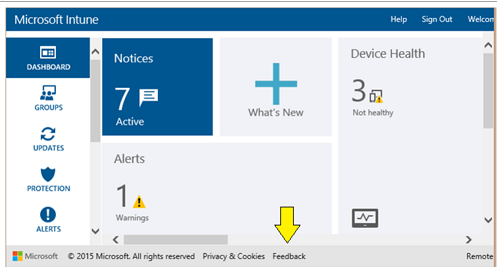

# Neuheiten in Microsoft Intune

## Geplante Neuerungen für November
**Ankündigung!** Im November fordert Microsoft Intune von allen globalen Administratoren (auch bekannt als Mandantenadministratoren), dass ihnen eine Intune- oder EMS-Lizenz (Enterprise Mobility Suite) zugewiesen ist, damit sie auf das Intune-Unternehmensportal zugreifen können. Um sicherzustellen, dass Ihre Administratoren den Zugriff auf das Unternehmensportal nicht verlieren, wechseln Sie zum [Office 365-Portal](http://portal.office.com/), um Ihren globalen Administratoren Intune- oder EMS-Lizenzen zuzuweisen. Lizenzen können einzeln oder als Massenvorgang zugewiesen werden. Beginnen Sie noch heute, um sicherzustellen, dass im November alles bereit ist!

So weisen Sie einem vorhandenen Benutzerkonto eine Lizenz zu

1.  Melden Sie sich beim [Office 365-Portal](http://portal.office.com/) mit den Anmeldeinformationen eines globalen Administrators an (Mandantenadministrator). Beachten Sie, dass das Intune-Kontenportal außer Kraft gesetzt und in das Office 365-Kontoportal überführt wird, wie in [diesem Blogbeitrag](http://blogs.technet.com/b/microsoftintune/archive/2015/09/01/intune-and-ems-subscriptions-now-available-in-the-office-365-portal.aspx) erläutert, und dass der Intune-Dienst darauf verweist.

2.  Klicken Sie auf **Benutzer** &gt; **Aktive Benutzer.**

    -   Wählen Sie entweder eine Ansicht zum Filtern nach jeder einzelnen globalen Administratorrolle aus.

    -   Oder ein globaler Administrator kann auch nach den Benutzern suchen, denen keine Lizenzen zugewiesen sind.

3.  Wählen Sie den Benutzer aus, der eine neue Lizenz benötigt. Durch das Aktivieren des Kontrollkästchens für einen Benutzer werden Ihnen die benutzerspezifischen Einstellungen im rechten Bereich angezeigt.

4.  Um eine bestimmte Lizenz zuzuweisen, klicken Sie auf den Link **Bearbeiten** unterhalb des Abschnitts **Zugewiesene Lizenz**.

5.  Aktivieren Sie das Kontrollkästchen neben Intune oder EMS, und klicken Sie dann auf **Speichern**.

Alternativ können Sie die Lizenzen in einem Massenvorgang über Office 365 zuweisen:

1.  Melden Sie sich beim [Office 365-Portal](http://portal.office.com/) mit den Anmeldeinformationen eines globalen Administrators an (Mandantenadministrator). Beachten Sie, dass das Intune-Kontenportal außer Kraft gesetzt und in das Office 365-Kontoportal überführt wird, wie in [diesem Blogbeitrag](http://blogs.technet.com/b/microsoftintune/archive/2015/09/01/intune-and-ems-subscriptions-now-available-in-the-office-365-portal.aspx) erläutert, und dass der Intune-Dienst darauf verweist.

2.  Klicken Sie auf **Benutzer** &gt; **Aktive Benutzer.**

3.  Wählen Sie alle Benutzer aus, die eine neue Lizenz benötigen.

4.  Wählen Sie die Option **Bearbeiten** im rechten Bereich aus. Hierdurch wird ein Assistent geöffnet, der Sie in vier Schritten durch die Benutzereinstellungen führt. Wenn Sie keine weiteren Änderungen an diesen Benutzern vornehmen möchten, können Sie mit Abschnitt 3 fortfahren.

Wenn Sie System Center 2012 Configuration Manager und Intune zusammen (Hybridszenario) verwenden, können Sie Lizenzen über die Intune-Sammlung in der Configuration Manager-Verwaltungskonsole zuweisen. Fügen Sie die globalen Administratoren der Benutzerauflistung hinzu, die im [Intune-Abonnement](https://technet.microsoft.com/en-us/library/jj884158.aspx#bkmk_witsub) definiert ist.

## Neuerungen in Intune – Oktober 2015

### Aktualisierungen beim bedingten Zugriff für Exchange lokal

-   **Sie können jetzt den Zugriff auf Exchange ActiveSync-E-Mail für konforme Geräte zulassen, die bei Intune registriert sind, wenn die globale Exchange-Regel auf Blockieren oder Isolieren festgelegt ist.**

    Bisher mussten Sie, um den E-Mail-Zugriff auf registrierten und konformen Geräten zuzulassen, die globale Exchange-Standardregel auf **Zulassen** festlegen.

    Mit diesem Dienstupdate ist diese Einstellung keine Voraussetzung mehr für den bedingten Zugriff.  Wenn Ihre Exchange-Umgebung erfordert, dass Ihre globale Standardregel auf **Blockieren/Isolieren** festgelegt ist, aktivieren Sie einfach das Kontrollkästchen **Standardregel außer Kraft setzen** auf der Seite für den bedingten Zugriff in Exchange lokal.  Das [Verwalten des E-Mail-Zugriffs mit Microsoft Intune](../Topic/Manage_email_access_with_Microsoft_Intune.md)-Thema enthält mehr Detailinformationen zu den Regeln und den resultierenden Endbenutzerbenachrichtigungen.

-   **Neue One-Click-Quarantäne-Erfahrung**

    Wir haben die E-Mail-Quarantäne-Erfahrung so vereinfacht, dass die Registrierung mit nur einem Klick möglich ist. Mit diesem Dienstupdate können Endbenutzer auf einen einzelnen Link in der Quarantäne-E-Mail klicken, um den Registrierungsprozess in der Unternehmensportal-App abzuschließen.

### Updates für die Verwaltung von mobilen Geräten und Apps

-   **Android**

    Alle [!INCLUDE[wit_nextref](../Token/wit_nextref_md.md)]-Verwaltungsfunktionen unterstützen jetzt Android 6.0 (Marshmallow), wie in diesem Blogbeitrag beschrieben: [Microsoft Intune bietet Day-0-Unterstützung für Android Marshmallow](http://blogs.technet.com/b/microsoftintune/archive/2015/10/09/microsoft-intune-to-provide-day-0-support-for-android-marshmallow.aspx).

-   **iOS**

    Sie können keine neuen App-Bereitstellungen mehr für iOS-Geräte erstellen, auf denen eine ältere Version als iOS 7.1 ausgeführt wird. Alle vorhandenen App-Bereitstellungen auf Geräten, auf denen eine ältere Version als iOS 7.1 ausgeführt wird, funktionieren weiterhin und werden auch weiterhin von [!INCLUDE[wit_nextref](../Token/wit_nextref_md.md)] verwaltet.

-   **Windows 10**

    [!INCLUDE[wit_nextref](../Token/wit_nextref_md.md)] unterstützt jetzt die Bereitstellung von universellen Windows 10-Apps mithilfe des Softwareinstallationsprogramm-Typs **App-Paket für Windows**. Ausführliche Informationen und Voraussetzungen finden Sie unter [Erste Schritte mit der Bereitstellung von Apps in Microsoft Intune](../Topic/Plan_for_app_deployment_in_Microsoft_Intune.md).

### Änderungen und Updates für die Unternehmensportal-Apps von Microsoft
In dieser Version wurden die folgenden Änderungen an den Unternehmensportal-Apps vorgenommen:

**iOS**

-   Der Unternehmensportal-App wurden neue Schaltflächen hinzugefügt, um Benutzer das Senden von Diagnoseprotokollen an ihre IT-Administratoren zu erleichtern:

    |Schaltflächenname|Position in der Oberfläche|
    |---------------------|------------------------------|
    |**Melden**|Fehlerwarnmeldungen|
    |**Diagnosebericht senden**|Bildschirm „Info“ in der Unternehmensportal-App|

## Was steht an?
Bleiben Sie auf dem Laufenden über bevorstehende Entwicklungen für Intune mit der [Cloudplattform-Roadmap](http://www.microsoft.com/en-us/server-cloud/roadmap/Indevelopment.aspx?TabIndex=0&dropValue=Intune).

### Schützen Ihrer Unternehmensdaten mithilfe des Unternehmensdatenschutzes (EDP, Enterprise Data Protection)
Wenn Sie Windows 10-Geräte verwalten, kann Intune Konfigurationsrichtlinien für den Windows 10-Unternehmensdatenschutz (EDP, Enterprise Data Protection) erstellen und bereitstellen  EDP kann Ihnen dabei helfen, die Freigabe von Unternehmensdaten einzuschränken und/oder Sie darüber zu benachrichtigen. Intune-EDP-Richtlinien verwalten die Liste der von EDP geschützten Apps, Unternehmensnetzwerk-Speicherorte, Schutzebene und Verschlüsselungseinstellungen.

## Archiv

-   [September 2015](../Topic/What_s_new_in_Microsoft_Intune.md#BKMK_Sep2015)

-   [August 2015](../Topic/What_s_new_in_Microsoft_Intune.md#BKMK_August2015)

-   [Juli 2015](../Topic/What_s_new_in_Microsoft_Intune.md#BKMK_Jul15)

-   [Juni 2015](../Topic/What_s_new_in_Microsoft_Intune.md#BKMK_Jun15)

-   [Mai 2015](../Topic/What_s_new_in_Microsoft_Intune.md#BKMK_May15)

-   [April 2015](../Topic/What_s_new_in_Microsoft_Intune.md#BKMK_Apr15)

-   [März 2015](../Topic/What_s_new_in_Microsoft_Intune.md#BKMK_Mar15)

-   [Februar 2015](../Topic/What_s_new_in_Microsoft_Intune.md#BKMK_Feb15)

-   [Dezember 2014](../Topic/What_s_new_in_Microsoft_Intune.md#BKMK_Dec14)

-   [November 2014](../Topic/What_s_new_in_Microsoft_Intune.md#BKMK_Nov14)

-   [September 2014](../Topic/What_s_new_in_Microsoft_Intune.md#BKMK_Sep14)

-   [April 2014](../Topic/What_s_new_in_Microsoft_Intune.md#bkmk_ape)

-   [Januar 2014](../Topic/What_s_new_in_Microsoft_Intune.md#bkmk_Jan2014)

-   [Oktober 2013](../Topic/What_s_new_in_Microsoft_Intune.md#bkmk_Oct2013)

-   [Juni 2013](../Topic/What_s_new_in_Microsoft_Intune.md#bkmk_June2013)

-   [Mai 2013](../Topic/What_s_new_in_Microsoft_Intune.md#bkmk_May2013)

-   [April 2013](../Topic/What_s_new_in_Microsoft_Intune.md#bkmk_April2013)

-   [März 2013](../Topic/What_s_new_in_Microsoft_Intune.md#bkmk_March2013)

### September 2015

#### Updates für die Verwaltung von mobilen Geräten und Apps

-   **Alle [!INCLUDE[wit_nextref](../Token/wit_nextref_md.md)]-Verwaltungsfunktionen für iOS unterstützen jetzt iOS 9**
    Ausführliche Informationen zu den iOS 9-Verwaltungsfunktionen finden Sie [in diesem Blogbeitrag](http://blogs.technet.com/b/microsoftintune/archive/2015/09/09/day-zero-support-for-ios-9-with-intune.aspx).

-   **Neue Konfigurationsrichtlinie für mobile Apps für iOS** 
    Mithilfe der neuen Konfigurationsrichtlinie für mobile Apps können Sie automatisch Einstellungen bereitstellen, die eine iOS-App bei der Ausführung möglicherweise benötigt. So könnten Sie beispielsweise einen Netzwerkport oder einen Benutzernamen bereitstellen. Details finden Sie unter [Konfigurieren von Apps mit Konfigurationsrichtlinien für mobile Apps in Microsoft Intune](../Topic/Configure_apps_with_mobile_app_configuration_policies_in_Microsoft_Intune.md).

-   **Einfachere App-Verwaltung für iOS 9-Benutzer**
    In dieser Version können Sie bereits bereitgestellte Apps für iOS 9-Benutzer in die Intune-Verwaltung integrieren. Wenn Sie bei früheren Versionen von iOS eine App bereitstellen und eine nicht verwaltete Version der App bereits auf einem Gerät installiert ist, müssen Sie den Benutzer nach wie vor bitten, die App manuell zu deinstallieren, bevor [!INCLUDE[wit_nextref](../Token/wit_nextref_md.md)] die verwaltete App installieren kann.

    Aber beginnend mit dieser Version von Intune können Sie Benutzer von iOS 9-Geräten jetzt auffordern, Intune die Verwaltung der App und die Anwendung aller relevanten Verwaltungsrichtlinien für mobile Anwendungen zu erlauben.

-   **Windows 10-Verwaltung** 
    Verwenden Sie die neue [allgemeine Windows 10-Konfigurationsrichtlinie](https://technet.microsoft.com/library/mt404697.aspx), um die Kennwort-, Geräte-, Browser- und sonstigen Einstellungen für registrierte Geräte, auf denen Windows 10 und Windows 10 Mobile ausgeführt wird, zu konfigurieren.

-   **Erstellen und Bereitstellen von Apps auf registrierten Windows 10-Geräten** 
    Dank eines neuen Softwareinstallationsprogramm-Typs, Windows Installer über MDM (&#42;.msi), können Sie Windows Installer-Apps für registrierte Geräte, auf denen Windows 10 ausgeführt wird, erstellen und darauf bereitstellen. Details finden Sie unter [Erste Schritte mit der Bereitstellung von Apps in Microsoft Intune](../Topic/Plan_for_app_deployment_in_Microsoft_Intune.md).

### Änderungen und Updates für die Unternehmensportal-Apps von Microsoft
In dieser Version wurden die folgenden Änderungen an den Unternehmensportal-Apps vorgenommen:

**iOS**

-   Microsoft erfasst automatisch anonyme Daten über die Leistung und die Verwendung des Unternehmensportals, um Microsoft-Produkte und -Dienste zu verbessern. Endbenutzer können die Datenerfassung über die Einstellung "Nutzungsdaten" auf ihrem Gerät deaktivieren, Administratoren haben jedoch keine Kontrolle über die Datenerfassung und können die Auswahl der Endbenutzer für diese Einstellung nicht ändern.

-   Unterstützung für Vollbildauflösung auf dem iPhone 6 und 6 Plus

-   Fehlerbehebungen für verbesserte Sicherheit.

### Neuerungen in der Intune-Dokumentation – September 2015

#### Neue Themen

|Name|Details|
|--------|-----------|
|[Einstellungen für Windows 10-Konfigurationsrichtlinien in Microsoft Intune](../Topic/Windows_10_configuration_policy_settings_in_Microsoft_Intune.md)|Dies ist eine neue Konfigurationsrichtlinie, mit der Sie die Einstellungen und Funktionen auf Geräten verwalten können, auf denen Windows 10 und Windows 10 Mobile ausgeführt wird.|
|[Konfigurieren von Apps mit Konfigurationsrichtlinien für mobile Apps in Microsoft Intune](../Topic/Configure_apps_with_mobile_app_configuration_policies_in_Microsoft_Intune.md)|Dies ist ein neuer Richtlinientyp, mit dem Sie automatisch Einstellungen bereitstellen können, die beim Ausführen einer iOS-App durch den Benutzer möglicherweise erforderlich sind.|

#### Aktualisierte Themen

|Name|Details|
|--------|-----------|
|[Verwenden von Richtlinien zum Verwalten von Computern und mobilen Geräten mit Microsoft Intune](../Topic/Use_policies_to_manage_computers_and_mobile_devices_with_Microsoft_Intune.md)|Aktualisiert mit den neuesten Informationen zum Grundverständnis und Erstellen von Richtlinien.|

### August 2015

#### Updates für die Verwaltung von mobilen Geräten und Apps

-   **Geschäftsbedingungen** für die Intune-Registrierung und den Unternehmenszugriff werden [jetzt mithilfe von Richtlinien verwaltet](https://technet.microsoft.com/library/mt405893.aspx). Sie können verschiedene Sätze von Geschäftsbedingungen bereitstellen, um die Anforderungen bestimmter Benutzergruppen zu erfüllen. Beispielsweise können Sie Geschäftsbedingungen in verschiedenen Sprachen für geografisch definierte Benutzergruppen bereitstellen. Sie können auch [Ihre Geschäftsbedingungen bearbeiten](https://technet.microsoft.com/library/mt405893.aspx#BKMK_TCVers) und angeben, ob die Versionsnummern erhöht werden sollen, sodass Benutzer den neuen Geschäftsbedingungen zustimmen müssen, bevor sie das Unternehmensportal verwenden können.

-   **Eine Reihe von Intune-Richtlinien wurde umbenannt**, um die Konsistenz im gesamten Produkt zu erhöhen und sie leichter auffindbar zu machen. Eine Liste aller verfügbaren Intune-Richtlinien finden Sie unter [Verwenden von Richtlinien zum Verwalten von Computern und mobilen Geräten mit Microsoft Intune](../Topic/Use_policies_to_manage_computers_and_mobile_devices_with_Microsoft_Intune.md).

-   **Zertifikatprofile vom Typ "PKCS #12 (.PFX)"** sind für Android 4.0 oder höher und Windows 10 (Desktop und mobil) und höher erhältlich. Für die Verwendung von PFX ist kein NDES-Server erforderlich. Erfahren Sie, wie Sie PFX-Zertifikatprofile in [Aktivieren des Zugriffs auf Unternehmensressourcen mithilfe von Zertifikatprofilen in Microsoft Intune](../Topic/Enable_access_to_company_resources_using_certificate_profiles_with_Microsoft_Intune.md) verwenden.

-   **Einstellungen für Unternehmensgrenzen für Windows 10 Desktop und Mobil** ermöglichen präzise VPN-Einstellungen, wie unter [Unterstützen von Benutzern beim Verbinden mit ihrer Arbeit über VPN-Profile in Microsoft Intune](../Topic/Help_users_connect_to_their_work_using_VPN_profiles_with_Microsoft_Intune.md) beschrieben.

-   **Die OneDrive-App für Android unterstützt jetzt mehrere Identitäten.** Dieses und weitere Aktualisierungen an den Verwaltungsrichtlinien für mobile Apps werden in der [Liste der Microsoft-Anwendungen, die verwaltet werden können](https://technet.microsoft.com/library/dn708489.aspx), beschrieben.

-   **Umgehung der iOS-Aktivierungssperre** Wenn firmeneigene iOS-Geräte durch eine Aktivierungssperre geschützt sind, müssen Sie vor dem Löschen oder erneuten Aktivieren des Geräts die Apple-ID und das zugehörige Kennwort des Benutzers eingeben. Dies kann ein Problem darstellen, wenn Benutzer das Unternehmen verlassen und ein firmeneigenes Gerät ohne deaktivierte Aktivierungssperre zurückgeben. Sie können die [Intune-Umgehung der Aktivierungssperre](https://technet.microsoft.com/library/mt414176.aspx) verwenden, um dieses Problem zu beheben.

#### Bedingter Zugriff für PCs
Sie können jetzt bedingte Zugriffsrichtlinien für PCs konfigurieren. Dadurch können Office-Desktop-Apps auf Exchange Online- und SharePoint Online-Dienste zugreifen. Um bedingte Zugriffsrichtlinien für PCs zu aktivieren, muss der PC entweder in eine Domäne eingebunden oder kompatibel sein.

-   Der Abschnitt **Erste Schritte** in [Verwalten des Zugriffs auf E-Mail und SharePoint mit Microsoft Intune](../Topic/Manage_access_to_email_and_SharePoint_with_Microsoft_Intune.md) enthält eine vollständige Liste der Anforderungen für das Aktivieren des bedingten Zugriffs für PCs.

-   Optionen, die Sie festlegen können, um den bedingten Zugriff für E-Mail-Zugriff zu aktivieren, finden Sie unter [Verwalten des E-Mail-Zugriffs mit Microsoft Intune](../Topic/Manage_email_access_with_Microsoft_Intune.md).

-   Optionen, die Sie festlegen können, um den bedingten Zugriff für SharePoint Online zu aktivieren, finden Sie unter [Verwalten des Zugriffs auf SharePoint Online mit Microsoft Intune](../Topic/Manage_SharePoint_Online_access_with_Microsoft_Intune.md).

#### Änderungen und Updates für die Unternehmensportal-Apps von Microsoft
In dieser Version wurden die folgenden Änderungen an den Unternehmensportal-Apps vorgenommen:

**Android**

-   Den Benutzern werden jetzt nach der Anmeldung Anweisungen zur Geräteregistrierung angezeigt, sofern das Gerät noch nicht für die Verwaltung registriert wurde.

#### Neuerungen in der Intune-Dokumentation – August 2015

##### Neue Themen

|Name|Details|
|--------|-----------|
|[Unterstützen des Schutz von iOS-Geräten durch Umgehung der Aktivierungssperre für Microsoft Intune](../Topic/Help_protect_iOS_devices_with_Activation_Lock_bypass_for_Microsoft_Intune.md)|Erfahren Sie, wie Sie Intune verwenden können, um die iOS-Aktivierungssperre zu umgehen, wenn ein Benutzer das Unternehmen verlässt und ein gesperrtes Gerät zurückgibt.|

##### Aktualisierte Themen

|Name|Details|
|--------|-----------|
|[Microsoft-Apps zur Verwendung mit den Microsoft Intune-Verwaltungsrichtlinien für mobile Anwendungen](../Topic/Microsoft_apps_you_can_use_with_Microsoft_Intune_mobile_application_management_policies.md)|Aktualisiert mit den neuesten Informationen zu Apps, die Sie mit Verwaltungsrichtlinien für mobile Geräte verwalten können.|
|[Verwenden von Richtlinien zum Verwalten von Computern und mobilen Geräten mit Microsoft Intune](../Topic/Use_policies_to_manage_computers_and_mobile_devices_with_Microsoft_Intune.md)|Aktualisiert mit den neuesten Richtlinien, die zu Intune hinzugefügt wurden.|

### Juli 2015
Die Intune-Updates im Juli beschränken sich auf Verbesserungen im Hintergrund, die es uns ermöglichen, Ihnen weiterhin eine qualitativ hochwertige Diensterfahrung zu ermöglichen. Dieses Dienstupdate enthält keine neuen Funktionen.

Android

#### Intune Onboarding-Vorteil
Microsoft bietet den Vorteil des Intune Onboardings für berechtigte Pläne. Das Onboarding ermöglichen Ihnen die Remotezusammenarbeit mit Microsoft-Spezialisten, um Ihre Intune-Umgebung einzurichten. Weitere Informationen finden Sie in der [Beschreibung des Microsoft Intune-Onboardings](https://technet.microsoft.com/library/mt228266.aspx).

#### Änderungen und Updates für die Unternehmensportal-Apps von Microsoft
In dieser Version wurden die folgenden Änderungen an den Unternehmensportal-Apps vorgenommen:

**Android**

-   Microsoft erfasst automatisch anonyme Daten über die Leistung und die Verwendung des Unternehmensportals, um Microsoft-Produkte und -Dienste zu verbessern. Endbenutzer können die Datenerfassung über die Einstellung "Nutzungsdaten" auf ihrem Gerät deaktivieren, Administratoren haben jedoch keine Kontrolle über die Datenerfassung und können die Auswahl der Endbenutzer für diese Einstellung nicht ändern.

### Juni 2015

### Helfen Sie uns, Intune zu verbessern.
Da wir gerne von Ihnen, der Intune-Community, erfahren möchten, wie wir Intune weiter verbessern können, haben wir eine neue, von UserVoice unterstützte Feedback-Website eingerichtet. Über den Link "Feedback" am unteren Rand der Verwaltungskonsole gelangen Sie zu UserVoice. Hier können Sie Microsoft Feedback zu vorhandenen Intune-Funktionen und -Inhalten geben, neue Funktionen oder Inhalte anfordern und bezüglich Übermittlungen abstimmen (um uns bei der Priorisierung zu helfen).

### Verwalten der neuen Outlook-App für iOS und Android
Mit einer Richtlinie für die Verwaltung mobiler Apps (Mobile App Management, MAM) können Sie die neue Outlook-App für iOS und Android verwalten.  Eine vollständige Liste der Apps, auf die Sie eine MAM-Richtlinie anwenden können, finden Sie unter [Microsoft-Apps zur Verwendung mit den Microsoft Intune-Verwaltungsrichtlinien für mobile Anwendungen](../Topic/Microsoft_apps_you_can_use_with_Microsoft_Intune_mobile_application_management_policies.md).

Diese App wird auch vom bedingten Zugriff auf Exchange-E-Mails unterstützt.  Weitere Informationen finden Sie unter [Verwalten des Zugriffs auf E-Mail und SharePoint mit Microsoft Intune](../Topic/Manage_access_to_email_and_SharePoint_with_Microsoft_Intune.md).

### Updates zu Endpoint Protection
**Im Schadsoftware-Arbeitsbereich von Endpoint Protection werden jetzt letzte Erkennungspfade angezeigt**
Auf der Seite **Sämtliche Malware** des Protection-Arbeitsbereichs finden Sie jetzt die Spalte **Letzte Erkennungspfade**. Diese Spalte enthält die letzten zehn Speicherorte der auf dem Computer gefundenen Malware. Weitere Informationen finden Sie unter [Schützen von Windows-PCs mit Endpoint Protection für Microsoft Intune](../Topic/Help_secure_Windows_PCs_with_Endpoint_Protection_for_Microsoft_Intune.md).

**Windows Defender-Verwaltung für Windows 10 Technical Preview**
Intune fügt Verwaltungseinstellungen für Windows Defender hinzu. Windows Defender bietet Schutz vor Malware und ersetzt Endpoint Protection in Windows 10 Technical Preview. Weitere Informationen finden Sie unter [Schützen von Windows-PCs mit Endpoint Protection für Microsoft Intune](../Topic/Help_secure_Windows_PCs_with_Endpoint_Protection_for_Microsoft_Intune.md).

### Verbesserte Endbenutzererfahrung
**Bedingter Zugriff**

-   Dem Endbenutzer wird eine vereinfachte E-Mail-Nachricht gesendet, wenn sein mobiles Gerät blockiert wird.

-   Die Anzahl der Schritte, mit denen der Endbenutzer die E-Mail-Funktion entsperrt, wurde reduziert.

### Änderungen und Updates für die Unternehmensportal-Apps von Microsoft
In dieser Version wurden die folgenden Änderungen an den Unternehmensportal-Apps vorgenommen:

**Windows und Windows Phone**

-   Administratoren können ein PowerShell-Skript verwenden, um das Unternehmensportal für das Windows Phone 8.1 Appx-Paket mit einem eigenen codesignierten Symantec-Zertifikat zu signieren. Dies ermöglicht den Sideload der Unternehmensportal-App. Das Skript wird im Rahmen der Anwendung **WinPhoneSSPBootstrapper.exe** verteilt, die Sie im [Download Center](http://www.microsoft.com/download/details.aspx?id=46445) herunterladen können.

-   Fehlerbehebungen

**iOS**

-   Die Microsoft Windows Intune-Unternehmensportal-App für iOS wurde aktualisiert, um die iOS-Version 7.1 und höher zu unterstützen. Dieses Update bedeutet, dass Endbenutzer neue Geräte in Intune nur registrieren können, wenn das Gerät iOS Version 7.1 oder höher ausführt. Geräte, die iOS Version 7.0 oder früher ausführen, können nicht registriert werden. Benutzer, die bereits Geräte registriert haben, auf denen eine nicht unterstützte Version von iOS ausgeführt wird, können weiterhin die auf ihrem Gerät vorhandene Unternehmensportal-App verwenden.

-   Verbesserte App-Katalogerfahrung zum Suchen und Installieren von Unternehmens-Apps

-   Fehlerbehebungen

### Neuerungen in der Intune-Dokumentation – Juni 2015

#### Aktualisierte Themen

|Name|Details|
|--------|-----------|
|[Microsoft-Apps zur Verwendung mit den Microsoft Intune-Verwaltungsrichtlinien für mobile Anwendungen](../Topic/Microsoft_apps_you_can_use_with_Microsoft_Intune_mobile_application_management_policies.md)|Mit den neuesten verwalteten Apps aktualisiert und mit Verwaltungsrichtlinien für mobile Geräte verwendbar.|
|[Verwalten des Zugriffs auf E-Mail und SharePoint mit Microsoft Intune](../Topic/Manage_access_to_email_and_SharePoint_with_Microsoft_Intune.md)|Mit den neuesten Apps aktualisiert, die den bedingten Zugriff auf Exchange-E-Mails und SharePoint Online unterstützen.|
|[Schützen von Daten mithilfe der Verwaltungsrichtlinien für mobile Anwendungen mit Microsoft Intune](../Topic/Configure_and_deploy_mobile_application_management_policies_in_the_Microsoft_Intune_console.md)|Mit Details zu Apps aktualisiert, die mehrere Identitäten unterstützen. Auf diese Weise können Sie nur Unternehmensdaten für die App und keine persönlichen Daten des Benutzers verwalten.|

### Mai 2015

#### Mobile Anwendungsverwaltung
Mit dem neuen **Microsoft Intune App Wrapping Tool für Android** können Sie das Verhalten interner Android-Apps so ändern, dass Sie sie mithilfe von Verwaltungsrichtlinien für mobile Anwendungen steuern können. Details finden Sie unter [Vorbereiten von Android-Apps für die Verwaltung von mobilen Anwendungen mit dem Microsoft Intune App Wrapper-Tool](../Topic/Prepare_Android_apps_for_mobile_application_management_with_the_Microsoft_Intune_App_Wrapping_Tool.md).

**Stellen Sie Google Play Store-Apps nach Bedarf bereit**.  Sie können nun Android-Apps aus dem Google Play Store als erforderlichen Installationen bereitstellen. Wenn die Anwendung bereitgestellt wird, erhält der Endbenutzer eine Meldung, dass die App erforderlich ist. Wenn der Benutzer auf die Benachrichtigung tippt, wird er zum Installieren der App an den Google Play Store weitergeleitet. Von der Microsoft Intune-Konsole aus können Sie überwachen, ob der Benutzer die App installiert hat.

**Sie können iOS-Apps ohne die Manifestdatei veröffentlichen und bereitstellen**.  Zum Veröffentlichen oder Bereitstellen einer iOS-App müssen Sie jetzt nur noch eine App-Installationsdatei angeben. Die zugehörige Manifestdatei (.plist) ist nicht mehr erforderlich.

#### Intune-Richtlinien

-   Einstellungen der Sicherheitsrichtlinie für mobile Geräte wurden in Konfigurationsrichtlinien für jede Geräteplattform aufgeteilt. Sie können die Sicherheitsrichtlinie für mobile Geräte weiter nutzen, wobei alle vorhandenen Bereitstellungen weiterhin funktionieren. Die neuen Konfigurationsrichtlinien enthalten allerdings die aktuellsten Einstellungen, weshalb Sie einen Wechsel zu deren Nutzung planen sollten. Dies sind die neuen Richtlinien:

    -   Android-Konfigurationsrichtlinie

    -   iOS-Konfigurationsrichtlinie

    -   Windows-Konfigurationsrichtlinie

    -   Windows Phone-Konfigurationsrichtlinie

    -   Exchange ActiveSync-Richtlinie

-   Die **Windows Phone-OMA-URI**-Richtlinie heißt jetzt **Benutzerdefinierte Windows Phone-Richtlinie**.

-   Die neue Richtlinie mit dem Namen **Benutzerdefinierte Windows 10-Richtlinie** dient zum Erstellen und Bereitstellen von OMA-URI-Einstellungen zum Steuern von Einstellungen auf registrierten Windows 10-Geräten.

    Details finden Sie unter [Benutzerdefinierte Windows 10-Richtlinieneinstellungen in Microsoft Intune](../Topic/Windows_10_custom_policy_settings_in_Microsoft_Intune.md). Eine Liste der Einstellungen, die Sie verwenden können, finden Sie unter [Benutzerdefinierte URI-Einstellungen für Windows 10-Geräte](../Topic/Custom_URI_settings_for_Windows_10_devices.md).

#### Neuer Konsolenfilter – "Helpdesk – Knoten 'Gruppen'"
Wenn Sie die Einstellung **Helpdesk – Knoten "Gruppen"** einem Intune-Dienstadministrator zuweisen, kann dieser Administrator nur eine begrenzte Ansicht der Intune-Konsole anzeigen und eingeschränkte Aufgaben ausführen, z. B. nach Malware suchen oder Kennwörter zurücksetzen. Details finden Sie unter [Kontrollieren, was Administratoren in der Microsoft Intune-Verwaltungskonsole anzeigen können](../Topic/Control_what_admins_can_see_in_the_Microsoft_Intune_admin_console.md).

#### Abonnieren von Benachrichtigungen zur Dienstintegrität
Abonnieren Sie RSS-Feeds auf der Intune-Seite [Dienststatus](http://status.manage.microsoft.com/StatusPage/ServiceDashboard), um bei Problemen mit dem Dienst und einer anstehenden Wartung benachrichtigt zu werden.

#### Bedingter Zugriff
Änderungen sind erfolgt, um es Endbenutzern zu erleichtern, ihr Gerät kompatibel zu machen und auf E-Mail zuzugreifen.

#### Änderungen und Updates für die Unternehmensportal-Apps von Microsoft
In dieser Version wurden die folgenden Änderungen an den Unternehmensportal-Apps vorgenommen:

**Windows und Windows Phone**

Wenn Endbenutzer eine App aus dem Windows Phone-Unternehmensportal installieren, sehen sie den Status ihrer Installation in der Detailansicht der App. Die drei möglichen Statuswerte sind:

-   Installation

-   Installiert

-   Fehler bei der Installation

**iOS**

-   Fehlerbehebungen für verbesserte Sicherheit.

**Android**

-   Fehlerbehebungen

### Neuerungen in der Intune-Dokumentation – Mai 2015

#### Neue Themen

|Name|Details|
|--------|-----------|
|[Einstellungen für iOS-Konfigurationsrichtlinien in Microsoft Intune](../Topic/iOS_configuration_policy_settings_in_Microsoft_Intune.md)  [Einstellungen für Android-Konfigurationsrichtlinien in Microsoft Intune](../Topic/Android_configuration_policy_settings_in_Microsoft_Intune.md)  [Einstellungen für Windows-Konfigurationsrichtlinien in Microsoft Intune](../Topic/Windows_configuration_policy_settings_in_Microsoft_Intune.md)  [Einstellungen für Windows Phone-Konfigurationsrichtlinien in Microsoft Intune](../Topic/Windows_Phone_configuration_policy_settings_in_Microsoft_Intune.md)  [Einstellungen für Exchange ActiveSync-Richtlinien in Microsoft Intune](../Topic/Exchange_ActiveSync_policy_settings_in_Microsoft_Intune.md)|Details zu den neuen plattformspezifischen Konfigurationsrichtlinien, mit denen Sie die Sicherheit, Kioskmodus und Kompatibilitätseinstellungen für Apps steuern.|
|[Benutzerdefinierte Windows 10-Richtlinieneinstellungen in Microsoft Intune](../Topic/Windows_10_custom_policy_settings_in_Microsoft_Intune.md)|Mit dieser neuen Richtlinie können Sie bestimmte Geräteeinstellungen mithilfe von OMA-URI-Einstellungen steuern.|
|[Benutzerdefinierte URI-Einstellungen für Windows 10-Geräte](../Topic/Custom_URI_settings_for_Windows_10_devices.md)|Enthält eine Liste der OMA-URI-Einstellungen, die Sie mithilfe einer benutzerdefinierten Windows 10-Richtlinie bereitstellen können.|
|[Vorbereiten von Android-Apps für die Verwaltung von mobilen Anwendungen mit dem Microsoft Intune App Wrapper-Tool](../Topic/Prepare_Android_apps_for_mobile_application_management_with_the_Microsoft_Intune_App_Wrapping_Tool.md)|Mit diesem Tool können Sie das Verhalten interner Android-Apps so ändern, dass Sie sie mithilfe von Verwaltungsrichtlinien für mobile Anwendungen steuern können.|
|[Kontrollieren, was Administratoren in der Microsoft Intune-Verwaltungskonsole anzeigen können](../Topic/Control_what_admins_can_see_in_the_Microsoft_Intune_admin_console.md)|Erläutert die voreingestellten Bezeichnungen, die Sie Dienstadministratoren zuweisen können, z. B. Mitarbeitern im Helpdesk. Dies dient zum Delegieren von Verwaltungsaufgaben und dem gleichzeitigen Gewährleisten der Sicherheit Ihrer [!INCLUDE[wit_nextref](../Token/wit_nextref_md.md)]-Infrastruktur.|

#### Aktualisierte Themen

|Name|Details|
|--------|-----------|
|[Verwalten von Einstellungen und Features auf Ihren Geräten mit Microsoft Intune-Richtlinien](../Topic/Manage_settings_and_features_on_your_devices_with_Microsoft_Intune_policies.md)|Informationen zur Auswahl der richtigen zu verwendenden Sicherheitsrichtlinie hinzugefügt.|
|[Verwenden von Richtlinien zum Verwalten von Computern und mobilen Geräten mit Microsoft Intune](../Topic/Use_policies_to_manage_computers_and_mobile_devices_with_Microsoft_Intune.md)|Mit einer Liste aller neuen [!INCLUDE[wit_nextref](../Token/wit_nextref_md.md)]-Richtlinien aktualisiert. Darüber hinaus wurden die Verfahren im Thema mit den neuesten Informationen aktualisiert.|
|[Verwaltungsfunktionen für mobile Geräte in Microsoft Intune [Ersatz]](http://msdn.microsoft.com/en-us/library/6b2f4ca9-5861-4fa0-8888-eba4cea25025)|Mit Informationen zu den neuesten Produktfunktionen aktualisiert.|
|[Informieren der Endbenutzer über den Einsatz von Microsoft Intune](../Topic/What_to_tell_your_end_users_about_using_Microsoft_Intune.md)|Beschreibt, wie IT-Fachkräfte nun Android-Apps aus dem Google Play Store als erforderlichen Installationen bereitstellen können.|

### April 2015

#### Bedingter Zugriff

-   Bedingter Zugriff für Exchange On-Premises bietet jetzt Unterstützung für Android-Geräte.

-   Sie können ab sofort das Konto festlegen, das zum Senden von Benachrichtigungs-E-Mails zur Geräteblockierung in einer Richtlinie für bedingten Zugriff für Exchange On-Premises verwendet wird.

-   Die Dokumentation zum bedingten Zugriff wurde mit neuen Informationen aktualisiert.

Weitere Informationen finden Sie unter [Verwalten des Zugriffs auf E-Mail und SharePoint mit Microsoft Intune](../Topic/Manage_access_to_email_and_SharePoint_with_Microsoft_Intune.md).

#### Konfigurationsrichtlinien

-   Die neue **benutzerdefinierte Android-Richtlinie** ermöglicht Ihnen das Bereitstellen von OMA-URI-Einstellungen für Android-Geräte, die nicht über eine Sicherheitsrichtlinie für mobile Geräte konfiguriert werden können. In dieser Version können Sie WLAN-Profile bereitstellen, die einen vorinstallierten Schlüssel für Android-Geräte bereitstellen. Weitere Informationen finden Sie unter [Benutzerdefinierte Android-Richtlinieneinstellungen in Microsoft Intune](../Topic/Android_custom_policy_settings_in_Microsoft_Intune.md).

#### Mobile Anwendungsverwaltung

-   Die Liste der verfügbaren richtlinienverwalteten Apps wurde mit neuen Informationen aktualisiert. Weitere Informationen finden Sie unter [Schützen von Daten mithilfe der Verwaltungsrichtlinien für mobile Anwendungen mit Microsoft Intune](../Topic/Configure_and_deploy_mobile_application_management_policies_in_the_Microsoft_Intune_console.md).

#### Verwalten von Software
Sie können jetzt Software für Windows Phone 8.1-Geräte im **.appx**-Paketformat bereitstellen. Details finden Sie unter [Bereitstellen von Apps für mobile Geräte in Microsoft Intune](../Topic/Deploy_apps_to_mobile_devices_in_Microsoft_Intune_-_deleted.md).

#### Windows Defender-Verwaltung für Windows 10 Technical Preview
[!INCLUDE[wit_nextref](../Token/wit_nextref_md.md)] stellt Verwaltungseinstellungen für Windows Defender bereit. Windows Defender bietet Schutz vor Malware und ersetzt in Windows 10 Technical Preview Endpoint Protection. Weitere Informationen finden Sie unter [Schützen von Windows-PCs mit Endpoint Protection für Microsoft Intune](../Topic/Help_secure_Windows_PCs_with_Endpoint_Protection_for_Microsoft_Intune.md).

#### Änderungen und Updates für die Unternehmensportal-Apps von Microsoft
In dieser Version wurden die folgenden Änderungen an den Unternehmensportal-Apps vorgenommen:

##### Windows und Windows Phone

-   Fehlerbehebungen

##### iOS

-   Benutzer können innerhalb der App auf die Lizenzbedingungen zugreifen.

-   Die Ansicht **Profil** wurde überarbeitet.

-   Fehlerbehebungen für verbesserte Sicherheit.

### März 2015

#### Unterstützung für Geräteregistrierungsprogramm (DEP)
Die Intune Verwaltung mobiler Geräte kann jetzt über das Apple-Geräteregistrierungsprogramm erworbene iOS-Geräte verwalten. Dies ermöglicht drahtlose Verwaltung von firmeneigenen mobilen iOS-Geräten. Details finden Sie unter [Registrieren firmeneigener iOS-Geräten in Microsoft Intune](../Topic/Enroll_corporate-owned_iOS_devices_in_Microsoft_Intune.md).

#### Beschränkung der Geräteregistrierung
Administratoren können die Anzahl der Geräte beschränken, die jeder Benutzer für die Verwaltung mit [!INCLUDE[wit_nextref](../Token/wit_nextref_md.md)] registrieren kann. Weitere Informationen finden Sie unter "Festlegen von Geräteregistrierungseinschränkungen" in [Aktivieren der Registrierung mobiler Geräte über das Microsoft Intune-Kontoportal](../Topic/Enable_mobile_device_enrollment_with_the_Microsoft_Intune_Account_Portal.md).

#### Verwalten von Software
Nun können Sie Software für Windows Phone 8.1-Geräte in **AppX**-Format bereitstellen. Details finden Sie unter [Bereitstellen von Apps für mobile Geräte in Microsoft Intune](../Topic/Deploy_apps_to_mobile_devices_in_Microsoft_Intune_-_deleted.md).

#### Änderungen und Updates für die Unternehmensportal-Apps von Microsoft
In dieser Version wurden die folgenden Änderungen an den Unternehmensportal-Apps vorgenommen:

##### Windows und Windows Phone

-   Verbessertes Anmeldeerlebnis für Windows- und Windows Phone-Unternehmensportal-Apps durch Integration der Active Directory-Authentifizierungsbibliothek

-   Fehlerbehebungen

##### Android

-   Neue Unterstützung für WLAN-Profile mit Hauptschlüssel, wenn Intune mit Configuration Manager verwendet wird

-   Neue Unterstützung für die Funktionen **Remotesperre** und **Kennung zurücksetzen**, wenn [!INCLUDE[wit_nextref](../Token/wit_nextref_md.md)] mit [!INCLUDE[cmshort](../Token/cmshort_md.md)] verwendet wird

-   Neue Einstellung **Ausführliche Protokollierung** zur Verbesserung der Problembehandlung

-   Verbesserte Leistung von SCEP-Zertifikatprofilen

-   Fehlerbehebungen

### Februar 2015

#### Bedingter Zugriff

-   Die neue SharePoint Online-Richtlinie verhindert, dass Anwendungen auf SharePoint Online zugreifen, wenn das Gerät nicht kompatibel ist.

#### WLAN-Profile
Verwenden Sie die neue **Windows Wi-Fi-Importrichtlinie**, um einen Satz von Wi-Fi-Einstellungen (für Windows 8.1 und höher) zu importieren, die Sie dann für Geräte- und Benutzergruppen in Ihrer Organisation bereitstellen können.

Details finden Sie unter [Benutzern mithilfe von WLAN-Profilen mit Microsoft Intune die Verbindung mit Unternehmensnetzwerken erleichtern](../Topic/Help_users_connect_to_company_networks_using_Wi-Fi_profiles_with_Microsoft_Intune.md).

#### VPN-Profile
App-VPN-Verbindungen werden jetzt für iOS-Geräte unterstützt, wenn der Verbindungstyp Cisco AnyConnect ist.

#### Sicherheitsrichtlinieneinstellungen für mobile Geräte
Die folgende Funktionalität für die Sicherheitsrichtlinieneinstellungen für mobile Geräte hat sich geändert:

-   Wenn Sie die Einstellung **Automatische Updates erforderlich** aktivieren, können Sie jetzt auch die minimale Kategorie von Updates wählen, die automatisch installiert werden sollen.

-   Die Einstellung **Verschlüsselung auf mobilen Geräten anfordern** wird jetzt unter Windows 8.1 unterstützt. Wenn Sie diese Einstellung aktivieren, müssen Benutzer ihren Microsoft-Account mit dem Gerät verbinden.

Details finden Sie unter [Verwalten von Einstellungen und Features auf Ihren Geräten mit Microsoft Intune-Richtlinien](../Topic/Manage_settings_and_features_on_your_devices_with_Microsoft_Intune_policies.md).

#### Mobile Anwendungsverwaltung
Weitere Informationen zu den neuesten Apps, die Sie mithilfe von Verwaltungsrichtlinien für mobile Anwendungen verwalten können, wurden zum Thema [Schützen von Daten mithilfe der Verwaltungsrichtlinien für mobile Anwendungen mit Microsoft Intune](../Topic/Configure_and_deploy_mobile_application_management_policies_in_the_Microsoft_Intune_console.md) hinzugefügt.

### Dezember 2014

#### Bedingter Zugriff
Das in der Version vom November 2014 eingeführte Feature „Bedingter Zugriff“ enthält jetzt die folgenden neuen Funktionen:

-   Richtlinien für bedingten Zugriff können jetzt zum Steuern des Zugriffs auf Exchange Online verwendet werden.

-   Erstellen Sie Konformitätsrichtlinien, die die Regeln und Einstellungen definieren, die ein Gerät erfüllen muss, um Zugriff auf lokales Exchange und Exchange Online zu erhalten.

Details finden Sie unter [Verwalten des Zugriffs auf E-Mail und SharePoint mit Microsoft Intune](../Topic/Manage_access_to_email_and_SharePoint_with_Microsoft_Intune.md).

#### Verwalten firmeneigener iOS-Geräte
[Registrieren firmeneigener iOS-Geräten in Microsoft Intune](../Topic/Enroll_corporate-owned_iOS_devices_in_Microsoft_Intune.md). Mit dieser Registrierungsmethode können Benutzer die Registrierung nicht aufheben oder das Gerät auf die Werkseinstellungen zurücksetzen. Der Administrator konfiguriert iOS-Geräte mit einer von zwei Methoden vor:

-   Er richtet die Geräte für die Registrierung ein, und verteilt anschließend jedes Gerät an einen einzelnen Benutzer; diese Methode wird auch als „Choose Your Own Device“ (CYOD) bezeichnet.

-   Er registriert das Gerät als „benutzerlos“ und für eine Gruppe von Benutzern freigegeben, wie z. B. POS-Geräte in einem Restaurant.

#### Mobile Anwendungsverwaltung
Verwaltete mobile Apps nutzen Richtlinien zur mobilen Anwendungsverwaltung, um bestimmte App-Vorgänge wie z. B. Kopieren und Einfügen oder Bildschirmfunktionen einzuschränken.

-   [Vorbereiten von iOS-Apps für die Verwaltung mobiler Anwendungen mit dem Microsoft Intune App Wrapper-Tool](../Topic/Prepare_iOS_apps_for_mobile_application_management_with_the_Microsoft_Intune_App_Wrapping_Tool.md)– Mit diesem Tool können Sie Ihre internen iOS-Apps für das Arbeiten mit Richtlinien zur mobilen Anwendungsverwaltung konfigurieren.

-   Verwenden Sie Richtlinien zur mobilen Anwendungsverwaltung, um Einstellungen auf kompatible Apps anzuwenden, mit denen Sie die Funktionalität der App einschränken können. Details finden Sie unter [Schützen von Daten mithilfe der Verwaltungsrichtlinien für mobile Anwendungen mit Microsoft Intune](../Topic/Configure_and_deploy_mobile_application_management_policies_in_the_Microsoft_Intune_console.md).

-   Der Managed Browser ist ein Webbrowser, den Sie auf Ihren Geräten bereitstellen können, um die Websites zu steuern, die Benutzer besuchen dürfen. Sie können darüber hinaus Richtlinien zur mobilen Anwendungsverwaltung auf den Browser anwenden. Details finden Sie unter [Verwalten des Internetzugriffs mittels Richtlinien für verwaltete Browser mit Microsoft Intune](../Topic/Manage_Internet_access_using_managed_browser_policies_with_Microsoft_Intune.md).

#### Richtlinien mit benutzerdefinierten Einstellungen
Für Einstellungen mobiler Geräte, die nicht mit einer Sicherheitsrichtlinie für mobile Geräte konfiguriert werden können, können Sie benutzerdefinierte Richtlinien für iOS-Geräte erstellen, die Sie aus dem Apple-Konfigurator-Tool exportiert haben. Details finden Sie unter [Benutzerdefinierte iOS-Richtlinieneinstellungen in Microsoft Intune](../Topic/iOS_custom_policy_settings_in_Microsoft_Intune.md).

Für Geräte unter Windows Phone können Sie eine Richtlinie erstellen und bereitstellen, die OMA-URI-Einstellungen zum Steuern von Features auf dem Gerät enthält.

#### Überwachung und Berichterstellung
Der neue Bericht **Geräteverlauf** zeigt ein Protokoll von Abkoppeln-, Zurücksetzen und Löschen-Aktionen. Sie können mit diesem Bericht ermitteln, welcher Benutzer in der Vergangenheit Aktionen auf Geräten initiiert hat.

### November 2014
Prüfen Sie neben Folgendem [Anforderungen an die Netzwerkinfrastruktur für Microsoft Intune](../Topic/Network_infrastructure_requirements_for_Microsoft_Intune.md) auf aktuelle Änderungen.

#### Änderung des Produktnamens
Ab dieser Version heißt Windows Intune jetzt [!INCLUDE[wit_firstref](../Token/wit_firstref_md.md)].

#### Verbesserungen der Intune-Verwaltungskonsole
Zahlreiche Verbesserungen wurden für die [!INCLUDE[wit_nextref](../Token/wit_nextref_md.md)]-Verwaltungskonsole vorgenommen, einschließlich einer neuen **Dashboard**-Seite, die schnellen Zugriff auf Statusdetails bietet, und mit deren Hilfe Sie [!INCLUDE[wit_nextref](../Token/wit_nextref_md.md)] verwalten und Details zu den von Ihnen verwalteten Geräten anzeigen können. Ausführliche Informationen zur Verwaltungskonsole finden Sie unter [Referenz für die Microsoft Intune-Verwaltungskonsolen](../Topic/Reference_for_the_Microsoft_Intune_administrative_consoles.md).

#### Bedingter Zugriff auf lokales Exchange

-   Damit können Sie den Zugriff auf das lokale Microsoft Exchange-E-Mail-System von mobilen Geräten aus blockieren, wenn das Gerät nicht von [!INCLUDE[wit_nextref](../Token/wit_nextref_md.md)] verwaltet wird. Details finden Sie unter [Verwalten des Zugriffs auf E-Mail und SharePoint mit Microsoft Intune](../Topic/Manage_access_to_email_and_SharePoint_with_Microsoft_Intune.md).

#### Zugriff auf Unternehmensressourcen

-   **Zertifikatprofile** – Ermöglicht Ihnen das Bereitstellen von Authentifizierungszertifikaten für verwaltete Geräte, um Benutzern einen nahtlosen Zugriff auf Unternehmensressourcen über VPN- und WLAN-Profile zu bieten. Details finden Sie unter [Aktivieren des Zugriffs auf Unternehmensressourcen mithilfe von Zertifikatprofilen in Microsoft Intune](../Topic/Enable_access_to_company_resources_using_certificate_profiles_with_Microsoft_Intune.md).

-   **E-Mail-Profile** – Sie können jetzt E-Mail-Profile für Geräte erstellen und bereitstellen, die Samsung KNOX ausführen. Details finden Sie unter [Konfigurieren des Zugriffs auf Unternehmens-E-Mail mithilfe von E-Mail-Profilen in Microsoft Intune](../Topic/Configure_access_to_corporate_email_using_email_profiles_with_Microsoft_Intune.md).

-   **VPN-Profile** – Ermöglicht Ihnen das Erstellen und Bereitstellen von VPN-Einstellungen, mit denen sich Endbenutzer leichter mit Ressourcen im Unternehmensnetzwerk verbinden können. Sie können einer verwalteten Anwendung auch VPN-Profile zuordnen, sodass automatisch eine VPN-Verbindung geöffnet wird, wenn die Anwendung ausgeführt wird. Details finden Sie unter [Unterstützen von Benutzern beim Verbinden mit ihrer Arbeit über VPN-Profile in Microsoft Intune](../Topic/Help_users_connect_to_their_work_using_VPN_profiles_with_Microsoft_Intune.md).

-   **WLAN-Profile** – Ermöglicht Ihnen das Erstellen und Bereitstellen von WLAN-Einstellungen, mit denen sich Endbenutzer leichter mit dem WLAN-Netzwerk des Unternehmens verbinden können. Details finden Sie unter [Benutzern mithilfe von WLAN-Profilen mit Microsoft Intune die Verbindung mit Unternehmensnetzwerken erleichtern](../Topic/Help_users_connect_to_company_networks_using_Wi-Fi_profiles_with_Microsoft_Intune.md).

#### Verwalten von Software

-   **Verwaltete mobile Apps für iOS** – Verwenden Sie den Installationstyp **Verwaltete iOS-App aus dem App Store** zum Verwalten und Bereitstellen von iOS-Apps, die kostenlos im App Store erhältlich sind. Sie können diesen Installationsprogrammtyp als erforderliche Installation bereitstellen, sodass dieser obligatorisch auf verwalteten Geräten ist, oder als verfügbar bereitstellen, damit Benutzer diesen über den App Store herunterladen können. Sie können auch kompatiblen Apps App-Einschränkungen zuordnen und deren Status in der Verwaltungskonsole überprüfen. Details finden Sie unter [Erste Schritte mit der Bereitstellung von Apps in Microsoft Intune](../Topic/Plan_for_app_deployment_in_Microsoft_Intune.md).

-   **Erforderliche Installation und Deinstallation von Apps** – Die Bereitstellungsaktion **Erforderlich** wird jetzt von mobilen Geräten unterstützt. Details finden Sie unter [Grundlegendes zu App-Bereitstellungsaktionen](../Topic/Plan_for_app_deployment_in_Microsoft_Intune.md#BKMK_Depl).

-   **App-Updates** – Eine Anwendung wird mit einer neuen Version aktualisiert, und diese wird automatisch auf Geräten bereitgestellt. Weitere Informationen finden Sie unter [Bereitstellen von Apps für mobile Geräte in Microsoft Intune](../Topic/Deploy_apps_to_mobile_devices_in_Microsoft_Intune_-_deleted.md) und [Bereitstellen von Apps auf Windows-PCs in Microsoft Intune](../Topic/Deploy_apps_to_Windows_PCs_in_Microsoft_Intune.md).

#### Datenschutz

-   **Kennung remote zurücksetzen** wird jetzt von Windows Phone 8 und Windows Phone 8.1 unterstützt. Details finden Sie unter [Schützen Ihrer Daten mit Remotezurücksetzen, Remotesperre und Kennungszurücksetzung in Microsoft Intune](../Topic/Help_protect_your_data_with_remote_wipe,_remote_lock,_or_passcode_reset_using_Microsoft_Intune.md).

-   **Multi-Factor Authentication** wird jetzt von [!INCLUDE[wit_nextref](../Token/wit_nextref_md.md)] unterstützt. Details finden Sie unter [Schützen von Windows-Geräten mit mehrstufiger Authentifizierung in Microsoft Intune](../Topic/Protect_Windows_devices_with_multi-factor_authentication.md).

-   **Gefilterte Gruppen** – Damit können Sie die Verwaltungsaktionen einschränken, die ein IT-Administrator in Ihrer Organisation für angegebene Gruppen ausführen kann. Details finden Sie unter [Verwenden von Gruppen zum Verwalten von Benutzern und Geräten in Microsoft Intune](../Topic/Use_groups_to_manage_users_and_devices_with_Microsoft_Intune.md).

#### Massenregistrierung

-   Der Geräteregistrierungsmanager ermöglicht einem Intune-Benutzer, mehr als fünf mobile Geräte zu registrieren. Neben der Registrierung von Geräten kann der Geräteregistrierungs-Manager Unternehmens-Apps und Software installieren und den Zugriff auf die verwalteten Geräte konfigurieren. Details finden Sie unter [Registrieren von firmeneigenen Geräten mit dem Geräteregistrierungs-Manager in Microsoft Intune](../Topic/Enroll_corporate-owned_devices_with_the_Device_Enrollment_Manager_in_Microsoft_Intune.md).

#### Konfigurationsrichtlinien
Konfigurationsrichtlinien bieten die folgenden Funktionen:

-   **Kompatible und nicht kompatible Anwendungen** – Damit können Sie eine Liste von Anwendungen angeben, die Benutzer installieren bzw. nicht installieren können.

-   **Kioskmodus** – Sie können ein Gerät sperren, damit nur bestimmte Funktionen funktionieren. Beispielsweise können Sie festlegen, dass auf einem Gerät nur eine von Ihnen angegebene verwaltete App ausgeführt werden kann, oder Sie können die Lautstärkeregler eines Geräts deaktivieren.

Details finden Sie unter [Einstellungen für iOS-Konfigurationsrichtlinien in Microsoft Intune](../Topic/iOS_configuration_policy_settings_in_Microsoft_Intune.md).

#### Geschäftsbedingungen

-   Beim Veröffentlichen von Nutzungsbedingungen werden Ihren Benutzern diese bei der erstmaligen Verwendung des Unternehmensportals von einem beliebigen Gerät aus angezeigt, und zwar unabhängig davon, ob das Gerät bereits registriert ist. Benutzer müssen diese Bedingungen für den Zugriff auf das Portal akzeptieren. Details finden Sie unter [Informationen zu den Nutzungsbedingungen](../Topic/Enable_mobile_device_enrollment_with_the_Microsoft_Intune_Account_Portal.md#BKMK_TermsAndConditions).

### September 2014

#### E-Mail-Profile
Mit E-Mail-Profilen können Sie Exchange ActiveSync-E-Mail-Einstellungen auf Geräten erstellen, bereitstellen und überwachen. Auf diese Weise erhalten Benutzer Zugriff auf Unternehmens-E-Mails, ohne dafür ein Setup vornehmen zu müssen. Weitere Informationen finden Sie unter [Konfigurieren des Zugriffs auf Unternehmens-E-Mail mithilfe von E-Mail-Profilen in Microsoft Intune](../Topic/Configure_access_to_corporate_email_using_email_profiles_with_Microsoft_Intune.md).

#### Neue Richtlinieneinstellungen für mobile Geräte
Neue Richtlinieneinstellungen wurden ergänzt, damit Sie mehr Funktionen auf ihren verwalteten mobilen Geräten verwalten können. Weitere Informationen finden Sie unter [Verwaltungsfunktionen für mobile Geräte in Microsoft Intune](../Topic/Mobile_device_management_capabilities_in_Microsoft_Intune.md).

### April 2014

#### Windows Phone 8.1
Windows Phone 8.1 wird jetzt unterstützt. Windows Phone 8.1 mit Unterstützung für neue Richtlinieneinstellungen.

#### Android Samsung KNOX
Android Samsung KNOX mit Unterstützung für selektives Zurücksetzen wird nun unterstützt.

#### Zurücksetzen von EFS-fähigem Inhalt
Sie können EFS-fähige Inhalte (z. B. Inhalte der Mail-App für Windows) nun zurücksetzen. Weitere Informationen finden Sie unter [Schützen Ihrer Daten mit Remotezurücksetzen, Remotesperre und Kennungszurücksetzung in Microsoft Intune](../Topic/Help_protect_your_data_with_remote_wipe,_remote_lock,_or_passcode_reset_using_Microsoft_Intune.md).

### Januar 2014

#### Remotesperre und Kennungszurücksetzung für Geräte
Sie können mobile Geräte remote sperren und auch die Kennung zurücksetzen. Weitere Informationen finden Sie unter [Schützen Ihrer Daten mit Remotezurücksetzen, Remotesperre und Kennungszurücksetzung in Microsoft Intune](../Topic/Help_protect_your_data_with_remote_wipe,_remote_lock,_or_passcode_reset_using_Microsoft_Intune.md).

#### Empfohlene Apps
Mit [!INCLUDE[wit_nextref](../Token/wit_nextref_md.md)] können Sie eine App nun als empfohlene App konfigurieren. Diese App wird dann im Unternehmensportal hervorgehoben angezeigt. Weitere Informationen finden Sie unter [Bereitstellen von Apps für mobile Geräte in Microsoft Intune](../Topic/Deploy_apps_to_mobile_devices_in_Microsoft_Intune_-_deleted.md).

#### Microsoft Intune Endpoint Protection standardmäßig installiert
In der Vorgängerversion von [!INCLUDE[wit_nextref](../Token/wit_nextref_md.md)] wurde [!INCLUDE[wit_firstref](../Token/wit_firstref_md.md)] Endpoint Protection nur installiert, wenn eine Richtlinie erstellt wurde, mit der diese Installation auf neu registrierten Clients erforderlich wurde. Bei der aktuellen [!INCLUDE[wit_nextref](../Token/wit_nextref_md.md)]-Version wird der Endpunktschutzclient auf Computern mit [!INCLUDE[wit_nextref](../Token/wit_nextref_md.md)] immer installiert, solange keine Richtlinie erstellt ist, mit der diese Installation unterbunden wird. Diese Änderung wurde infolge von Kundenfeedback und mit dem Ziel durchgeführt, Computer mit [!INCLUDE[wit_nextref](../Token/wit_nextref_md.md)] besser zu schützen. Weitere Informationen finden Sie unter [Schützen von Windows-PCs mit Endpoint Protection für Microsoft Intune](../Topic/Help_secure_Windows_PCs_with_Endpoint_Protection_for_Microsoft_Intune.md).

#### Die folgenden Updates von Januar 2014 gelten ausschließlich für die eigenständige Version von Microsoft Intune und erfordern Configuration Manager nicht.

##### Neue Richtlinieneinstellungen für mobile Geräte
Neue Richtlinieneinstellungen wurden ergänzt, damit Sie mehr Funktionen auf ihren inventarisierten mobilen Geräten verwalten können.  Weitere Informationen finden Sie unter [Vorbereiten der Registrierung von Geräten in Microsoft Intune](../Topic/Get_ready_to_enroll_devices_in_Microsoft_Intune.md).

##### Neuer Inventurbericht für mobile Geräte
Ein neuer Berichtstyp wurde hinzugefügt, die speziell über inventarisierte mobile Geräte in Ihrer Organisation Auskunft gibt.  Weitere Informationen finden Sie unter [Einblicke in Microsoft Intune-Vorgänge durch Berichte](../Topic/Understand_Microsoft_Intune_operations_by_using_reports.md).

##### Web-Apps
Mit [!INCLUDE[wit_nextref](../Token/wit_nextref_md.md)] können Sie nun eine Verknüpfung zu einer Anwendung im Web auf Ihren Geräten bereitstellen. Weitere Informationen finden Sie unter [Erste Schritte mit der Bereitstellung von Apps in Microsoft Intune](../Topic/Plan_for_app_deployment_in_Microsoft_Intune.md).

##### Android-Unterstützung
Mit [!INCLUDE[wit_nextref](../Token/wit_nextref_md.md)] können Sie nun Android-Geräte für die Direktverwaltung registrieren. Weitere Informationen finden Sie unter [Einrichten der Android-Verwaltung mit Microsoft Intune](../Topic/Set_up_Android_management_with_Microsoft_Intune.md).

### Oktober 2013

#### Unterstützung von Windows 8.1
Von [!INCLUDE[wit_nextref](../Token/wit_nextref_md.md)] werden jetzt Windows 8.1-Geräte unterstützt, darunter Windows Professional, Surface, Surface Pro und Windows Phone.

#### Clientregistrierung mit Geräteverwaltung unter Windows 8.1
Bei Geräten mit Windows 8.1 und Windows RT 8.1 ist es jetzt möglich, die Geräteverwaltung zu aktivieren, die Geräte automatisch zu registrieren sowie Apps zu installieren. Weitere Informationen finden Sie unter [Aktivieren der Registrierung mobiler Geräte über das Microsoft Intune-Kontoportal](../Topic/Enable_mobile_device_enrollment_with_the_Microsoft_Intune_Account_Portal.md).

#### Gruppe „Nicht gruppierte Geräte“ wieder in Administratorkonsole
Die Standardgruppe „Nicht gruppierte Geräte“, die aus einer früheren Version entfernt wurde, ist jetzt wieder verfügbar. Neu registrierte Geräte werden dieser Gruppe automatisch zugewiesen.

#### Neue Unternehmensportal-App für iOS-Geräte
Für iOS-Geräte gibt es jetzt eine eigene, vollständige Unternehmensportal-App, und es ist nicht mehr notwendig, die mobile Web-App zu verwenden.

#### Neue Richtlinieneinstellungen für Updates des Client-Agents von Microsoft Intune
Mithilfe zweier neuer Richtlinieneinstellungen können Administratoren die Updates des Client-Agents jetzt leichter optimieren:

-   **Benutzer zum Neustarten von Windows während obligatorischer Updates des Client-Agents von Microsoft Intune auffordern**.

-   **Zeitplan für die Installation von obligatorischen Updates des Client-Agents von Microsoft Intune** mit den Parametern **Geplant am** und **Geplante Zeit**.

#### Neue Richtlinieneinstellung für die Installation von Endpoint Protection
Für die [!INCLUDE[wit_nextref](../Token/wit_nextref_md.md)]-Agentrichtlinieneinstellung **Endpoint Protection installieren** gibt es einen neuen Wert. Der neue Wert lautet **Nein** und ist der Standardwert.

> [!NOTE]
> Dieses Verhalten unterscheidet sich von der früheren [!INCLUDE[wit_nextref](../Token/wit_nextref_md.md)]-Version, wo [!INCLUDE[wit_nextref](../Token/wit_nextref_md.md)] Endpoint Protection im Rahmen der Clientinstallation automatisch installiert wurde. Nach dem Upgrade müssen Sie möglicherweise eine neue Richtlinie erstellen, um sicherzustellen, dass Endpoint Protection für neue Clients installiert wird und dass vorhandene Clients weiterhin Updates erhalten.  .

### Juni 2013

#### Dienst für Service Connector von Exchange
Mit diesem Update können Sie den Exchange Connector in [!INCLUDE[wit_nextref](../Token/wit_nextref_md.md)] so konfigurieren, dass ohne Herunterladen von zusätzlicher Software eine direkte Verbindung von Ihrem [!INCLUDE[wit_nextref](../Token/wit_nextref_md.md)]-Dienst mit Ihrer gehosteten Exchange-Umgebung hergestellt wird.  .

#### Supporttool für die Microsoft Intune-Testverwaltung von Windows Phone 8
Mit diesem Tool ist es ganz einfach, im Rahmen des [!INCLUDE[wit_nextref](../Token/wit_nextref_md.md)]-Testabonnements die Geräteverwaltung von Windows Phone 8 mithilfe von Microsoft System Center 2012 Configuration Manager auszuprobieren, ohne dass ein Symantec-Zertifikat benötigt wird. Dieses Tool enthält Folgendes:

-   ein Skript, von dem ein Beispieltoken zur Anwendungsregistrierung aufgefüllt wird;

-   ein Beispiel der Unternehmensportal-App von Windows Phone 8;

-   zwei Beispielanwendungen für Verteilungsszenarien der Windows Phone 8-Software.

Das Supporttool für die [!INCLUDE[wit_nextref](../Token/wit_nextref_md.md)]-Testverwaltung von Windows Phone 8 kann im [Download Center](http://www.microsoft.com/en-us/download/details.aspx?id=39079) heruntergeladen werden.

### Mai 2013

#### Sitzungen mit der Microsoft Intune-Administratorkonsole sind auf 8 Stunden beschränkt
Mit diesem Sicherheitsupdate wird nach Anmelden bei der [!INCLUDE[wit_nextref](../Token/wit_nextref_md.md)]-Administratorkonsole die Sitzung nach acht Stunden ungültig, und es wird zum erneuten Anmelden aufgefordert.

### April 2013

#### Windows 8- oder Windows RT-App durch Scannen von Microsoft-Tags oder Strichcodes installieren
Mit diesem Update können Sie Microsoft Tags oder Strichcodes scannen und automatisch zur Seite "App-Details" im Unternehmensportal von Windows 8 oder Windows RT navigieren.  Wenn die Unternehmensportal-App nicht installiert ist, werden Sie zur Installation aufgefordert.

### März 2013

#### Unterstützung des Exchange Connectors für Office 365
Mit diesem Update können Sie den Exchange Connector in [!INCLUDE[wit_nextref](../Token/wit_nextref_md.md)] zum Herstellen einer Verbindung mit Ihrer gehosteten Exchange-Umgebung in Office 365 konfigurieren.  Weitere Informationen finden Sie unter [Verwaltung mobiler Geräte mit Exchange ActiveSync und Microsoft Intune](../Topic/Mobile_device_management_with_Exchange_ActiveSync_and_Microsoft_Intune.md)

#### Freigeben von Apps auf Ihrem Windows Phone 8
Mit diesem Update können Sie Apps für andere Personen freigeben, indem Sie auf der Seite "App-Details" **Freigeben** auswählen. Dadurch wird eine E-Mail mit einem direkten Link zur Seite "App-Details" versendet.  Sie müssen die App nicht selbst installiert haben, um sie freigeben zu können.

#### Windows 8-App durch Scannen von Microsoft-Tags oder Strichcodes installieren
Mit diesem Update können Sie Microsoft Tags oder Strichcodes scannen und automatisch zur Seite "App-Details" im Unternehmensportal von Windows 8 navigieren.  Wenn die Unternehmensportal-App nicht installiert ist, werden Sie zur Installation aufgefordert.

## Siehe auch
[Starten der Verwendung von Microsoft Intune](../Topic/Start_using_Microsoft_Intune.md)
[Microsoft Intune TechNet-Bibliothek](http://go.microsoft.com/fwlink/?LinkID=247636)
[Produktinformationen zu Windows Intune](http://go.microsoft.com/fwlink/?LinkID=249135)
[Microsoft Intune-Blog](http://go.microsoft.com/fwlink/?LinkID=273882)

