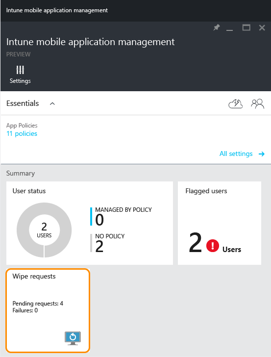
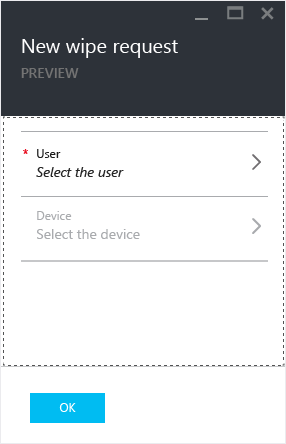

# L&#246;schen verwalteter Unternehmensdaten aus Apps mit Microsoft Intune
Sie können Unternehmensdaten selektiv aus Apps entfernen, ohne dass sich dieser Vorgang auf die persönlichen Daten auf einem Gerät auswirkt.  Zum Löschen von Unternehmensdaten aus einer App müssen Sie eine Löschanforderung ausgeben.  Mit der Löschanforderung werden die Unternehmensdaten beim nächsten Ausführen der Anwendung aus der App entfernt.

Die Kachel **Löschanforderung** auf dem Blatt **Intune Mobile Application Management** zeigt die Anzahl der ausstehenden Anforderungen und Fehler an.

> [!IMPORTANT]
> In der aktuellen Version gibt es für Microsoft Word-, Excel- und PowerPoint-Apps keine selektive Löschfunktion.

**Gegenstand dieses Themas**

[Ausgeben einer Löschanforderung](#bkmk_makerequest)

[Überwachen der Löschanforderungen](#bkmk_monitorrequest)

#### Ausgeben einer Löschanforderung

1.  Klicken Sie auf dem Blatt **Intune Mobile Application Management**  auf die Kachel **Löschanforderung**.

    

2.  Klicken Sie auf **Neue Löschanforderung**.

    

3.  Klicken Sie auf dem Blatt **Neue Löschanforderung** auf **Benutzer**, um das Blatt **Benutzer** zu öffnen und den Benutzer auszuwählen, dessen Anwendungsdaten gelöscht werden sollen.

4.  Klicken Sie auf **Gerät**.  Daraufhin wird das Blatt **Gerät** geöffnet, auf dem alle dem ausgewählten Benutzer zugeordneten Geräte aufgeführt sind.  Wählen Sie das Gerät aus, das zurückgesetzt werden soll.

5.  Jetzt wird erneut das Blatt **Neue Löschanforderung** geöffnet. Klicken Sie auf **OK**, um die Löschanforderung auszuführen. Der Dienst erstellt für jede geschützte App auf dem Gerät eine separate Löschanforderung und überwacht diese.

Auf dem Blatt **Intune Mobile Application Management**  enthält die Kachel **Löschanforderung** einen zusammenfassenden Bericht.  Angezeigt wird der Gesamtstatus mit der Anzahl der ausstehenden Anforderungen und Fehlern. Sie können weitere Details abrufen, indem Sie auf die Kachel klicken. Dadurch wird das Blatt **Löschanforderung** geöffnet.

#### Überwachen der Löschanforderungen

1.  Klicken Sie auf dem Blatt **Intune Mobile Application Management**  auf die Kachel **Löschanforderung**, um das Blatt **Löschanforderung** zu öffnen.

2.  Auf dem Blatt **Löschanforderung** wird eine Liste mit Ihren Anforderungen, gruppiert nach Benutzer, angezeigt.  Da das System für jede geschützte App, die auf dem Gerät ausgeführt wird, eine Löschanforderung erstellt, werden möglicherweise für einen Benutzer mehrere Anforderungen angezeigt.  Der Status gibt an, ob eine Löschanforderung noch **aussteht** oder **fehlgeschlagen** ist bzw. **erfolgreich** ausgeführt wurde.

## Siehe auch
[Konfigurieren der App-Richtlinien für die Verhinderung von Datenverlust mit Microsoft Intune](../Topic/Configure_data_loss_prevention_app_policies_with_Microsoft_Intune.md)

